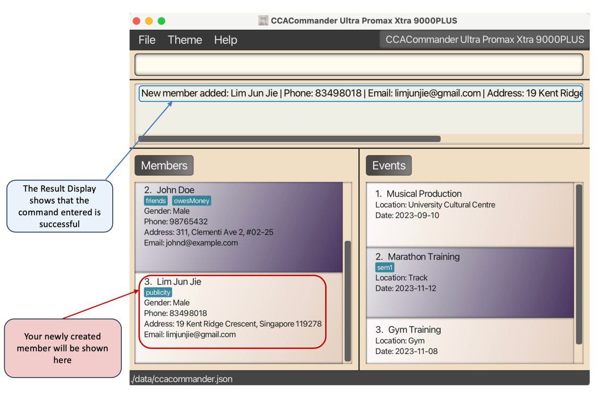
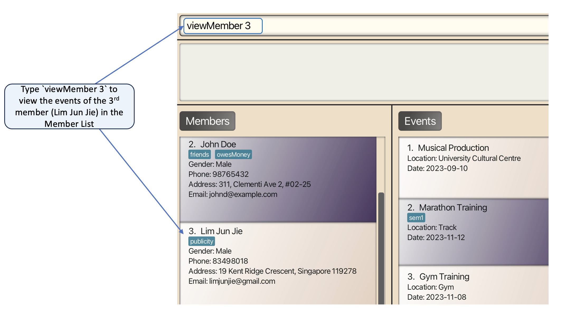
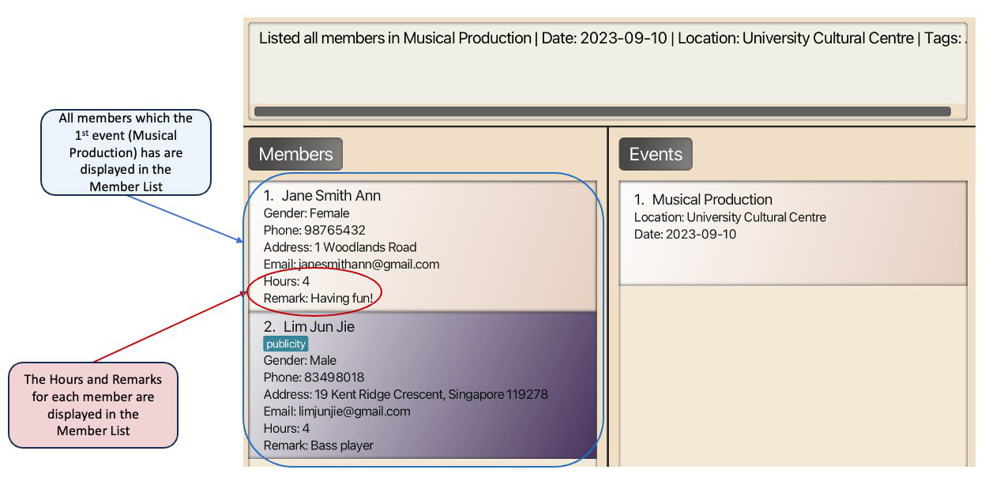

<link rel="stylesheet" href="./assets/css/guide.css">
## CCACommander Ultra Promax Xtra 9000PLUS - User Guide

<figure>
    
</figure>

## Introduction
As a Co-curricular Activity (CCA) head, do you find yourself struggling to manage your CCA members’ attendance and record the array of events that your CCA has?
Are the heaps of spreadsheets you are using to manage them making you feel overwhelmed? Well, fear not, **CCACommander Ultra ProMax Xtra 9000PLUS** is here to save the day!

CCACommander is a desktop application that helps CCA leaders record details of their members and events, whilst tracking every member’s attendance. 
It helps to organise members and events into easy-to-view compartments under a singular Graphical User Interface (GUI) while providing granular control to you via its in-built Command Line Interface (CLI). 
If you can type quickly, CCACommander can help you complete your administrative tasks much more efficiently than traditional GUI applications.

## About
This user guide provides documentation on how you can install and use **CCACommander Ultra ProMax Xtra 9000PLUS**. Descriptions of CCACommander’s features and how to use them have been carefully organised into key sections for your convenience.
To get started, take a look at our [quick start](#quick-start) guide!

This guide uses the following features to make it easier for you to navigate around:
* Words that look like [this](#about) can be clicked to jump to the related section.
* Words that look like `this` refer to commands which you can type into the command box of CCACommander.
* Words that look like <kbd>this</kbd> refer to keyboard keys that you can press.

:warning: Boxes with the :warning: icon contain important information that you should read.

:information_source: Boxes with the :information_source: icon contain additional useful information.

:bulb: Boxes with the :bulb: icon contain additional tips and tricks to help you get the most out of CCACommander.

{:toc}

--------------------------------------------------------------------------------------------------------------------

## Quick start

:warning: We assume that you have some basic knowledge of terminal commands. You can learn how to use the terminal with [this guide](https://www.freecodecamp.org/news/command-line-for-beginners/)

1. Ensure you have Java `11` or above installed in your computer by following [this guide](https://www.freecodecamp.org/news/command-line-for-beginners/).

2. Download the latest `ccacommander.jar` from [here](https://github.com/AY2324S1-CS2103T-F11-1/tp/releases).

3. Put the downloaded file into a folder of your choice (preferably a new empty folder).

4. Open a command terminal in the folder you put the CCACommander file in, and use the `java -jar ccacommander.jar` command to run the application. 
   A GUI similar to the below should appear in a few seconds. Note how the app contains some sample data. 
   

5. Type the command in the command box and press <kbd>Enter</kbd> to execute it.   e.g. typing `help` and pressing <kbd> Enter </kbd> will open the help window.  
   Some example commands you can try:

    * `list` : Lists all members and events.

    * `createMember n/Lim Jun Jie g/Male p/98765432 e/limjunjie@gmail.com a/19 Kent Ridge Crescent, Singapore 119278`: Creates a member named Lim Jun Jie in CCACommander.

    * `deleteMember 3` : Deletes the 3rd member shown in the current list.

6. You can refer to the [Features](#features) section below for the details of each command.

:bulb: You can use the `clear` command to remove the sample data.

--------------------------------------------------------------------------------------------------------------------

## Navigating User Interface

Here are the important components of CCACommander that you will use and interact with.

**Menu**: The CCACommander menu is located at the top-left corner of your screen. Click the sub-menu items to execute the following
1. File: Exit the program
2. Theme: Toggle between light and dark themes

Light | Dark
--------|--------
 | 

3. Help: Access our user guide

**Command Box**: Type in your text commands.  
**Result Display**: View messages from CCACommander regarding your commands.  
**Member List**: View the members stored in CCACommander.  
**Event List**: View the events stored in CCACommander.  
**Storage Location**: Locate where your CCACommander data is stored in your computer.

### Command History
You can quickly recall previously entered commands for convenience as CCACommander stores almost all (see the info card below to see what commands are stored) commands entered by the user.  
Upon selecting the command box, you can use the <kbd>↑</kbd> to <kbd>↓</kbd> key to navigate through the commands entered .

Example:
1. You have just marked attendance for the first member in the member list using the editEnrolment m/1 e/1 r/Present command.
2. You can then use <kbd>↑</kbd> to get editEnrolment m/1 e/1 r/Present
3. You can edit the member index to get editEnrolment m/2 e/1 r/Present to mark the second member as present.

:information_source: CCACommander will not store 2 of the same commands if they were entered twice in a row. Likewise, "commands" containing exclusively of blank spaces will not be stored as well.

Upon entering the <kbd>⌫ Backspace</kbd> or the <kbd>↵ Enter</kbd> key, users will have to re-navigate from the most recent command as it will be treated as an edit or entry of command.

--------------------------------------------------------------------------------------------------------------------

## Features

**:information_source: Notes about the command format:** 

* Words in `UPPER_CASE` are the parameters to be supplied by the user. 
  e.g. in `createMember n/NAME`, `NAME` is a parameter which can be used as `createMember n/John Doe`.

* Items in square brackets are optional. 
  e.g. `n/NAME [t/TAG]` can be used as `n/John Doe t/friend` or as `n/John Doe`.

* Items with `…`​ after them can be used multiple times including zero times. 
  e.g. `[t/TAG]…​` can be used as ` ` (i.e. 0 times), `t/friend`, `t/friend t/family` etc.

* Parameters can be in any given order. 
  e.g. if the command specifies `n/NAME p/PHONE_NUMBER`, `p/PHONE_NUMBER n/NAME` is also acceptable.

* Some parameters of certain commands have constraints on the acceptable inputs.  
  You can refer to the [List of acceptable values](#list-of-acceptable-values) section below for more details.

* Extraneous parameters for commands that do not take in parameters (such as `help`, `list`, `exit` and `clear`) will be ignored. 
  e.g. if the command specifies `help 123`, it will be interpreted as `help`.

* If you are using a PDF version of this document, be careful when copying and pasting commands that span multiple lines as space characters surrounding line-breaks may be omitted when copied over to the application.

### Member Commands
The vitality of a CCA lies in its members. CCACommander allows you to manage your members with the commands below:

#### Create a Member: `createMember`
When you first start CCACommander and want to populate CCACommander with your members, you can do it with just one simple command - `createMember`!

Here is how you can use it: 
`createMember n/MEMBER_NAME g/GENDER [p/PHONE_NUMBER] [e/EMAIL] [a/ADDRESS] [t/TAG]...`

Here is an example command where we create a member **named** "Lim Jun Jie" with **gender** "Male", **phone number** of "83498018", **email** of "limjunjie@gmail.com", home **address** of "19 Kent Ridge Crescent, Singapore 119278" and a "publicity" **tag**:

`createMember n/Lim Jun Jie g/Male p/83498018 e/limjunjie@gmail.com a/19 Kent Ridge Crescent, Singapore 119278 t/publicity`

<figure>
    
    <figcaption>After executing the <code>createMember</code> command</figcaption>
</figure>

#### Edit a Member: `editMember`
If you accidentally make a typo while creating your member, do not worry! You can quickly fix it with the `editMember` command.

Here is how you can use it: 
`editMember MEMBER_INDEX [n/MEMBER_NAME] [g/GENDER] [p/PHONE_NUMBER] [e/EMAIL] [a/ADDRESS] [t/TAG]...`

:information_source: Remember to provide at least one field to be edited!

Here is an example command where we edit the member at **index** 1 in the displayed list, changing their **phone number** to "91234567" and **email** to "johndoe@example.com":

`editMember 1 p/91234567 e/johndoe@example.com`

#### Delete a Member : `deleteMember`

If a member leaves your CCA, get over the disappointment by swiftly removing them from CCACommander using the `deleteMember` command!

Here is how you can use it: 
 `deleteMember MEMBER_INDEX`

Here is an example command where we delete the member at **index** 1 in the displayed list:

`deleteMember 1`

:information_source: The `MEMBER_INDEX` parameter refers to the index number shown in the **currently displayed** member list.

### Event commands

#### Create an Event : `createEvent`

Creates a new event with accompanying details (name, location, date, tag).

Format: `createEvent n/EVENT_NAME l/LOCATION d/DATE [t/TAG]...`

* Acceptable values for `DATE`: Dates in the format of `YYYY-MM-DD`.

Examples:
* `createEvent n/Party l/Raffles Hall d/2023-09-16` creates an event `Party` in CCACommander.

#### Delete an Event: `deleteEvent`

Deletes the event at the specified index.

Format: `deleteEvent EVENT_INDEX`

* Deletes the event at the specified `EVENT_INDEX`.
* The index refers to the index number shown in the **currently displayed** event list.
* The index **must be a positive integer** that is within the range of the length of the event list.

Examples:
* `deleteEvent 1` deletes the 1st event in the event list.
* `deleteEvent 10` deletes the 10th event in the event list.

#### Edit an Event : `editEvent`

Edits the event at the specified index with the specified attributes.

Format: `editEvent EVENT_INDEX [n/EVENT_NAME] [l/LOCATION] [d/DATE] [t/TAG]...`

* The index refers to the index number shown in the **currently displayed** event list.
* The index **must be a positive integer** that is within the range of the length of the member list.
* At least one field to edit must be provided.
* `EVENT_NAME` **must only contain** Alphanumeric Characters and spaces, and it should not be blank
* `LOCATION` **must not** be blank and can take in any values.
* `DATE` **must be a valid date** in the format of **YYYY-MM-DD**.
* `TAG` **must only contain** Alphanumeric Characters with no space in between.

Examples:
* `editEvent 5 n/Halloween Surprise Party l/UTR d/2023-10-31 t/sem1` edits the 5th event in the event list to change the name to `Halloween
  Surprise Party`, the location to `UTR`, the date to `2023-10-31` and the tag to `sem1`.
* `editEvent 3 l/UCC Theater` edits the 3rd event in the event list to change the location to `UCC Theater`.

### Enrolment commands

#### Enrol a Member to an Event: `enrol`

Enrols a member to an event.

Format: `enrol m/MEMBER_INDEX e/EVENT_INDEX [h/NUMBER_OF_HOURS] [r/REMARK]`

* Enrols the member at the specified `MEMBER_INDEX` to the event at the specified `EVENT_INDEX` with `NUMBER_OF_HOURS` specifying the number of hours that the member contributed and `REMARK` stating extra remarks about the member and event.
* The `MEMBER_INDEX`/`EVENT_INDEX` refers to the index number shown in the **currently displayed** member/event list.
* The `MEMBER_INDEX`/`EVENT_INDEX` **must be a positive integer** that is within the range of the length of the member/event list.
* The `NUMBER_OF_HOURS` **must be a positive integer** and **must be less than or equal to 2147483647**.

Examples:
* `enrol m/1 e/5 h/3 r/did planning` enrols the 1st member in the member list to the 5th event in the event list, where the member had 3 hours of contributions to that event and has a remark stating that the member "did planning".
* `enrol m/5 e/1` enrols the 5th member in the member list to the 1st event in the event list.

#### Unenrol a Member from an Event: `unenrol`

Unenrol a member from an event.

Format: `unenrol m/MEMBER_INDEX e/EVENT_INDEX`

* Unenrol the member at the specified `MEMBER_INDEX` from the event at the specified `EVENT_INDEX`.
* The member at `MEMBER_INDEX` must be a part of the event at `EVENT_INDEX`.
* The `MEMBER_INDEX`/`EVENT_INDEX` refers to the index number shown in the **currently displayed** member/event list.
* The `MEMBER_INDEX`/`EVENT_INDEX` **must be a positive integer** that is within the range of the length of the member/event list.

Examples:
* `unenrol m/1 e/5` unenrols the 1st member in the member list from the 5th event in the event list.
* `unenrol m/5 e/1` unenrols the 5th member in the member list from the 1st event in the event list.

#### Edit an enrolment: `editEnrolment`
Edits the enrolment details of a specified member at a specified event with the specified attributes.

Format: `editEnrolment m/MEMBER_INDEX e/EVENT_INDEX [h/NUMBER_OF_HOURS] [r/REMARK]`

* Edits the specified `MEMBER_INDEX`'s enrolment of the event at the specified `EVENT_INDEX` with `NUMBER_OF_HOURS` specifying the number of hours that the member contributed and `REMARK` stating extra remarks about the member and event.
* The `MEMBER_INDEX`/`EVENT_INDEX` refers to the index number shown in the **currently displayed** member/event list.
* The `MEMBER_INDEX`/`EVENT_INDEX` **must be a positive integer** that is within the range of the length of the member/event list.
* At least one field to edit must be provided.
* The `NUMBER_OF_HOURS` **must be a positive integer** and **must be less than or equal to 2147483647**.
* `REMARK` can take any value, but should not be blank.

Examples:
* `editEnrolment m/1 e/1 h/0 r/Absent due to Covid` edits the enrolment of the 1st member in the member list for the 1st event of the event list to be `0` hours and have a remark `Absent due to Covid`.

### View commands
In CCACommander, you can quickly change the view to fit your current use case, be it to check for the enrolment of an event, 
searching for a member and more!

#### View Events of Member : `viewMember`

If you want to view the events in which a particular member is enrolled, you can do so via the `viewMember` command.

Here’s how you can use it:
`viewMember MEMBER_INDEX`

Here is an example command where we want to view the events in which the **member** at index 3 in our member list is enrolled:

`viewMember 3`

<figure>
    
    <figcaption>Before executing the <code>viewMember</code> command</figcaption>
</figure>
 
<figure>
    
    <figcaption>After executing the <code>viewMember</code> command</figcaption>
</figure>

#### View Members of Event : `viewEvent`

If you want to view the members which a particular event has, you can do so via the `viewEvent` command.

Here’s how you can use it:
`viewEvent EVENT_INDEX`

Here is an example command where we want to view the members that the **event** at index 1 of our event list has:

`viewEvent 1`

<figure>
    
    <figcaption>Before executing the <code>viewEvent</code> command</figcaption>
</figure>
 
<figure>
    
    <figcaption>After executing the <code>viewEvent</code> command</figcaption>
</figure>

#### Find Member in member list : `findMember`

If your CCA contains many members and you don’t want to scroll past tens or hundreds of members, you can use the 
`findMember` command to instantly filter a list of members with a matching name.

Do you want to find multiple members? Worry not as you can simply add more names one after another.

Here’s how you can use it:
`findMember MEMBER_NAME [MORE_NAMES]`

Here is an example command where we find all members with the names of "Anthony" and "Nicholas":

`findMember anthony nicholas`

#### Find Event in event list : `findEvent`

Similar to `findMember`, `findEvent` allows you to instantly find your event among your multiple events.

Here’s how you can use it:
`findEvent EVENT_NAME [MORE_NAMES]`

Here is an example command where we find all events with the event name of "Party":

`findEvent party`

:information_source:
The find commands require the names to be typed in full, meaning "Nich" will not suffice for finding "Nicholas". 
To make it convenient for you, the names do not have to be capitalised! 

:bulb:
The find commands are powerful tools to help you work faster. Want to view the attendance of Nicholas, but you don’t 
want to scroll the member list? Use the `findMember` then follow it with the `viewMember` command to achieve that. 
This is applicable for both members and events!

#### List all Members and all Events : `list`
If you’re in the event / member view, you can always use the `list` command to return to the default view with all members and events.

Here’s how you use it: `list`

### Utility commands
CCACommander provides you with powerful utility commands to make your admin tasks even more of a breeze than it was.

#### Undoing a command: `undo`

The `undo` command is the ultimate safety net for CCACommander. You no longer have to fear accidentally deleting 
the wrong event or enrolling the wrong member. Simply enter the `undo` command to undo your previous command, 
and it will return to the previous state.

Here’s how you can use it: `undo`

Here's a list of commands you can undo:
* `clear`
* `createMember`
* `deleteMember`
* `editMember`
* `createEvent`
* `deleteEvent`
* `editEvent`
* `enrol`
* `unenrol`
* `editEnrolment`

#### Redoing a command: `redo`

Accidentally used `undo`? Don’t worry, you can redo your undone commands too!

Here’s how you can use it: `redo`

#### Clear all Members and Events: `clear`
Is it time for a new academic year when you need to remove all your previous members and events for new members and 
events? You can use the `clear` command to instantly remove all your members and events without needing to delete them one by one.

Here’s how you can use it: `clear`

:bulb: Accidentally cleared your list? 
Worry not as you can use the `undo` command to recover your data! 

#### Help: `help`

Forgot how to edit a specific enrolment or how to unenrol members? The `help` command will allow you to clarify and recall any features of the app by providing you a link to our friendly and informative user guide.

Here’s how you can use it: `help`

<figure>
    
    <figcaption>A help pop-up window will appear upon entering the <code>help</code> command</figcaption>
</figure>

#### Exit: `exit`

If it’s time to call it a day for your CCA tasks, you can use the `exit` command to quit the app.

Here’s how you can use it: `exit`

:information_source: The exit command exists for your convenience. 
It performs the same task as the cross in the top bar and the Exit button in the File submenu item

#### Saving the data

CCACommander data are saved automatically after any command that changes the data. There is no need to save manually.

--------------------------------------------------------------------------------------------------------------------

## FAQ

**Q**: How do I transfer my data to another Computer? 
**A**: Install the app in the other computer and overwrite the empty data file it creates with the file that contains the data of your previous CCACommander folder.

**Q**: Do I need Wi-Fi connection to use CCACommander? 
**A**: No, you can use CCACommander offline.

**Q**: How much storage space do I need for CCACommander? 
**A**: CCACommander is so lightweight that you only need 30 MB on your computer.

**Q**: What happens if my laptop battery dies suddenly? 
**A**: Rest assured, your data remains securely stored on your laptop. 
Once your laptop is recharged, you can regain access to all your stored information.

--------------------------------------------------------------------------------------------------------------------

## Known issues

1. **When using multiple screens**, if you move the application to a secondary screen, and later switch to using only the primary screen, the GUI will open off-screen. The remedy is to delete the `preferences.json` file created by the application before running the application again.
2. **Edit** commands go back to the main view no matter what view you were in.

--------------------------------------------------------------------------------------------------------------------

## Glossary
This glossary provides definitions for the special terms used in this user guide.

**CCA**: Co-curricular activity.

**Command**: The text typed in by the user as a CCA Head for CCACommander.

**Index**: The number beside the corresponding entry in a list.

**Tag**: A word or phrase that labels a member or an event.

--------------------------------------------------------------------------------------------------------------------

## Command summary

Action | Format, Examples
--------|------------------
**Clear all members and events** | `clear`
**Create a member** | `createMember n/MEMBER_NAME g/GENDER [p/PHONE_NUMBER] [e/EMAIL] [a/ADDRESS] [t/TAG]...`   e.g. `createMember n/CHU WEI RONG g/Male p/98765432 e/chuweirongrocks@gmail.com a/19 Kent Ridge Crescent, Singapore 119278 t/Leader`
**Delete a member** | `deleteMember MEMBER_INDEX`   e.g.`deleteMember 1`
**Edit a member** | `editMember MEMBER_INDEX [n/MEMBER_NAME] [g/GENDER] [p/PHONE_NUMBER] [e/EMAIL] [a/ADDRESS] [t/TAG]...`   e.g.`editMember 1 a/One North`
**Create an event** | `createEvent n/EVENT_NAME [l/LOCATION] [d/DATE] [t/TAG]...`   e.g.`createEvent n/Party l/Raffles Hall d/2023-09-16 t/Fun`
**Delete an event** | `deleteEvent EVENT_INDEX`   e.g.`deleteEvent 1`
**Edit an event** | `editEvent EVENT_INDEX [n/EVENT_NAME] [l/LOCATION] [d/DATE] [t/TAG]...`   e.g. `editEvent 5 n/Halloween Surprise Party l/UTR d/2023-10-31 t/sem1`
**Add member to an event** | `enrol m/MEMBER_INDEX e/EVENT_INDEX [h/NUMBER_OF_HOURS] [r/REMARK]`   e.g.`enrol m/1 e/5 h/3 r/did planning`
**Delete member from an event** | `unenrol m/MEMBER_INDEX e/EVENT_INDEX`   e.g.`unenrol m/1 e/5`
**Edit an enrolment** | `editEnrolment m/MEMBER_INDEX e/EVENT_INDEX [h/NUMBER_OF_HOURS] [r/REMARK]`   e.g. `editEnrolment m/1 e/1 h/0 r/Absent due to Covid`
**View members of event** | `viewEvent EVENT_INDEX`   e.g.`viewEvent 1`
**View events of member** | `viewMember MEMBER_INDEX`   e.g.`viewMember 1`
**Find member in list** | `findMember KEYWORD [MORE_KEYWORDS]`   e.g.`findMember alice`
**Find event in list** | `findEvent KEYWORD [MORE_KEYWORDS]`   e.g.`findEvent party`
**List all members and all events** | `list`
**Redo** | `redo`
**Undo** | `undo`
**Help** | `help`
**Exit** | `exit`

## List of acceptable values

<table class="tg">
<thead>
  <tr>
    <th class="tg-0pky">Command</th>
    <th class="tg-0pky">Field</th>
    <th class="tg-0pky">Acceptable values</th>
  </tr>
</thead>
<tbody>
  <tr>
    <td class="tg-0pky command" rowspan="6"><code>createMember</code> / <code>editMember</code></td>
    <td class="tg-0pky">MEMBER_NAME</td>
    <td class="tg-0pky">Only contain alphanumeric characters and spaces, and should not be blank</td>
  </tr>
  <tr>
    <td class="tg-0pky">GENDER</td>
    <td class="tg-0pky"><code>Male</code>, <code>Female</code>, <code>Others</code></td>
  </tr>
  <tr>
    <td class="tg-0pky">PHONE_NUMBER</td>
    <td class="tg-0pky">Only contain numbers, and at least 3 digits long</td>
  </tr>
  <tr>
    <td class="tg-0pky">EMAIL</td>
    <td class="tg-0pky">An email with a valid extension (e.g. <code>@gmail.com</code>)</td>
  </tr>
  <tr>
    <td class="tg-0pky">ADDRESS</td>
    <td class="tg-0pky">Any non-blank values except the following prefixes: <code>n/</code>, <code>g/</code>, <code>p/</code>, <code>e/</code>, <code>a/</code>, <code>t/</code></td>
  </tr>
  <tr>
    <td class="tg-0pky">TAG</td>
    <td class="tg-0pky">Only contain alphanumeric characters with no spaces in between, but can be blank</td>
  </tr>
  <tr>
    <td class="tg-0pky command" rowspan="4"><code>createEvent</code> / <code>editEvent</code></td>
    <td class="tg-0pky">EVENT_NAME</td>
    <td class="tg-0pky">Only contain alphanumeric characters and spaces, and should not be blank</td>
  </tr>
  <tr>
    <td class="tg-0pky">LOCATION</td>
    <td class="tg-0pky">Must not be blank and can take in any values, except the following prefixes:<code>e/</code>, <code>l/</code>, <code>d/</code>, <code>t/</code></td>
  </tr>
  <tr>
    <td class="tg-0pky">DATE</td>
    <td class="tg-0pky">Must be a valid date in the format of YYYY-MM-DD</td>
  </tr>
  <tr>
    <td class="tg-0pky">TAG</td>
    <td class="tg-0pky">Only contain alphanumeric characters with no spaces in between, but can be blank</td>
  </tr>
  <tr>
    <td class="tg-0pky command"><code>deleteMember</code> / <code>deleteEvent</code></td>
    <td class="tg-0pky">MEMBER_INDEX / EVENT_INDEX</td>
    <td class="tg-0pky">Must be a positive integer that is within the range of the length of the currently displayed member/event list</td>
  </tr>
  <tr>
    <td class="tg-0pky command" rowspan="3"><code>enrol</code> / <code>editEnrolment</code></td>
    <td class="tg-0pky">MEMBER_INDEX / EVENT_INDEX</td>
    <td class="tg-0pky">Must be a positive integer that is within the range of the length of the currently displayed member/event list</td>
  </tr>
  <tr>
    <td class="tg-0pky">NUMBER_OF_HOURS</td>
    <td class="tg-0pky">Must be a positive integer and must be less than or equal to 2147483647</td>
  </tr>
  <tr>
    <td class="tg-0pky">REMARK</td>
    <td class="tg-0pky">Must not be blank and can take in any values, except the following prefixes:<code>m/</code>, <code>e/</code>, <code>h/</code>, <code>r/</code></td>
  </tr>
  <tr>
    <td class="tg-0pky command"><code>viewMember</code> / <code>viewEvent</code></td>
    <td class="tg-0pky">MEMBER_INDEX / EVENT_INDEX</td>
    <td class="tg-0pky">Must be a positive integer that is within the range of the length of the currently displayed member/event list</td>
  </tr>
  <tr>
    <td class="tg-0pky command"><code>findMember</code> / <code>findEvent</code></td>
    <td class="tg-0pky">KEYWORD</td>
    <td class="tg-0pky">Any non-blank values</td>
  </tr>
</tbody>
</table>
