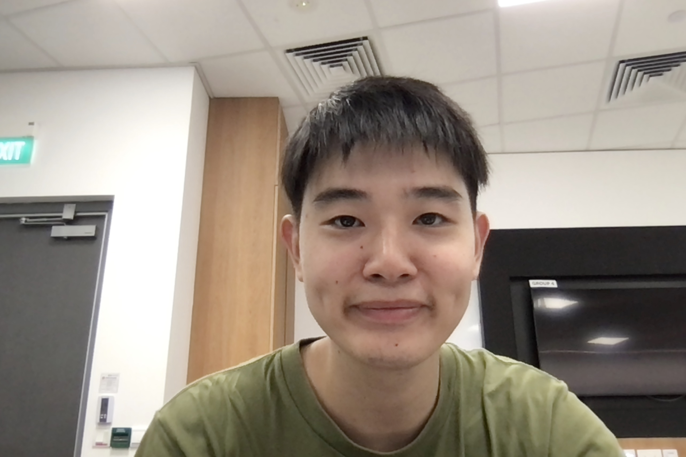
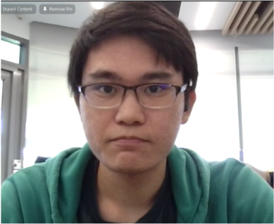
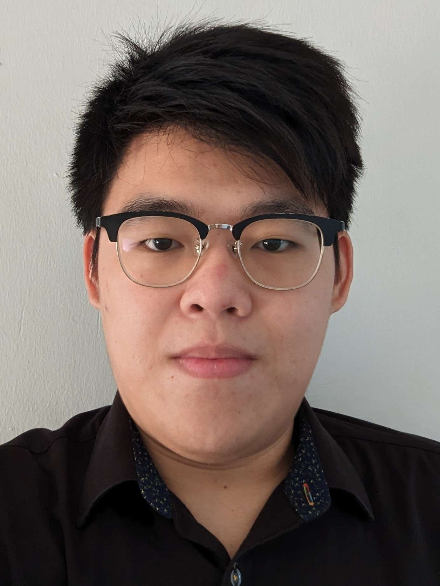
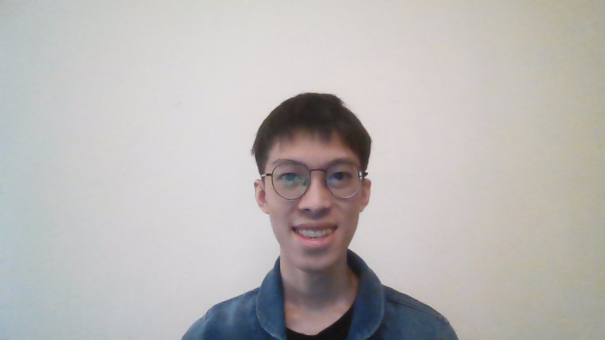

# About Us

We are a team based in the [School of Computing, National University of Singapore](http://www.comp.nus.edu.sg).

This project was done by a team of 4 members.

## Project team

### Li Hongguang

[[github](https://github.com/lihongguang00)]
[[portfolio](team/lihongguang00.md)]

- Role: Team Member
- Responsibilities: TBD

### Andre Sim

[[github](http://github.com/fallman2)]
[[portfolio](team/fallman2.md)]

- Role: Team Member
- Responsibilities: TBD

### Low Jun Hong

[[github](http://github.com/junhonglow)]
[[portfolio](team/junhonglow.md)]

- Role: Developer
- Responsibilities: TBD

### Nicholas Lee

[[github](http://github.com/nicrandomlee)]
[[portfolio](team/nicrandomlee.md)]

- Role: Developer
- Responsibilities: TBD
