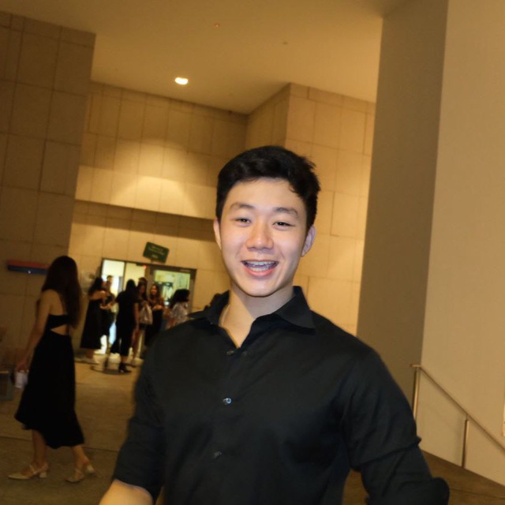

We are a team based in the [School of Computing, National University of Singapore](http://www.comp.nus.edu.sg).

You can reach us at the email `seer[at]comp.nus.edu.sg`

## Project team

### Su Shenyi

[[github](https://github.com/AlainS87)]
[[portfolio](team/alains87.md)]

* Role: Developer Documentation

### Mikhil Anand

[[github](http://github.com/sasmik23)]
[[portfolio](team/sasmik23.md)]

- Role: Developer
- Responsibilities: User Documentation

### Wong Joon Hung

[[github](https://github.com/PetrichorPrecipice)]
[[portfolio](team/petrichorprecipice.md)]

- Role: Testing

### Ku Shang Yi

[[github](http://github.com/bombbird2001)] [[portfolio](team/bombbird2001.md)]

- Role: Team Lead, Developer
- Responsibilities: Scheduling and tracking
### Xavier Oh

[[github](http://github.com/cxo05)]
[[portfolio](team/cxo05.md)]

- Role: Developer
- Responsibilities: UI
