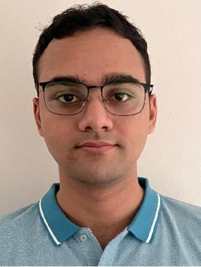
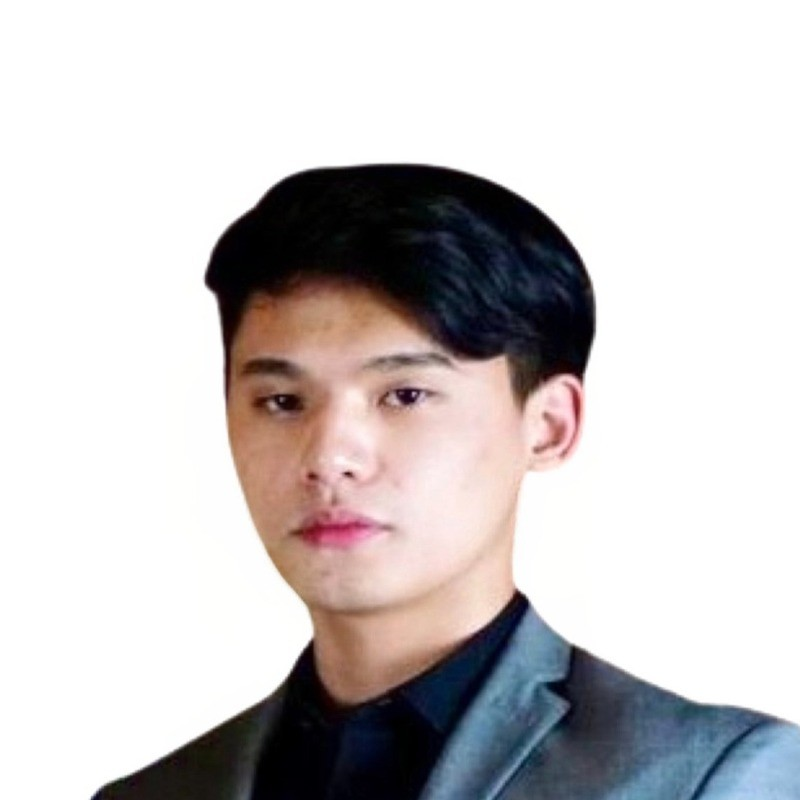
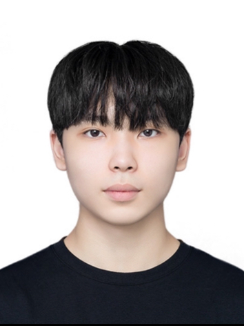
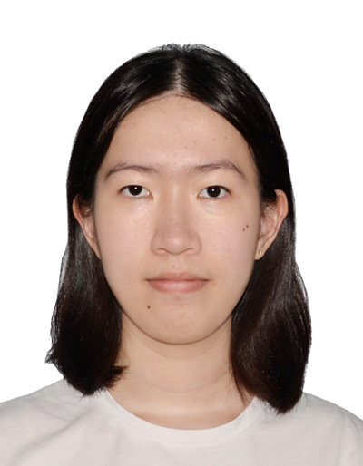

We are a team based in the [School of Computing, National University of Singapore](http://www.comp.nus.edu.sg).

You can reach us at the email `seer[at]comp.nus.edu.sg`

## Project team

### Aryan Ganju

[[homepage](https://ay2324s1-cs2103t-f10-1.github.io/tp)]
[[github](https://github.com/AryanG01)]
[[portfolio](team/aryang01.md)]

* Role: Project Advisor

### Rohan Bahl

[[github](http://github.com/RB9823)]
[[portfolio](team/rb9823.md)]

* Role: close
* Responsibilities: Add a booking

### Mark Garcera

[[github](http://github.com/markgcera)] 
[[portfolio](team/markgcera.md)]

* Role: Developer
* Responsibilities: Data

### Moon Ji Hoon

[[github](http://github.com/iyioon)]
[[portfolio](team/iyioon.md)]

* Role: Developer
* Responsibilities: Dev Ops + Threading

### Ting Si Yang Annabel

[[github](http://github.com/AnnabelTing)]
[[portfolio](team/annabelting.md)]

* Role: Developer
* Responsibilities: UI
