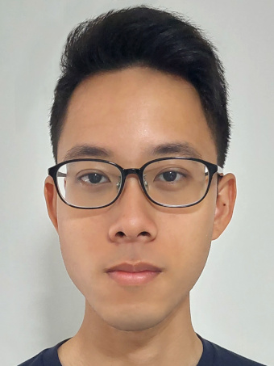
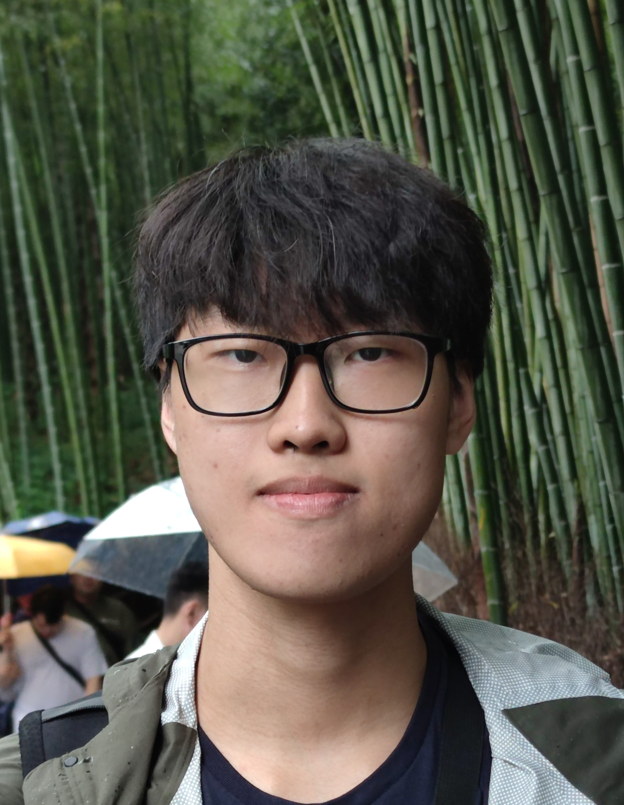

# About Us

We are a team based in the [School of Computing, National University of Singapore](http://www.comp.nus.edu.sg).

You can reach us at the email `seer[at]comp.nus.edu.sg`

## Project team

### Phua Zai Lian

[[github](https://github.com/pzl111)]
[[portfolio](team/pzl111.md)]

* Role: Lead Developer

### Richie Hsieh

[[github](http://github.com/richiehx)]
[[portfolio](team/richiehx.md)]

* Role: Team Lead
* Responsibilities: Development

### Wang Yiwen

[[github](http://github.com/yiwen101)]
[[portfolio](team/yiwen.md)]
### Johnny Doe

[[github](http://github.com/johndoe)] [[portfolio](team/johndoe.md)]

* Role: Developer
* Responsibilities: Data

### Jean Doe

[[github](http://github.com/johndoe)]
[[portfolio](team/johndoe.md)]

* Role: Developer
* Responsibilities: Dev Ops + Threading

### James Doe

[[github](http://github.com/johndoe)]
[[portfolio](team/johndoe.md)]

* Role: Developer
* Responsibilities: UI
