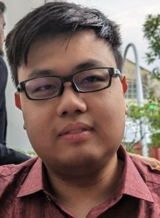
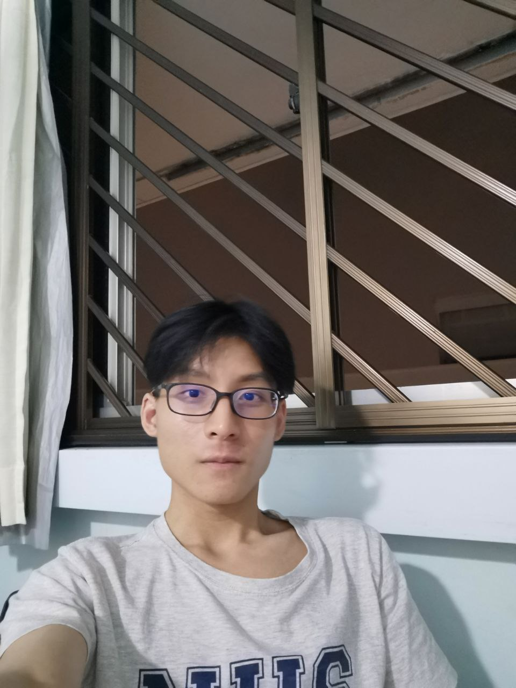
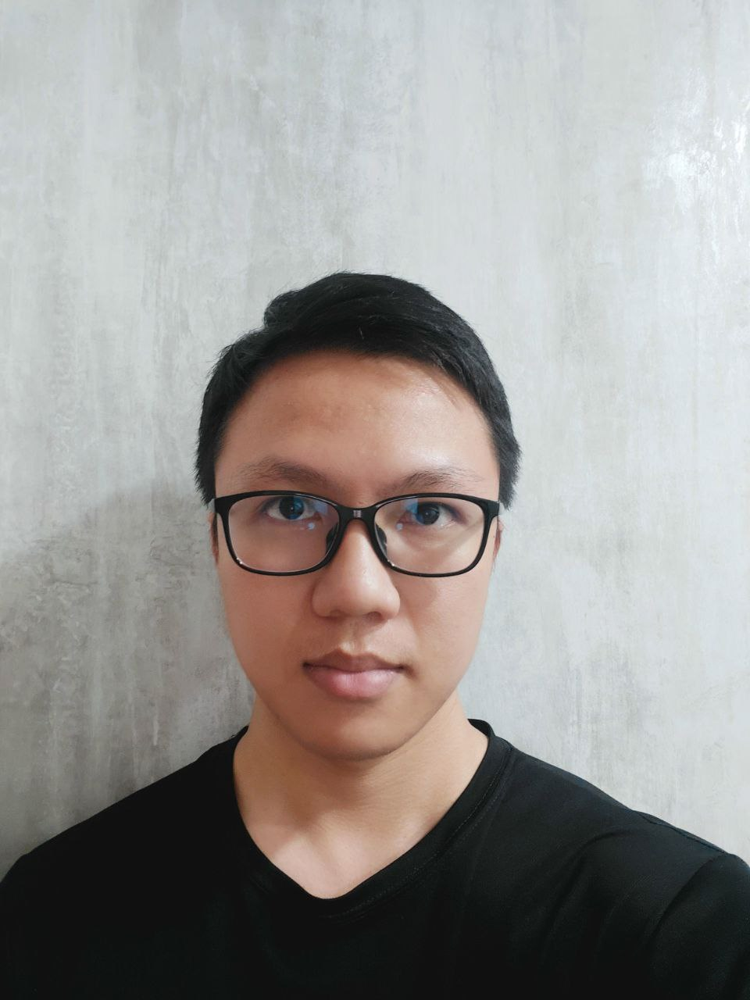
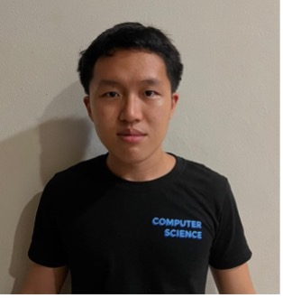
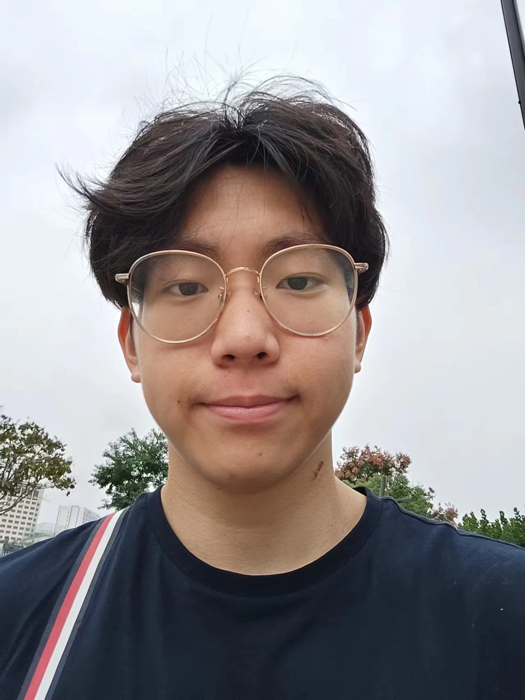

We are a team based in the [School of Computing, National University of Singapore](http://www.comp.nus.edu.sg).

We currently do not offer any means to contacting us, thank you for your understanding.

## Team CS2103T-T11-2

### Jason Lim

[[github](https://github.com/JasonLCY-Temp)]
[[portfolio](team/jasonlcy-temp.md)]

* Role: Scheduling and tracking, CI Pipeline manager
* Responsibilities: In charge of  `Interview`

### Tan Jing Jie

[[github](http://github.com/jingjie88)]
[[portfolio](team/jingjie88.md)]

* Role: Developer
* Responsibilities: Improve `add`, `edit`, `delete` features

### Johnny Doe

[[github](http://github.com/johndoe)] [[portfolio](team/johndoe.md)]

* Role: Developer
* Responsibilities: Data

### Jony

[[github](http://github.com/jonyxzx)]
[[portfolio](team/jonyxzx.md)]

* Role: Developer
* Responsibilities: Improve find feature

### Tan Kerway

[[github](http://github.com/kiwibang)]
[[portfolio](team/kiwibang.md)]

* Role: Developer
* Responsibilities: Time man

### Chen Xin-An

[[github](http://github.com/Chen1x)]
[[portfolio](team/chen1x.md)]

* Role: Developer
* Responsibilities: Job role object
