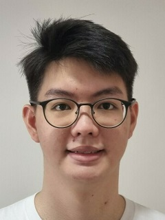
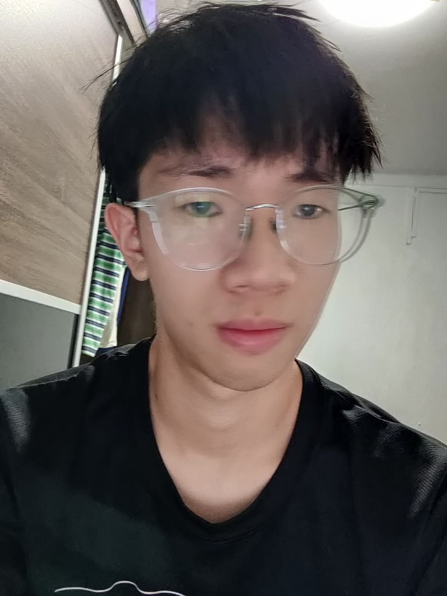
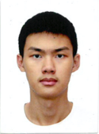

We are a team based in the [School of Computing, National University of Singapore](http://www.comp.nus.edu.sg).

You can reach us at the email `ManageHR@comp.nus.edu.sg`

## Project team

### Kenvyn Kwek

[[github](https://github.com/kenvynkwek)]
[[portfolio](team/johndoe.md)]

* Role: Team Lead + Developer
* Responsibilities: Deliverables and deadlines + Integration

### Matthew Sung

[[github](https://github.com/SungMatt)]
[[portfolio](team/johndoe.md)]

* Role: Team Lead + Project Advisor
* Responsibilities: Scheduling and tracking + Documentation

### Lee Bing Heng

[[github](https://github.com/starrylight99)]
[[portfolio](team/johndoe.md)]

* Role: Developer
* Responsibilities: UI + Testing

### Zhu XiHua

[[github](https://github.com/XihuaZ)]
[[portfolio](team/johndoe.md)]

* Role: Developer
* Responsibilities: UX + Code Quality
