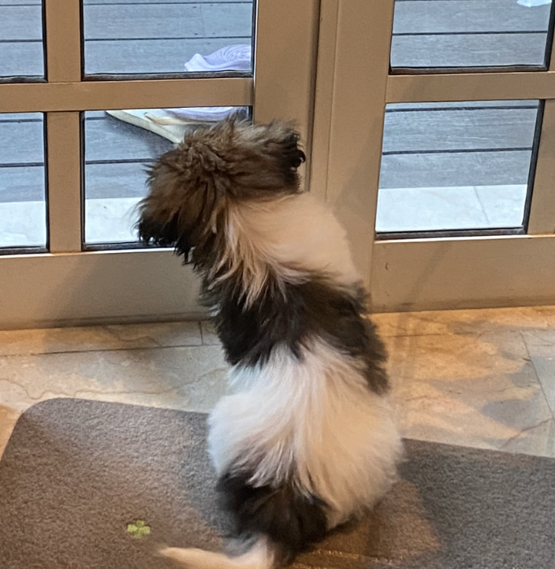
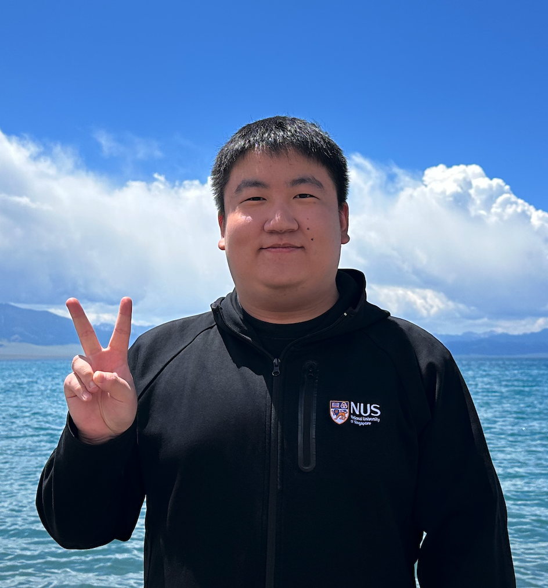

We are a team based in the [School of Computing, National University of Singapore](http://www.comp.nus.edu.sg).

You can reach us at the email `seer[at]comp.nus.edu.sg`

## Project team

### Joey Lee

[[homepage](http://www.comp.nus.edu.sg/~damithch)]
[[github](https://github.com/applepiofmyeye)]
[[portfolio](team/applepiofmyeye.md)]

* Role: Developer
* Responsibilities: Scheduling and tracking tasks

### Jane Doe

[[github](http://github.com/johndoe)]
[[portfolio](team/johndoe.md)]

* Role: Team Lead
* Responsibilities: UI

### He Yifan

[[github](http://github.com/jibtaf)] [[portfolio](team/jibtaf.md)]

* Role: Developer
* Responsibilities: Data

### Jean Doe

[[github](http://github.com/johndoe)]
[[portfolio](team/johndoe.md)]

* Role: Developer
* Responsibilities: Dev Ops + Threading

### Jin Hao

[[github](http://github.com/Leb14)]
[[portfolio](team/jinHao.md)]

* Role: Developer
* Responsibilities: Logic
