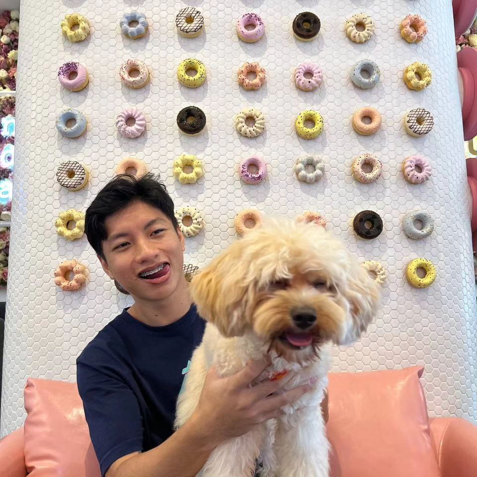
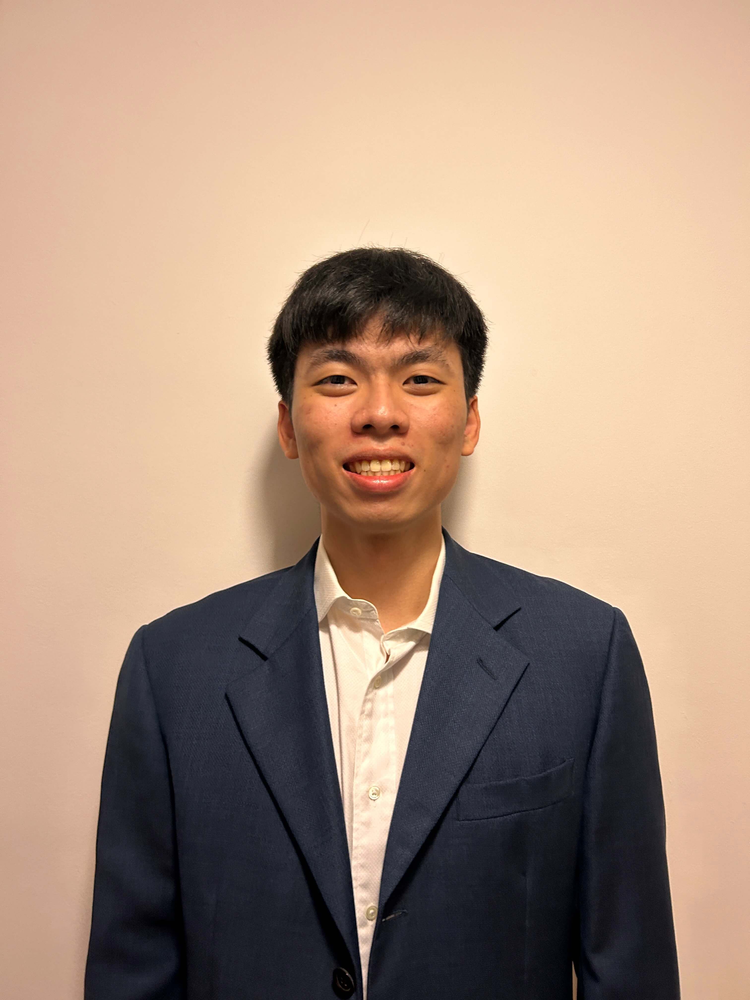
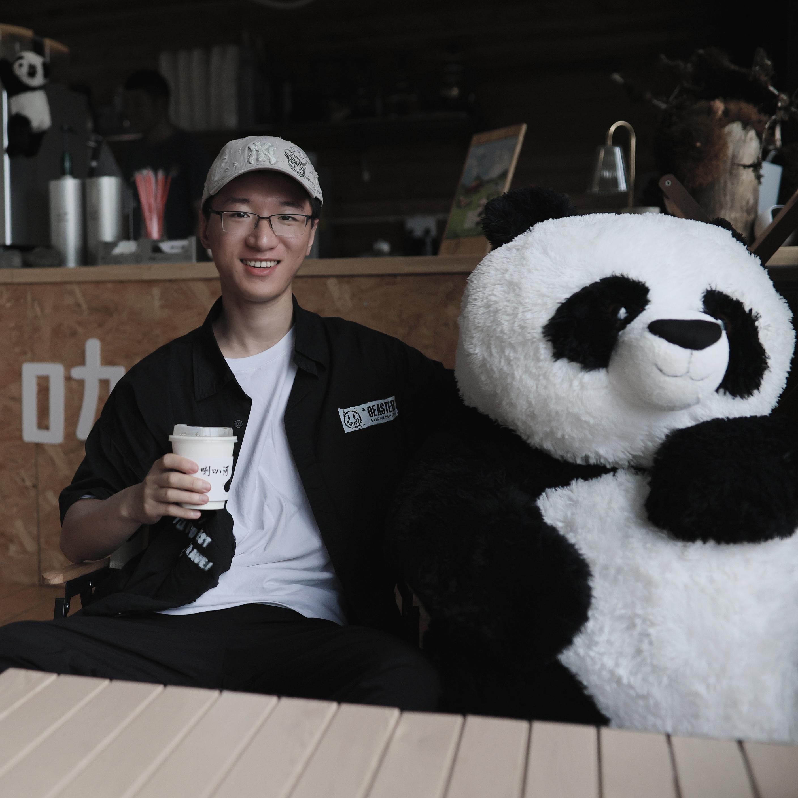
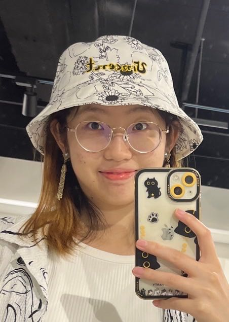
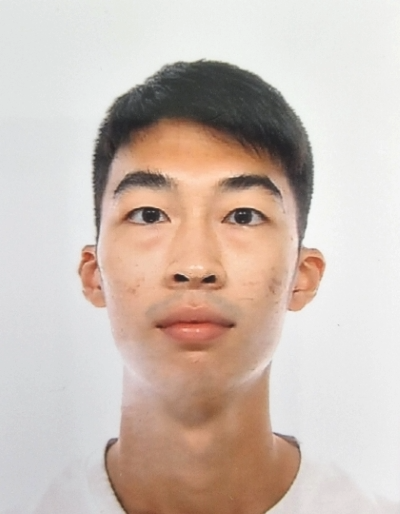

We are a team based in the [School of Computing, National University of Singapore](http://www.comp.nus.edu.sg).

You can reach us at the email `seer[at]comp.nus.edu.sg`

## Project team

### Delton Cheng

[[github](https://github.com/DeltonCheng)]
[[portfolio](team/deltoncheng.md)]

* Role: Developer
* Responsibilities: Deliverables, Deadline and Documentation

### Shu Yang

[[github](http://github.com/shuyangk)]
[[portfolio](team/shuyangk.md)]

* Role: Developer
* Responsibilities: Documentation

### Tan Yiming

[[github](http://github.com/tanyyming)] 
[[portfolio](team/tanyyyming.md)]

* Role: Developer
* Responsibilities: Scheduling and Tracking + Code Quality

### Wang Hejin

[[github](http://github.com/wanghejin)]
[[portfolio](team/wanghejin.md)]

* Role: Developer
* Responsibilities: Documentation

### Tan Yang Yi

[[github](http://github.com/yytan25)]
[[portfolio](team/yytan25.md)]

* Role: Developer
* Responsibilities: UI, Scheduling and Tracking
