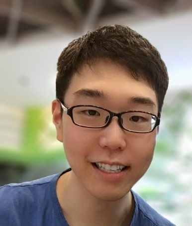
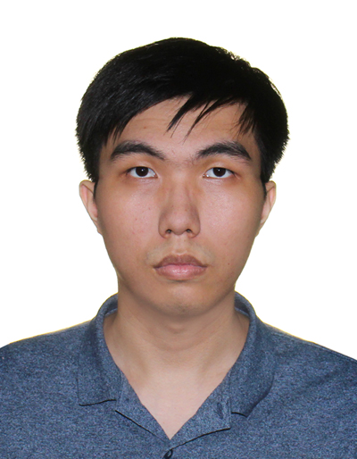

We are a team taking CS2103 at NUS in AY23/24 S1.

This page is designed to closely follow the format required by grading scripts.

## Project team

### Cloud7050

*The public name and image are placeholders.*

[[github](https://github.com/Cloud7050)]
[[portfolio](./team/cloud7050.md)]

- Role: Team Lead
- Responsibilities: Code quality. Assists with: Integration (e.g. maintaining repo, merging PRs), scheduling & tracking (e.g. defining/assigning/editing issues/PRs)

### mamayuan

[[github](http://github.com/mamayuan)]
[[portfolio](./team/mamayuan.md)]

* Role: Developer
* Responsibilities: Testing and Integration (e.g. maintaining repo, merging PRs)

### bwangpj

[[github](http://github.com/bwangpj)]
[[portfolio](./team/bwangpj.md)]

- Role: Developer
- Responsibilities: Documentation

### rayshawntan

[[github](http://github.com/rayshawntan)]
[[portfolio](./team/rayshawntan.md)]

- Role: Developer
- Responsibilities: Scheduling and tracking
