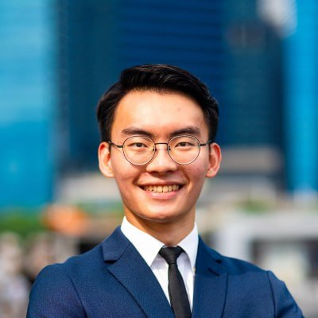
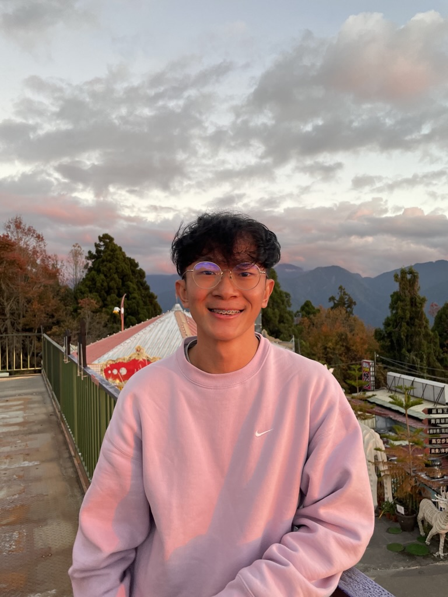
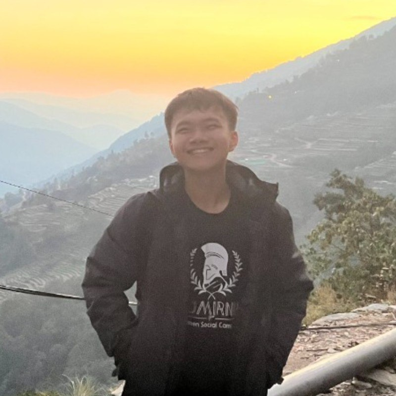
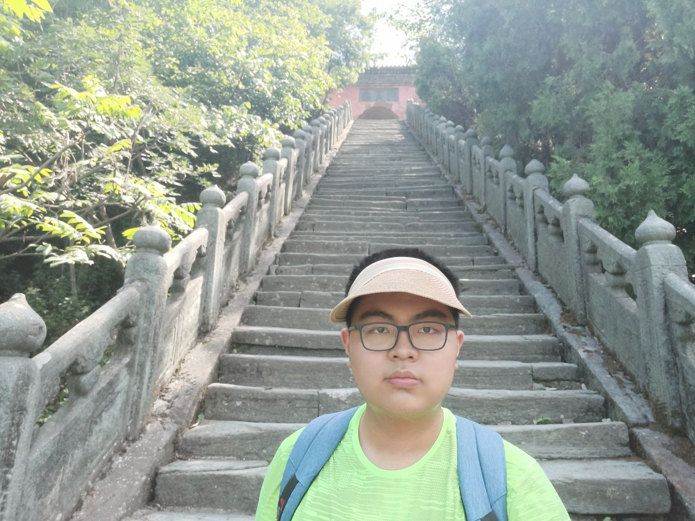
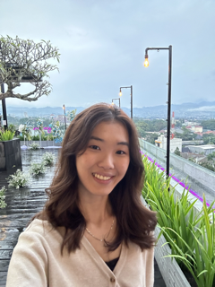

We are a team based in the [School of Computing, National University of Singapore](http://www.comp.nus.edu.sg).

You can reach us at the email `pohsaykeong@stu.comp.nus.edu.sg`

## TAManager

### Poh Say Keong

[[github](https://github.com/pohsaykeong)]
[[portfolio](team/pohsaykeong.md)]

* Role: Team Lead
* Responsibilities: Overall project coordination.

### Rayner Toh

[[github](http://github.com/raynertjx)]
[[portfolio](team/raynertjx.md)]

* Role: Developer (deliverables and deadlines)
* Responsibilities: Ensure deliverables are on time and in the right format.

### Lu Shaoqin

[[github](http://github.com/lshaoqin)] 
[[portfolio](team/lshaoqin.md)]

* Role: Developer (integration)
* Responsibilities: In charge of versioning of the code, maintaining the code repository, integrating various parts of the software to create a whole.

### Luo Zhongyi

[[github](http://github.com/luozyi)]
[[portfolio](team/luozyi.md)]

* Role: Developer (testing)
* Responsibilities: Ensures the testing of the project is done properly and on time.

### Sigrid Elvina Huisen

[[github](http://github.com/itssisi)]
[[portfolio](team/itssisi.md)]

* Role: Developer (code quality)
* Responsibilities: Looks after code quality, ensures adherence to coding standards, etc.
