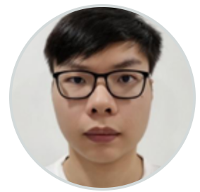
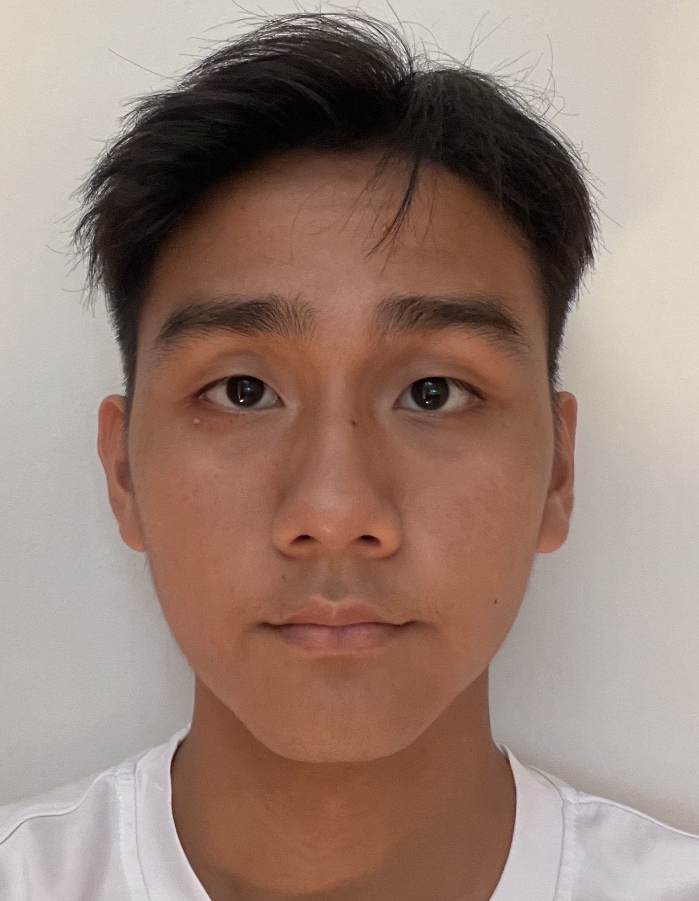
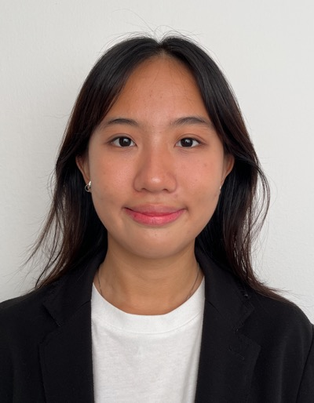

We are a team based in the [School of Computing, National University of Singapore](http://www.comp.nus.edu.sg).

You can reach us at the email `seer[at]comp.nus.edu.sg`

## Project team

### Aaron Tay Kai Boon

[[github](https://github.com/Kb-tay)]
[[portfolio](team/aaron.md)]

* Role: Developer
* Responsibilities: User Stories

### Nicholas Chia

[[github](http://github.com/nikele2001)]
[[portfolio](team/nikele2001.md)]

* Role: Team Lead
* Responsibilities: UI

### Poon Yip Hang, Ryan

[[github](http://github.com/sopa301)] [[portfolio](team/sopa301.md)]

* Role: Developer
* Responsibilities: Documentation

### Low Jun Yu

[[github](http://github.com/jylow)]
[[portfolio](team/jylow.md)]

* Role: Developer
* Responsibilities: Dev Ops + Threading + Debugging

### Alyssa Png Kai Wen

[[github](https://github.com/AlyssaPng)]
[[portfolio](team/alyssapng.md)]

* Role: Developer
* Responsibilities: UI + Debugging
