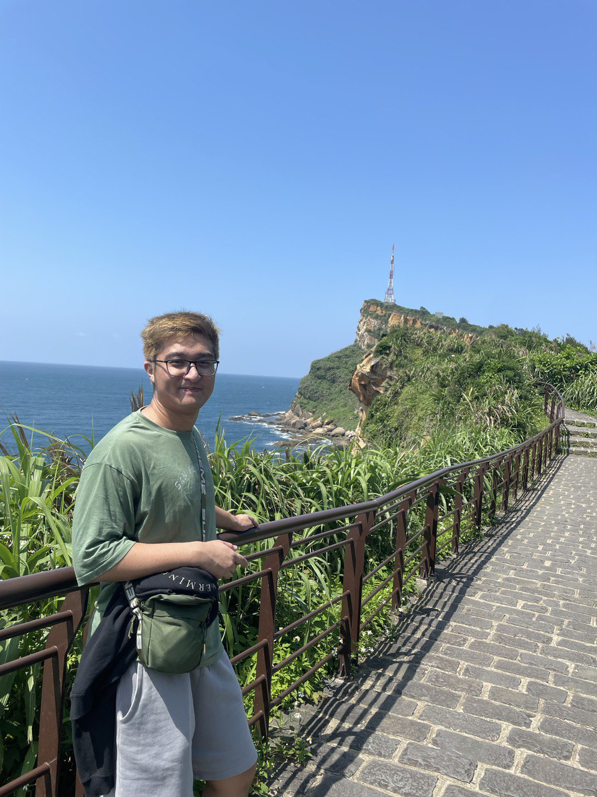

We are a team based in the [School of Computing, National University of Singapore](http://www.comp.nus.edu.sg).

You can reach us at the email `seer[at]comp.nus.edu.sg`

## Project team

### Tanveer Singh

[[homepage](https://www.linkedin.com/in/tanveersingh10/)]
[[github](https://github.com/tanveersingh10)]
[[portfolio](team/tanveer.md)]

* Role: Project Advisor

### Koh Kai Jie

[[homepage](https://www.linkedin.com/in/koh-kai-jie-1064b728b/)]
[[github](http://github.com/kohkaijie)]
[[portfolio](team/kaijie.md)]

* Role: Developer
* Responsibilities: UI

### Johnny Doe

[[github](http://github.com/johndoe)] [[portfolio](team/johndoe.md)]

* Role: Developer
* Responsibilities: Data

### Jean Doe

[[github](http://github.com/johndoe)]
[[portfolio](team/johndoe.md)]

* Role: Developer
* Responsibilities: Dev Ops + Threading

### James Doe

[[github](http://github.com/johndoe)]
[[portfolio](team/johndoe.md)]

* Role: Developer
* Responsibilities: UI
