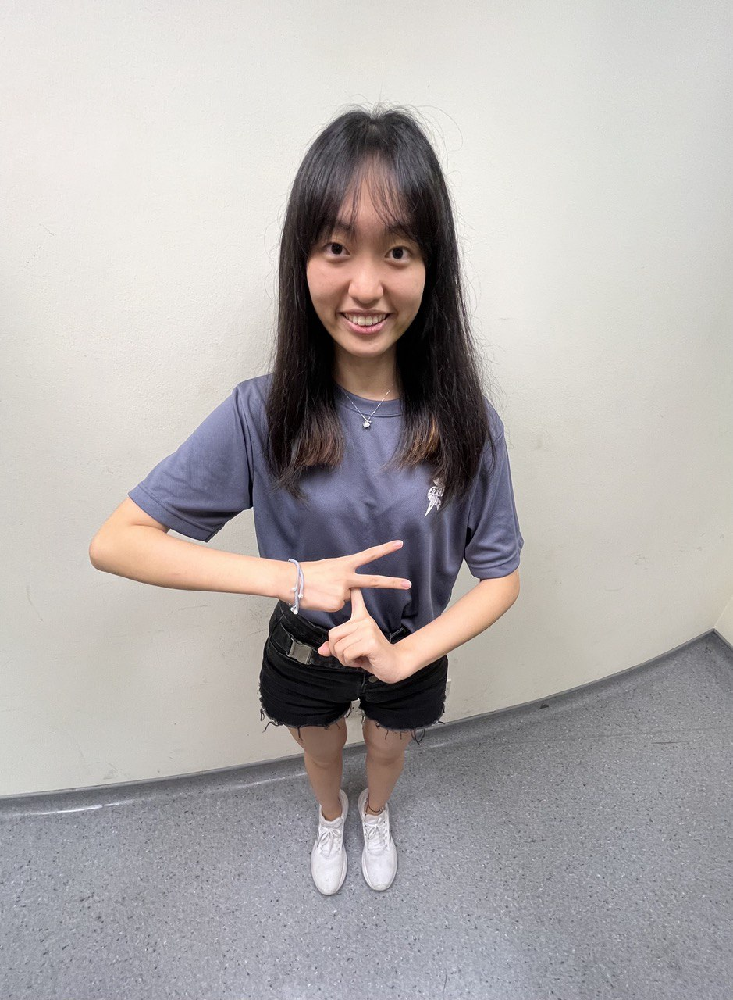
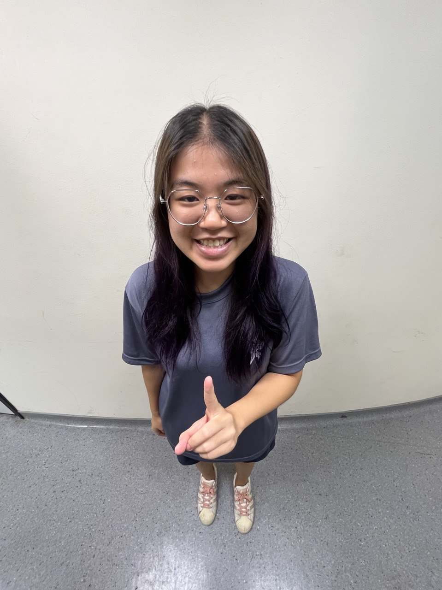
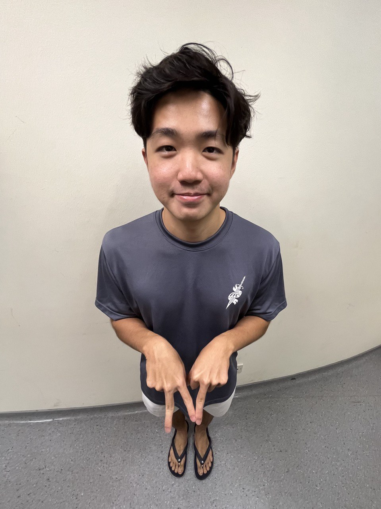
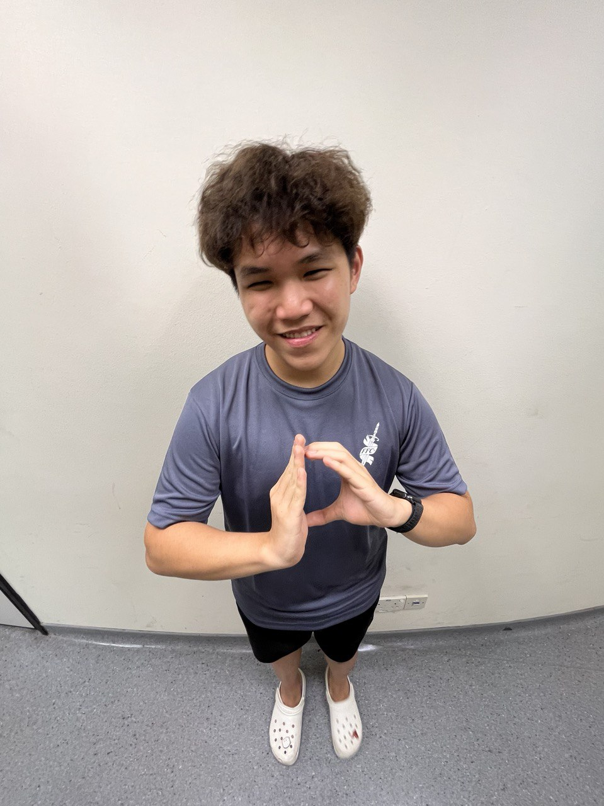
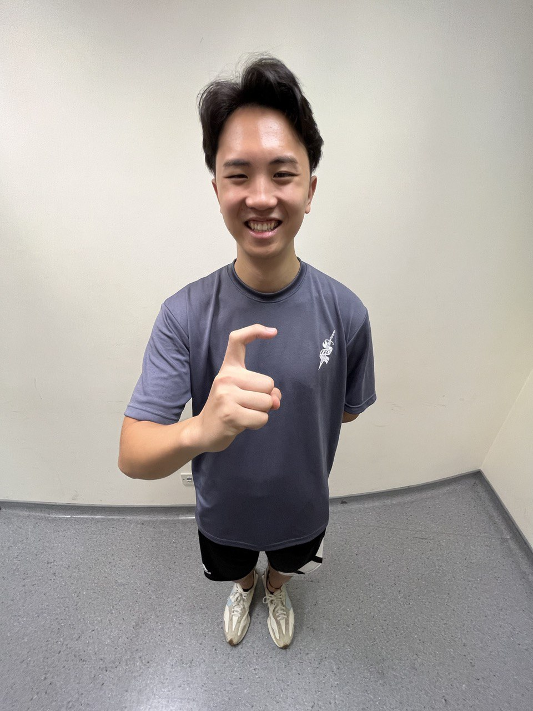

We are a team based in the [School of Computing, National University of Singapore](http://www.comp.nus.edu.sg).

You can reach us at the email `seer[at]comp.nus.edu.sg`

## Project team

### Chen Peiran

[[github](https://github.com/peiran18)]
[[portfolio](team/peiran18.md)

* Role: Documentation & Deliverables IC
* Responsibilities:
  * Review Documentations
  * Tasks Allocation
  * Milestone Tracking

### Chen Zhiruo

[[github](http://github.com/czhiruo)]
[[portfolio](team/czhiruo.md)]

* Role: Testing IC
* Responsibilities:
  * Code Testing
  * Supervises Continuous Integration

### Jeremy Yong Zheming

[[github](https://github.com/JeremyYong128)] [[portfolio](team/jeremyyong128.md)]

* Role: Code Implementation & Quality IC
* Responsibilities:
  * Logic Implementation
  * Reviews Code Quality

### Miguel Foo Ming Yew

[[github](http://github.com/migfoo02)]
[[portfolio](team/migfoo02.md)]

* Role: Frontend Development IC
* Responsibilities:
  * Frontend Development
  * UI Design

### Yan Weidong (Evan)

[[github](https://github.com/evanyan13)]
[[portfolio](team/evanyan13.md)]

* Role: Team Lead
* Responsibilities:
  * Overall Coordination
  * Version & Release Management
  * Repo Maintenance & Integration
