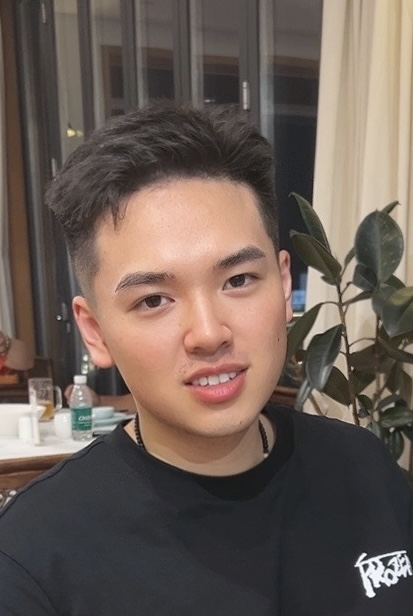
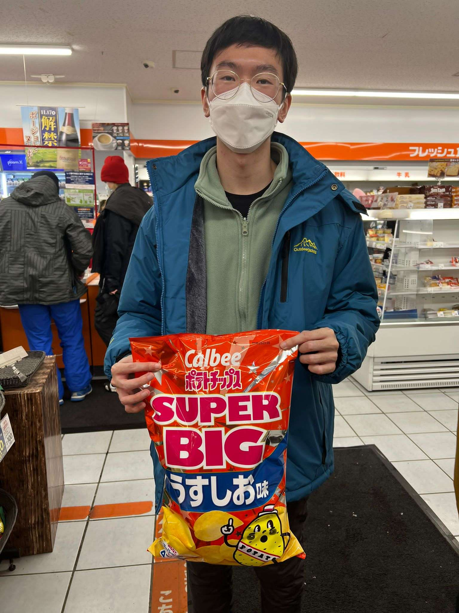

We are a team based in the [School of Computing, National University of Singapore](http://www.comp.nus.edu.sg).

You can reach us at the email `seer[at]comp.nus.edu.sg`

## Project team

### Su Shenyi

[[github](https://github.com/AlainS87)]
[[portfolio](team/alains87.md)]

* Role: Developer Documentation

### Jane Doe

[[github](http://github.com/johndoe)]
[[portfolio](team/johndoe.md)]

- Role: Team Lead
- Responsibilities: UI

### Johnny Doe

[[github](http://github.com/johndoe)] [[portfolio](team/johndoe.md)]

- Role: Developer
- Responsibilities: Data

### Jean Doe

[[github](http://github.com/johndoe)]
[[portfolio](team/johndoe.md)]

- Role: Developer
- Responsibilities: Dev Ops + Threading

### Xavier Oh

[[github](http://github.com/cxo05)]
[[portfolio](team/cxo05.md)]

- Role: Developer
- Responsibilities: UI
