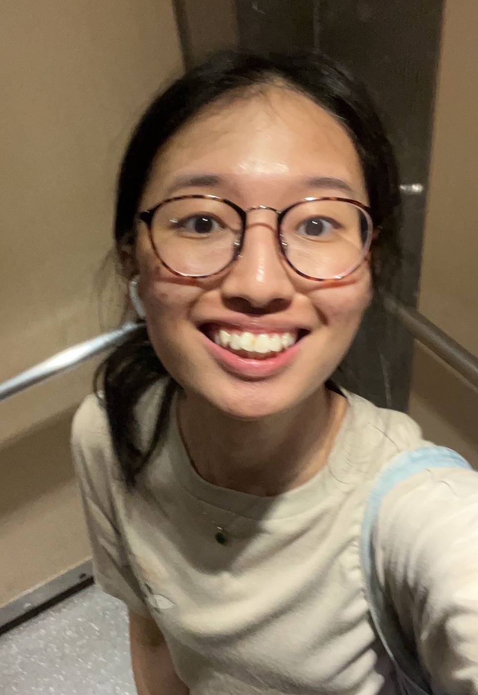
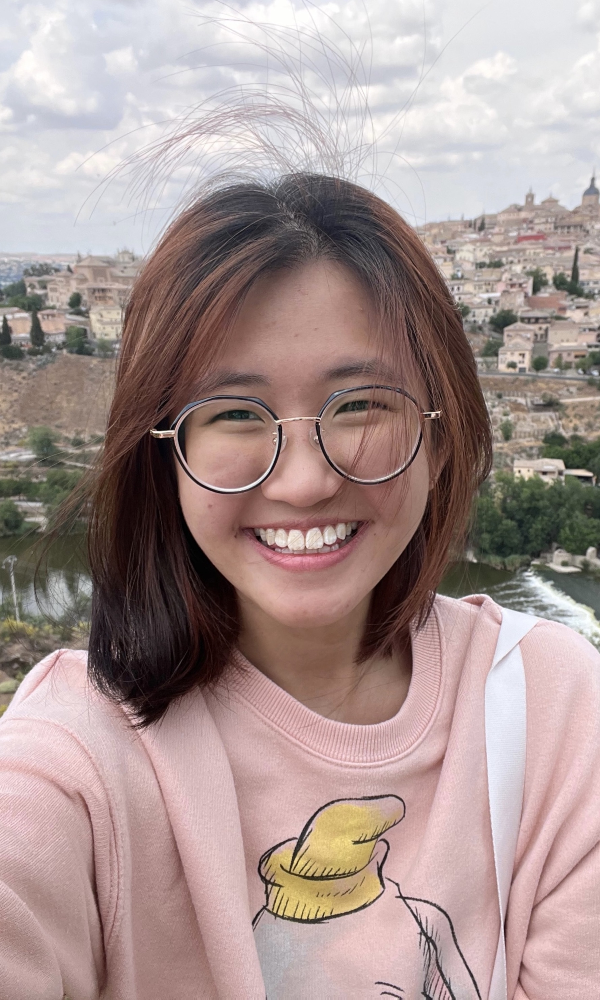
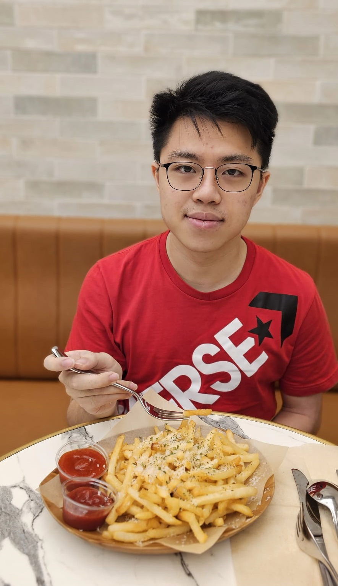
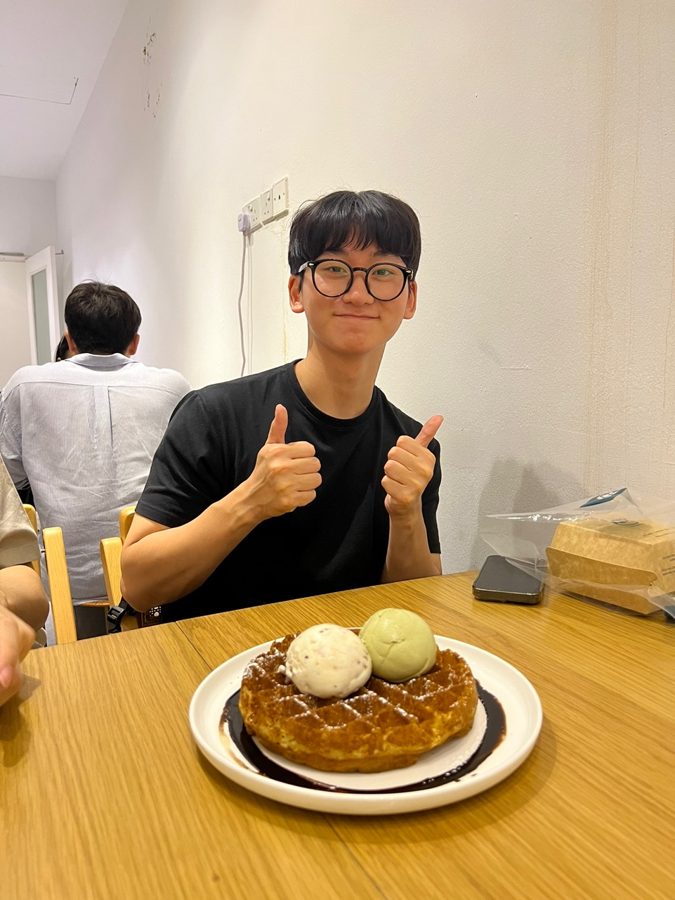
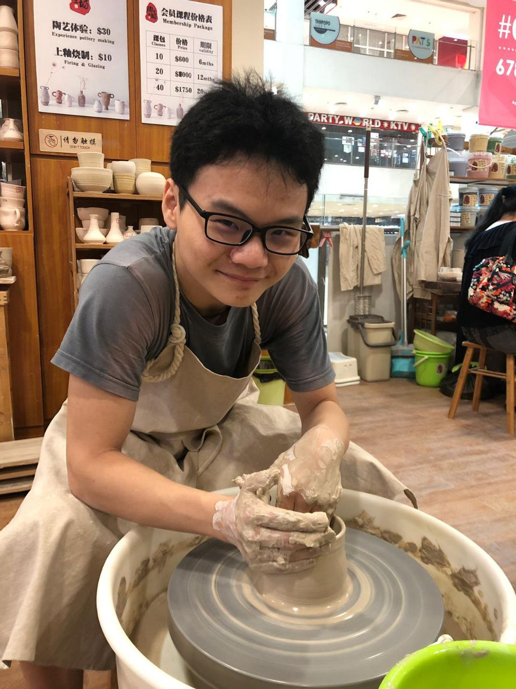

We are a team based in the [School of Computing, National University of Singapore](http://www.comp.nus.edu.sg).

You can reach us at the email `seer[at]comp.nus.edu.sg`

## Project team

### Nicole Chiong

[[github](https://github.com/butteredyakiimo)]
[[portfolio](team/butteredyakiimo.md)]

* Role: Deliverables and Deadlines, Code Quality

### Nanette Tan

[[github](https://github.com/nananakx-x)]
[[portfolio](team/nananakx-x.md)]

* Role: Testing

### Sia Zhi Hong

[[github](http://github.com/h1410101)]
[[portfolio](team/h1410101.md)]

* Role: Integration

### Nam Dohyun (Brandon)

[[github](http://github.com/brandon-nam)]
[[portfolio](team/brandon-nam.md)]

* Role: Scheduling and Tracking

### Tyrus Lye

[[github](https://github.com/TyrusLye)]
[[portfolio](team/tyruslye.md)]

* Role: Documentation
