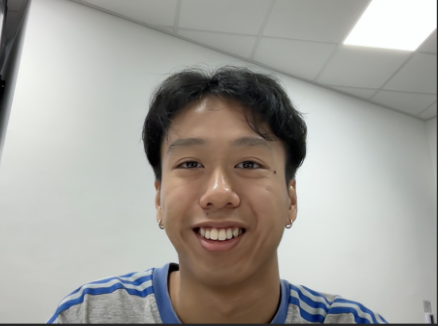
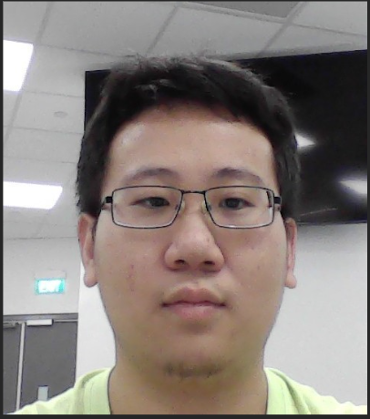
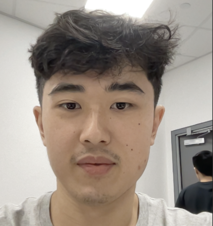
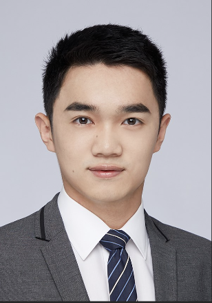
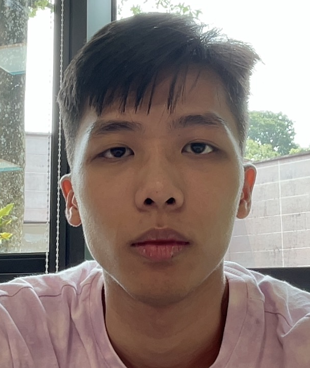

# About Us

We are a team based in the [School of Computing, National University of Singapore](http://www.comp.nus.edu.sg).

You can reach us at the email `seer[at]comp.nus.edu.sg`

## Project team

### Kieron Seven Lee Jun Wei

[[github](https://github.com/cikguseven)]
[[portfolio](team/cikguseven.md)]

* Role: Project Advisor

### Liang Wenzhong

[[github](http://github.com/lwz19)]
[[portfolio](team/lwz19.md)]

* Role: Team Lead
* Responsibilities: UI

### Lim Ngee Yong

[[github](http://github.com/ngeeyonglim)]
[[portfolio](team/ngeeyonglim.md)]

* Role: Developer
* Responsibilities: Data

### Qian Changru

[[github](http://github.com/changruhenryqian)]
[[portfolio](team/changruhenryqian.md)]

* Role: Developer
* Responsibilities: Dev Ops + Threading

### Yeo Boh Shin

[[github](http://github.com/yeobohshin)]
[[portfolio](team/yeobohshin.md)]

* Role: Developer
* Responsibilities: UI
