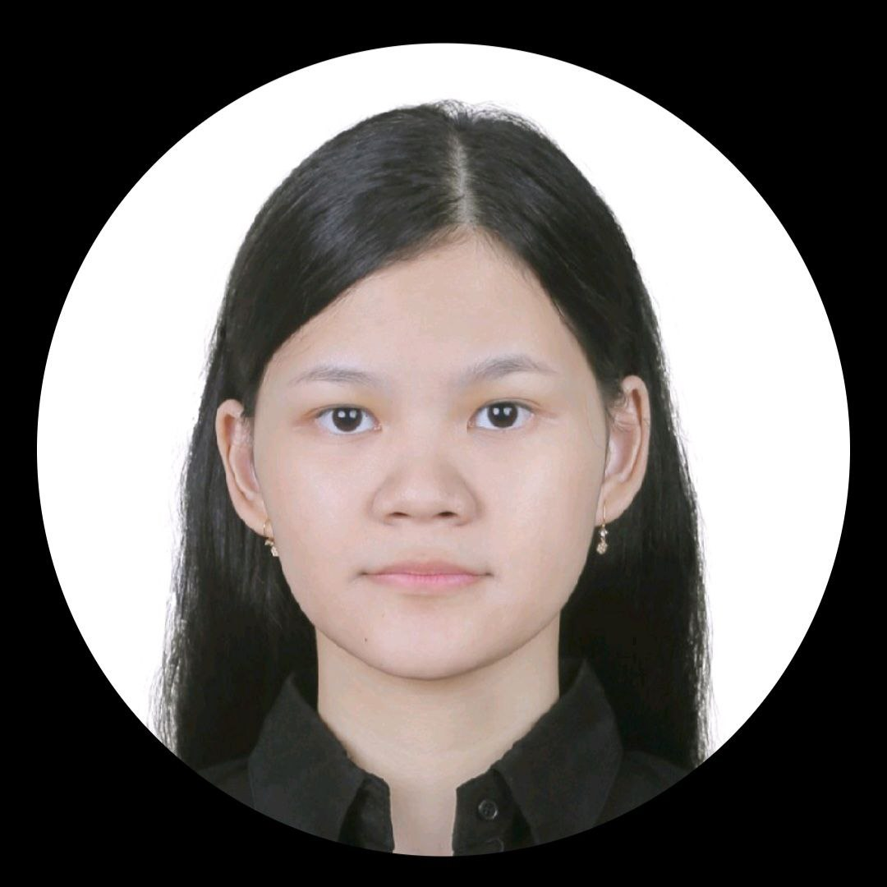
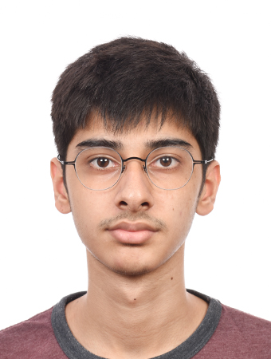
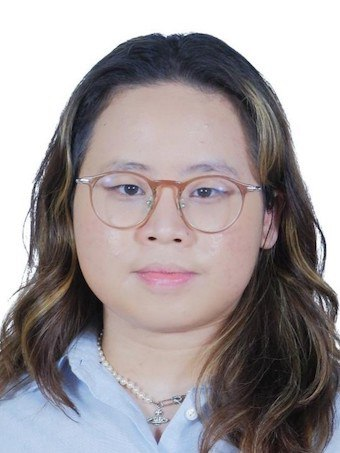

# About Us

We are a team based in the [School of Computing, National University of Singapore](http://www.comp.nus.edu.sg).

You can reach us at the email `e0958427[at]comp.nus.edu.sg`

## Project team

### Sean Koh Hak Guan

[[github](https://github.com/sk2001git)]
[[portfolio](team/johndoe.md)]

* Role: Developer
* Responsibilities: Deliverables & Deadlines, Integration
* In charge of: Storage

### Ariella Thirza Callista

[[github](http://github.com/AriellaCallista)]
[[portfolio](team/johndoe.md)]

* Role: Team Lead
* Responsibilities: Documentation
* In charge of: Model, UI

### Misra Aditya

[[github](http://github.com/MadLamprey)]
[[portfolio](team/johndoe.md)]

* Role: Developer
* Responsibilities: Testing
* In charge of: Test cases and coverage

### Catherine Liang

[[github](http://github.com/ketweeen)]
[[portfolio](team/johndoe.md)]

* Role: Developer
* Responsibilities: Scheduling and tracking
* In charge of: Commons

### Goh Peng Tat

[[github](http://github.com/ScarletBlanks)]
[[portfolio](team/johndoe.md)]

* Role: Developer
* Responsibilities: Code Quality
* In charge of: Logic
