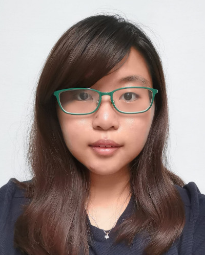

We are a team based in the [School of Computing, National University of Singapore](http://www.comp.nus.edu.sg).

You can reach us at the email `seer[at]comp.nus.edu.sg`

## Project team

### Joshua Weng Hao

[[github](https://github.com/jweng88)]
[[portfolio](team/jweng88.md)]

* Role: Developer
* Responsibilities: Tutor deletion, Tutor viewing

### Muhammad Fikri

[[github](http://github.com/mfjkri)]
[[portfolio](team/mfjkri.md)]

* Role: Developer
* Responsibilities: Tutor search

### Seow Xuan Yi

[[github](http://github.com/saltedfishxx)] [[portfolio](team/saltedfishxx.md)]

* Role: Developer
* Responsibilities: Deleting and viewing schedules

### Teo Rui Shan

[[github](http://github.com/ruishanteo)]
[[portfolio](team/ruishanteo.md)]

* Role: Developer
* Responsibilities: Add Tutors functionalities

### Yeo Di Sheng

[[github](https://github.com/dishenggg)]
[[portfolio](team/dishenggg.md)]

* Role: Developer
* Responsibilities: Add schedule
