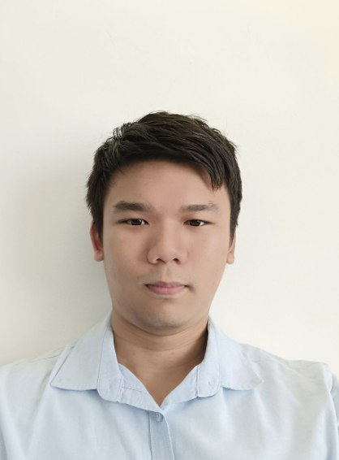
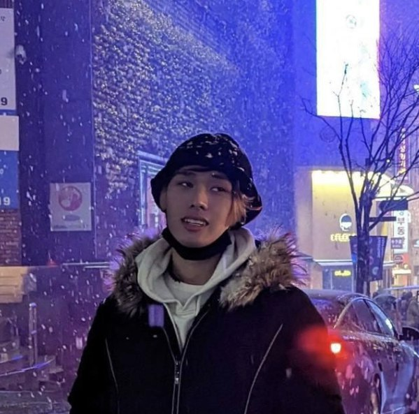
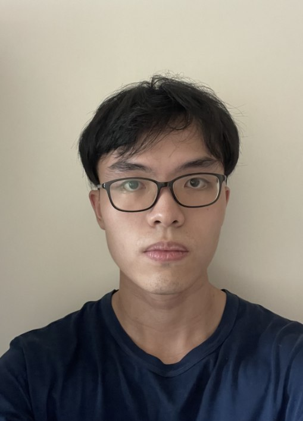

# About Us

We are a team based in the [School of Computing, National University of Singapore](http://www.comp.nus.edu.sg).

You can reach us at the email `seer[at]comp.nus.edu.sg`

## Project team

### Cheong Howen

[[github](https://github.com/howenc)]
[[portfolio](team/howenc.md)]

* Role: Developer
* Responsibilities: In charge of code quality and overall coordination

### Huang Jia Can (Jason)

[[github](http://github.com/jason-raiin)]
[[portfolio](team/jason-raiin.md)]

* Role: Developer
* Responsibilities: In charge of Logic component

### Hwang Qi Zhen

[[github](http://github.com/qz1004)]
[[portfolio](team/qz1004.md)]

* Role: Developer
* Responsibilities: In charge of Model component

### Justin Soong Yoong Kai

[[github](http://github.com/juzzztinsoong)]
[[portfolio](team/juzzztinsoong.md)]

* Role: Developer
* Responsibilities: In charge of Storage component

### Linus Lee

[[github](http://github.com/LoMaply)]
[[portfolio](team/lomaply.md)]

* Role: Developer
* Responsibilities: In charge of UI component

