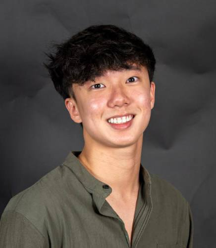
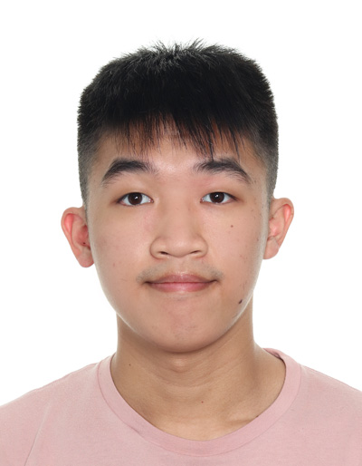
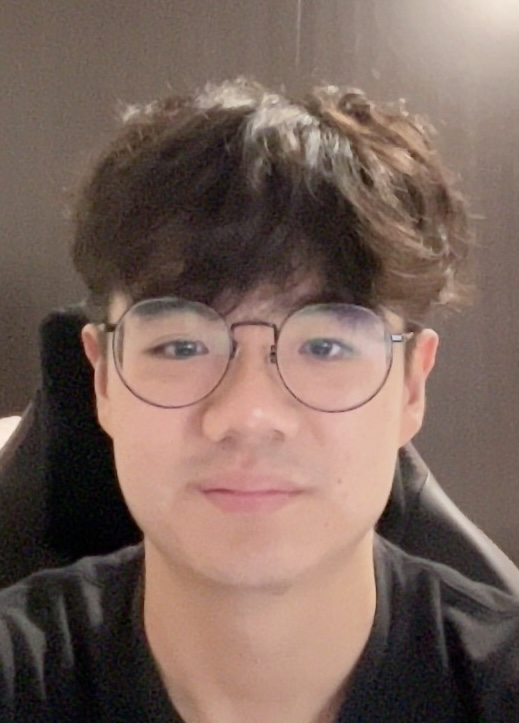
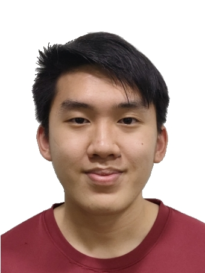
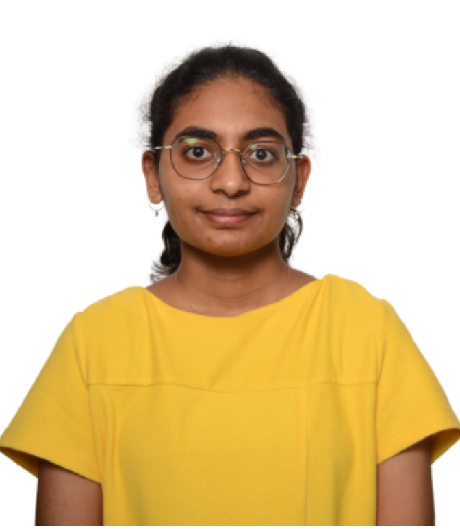

We are a team based in the [School of Computing, National University of Singapore](http://www.comp.nus.edu.sg).

You can reach us at the email `eric_sim@u.nus.edu`

## Project team

### Qu Zhetao

[[github](https://github.com/quzhetao01)]
[[portfolio](team/quzhetao01.md)]

* Role: Developer
* Responsibilities: Storage

### Darren Tan Fanyi

[[github](http://github.com/darrentfy)]
[[portfolio](team/darrentfy.md)]

* Role: Developer
* Responsibilities: UI

### Eric Sim

[[github](http://github.com/simwperic)]
[[portfolio](team/simwperic.md)]

* Role: Developer
* Responsibilities: Architecture

### Stephen

[[github](http://github.com/sheeepen)]
[[portfolio](team/sheeepen.md)]

* Role: Developer
* Responsibilities: Model

### Hannah Caroline Solomonraj

[[github](http://github.com/hcs1203)]
[[portfolio](team/hcs1203.md)]

* Role: Developer
* Responsibilities: Model
  
