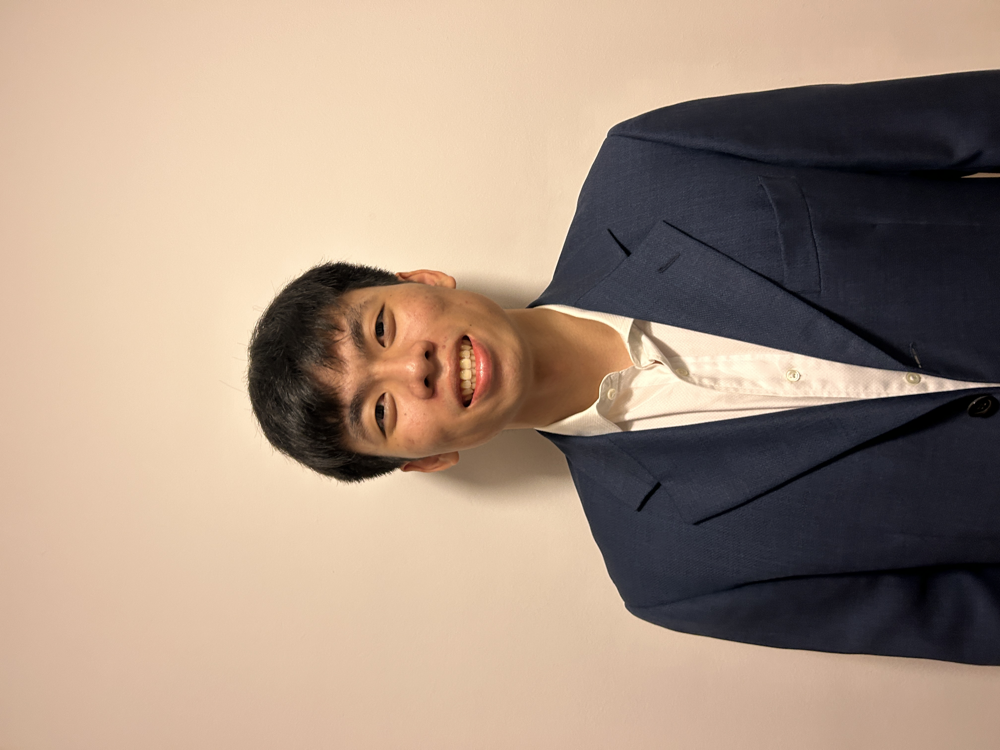

We are a team based in the [School of Computing, National University of Singapore](http://www.comp.nus.edu.sg).

You can reach us at the email `seer[at]comp.nus.edu.sg`

## Project team

### John Doe

[[homepage](http://www.comp.nus.edu.sg/~damithch)]
[[github](https://github.com/johndoe)]
[[portfolio](team/johndoe.md)]

* Role: Project Advisor

### Shu Yang

[[github](http://github.com/shuyangk)]
[[portfolio](team/shuyangk.md)]

* Role: Developer
* Responsibilities: Documentation

### Tan Yiming

[[github](http://github.com/tanyyming)] 
[[portfolio](team/johndoe.md)]

* Role: Developer
* Responsibilities: Scheduling and Tracking + Code Quality

### Wang Hejin

[[github](http://github.com/wanghejin)]
[[portfolio](team/wanghejin.md)]

* Role: Developer
* Responsibilities: Documentation

### James Doe

[[github](http://github.com/johndoe)]
[[portfolio](team/tanyyyming.md)]

* Role: Developer
* Responsibilities: UI
