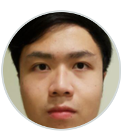
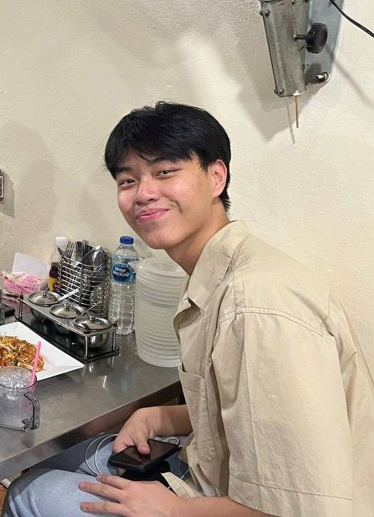
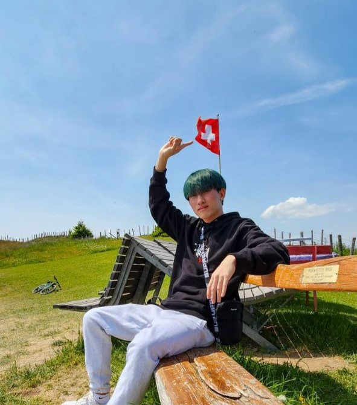

We are a team based in the [School of Computing, National University of Singapore](http://www.comp.nus.edu.sg).

You can reach us at the email `seer[at]comp.nus.edu.sg`

## Project team

### Antony Swami Alfred Ben

[[github](https://github.com/AlfredBeNoel)]
[[portfolio](team/AlfredBeNoel.md)]

* Role: Documentation Expert

### Chan Rui Jia

[[github](http://github.com/matochichap)]
[[portfolio](team/matochichap.md)]

* Role: Intellij Expert

### Jonas Ong Si Wei

[[github](http://github.com/jonasongg)]
[[portfolio](team/jonasongg.md)]

* Role: Git Expert

### Lim Win Sheng

[[github](http://github.com/WinSheng1)]
[[portfolio](team/WinSheng1.md)]

* Role: Scheduling and Tracking

### Teng Hui Xin Alicia

[[github](http://github.com/Saezenn)]
[[portfolio](team/Saezenn.md)]

* Role: UI Design Expert
