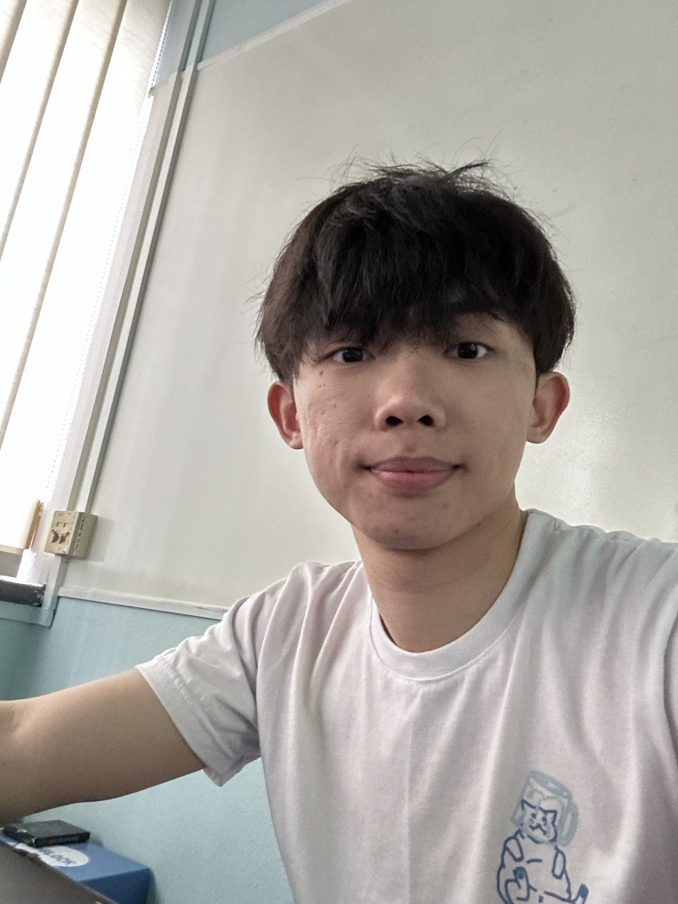
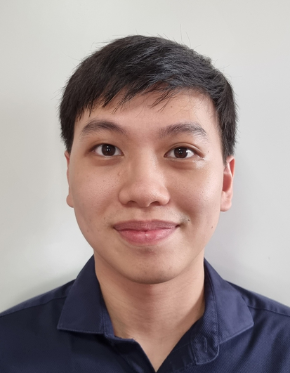
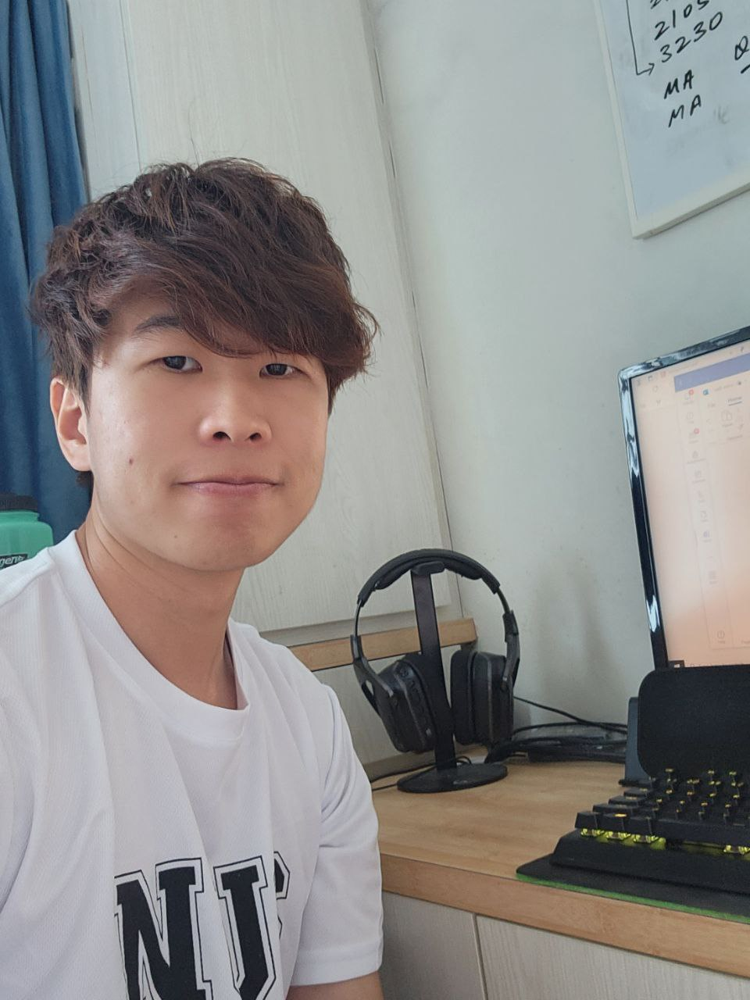

# About Us

We are a team based in the [School of Computing, National University of Singapore](http://www.comp.nus.edu.sg).

You can reach us at the email `shuenjin@u.nus.edu`

## Project team

### Lee Zhan Peng

[[github](https://github.com/leezhanpeng)]
[[portfolio](team/leezhanpeng.md)]

* Role: Head Developer
* Responsibilities: UI, Administrative

### Eric Xiong

[[github](http://github.com/EricXiong420)]
[[portfolio](team/ericxiong420.md)]

* Role: Developer
* Responsibilities: Logic

### Ng Shuen Jin

[[github](http://github.com/shuenj)] [[portfolio](team/shuenj.md)]

* Role: Developer
* Responsibilities: Features

### Zheng Chenglong

[[github](https://github.com/seonlo99)]
[[portfolio](team/seonlo99.md)]

* Role: Developer
* Responsibilities: Features
