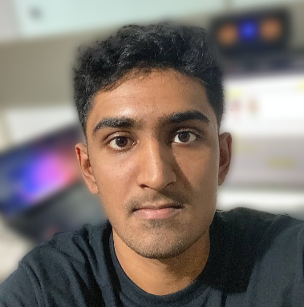

# About Us

We are a team based in the [School of Computing, National University of Singapore](http://www.comp.nus.edu.sg).

You can reach us at the email `seer[at]comp.nus.edu.sg`

## Project team

### John Doe

[[homepage](http://www.comp.nus.edu.sg/~damithch)]
[[github](https://github.com/johndoe)]
[[portfolio](team/johndoe.md)]

* Role: Project Advisor

### Goh En Rui Ryann

[[github](http://github.com/ryamgoh)]
[[portfolio](team/gohenruiryann.md)]

* Role: Team Lead
* Responsibilities: UI

### Johnny Doe

[[github](http://github.com/johndoe)] [[portfolio](team/johndoe.md)]

* Role: Developer
* Responsibilities: Data

### Lynn Low

[[github](http://github.com/lynnlow175)]
[[portfolio](team/lynnlow.md)]

* Role: Developer
* Responsibilities: Dev Ops + Threading

### Shishir Bychapur

[[github](http://github.com/shishirbychapur)]
[[portfolio](team/shishirbychapur.md)]

* Role: Developer
* Responsibilities: Logic
* 
* ### Lee Seng Kitt

[[github](http://github.com/bobscodedump)]
[[portfolio](team/sengkitt.md)]

* Role: Developer
* Responsibilities: Software Engineering
