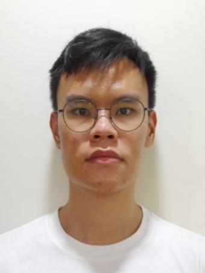

# About Us

DoConnek Pro is developed by the W13-1 team.

We are a team based in the [School of Computing, National University of Singapore](http://www.comp.nus.edu.sg).

## Project team

### Vansh Nath

[[github](https://github.com/vansh284)]
[[portfolio](team/vansh284.md)]

* Role: Developer
* Responsibilities: Team lead, Integration

### Gavin Chiam Xiang Zhe

[[github](http://github.com/gavino3o)]
[[portfolio](team/gavino3o.md)]

* Role: Developer
* Responsibilities: Code Quality, Deliverables and Deadlines, Git Expert

### Lim Jun Han, Alvin

[[github](http://github.com/alvinlim277)]
[[portfolio](team/alvinlim277.md)]

* Role: Developer
* Responsibilities: Documentation, Testing

### Ng Kok Seng

[[github](http://github.com/kokseng1)]
[[portfolio](team/kokseng1.md)]

* Role: Developer
  * Responsibilities: Scheduling and tracking, in charge of models

### Angky Akdi Frandy Putrakelana

[[github](http://github.com/angkyakdifp)]
[[portfolio](team/angkyakdifp.md)]

* Role: Developer
* Responsibilities: In Charge of UI, In Charge of Storage
