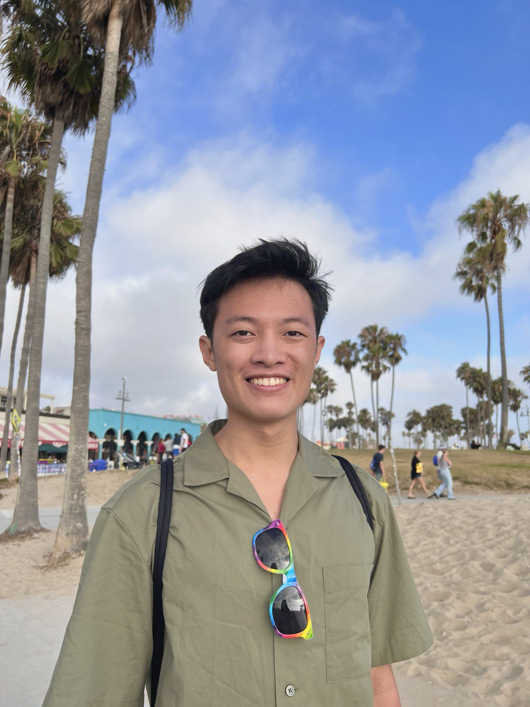
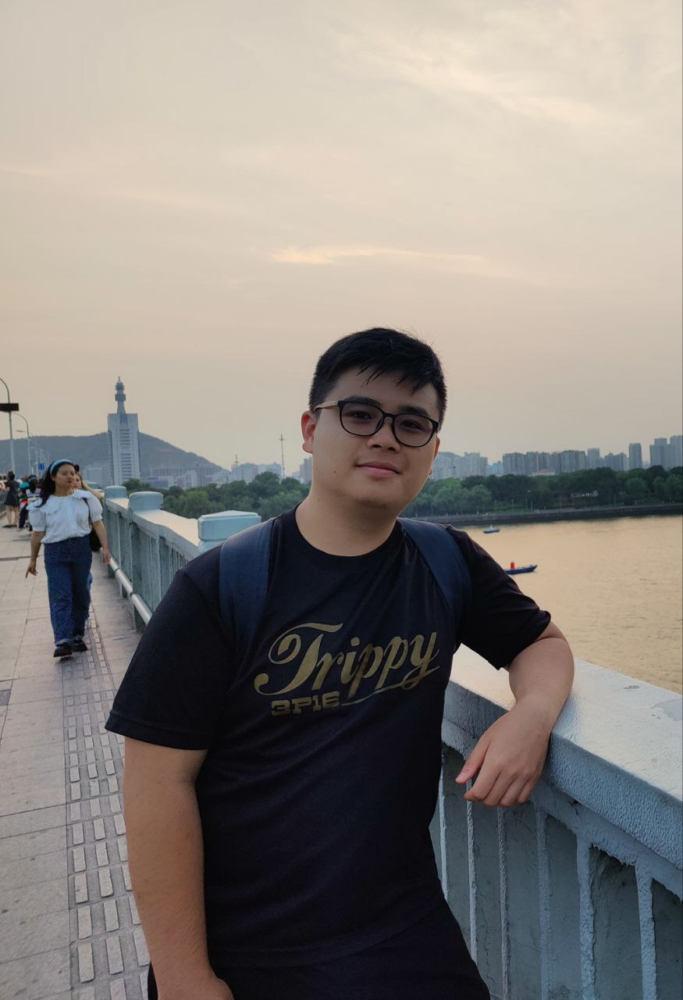
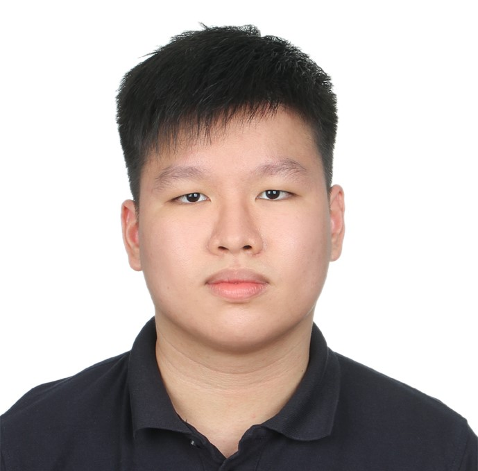

We are a team based in the [School of Computing, National University of Singapore](http://www.comp.nus.edu.sg).

You can visit our project repository at our [organisation github](https://github.com/AY2324S1-CS2103T-T12-2).

## Project team

### Lee Zheng Jing

[[github](https://github.com/leezhengjing)]
[[portfolio](team/leezhengjing.md)]

* Role: Developer
* Responsibilities: Data

### Kurt Lee Yi Jie

[[github](https://github.com/Kurtyjlee)]
[[portfolio](team/kurtyjlee.md)]

* Role: Developer
* Responsibilities: Back-end and QA

### Leong Yu Jun Nicholas

[[github](https://github.com/nicleongyj)]
[[portfolio](team/nicleongyj.md)]

* Role: Developer
* Responsibilities: Data

### Guo Yuheng

[[github](https://github.com/DistractedCat)]
[[portfolio](team/distractedcat.md)]

* Role: Developer
* Responsibilities: Dev Ops + Threading

### Lai Wei Zhong

[[github](https://github.com/Ken-Lai)]
[[portfolio](team/ken-lai.md)]

* Role: Developer
* Responsibilities: UI
