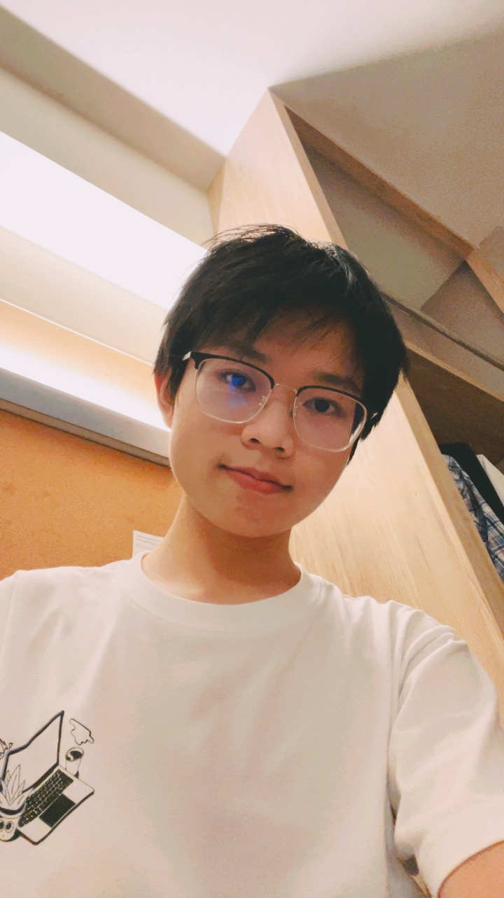
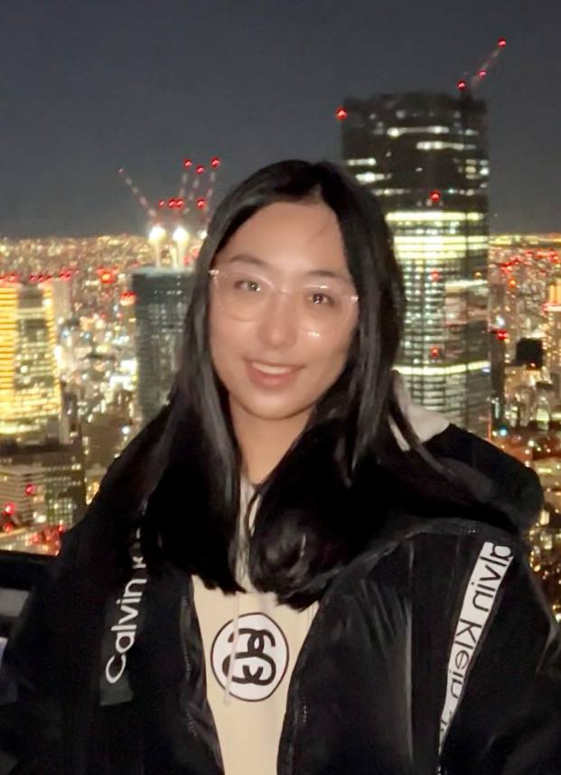
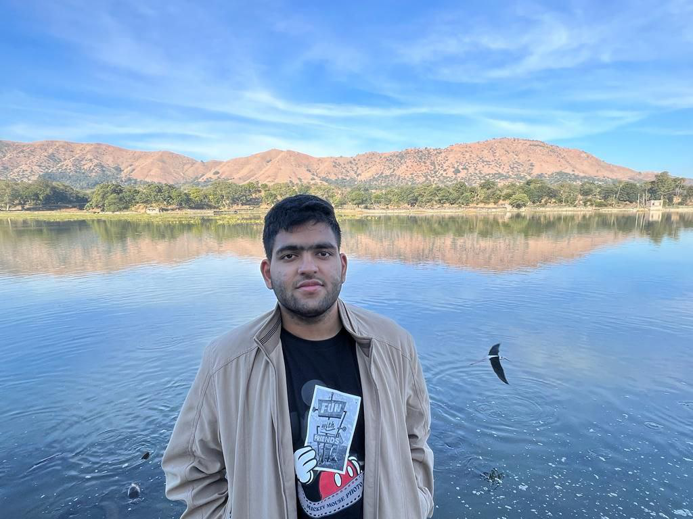

We are a team based in the [School of Computing, National University of Singapore](http://www.comp.nus.edu.sg).

You can reach us at the email `seer[at]comp.nus.edu.sg`

## Project team

### Wang Cheng

[[github](https://github.com/wangcheng0116)]
[[portfolio](team/wangcheng0116.md)]

* Role: Developer
* Responsibilities: Data and backend

### Yu Jiali

[[github](http://github.com/a1waysd)]
[[portfolio](team/a1waysd.md)]

* Role: Scheduling and tracking, Lead
* Responsibilities: UI

### TAN SHEN, NATHANAEL MARK

[[github](https://github.com/itsNatTan)]
[[portfolio](team/itsnattan.md)]

* Role: Lead, QA, Developer
* Responsibilities: Backend, UI

### BHARDWAJ TAANISH

[[github](http://github.com/D-Limiter)]
[[portfolio](team/d_limiter.md)]

* Role: Developer
* Responsibilities: UI and backend

### Song Mengfei

[[github](http://github.com/Song-Mengfei)]
[[portfolio](team/song-mengfei.md)]

* Role: Developer
* Responsibilities: UI
