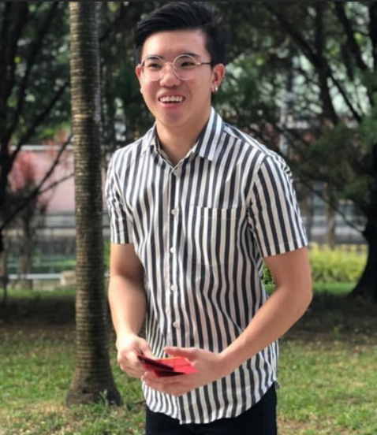
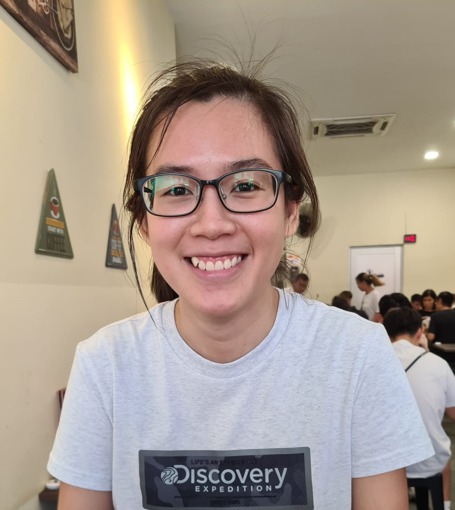

We are a team based in the [School of Computing, National University of Singapore](http://www.comp.nus.edu.sg).

You can reach us at the email `seer[at]comp.nus.edu.sg`

## Project team

### Brendan

[[github](https://github.com/brendanneojw)]
[[portfolio](team/brendanneojw.md)]

* Role: Team Lead

### Chai Yin

[[github](http://github.com/KumChaiYin)]
[[portfolio](team/KumChaiYin.md)]

* Role: Documentation

### Rohan

[[github](http://github.com/RSXIX)]
[[portfolio](team/RSXIX.md)]

* Role: Testing

### Suryansh

[[github](http://github.com/suryanshkushwaha)]
[[portfolio](team/suryanshkushwaha.md)]

* Role: Code Quality

### Yao Xuan

[[github](http://github.com/cyaoxuan)]
[[portfolio](team/cyaoxuan.md)]

* Role: Git Expert
