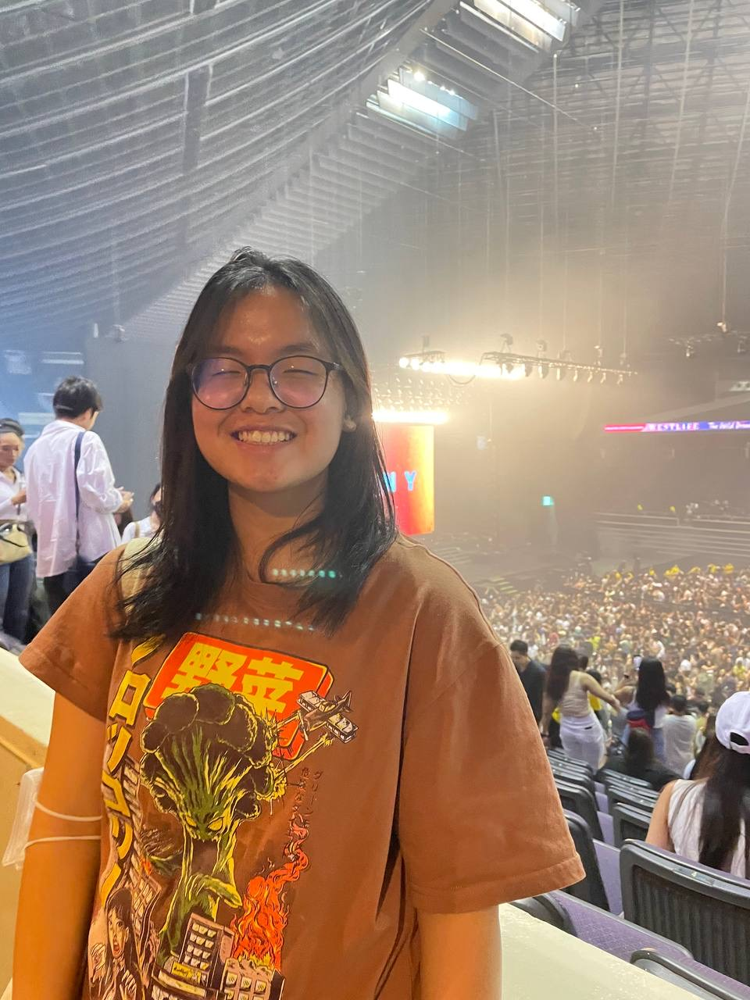
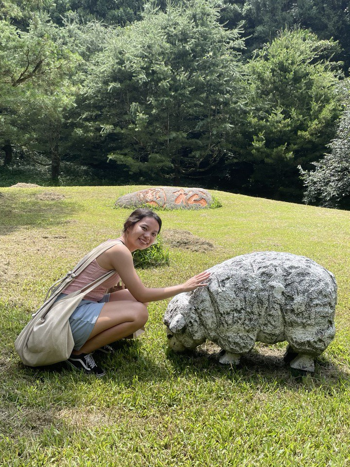

We are a team based in the [School of Computing, National University of Singapore](http://www.comp.nus.edu.sg).

You can reach us at the email `seer[at]comp.nus.edu.sg`

## Project team

### Shah Saumya Snehal

[[github](https://github.com/LordSaumya)]
[[portfolio](team/saumyashah.md)]

* Role: Team Lead
* Responsibilities: Model

### Kok Fangyu Inez

[[github](http://github.com/inezkok)]
[[portfolio](team/inezkok.md)]

* Role: Deliverables and deadlines, Scheduling and tracking
* Responsibilities: UI

### Lim Jin Yin

[[github](http://github.com/miljyy)]
[[portfolio](team/miljyy.md)]

* Role: Documentation
* Responsibilities: Logic

### Kee Song Yang

[[github](http://github.com/s0ngyang)]
[[portfolio](team/s0ngyang.md)]

* Role: Integration
* Responsibilities: Logic

### Jason Ray

[[github](https://github.com/JasonRay168)]
[[portfolio](team/JasonRay168.md)]

* Role: Testing
* Responsibilities: Storage
