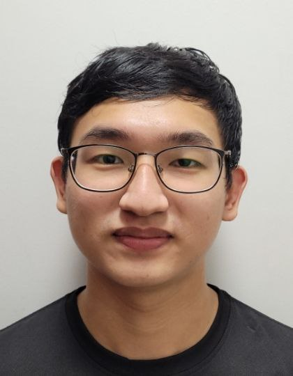

We are a team based in the [School of Computing, National University of Singapore](http://www.comp.nus.edu.sg).

You can reach us at the email `seer[at]comp.nus.edu.sg`

## Project team

### Anthony Tamzil

[[github](https://github.com/anthonytamzil)]
[[portfolio](team/anthonytamzil.md)]

* Role: Team Lead

### Jane Doe

[[github](http://github.com/johndoe)]
[[portfolio](team/johndoe.md)]

* Role: Team Lead
* Responsibilities: UI

### Elgin Tan Zhi Ming

[[github](http://github.com/ElginTZM)]
[[portfolio](team/elgintzm.md)]

* Role: Developer
* Responsibilities: Testing

### Tan Liyan

[[github](http://github.com/spatuly)]
[[portfolio](team/spatuly.md)]

* Role: Developer
* Responsibilities: Code Quality

### Quek Zong Jin

[[github](http://github.com/Zjinnnn)]
[[portfolio](team/zjinnnn.md)]

* Role: Developer
* Responsibilities: Deliverables and Deadlines
