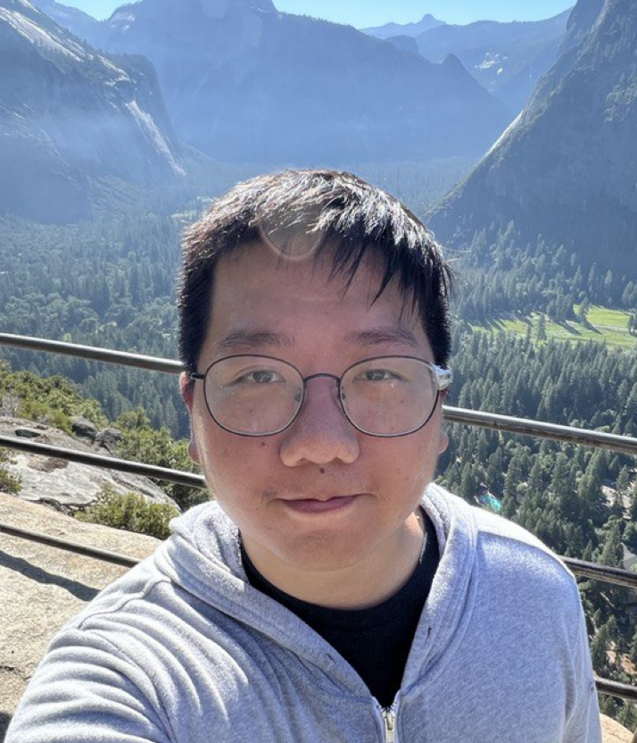

# About Us

We are a team based in the [School of Computing, National University of Singapore](http://www.comp.nus.edu.sg).

You can reach us at the email `seer[at]comp.nus.edu.sg`

## Project team

### Calvin Fong

[[github](https://github.com/lordidiot)]
[[portfolio](team/lordidiot.md)]

- Role: Team lead, Scheduling and tracking

### Wong Kok Rui

[[github](http://github.com/kokrui)]
[[portfolio](team/kokrui.md)]

- Role: Code quality, Integration

### Nguyen Phu Hao

[[github](http://github.com/vn-hao)]
[[portfolio](team/vn-hao.md)]

- Role: Testing

### Lim Jun Xian

[[github](http://github.com/limjunxian1)]
[[portfolio](team/limjunxian1.md)]

- Role: Deliverables and deadlines

### Conrad Soon

[[github](http://github.com/conradsoon)]
[[portfolio](team/conradsoon.md)]

- Role: Documentation
