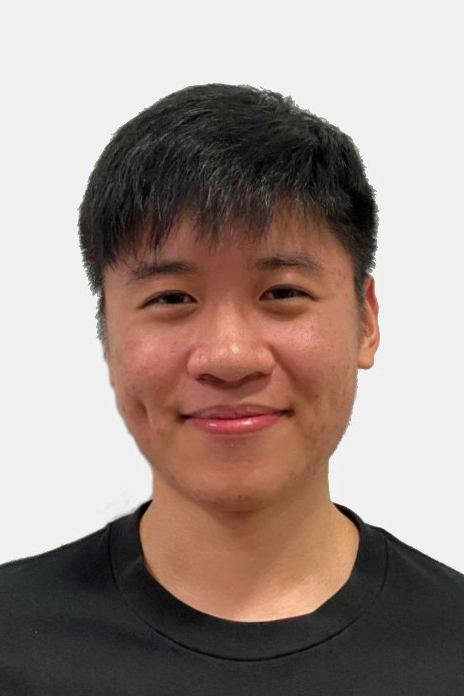

We are a team based in the [School of Computing, National University of Singapore](http://www.comp.nus.edu.sg).

You can reach us at the email `seer[at]comp.nus.edu.sg`

## Project team

### Lang Heran

[[github](http://github.com/heran9)] [[portfolio](team/heran9.md)]

* Role: Developer
* Responsibilities: NA

### Lim Yih Fei

[[github](http://github.com/yihfei)]
[[portfolio](team/yihfei.md)]

* Role: Developer
* Responsibilities: Not determined yet

### Lam Jin Heng Braydon

[[github](https://github.com/lambraydon)] [[portfolio](team/johndoe.md)]

* Role: Developer
* Responsibilities: Data

### Armando Jovan Kusuma

[[github](https://github.com/jovkusuma)]
[[portfolio](team/jovkusuma.md)]

* Role: Developer
* Responsibilities: Not determined yet

### Winston Leonard Prayonggo

[[github](http://github.com/WinstonLeonard)]
[[portfolio](team/winstonleonard.md)]

* Role: Developer
* Responsibilities: UI
