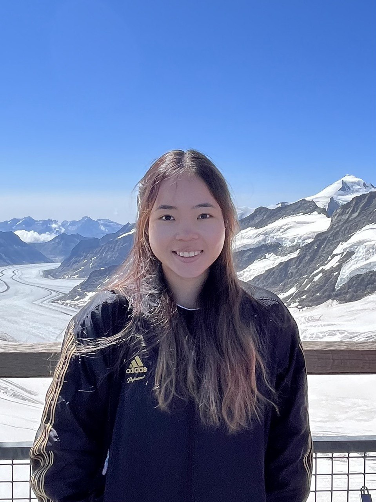

# About Us

We are a team based in the [School of Computing, National University of Singapore](http://www.comp.nus.edu.sg).

You can reach us at the email `seer[at]comp.nus.edu.sg`

## Project team

### Wee Hung

[[homepage](https://github.com/WeeeHung)]
[[github](https://github.com/WeeeHung)]
[[portfolio](team/weeehung.md)]

* Role: Developer
* Responsibilities: Deliverables and deadlines

### Zhang Yiheng

[[github](http://github.com/nubnubyas)]
[[portfolio](team/yiheng.md)]

* Role: Team Lead
* Responsibilities: UI

### Janssen Lau

[[github](http://github.com/kanna-1)] [[portfolio](team/kanna-1.md)]

* Role: Developer
* Responsibilities: Documentation + Code Quality

### Huang Yi Chee

[[github](http://github.com/hyc17003)]
[[portfolio](team/hyc17003.md)]

* Role: Developer
* Responsibilities: Dev Ops + Threading

### Wang Zhi, Wren

[[github](http://github.com/wzwren)]
[[portfolio](team/wzwren.md)]

* Role: Developer
* Responsibilities: Scheduling and Tracking
