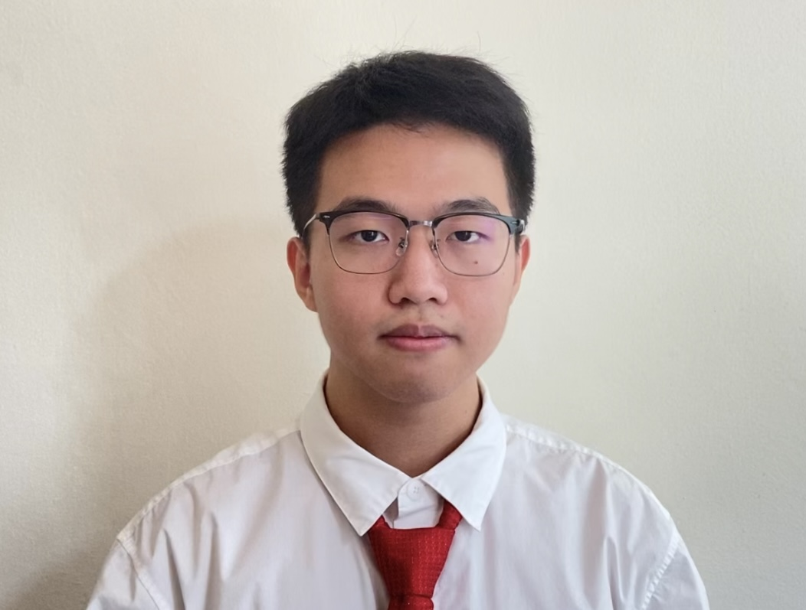

We are a team of students from the [School of Computing, National University of Singapore](http://www.comp.nus.edu.sg).

## Project team

### Nguyen Khoi Nguyen

[[homepage](https://nknguyenhc.github.io/)]
[[github](https://github.com/nknguyenhc)]
[[portfolio](team/nknguyenhc.md)]

* Role: Team Lead
* Responsibilities: 
  * Scheduling and tracking
  * Deliverables and deadlines
  * Integration

### Luo Jiale

[[github](https://github.com/singa-pirate)]
[[portfolio](team/singa-pirate.md)]

* Role: Developer
* Responsibilities: Documentation

### Johnny Doe

[[github](http://github.com/johndoe)] [[portfolio](team/johndoe.md)]

* Role: Developer
* Responsibilities: Data

### Jean Doe

[[github](http://github.com/johndoe)]
[[portfolio](team/johndoe.md)]

* Role: Developer
* Responsibilities: Dev Ops + Threading

### James Doe

[[github](http://github.com/johndoe)]
[[portfolio](team/johndoe.md)]

* Role: Developer
* Responsibilities: UI
