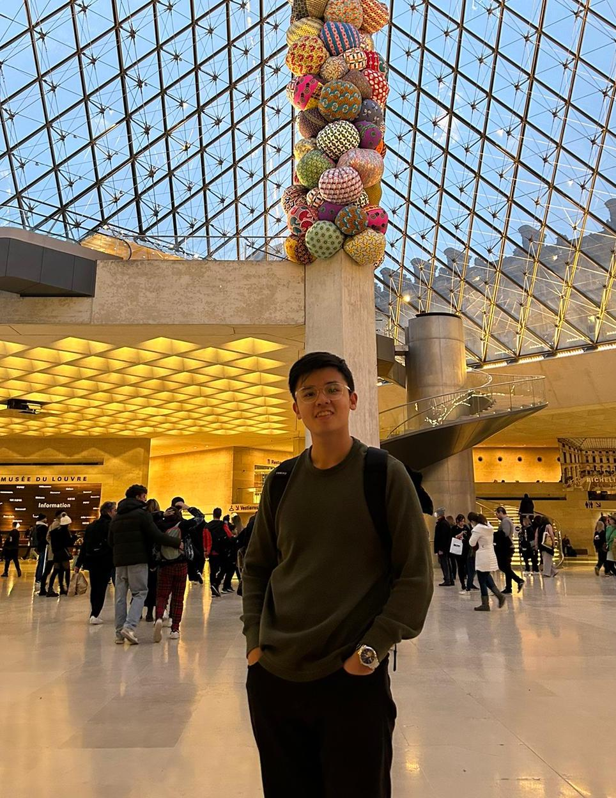

We are a team based in the [School of Computing, National University of Singapore](http://www.comp.nus.edu.sg).

You can reach us at the email `connectify[at]comp.nus.edu.sg`

## Project team

### Kamili Arsyad

[[github](https://github.com/KamiliArsyad)]
[[portfolio](team/kamiliarsyad.md)]

* Role: Team Lead
* Responsibilities: Reviewer and Repo maintainer

### Dick Ong

[[github](http://github.com/dickongwd)]
[[portfolio](team/dickongwd.md)]

* Role: Code Quality and Documentation Reviewer
* Responsibilities: UserGuide and DeveloperGuide

### Jair Goh

[[github](http://github.com/lilozz2)]
[[portfolio](team/lilozz2.md)]

* Role: Developer & Integration Reviewer
* Responsibilities: Component Design & Testing

### Sean Wang

[[github](http://github.com/magnificentcreature)]
[[portfolio](team/magnificentcreature.md)]

* Role: Testing Reviewer
* Responsibilities: DevOps + Testing + Threading

### Zhang Yu Han

[[github](http://github.com/zhyuhan)]
[[portfolio](team/zhyuhan.md)]

* Role: Frontend Developer
* Responsibilities: Dashboard, UI
