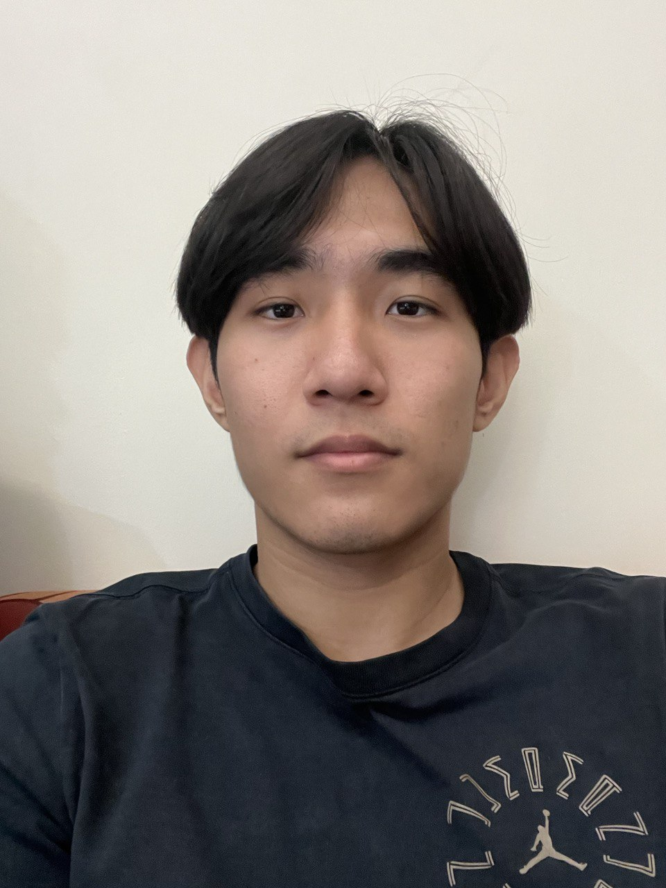
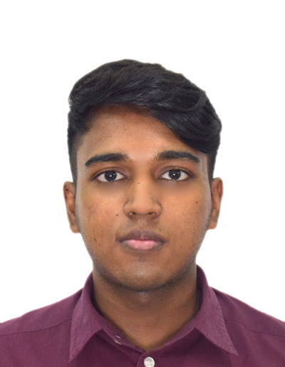
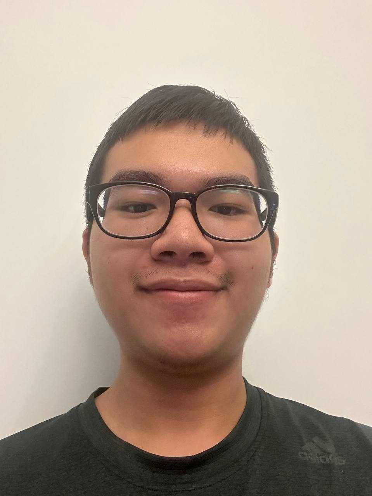
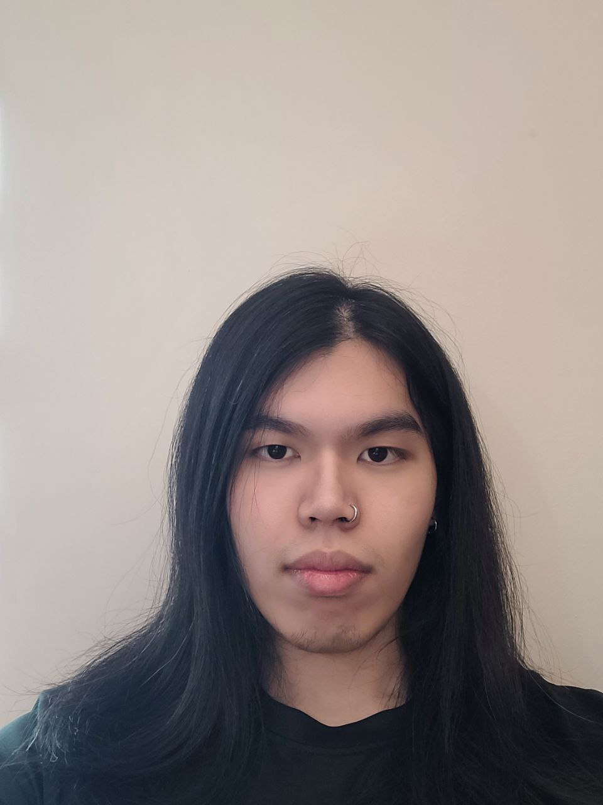

We are a team based in the [School of Computing, National University of Singapore](http://www.comp.nus.edu.sg).

You can reach us at the email `seer[at]comp.nus.edu.sg`

## Project team

### Gao Tianrun

[[github](https://github.com/trgao)]
[[portfolio](team/trgao.md)]

* Role: Team Lead
* Responsibilities:

### Shen Licong

[[github](http://github.com/licongshen12)]
[[portfolio](team/licongshen12.md)]

* Role: Developer
* Responsibilities:

### Stalin Muthukumar Bill Kirankumar

[[github](http://github.com/billieboy7)]
[[portfolio](team/billieboy7.md)]

* Role: Developer
* Responsibilities:

### Doan Quoc Thinh

[[github](http://github.com/dinde2004)]
[[portfolio](team/dinde2004.md)]

* Role: Developer
* Responsibilities:

### Kwang Thiag

[[github](http://github.com/kwangthiag)]
[[portfolio](team/kwangthiag.md)]

* Role: Developer
* Responsibilities:
