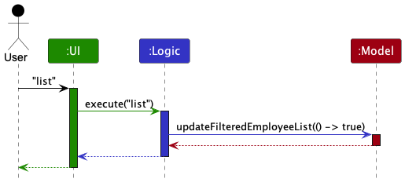
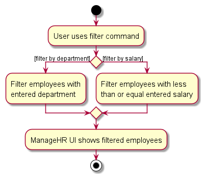
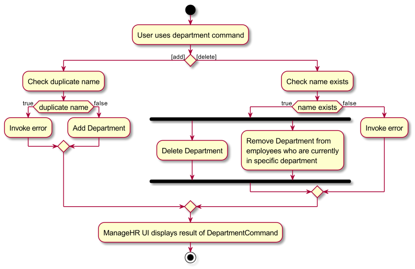

* Table of Contents
{:toc}

--------------------------------------------------------------------------------------------------------------------

## **Acknowledgements**

* {list here sources of all reused/adapted ideas, code, documentation, and third-party libraries -- include links to the original source as well}

--------------------------------------------------------------------------------------------------------------------

## **Setting up, getting started**

Refer to the guide [_Setting up and getting started_](SettingUp.md).

--------------------------------------------------------------------------------------------------------------------

## **Design**

:bulb: **Tip:** The `.puml` files used to create diagrams in this document `docs/diagrams` folder. Refer to the [_PlantUML Tutorial_ at se-edu/guides](https://se-education.org/guides/tutorials/plantUml.html) to learn how to create and edit diagrams.

### Architecture

The ***Architecture Diagram*** given above explains the high-level design of the App.

Given below is a quick overview of main components and how they interact with each other.

**Main components of the architecture**

**`Main`** (consisting of classes [`Main`](https://github.com/se-edu/addressbook-level3/tree/master/src/main/java/seedu/address/Main.java) and [`MainApp`](https://github.com/se-edu/addressbook-level3/tree/master/src/main/java/seedu/address/MainApp.java)) is in charge of the app launch and shut down.
* At app launch, it initializes the other components in the correct sequence, and connects them up with each other.
* At shut down, it shuts down the other components and invokes cleanup methods where necessary.

The bulk of the app's work is done by the following four components:

* [**`UI`**](#ui-component): The UI of the App.
* [**`Logic`**](#logic-component): The command executor.
* [**`Model`**](#model-component): Holds the data of the App in memory.
* [**`Storage`**](#storage-component): Reads data from, and writes data to, the hard disk.

[**`Commons`**](#common-classes) represents a collection of classes used by multiple other components.

**How the architecture components interact with each other**

The *Sequence Diagram* below shows how the components interact with each other for the scenario where the user issues the command `delete 1`.

Each of the four main components (also shown in the diagram above),

* defines its *API* in an `interface` with the same name as the Component.
* implements its functionality using a concrete `{Component Name}Manager` class (which follows the corresponding API `interface` mentioned in the previous point.

For example, the `Logic` component defines its API in the `Logic.java` interface and implements its functionality using the `LogicManager.java` class which follows the `Logic` interface. Other components interact with a given component through its interface rather than the concrete class (reason: to prevent outside component's being coupled to the implementation of a component), as illustrated in the (partial) class diagram below.

The sections below give more details of each component.

### UI component

The **API** of this component is specified in [`Ui.java`](https://github.com/se-edu/addressbook-level3/tree/master/src/main/java/seedu/address/ui/Ui.java)

The UI consists of a `MainWindow` that is made up of parts e.g.`CommandBox`, `ResultDisplay`, `EmployeeListPanel`, `StatusBarFooter` etc. All these, including the `MainWindow`, inherit from the abstract `UiPart` class which captures the commonalities between classes that represent parts of the visible GUI.

The `UI` component uses the JavaFx UI framework. The layout of these UI parts are defined in matching `.fxml` files that are in the `src/main/resources/view` folder. For example, the layout of the [`MainWindow`](https://github.com/se-edu/addressbook-level3/tree/master/src/main/java/seedu/address/ui/MainWindow.java) is specified in [`MainWindow.fxml`](https://github.com/se-edu/addressbook-level3/tree/master/src/main/resources/view/MainWindow.fxml)

The `UI` component,

* executes user commands using the `Logic` component.
* listens for changes to `Model` data so that the UI can be updated with the modified data.
* keeps a reference to the `Logic` component, because the `UI` relies on the `Logic` to execute commands.
* depends on some classes in the `Model` component, as it displays `Employee` object residing in the `Model`.

### Logic component

**API** : [`Logic.java`](https://github.com/se-edu/addressbook-level3/tree/master/src/main/java/seedu/address/logic/Logic.java)

Here's a (partial) class diagram of the `Logic` component:

The sequence diagram below illustrates the interactions within the `Logic` component, taking `execute("delete 1")` API call as an example.

:information_source: **Note:** The lifeline for `DeleteCommandParser` should end at the destroy marker (X) but due to a limitation of PlantUML, the lifeline reaches the end of diagram.

How the `Logic` component works:

1. When `Logic` is called upon to execute a command, it is passed to an `AddressBookParser` object which in turn creates a parser that matches the command (e.g., `DeleteCommandParser`) and uses it to parse the command.
1. This results in a `Command` object (more precisely, an object of one of its subclasses e.g., `DeleteCommand`) which is executed by the `LogicManager`.
1. The command can communicate with the `Model` when it is executed (e.g. to delete an employee).
1. The result of the command execution is encapsulated as a `CommandResult` object which is returned back from `Logic`.

Here are the other classes in `Logic` (omitted from the class diagram above) that are used for parsing a user command:

How the parsing works:
* When called upon to parse a user command, the `AddressBookParser` class creates an `XYZCommandParser` (`XYZ` is a placeholder for the specific command name e.g., `AddCommandParser`) which uses the other classes shown above to parse the user command and create a `XYZCommand` object (e.g., `AddCommand`) which the `AddressBookParser` returns back as a `Command` object.
* All `XYZCommandParser` classes (e.g., `AddCommandParser`, `DeleteCommandParser`, ...) inherit from the `Parser` interface so that they can be treated similarly where possible e.g, during testing.

### Model component
**API** : [`Model.java`](https://github.com/se-edu/addressbook-level3/tree/master/src/main/java/seedu/address/model/Model.java)

The `Model` component,

* stores the address book data i.e., all `Employee` objects (which are contained in a `UniqueEmployeeList` object).
* stores the currently 'selected' `Employee` objects (e.g., results of a search query) as a separate _filtered_ list which is exposed to outsiders as an unmodifiable `ObservableList<Employee>` that can be 'observed' e.g. the UI can be bound to this list so that the UI automatically updates when the data in the list change.
* stores a `UserPref` object that represents the user’s preferences. This is exposed to the outside as a `ReadOnlyUserPref` objects.
* does not depend on any of the other three components (as the `Model` represents data entities of the domain, they should make sense on their own without depending on other components)

:information_source: **Note:** An alternative (arguably, a more OOP) model is given below. It has a `Department` list in the `AddressBook`, which `Employee` references. This allows `AddressBook` to only require one `Department` object per unique tag, instead of each `Employee` needing their own `Department` objects. 

### Storage component

**API** : [`Storage.java`](https://github.com/se-edu/addressbook-level3/tree/master/src/main/java/seedu/address/storage/Storage.java)

The `Storage` component,
* can save both address book data and user preference data in JSON format, and read them back into corresponding objects.
* inherits from both `AddressBookStorage` and `UserPrefStorage`, which means it can be treated as either one (if only the functionality of only one is needed).
* depends on some classes in the `Model` component (because the `Storage` component's job is to save/retrieve objects that belong to the `Model`)

### Common classes

Classes used by multiple components are in the `seedu.addressbook.commons` package.

--------------------------------------------------------------------------------------------------------------------

## **Implementation**

This section describes some noteworthy details on how certain features are implemented.

### Employee management

#### The employee class

ManageHR keeps track of employees within the company with the use of `Employee` and `UniqueEmployeeList`. The `UniqueEmployeeList` serves as a container for the `Employee` objects
within the company, while enforcing the constraints that no 2 employees can have the same name.

The `Employee` class contains the following attributes.

1. `Name`: The name of the employee.
2. `Email`: The email of the employee.
3. `Address`: The home address of the employee.
4. `Leave`: The amount of leave remaining for the employee.
5. `Salary`: The monthly salary accorded to the employee.
6. `Phone`: The phone number of the employee.
7. `Departments`: A set of departments in which the employee can belong to.

All the attributes except Departments are compulsory fields.

### List command

#### Overview

The `ListCommand` displays the `Employee` objects currently stored in `UniqueEmployeeList` object.

The following sequence diagram shows how the different components of ManageHR interact with each other.

The above sequence diagram omits details on the internal implementations within each directory in order to improve
overall readability of the diagram.

### Help command

#### Overview

The `HelpCommand` displays help for the current command.
- `help <Command>`
  - example: `help add`
  - expected: Shows functionality for `add` in the help window.
  - Shows the same content as the user guide.
- `help`
  - example: `help'
  - expected: Displays a link to the user guide.
  - Shows the same content as the user guide.

The following activity diagram summarizes the possible outputs of the help command.

**Design considerations:**

Basic functionality of referring to the online user guide should always be retained.
However, due to a host of reasons, the online guide may not be available to our target user.
As such, offline help is required, by the means of a quick reference with the `help <command>` function.

When presenting users with help, syntax and examples need to be provided to the user.
The Copy URL button used for the general help can be repurposed to support the quick copying of an example command.
The example command is now separated from the usage in each command, to allow for quick delivery of the example.

**Adding additional Command:**

Upon the addition of a new Command, registration has to occur in ManageHRParser.
This involves adding a new case to both the parser, and the command use checker.
By default, this should return the `MESSAGE_USAGE` and `MESSAGE_EXAMPLE`.
`MESSAGE_EXAMPLE` should be something that can be copy-pasted into the command line.

### Filter feature

The filter feature filters employees by parameters/prefixes.
- `filter d/DEPARTMENT`
  - example: `filter d/R&D`
  - expected: shows employees with the `R&D` department tag

- `filter s/4000`
  - example: `filter s/4000`
  - expected: shows employees with salary less than or equal to 4000

The following activity diagram summarizes what happens when a user executes the filter command:

### Department feature

The department feature allows users to manage department using a single command
- `department t/TYPE n/NAME`
    - TYPE corresponds to the type of action to be taken
    - example 1: `department t/add n/R&D`
    - expected 1: add a department with the name R&D
    - example 2: `department t/delete n/R&D`
    - expected 2: delete the department with the name R&D

The following activity diagram summarizes what happens when a user executes the filter command:

#### Design considerations:

**Aspect: How undo & redo executes:**

* **Alternative 1 (current choice):** Saves the entire address book.
  * Pros: Easy to implement.
  * Cons: May have performance issues in terms of memory usage.

* **Alternative 2:** Individual command knows how to undo/redo by
  itself.
  * Pros: Will use less memory (e.g. for `delete`, just save the employee being deleted).
  * Cons: We must ensure that the implementation of each individual command are correct.

_{more aspects and alternatives to be added}_

### \[Proposed\] Data archiving

_{Explain here how the data archiving feature will be implemented}_

--------------------------------------------------------------------------------------------------------------------

## **Documentation, logging, testing, configuration, dev-ops**

* [Documentation guide](Documentation.md)
* [Testing guide](Testing.md)
* [Logging guide](Logging.md)
* [Configuration guide](Configuration.md)
* [DevOps guide](DevOps.md)

--------------------------------------------------------------------------------------------------------------------

## **Appendix: Requirements**

### Product scope

**Target user profile**:

* has a need to manage a significant number of people' information
* prefer desktop apps over other types
* can type fast
* prefers typing to mouse interactions
* is reasonably comfortable using CLI apps

**Value proposition**: manage people' information faster than a typical mouse/GUI driven app

### User stories

Priorities: High (must have) - `* * *`, Medium (nice to have) - `* *`, Low (unlikely to have) - `*`

| Priority | As a…             | I want to …                                          | So that I can …                                                |
|----------|-------------------|------------------------------------------------------|----------------------------------------------------------------|
| `***`    | Beginner user     | Add an employee entry with details                   | Keep track of people                                           |
| `***`    | Beginner user     | Delete employee entries                              | Maintain employee list so that it doesn’t get too long         |
| `***`    | Beginner user     | Edit employee entries                                | Update employee details                                        |
| `***`    | User              | Retrieve information of past records                 | Find details of applicants that have been keyed in previously. |
| `***`    | Beginner user     | There is a ‘help’ command to list functions/features | Know how to use the app                                        |
| `***`    | Beginner user     | Exception handling                                   | Handle invalid inputs                                          |
| `***`    | Intermediate user | Filter employee by parameters                        | Easily search/track certain details of employees               |

*{More to be added}*

### Use cases

(For all use cases below, the **System** is the `ManageHR` and the **Actor** is the `HR manager`, unless specified otherwise)

#### Use case: UC01 - List all people

**MSS**

1. HR manager requests to list people
2. ManageHR shows a list of people

    Use case ends.

#### Use case: UC02 - Delete an employee

**MSS**

1. HR manager [lists all people (UC01)](#use-case-uc01---list-all-people).
2. HR manager requests to delete a specific employee in the list
3. ManageHR deletes the employee

    Use case ends.

**Extensions**

* 1a. The list is empty.

  Use case ends.

* 2a. The given index is invalid.

    * 2a1. ManageHR shows an error message.

      Use case resumes at step 2.

#### Use case: UC03 - Add an employee

**MSS**

1. HR manager enters the employee details
2. A confirmation message is displayed to the HR manager, indicating that the employee has been successfully added.

    Use case ends.

**Extensions**

* 1a. ManageHR detects an error with the entered employee's details.
  * 1a1. ManageHR shows an error message.

    Use case resumes at step 1.

#### Use case: UC04 - Edit an employee details

**MSS**

1. HR manager [lists all people (UC01)](#use-case-uc01---list-all-people).
2. HR manager edits a specific employee's details in the list.
3. ManageHR modifies the employee's details.

   Use case ends.

**Extensions**

* 1a. The list is empty.

  Use case ends.

* 2a. The given index is invalid.

    * 2a1. ManageHR shows an error message.

        Use case resumes at step 2.

* 2b. ManageHR detects an error with the entered employee's details.

    * 2b1. ManageHR shows an error message.

        Use case resumes at step 2.

#### Use case: UC05 - Get help with ManageHR's features

**MSS**

1. HR manager is using the ManageHR and has forgotten some of the features in the app.
2. HR manager requests help.
3. ManageHR displays a link to access the user guide.
4. HR manager access the user guide and obtains information on the different features.

   Use case ends.

**Extensions**

* 4a. HR manager does not find the required information in the user guide.

    * 4a1. ManageHR provides options for contacting customer support or accessing additional help resources.

        Use case ends.

#### Use case: UC06 - Close ManageHR

**MSS**

1. HR manager requests to close ManageHR.
2. ManageHR closes.

   Use case ends.

#### Use case: UC07 - Filtering employees by department

**MSS**

1. HR Manager filters employees by department tag.
2. ManageHR displays employees with filtered department tag.

   Use case ends.

**Extensions**

* 2a. Invalid department entered.

  * 2a1. ManageHR shows an error message.

    Use case ends.

### Non-Functional Requirements

1. Should work on any _mainstream OS_ as long as it has Java `11` or above installed.
2. Should be able to hold up to 1000 people without a noticeable sluggishness in performance for typical usage.
3. A HR manager with above average typing speed for regular English text (i.e. not code, not system admin commands) should be able to accomplish most of the tasks faster using commands than using the mouse.
4. The user interface should be intuitive and user-friendly for HR managers to easily understand.
5. ManageHR's code should be well-documented and adhere to coding standards to allow for efficient updates to it.

### Glossary

* **Mainstream OS**: Windows, Linux, Unix, OS-X
* **Private contact detail**: A contact detail that is not meant to be shared with others

--------------------------------------------------------------------------------------------------------------------

## **Appendix: Instructions for manual testing**

Given below are instructions to test the app manually.

:information_source: **Note:** These instructions only provide a starting point for testers to work on;
testers are expected to do more *exploratory* testing.

### Launch and shutdown

1. Initial launch

   1. Download the jar file and copy into an empty folder

   1. Double-click the jar file Expected: Shows the GUI with a set of sample employees. The window size may not be optimum.

1. Saving window preferences

   1. Resize the window to an optimum size. Move the window to a different location. Close the window.

   1. Re-launch the app by double-clicking the jar file. 
       Expected: The most recent window size and location is retained.

1. _{ more test cases …​ }_

### Deleting an employee

1. Deleting an employee while all people are being shown

   1. Prerequisites: List all employees using the `list` command. Multiple employees in the list.

   1. Test case: `delete 1` 
      Expected: First employee is deleted from the list. Details of the deleted employee shown in the status message. Timestamp in the status bar is updated.

   1. Test case: `delete 0` 
      Expected: No employee is deleted. Error details shown in the status message. Status bar remains the same.

   1. Other incorrect delete commands to try: `delete`, `delete x`, `...` (where x is larger than the list size) 
      Expected: Similar to previous.

1. _{ more test cases …​ }_

### Filtering

1. Filter by `department`

   1. Prerequisites: Employees need to have department tags

   1. Test case: `filter d/R&D` 
      Expected: Only employees with `R&D` department tag are shown.

   1. Test case: `filter d/aaosijflk` 
      Expected: No such department tag found. No employee is shown. Error details shown in the status message.

2. Filter by `salary`

   1. Prerequisites: Employees need to have salary assigned

   1. Test case: `filter s/4000` 
      Expected: Employees with salary less than or equal to 4000 are shown.

   2. Test case: `filter s/alsjl` 
      Expected: Incorrect parameter. Not an integer. No employee is shown. Error details shown in the status message.

### Saving data

1. Dealing with missing/corrupted data files

   1. _{explain how to simulate a missing/corrupted file, and the expected behavior}_

1. _{ more test cases …​ }_
