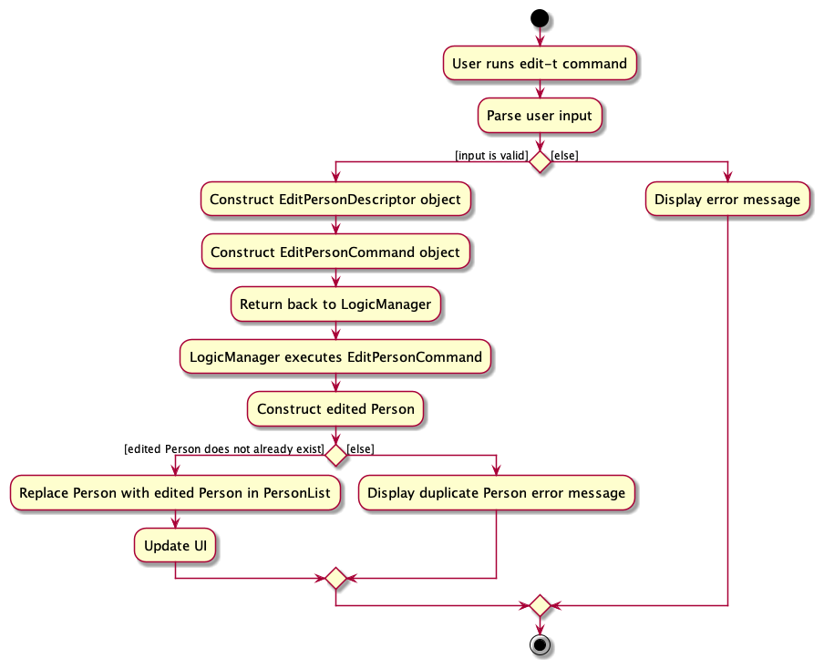

* Table of Contents
{:toc}

--------------------------------------------------------------------------------------------------------------------

## **Acknowledgements**

* {list here sources of all reused/adapted ideas, code, documentation, and third-party libraries -- include links to the original source as well}

--------------------------------------------------------------------------------------------------------------------

## **Setting up, getting started**

Refer to the guide [_Setting up and getting started_](SettingUp.md).

--------------------------------------------------------------------------------------------------------------------

## **Design**

:bulb: **Tip:** The `.puml` files used to create diagrams in this document `docs/diagrams` folder. Refer to the [_PlantUML Tutorial_ at se-edu/guides](https://se-education.org/guides/tutorials/plantUml.html) to learn how to create and edit diagrams.

### Architecture

The ***Architecture Diagram*** given above explains the high-level design of the App.

Given below is a quick overview of main components and how they interact with each other.

**Main components of the architecture**

**`Main`** (consisting of classes [`Main`](https://github.com/se-edu/addressbook-level3/tree/master/src/main/java/seedu/address/Main.java) and [`MainApp`](https://github.com/se-edu/addressbook-level3/tree/master/src/main/java/seedu/address/MainApp.java)) is in charge of the app launch and shut down.
* At app launch, it initializes the other components in the correct sequence, and connects them up with each other.
* At shut down, it shuts down the other components and invokes cleanup methods where necessary.

The bulk of the app's work is done by the following four components:

* [**`UI`**](#ui-component): The UI of the App.
* [**`Logic`**](#logic-component): The command executor.
* [**`Model`**](#model-component): Holds the data of the App in memory.
* [**`Storage`**](#storage-component): Reads data from, and writes data to, the hard disk.

[**`Commons`**](#common-classes) represents a collection of classes used by multiple other components.

**How the architecture components interact with each other**

The *Sequence Diagram* below shows how the components interact with each other for the scenario where the user issues the command `delete 1`.

Each of the four main components (also shown in the diagram above),

* defines its *API* in an `interface` with the same name as the Component.
* implements its functionality using a concrete `{Component Name}Manager` class (which follows the corresponding API `interface` mentioned in the previous point.

For example, the `Logic` component defines its API in the `Logic.java` interface and implements its functionality using the `LogicManager.java` class which follows the `Logic` interface. Other components interact with a given component through its interface rather than the concrete class (reason: to prevent outside component's being coupled to the implementation of a component), as illustrated in the (partial) class diagram below.

The sections below give more details of each component.

### UI component

The **API** of this component is specified in [`Ui.java`](https://github.com/se-edu/addressbook-level3/tree/master/src/main/java/seedu/address/ui/Ui.java)

The UI consists of a `MainWindow` that is made up of parts e.g.`CommandBox`, `ResultDisplay`, `PersonListPanel`, `StatusBarFooter` etc. All these, including the `MainWindow`, inherit from the abstract `UiPart` class which captures the commonalities between classes that represent parts of the visible GUI.

The `UI` component uses the JavaFx UI framework. The layout of these UI parts are defined in matching `.fxml` files that are in the `src/main/resources/view` folder. For example, the layout of the [`MainWindow`](https://github.com/se-edu/addressbook-level3/tree/master/src/main/java/seedu/address/ui/MainWindow.java) is specified in [`MainWindow.fxml`](https://github.com/se-edu/addressbook-level3/tree/master/src/main/resources/view/MainWindow.fxml)

The `UI` component,

* executes user commands using the `Logic` component.
* listens for changes to `Model` data so that the UI can be updated with the modified data.
* keeps a reference to the `Logic` component, because the `UI` relies on the `Logic` to execute commands.
* depends on some classes in the `Model` component, as it displays `Person` object residing in the `Model`.

### Logic component

**API** : [`Logic.java`](https://github.com/se-edu/addressbook-level3/tree/master/src/main/java/seedu/address/logic/Logic.java)

Here's a (partial) class diagram of the `Logic` component:

The sequence diagram below illustrates the interactions within the `Logic` component, taking `execute("delete 1")` API call as an example.

:information_source: **Note:** The lifeline for `DeleteCommandParser` should end at the destroy marker (X) but due to a limitation of PlantUML, the lifeline reaches the end of diagram.

How the `Logic` component works:

1. When `Logic` is called upon to execute a command, it is passed to an `AddressBookParser` object which in turn creates a parser that matches the command (e.g., `DeleteCommandParser`) and uses it to parse the command.
1. This results in a `Command` object (more precisely, an object of one of its subclasses e.g., `DeleteCommand`) which is executed by the `LogicManager`.
1. The command can communicate with the `Model` when it is executed (e.g. to delete a person).
1. The result of the command execution is encapsulated as a `CommandResult` object which is returned back from `Logic`.

Here are the other classes in `Logic` (omitted from the class diagram above) that are used for parsing a user command:

How the parsing works:
* When called upon to parse a user command, the `AddressBookParser` class creates an `XYZCommandParser` (`XYZ` is a placeholder for the specific command name e.g., `AddCommandParser`) which uses the other classes shown above to parse the user command and create a `XYZCommand` object (e.g., `AddCommand`) which the `AddressBookParser` returns back as a `Command` object.
* All `XYZCommandParser` classes (e.g., `AddCommandParser`, `DeleteCommandParser`, ...) inherit from the `Parser` interface so that they can be treated similarly where possible e.g, during testing.

### Model component
**API** : [`Model.java`](https://github.com/se-edu/addressbook-level3/tree/master/src/main/java/seedu/address/model/Model.java)

The `Model` component,

* stores the address book data i.e., all `Person` objects (which are contained in a `UniquePersonList` object).
* stores the currently 'selected' `Person` objects (e.g., results of a search query) as a separate _filtered_ list which is exposed to outsiders as an unmodifiable `ObservableList<Person>` that can be 'observed' e.g. the UI can be bound to this list so that the UI automatically updates when the data in the list change.
* stores a `UserPref` object that represents the user’s preferences. This is exposed to the outside as a `ReadOnlyUserPref` objects.
* does not depend on any of the other three components (as the `Model` represents data entities of the domain, they should make sense on their own without depending on other components)

:information_source: **Note:** An alternative (arguably, a more OOP) model is given below. It has a `Tag` list in the `AddressBook`, which `Person` references. This allows `AddressBook` to only require one `Tag` object per unique tag, instead of each `Person` needing their own `Tag` objects. 

### Storage component

**API** : [`Storage.java`](https://github.com/se-edu/addressbook-level3/tree/master/src/main/java/seedu/address/storage/Storage.java)

The `Storage` component,
* can save both address book data and user preference data in JSON format, and read them back into corresponding objects.
* inherits from both `AddressBookStorage` and `UserPrefStorage`, which means it can be treated as either one (if only the functionality of only one is needed).
* depends on some classes in the `Model` component (because the `Storage` component's job is to save/retrieve objects that belong to the `Model`)

### Common classes

Classes used by multiple components are in the `seedu.addressbook.commons` package.

--------------------------------------------------------------------------------------------------------------------

## **Implementation**

This section describes some noteworthy details on how certain features are implemented.

### Edit tutor feature 

The “Edit Tutor” feature allows users to edit an existing tutor in the address book given a tutor index. 

Below, we provide an example usage scenario and a detailed description of how the edit tutor mechanism behaves at 
each step.

**:information_source: Limitations** 
* Input format must adhere to the follow limitations:
    * `TUTOR_INDEX`: Only number input accepted, starting from 1 to the last tutor index shown in the list of tutors.
    * `NAME`: Only contain alphanumeric characters and spaces, and should not be blank
    * `PHONE NUMBER`: Only contain numbers, and should be at least 3 digits long
    * `EMAIL`: Of the format local-part@domain
* Tutor to be edited must not already exist in the addressbook (excluding the current specified one).
* TUTOR_INDEX parameter is compulsory and at least one edited field must be provided.

#### Implementation

The bulk of the implementation details is identical to that of other commands.
As such only details specific to `edit-t` will be discussed.

Step 1. The user has the application launched with at least 1 tutor added.

Step 2. The user executes `list-s` to view all added tutors.

Step 3. The user executes `edit-t 1 n/John Doe` to edit the first tutor's name in the list of tutors displayed. 
The command is parsed in AddressBookParser.

Step 4. EditTutorCommandParser is created, and constructs an `EditPersonDescriptor` which describes the edited 
`Person`. An EditTutorCommand object is then constructed with this `EditPersonDescriptor` and the specified tutor index.

Step 5. The EditTutorCommand object gets the specified person from the current filtered person list using the 
tutor index.

Step 6. EditTutorCommand object then creates an edited person from the specified person and the editPersonDescriptor.

Step 7. EditTutorCommand object then calls the setPerson method in the ModelManager with the new edited person. This 
method sets the specified `Person` in the model to be that edited person.

Step 8. Finally, the EditTutorCommand object updates the person list to display the edited person.

The following sequence diagram shows how the above steps for edit tutor operation works, taking 
`execute("edit-t 1 n/New Name")` API call as an example.

:information_source: **Note:** The lifeline for `EditTutorCommandParser` should end at the destroy marker (X) but due to a limitation of PlantUML, the lifeline reaches the end of diagram.

#### Design rationale:
The `edit-t` command was designed this way to ensure consistency with the previous `edit` person command.

### \[Proposed\] Undo/redo feature

#### Proposed Implementation

The proposed undo/redo mechanism is facilitated by `VersionedAddressBook`. It extends `AddressBook` with an undo/redo history, stored internally as an `addressBookStateList` and `currentStatePointer`. Additionally, it implements the following operations:

* `VersionedAddressBook#commit()` — Saves the current address book state in its history.
* `VersionedAddressBook#undo()` — Restores the previous address book state from its history.
* `VersionedAddressBook#redo()` — Restores a previously undone address book state from its history.

These operations are exposed in the `Model` interface as `Model#commitAddressBook()`, `Model#undoAddressBook()` and `Model#redoAddressBook()` respectively.

Given below is an example usage scenario and how the undo/redo mechanism behaves at each step.

Step 1. The user launches the application for the first time. The `VersionedAddressBook` will be initialized with the initial address book state, and the `currentStatePointer` pointing to that single address book state.

Step 2. The user executes `delete 5` command to delete the 5th person in the address book. The `delete` command calls `Model#commitAddressBook()`, causing the modified state of the address book after the `delete 5` command executes to be saved in the `addressBookStateList`, and the `currentStatePointer` is shifted to the newly inserted address book state.

Step 3. The user executes `add n/David …​` to add a new person. The `add` command also calls `Model#commitAddressBook()`, causing another modified address book state to be saved into the `addressBookStateList`.

:information_source: **Note:** If a command fails its execution, it will not call `Model#commitAddressBook()`, so the address book state will not be saved into the `addressBookStateList`.

Step 4. The user now decides that adding the person was a mistake, and decides to undo that action by executing the `undo` command. The `undo` command will call `Model#undoAddressBook()`, which will shift the `currentStatePointer` once to the left, pointing it to the previous address book state, and restores the address book to that state.

:information_source: **Note:** If the `currentStatePointer` is at index 0, pointing to the initial AddressBook state, then there are no previous AddressBook states to restore. The `undo` command uses `Model#canUndoAddressBook()` to check if this is the case. If so, it will return an error to the user rather
than attempting to perform the undo.

The following sequence diagram shows how the undo operation works:

:information_source: **Note:** The lifeline for `UndoCommand` should end at the destroy marker (X) but due to a limitation of PlantUML, the lifeline reaches the end of diagram.

The `redo` command does the opposite — it calls `Model#redoAddressBook()`, which shifts the `currentStatePointer` once to the right, pointing to the previously undone state, and restores the address book to that state.

:information_source: **Note:** If the `currentStatePointer` is at index `addressBookStateList.size() - 1`, pointing to the latest address book state, then there are no undone AddressBook states to restore. The `redo` command uses `Model#canRedoAddressBook()` to check if this is the case. If so, it will return an error to the user rather than attempting to perform the redo.

Step 5. The user then decides to execute the command `list`. Commands that do not modify the address book, such as `list`, will usually not call `Model#commitAddressBook()`, `Model#undoAddressBook()` or `Model#redoAddressBook()`. Thus, the `addressBookStateList` remains unchanged.

Step 6. The user executes `clear`, which calls `Model#commitAddressBook()`. Since the `currentStatePointer` is not pointing at the end of the `addressBookStateList`, all address book states after the `currentStatePointer` will be purged. Reason: It no longer makes sense to redo the `add n/David …​` command. This is the behavior that most modern desktop applications follow.

The following activity diagram summarizes what happens when a user executes a new command:

#### Design considerations:

**Aspect: How undo & redo executes:**

* **Alternative 1 (current choice):** Saves the entire address book.
  * Pros: Easy to implement.
  * Cons: May have performance issues in terms of memory usage.

* **Alternative 2:** Individual command knows how to undo/redo by
  itself.
  * Pros: Will use less memory (e.g. for `delete`, just save the person being deleted).
  * Cons: We must ensure that the implementation of each individual command are correct.

_{more aspects and alternatives to be added}_

### \[Proposed\] Data archiving

_{Explain here how the data archiving feature will be implemented}_

--------------------------------------------------------------------------------------------------------------------

## **Documentation, logging, testing, configuration, dev-ops**

* [Documentation guide](Documentation.md)
* [Testing guide](Testing.md)
* [Logging guide](Logging.md)
* [Configuration guide](Configuration.md)
* [DevOps guide](DevOps.md)

--------------------------------------------------------------------------------------------------------------------

## **Appendix: Requirements**

### Product scope

**Target user profile**:

* has a need to manage a significant number of tutors and their schedules
* prefer desktop apps over other types
* can type fast
* prefers typing to mouse interactions

**Value proposition**: help tuition centre managers easily track, schedule, and notify tutors of their upcoming schedule

### User stories

Priorities: High (must have) - `* * *`, Medium (nice to have) - `* *`, Low (unlikely to have) - `*`

| Priority &nbsp; | As a …​   | I want to …​                                                                                   | So that I can…​                                                             |
|-----------------|-----------|------------------------------------------------------------------------------------------------|-----------------------------------------------------------------------------|
| `* * *`         | manager   | add new tutors to the system                                                                   | manage them                                                                 |
| `* * *`         | manager   | store each tutor's contact information, including their name, phone number, and email address  | access it later                                                             |
| `* * *`         | manager   | remove tutors from the system when they are no longer available                                | keep the system up to date                                                  |
| `* * *`         | manager   | view a list of all tutors in the system                                                        | have an overview of available tutors                                        |
| `* * *`         | manager   | search for a tutor by their name                                                               | quickly find their information                                              |
| `* * *`         | manager   | create a schedule for each tutor                                                               | track their schedule                                                        |
| `* * *`         | manager   | delete a schedule for a tutor                                                                  | remove an appointment when the tutor is not available                       |
| `* * *`         | manager   | view a summary of all upcoming tutoring sessions                                               | plan accordingly                                                            |
| `* * *`         | manager   | save the schedule and tutor’s information                                                      | can access it again in the future                                           |
| `* *`           | manager   | mark sessions as attended or missed                                                            | track the status of tutoring sessions                                       |
| `* *`           | manager   | keep a record of completed tutoring sessions                                                   | maintain a history of successful sessions                                   |
| `* *`           | manager   | keep a record of missed tutoring sessions                                                      | monitor attendance and address any issues                                   |
| `* *`           | manager   | edit the tutor information                                                                     | update their details easily                                                 |
| `* *`           | manager   | edit the schedule information                                                                  | reschedule tutoring sessions                                                |
| `* *`           | manager   | shorter syntax                                                                                 | work faster                                                                 |
| `* *`           | manager   | view schedules by tutor                                                                        | easily plan the schedule of that tutor                                      |
| `* *`           | manager   | have a help function                                                                           | quickly check the command parameters without having to check the User Guide |
| `*`             | manager   | export data to an excel file                                                                   | use the data for other purposes                                             |
| `*`             | manager   | import data from an excel file                                                                 | easily restore and update records                                           |
| `*`             | manager   | add new students to the system                                                                 | enrol them                                                                  |
| `*`             | manager   | store each students contact information, including their name, phone number, and email address | access it later                                                             |
| `*`             | manager   | remove students from the system when they are no longer enrolled                               | maintain an accurate student list                                           |
| `*`             | manager   | view a list of all students in the system                                                      | have an overview of enrolled students                                       |
| `*`             | manager   | edit the student information                                                                   | keep their details up to date                                               |
| `*`             | manager   | assign specific tutors to a student                                                            | have personalised tutoring (one tutor to many students)                     |
| `*`             | manager   | reassign tutors to students                                                                    | adapt to changing needs and preferences                                     |

*{More to be added}*

### Use cases

(For all use cases below, the **System** is the `AddressBook` and the **Actor** is the `user`, unless specified otherwise)

**Use case: Delete a tutor**

**MSS**

1.  User requests to list tutors
2.  TutorConnect shows a list of tutors
3.  User requests to delete a specific tutor in the list
4.  TutorConnect deletes the tutor

    Use case ends.

**Extensions**

* 2a. The list is empty.

  Use case ends.

* 3a. The given index is invalid.

    * 3a1. TutorConnect shows an error message.

      Use case resumes at step 2.

**Use case: Add a schedule**

**MSS**

1.  User requests to list tutors
2.  TutorConnect shows a list of tutors
3.  User requests to add a schedule for a specific tutor in the list
4.  TutorConnect adds the schedule and displays a list of schedule

    Use case ends.

**Extensions**

* 2a. The list is empty.

  Use case ends.

* 3a. The given index is invalid.

    * 3a1. TutorConnect shows an error message.

      Use case resumes at step 2.

* 3b. The schedule parameters is invalid.

    * 3b1. TutorConnect shows an error message.

      Use case resumes at step 2.

**Use case: Delete a schedule**

**MSS**

1.  User requests to list schedules
2.  TutorConnect shows a list of schedules
3.  User requests to delete a specific schedule in the list
4.  TutorConnect deletes the schedule

    Use case ends.

**Extensions**

* 2a. The list is empty.

  Use case ends.

* 3a. The given index is invalid.

    * 3a1. TutorConnect shows an error message.

      Use case resumes at step 2.

**Use case: Mark a schedule as completed**

**MSS**

1.  User requests to list schedules
2.  TutorConnect shows a list of schedules
3.  User requests to mark a specific schedule in the list as completed
4.  TutorConnect marks the schedule as completed

    Use case ends.

**Extensions**

* 2a. The list is empty.

  Use case ends.

* 3a. The given index is invalid.

    * 3a1. TutorConnect shows an error message.

      Use case resumes at step 2.

**Use case: Edit a tutor information**

**MSS**

1.  User requests to list tutors
2.  TutorConnect shows a list of tutors
3.  User requests to edit a specific tutor information in the list
4.  TutorConnect modifies the tutor information

    Use case ends.

**Extensions**

* 2a. The list is empty.

  Use case ends.

* 3a. The given index is invalid.

    * 3a1. TutorConnect shows an error message.

      Use case resumes at step 2.

* 3b. The tutor information parameters is invalid.

    * 3b1. TutorConnect shows an error message.

      Use case resumes at step 2.

**Use case: Edit a schedule information**

**MSS**

1.  User requests to list schedules
2.  TutorConnect shows a list of schedules
3.  User requests to edit a specific schedule information in the list
4.  TutorConnect modifies the schedule information

    Use case ends.

**Extensions**

* 2a. The list is empty.

  Use case ends.

* 3a. The given index is invalid.

    * 3a1. TutorConnect shows an error message.

      Use case resumes at step 2.

* 3b. The schedule information parameters is invalid.

    * 3b1. TutorConnect shows an error message.

      Use case resumes at step 2.

**Use case: View schedules by tutor**

**MSS**

1.  User requests to list tutors
2.  TutorConnect shows a list of tutors
3.  User requests to view schedules for a specific tutor in the list
4.  TutorConnect displays a list of schedules for the tutor

    Use case ends.

**Extensions**

* 2a. The list is empty.

  Use case ends.

* 3a. The given index is invalid.

    * 3a1. TutorConnect shows an error message.

      Use case resumes at step 2.

**Use case: Delete a student**

**MSS**

1.  User requests to list students
2.  TutorConnect shows a list of students
3.  User requests to delete a specific student in the list
4.  TutorConnect deletes the student

    Use case ends.

**Extensions**

* 2a. The list is empty.

  Use case ends.

* 3a. The given index is invalid.

    * 3a1. TutorConnect shows an error message.

      Use case resumes at step 2.

**Use case: Edit a student information**

**MSS**

1.  User requests to list students
2.  TutorConnect shows a list of students
3.  User requests to edit a specific student information in the list
4.  TutorConnect modifies the student information

    Use case ends.

**Extensions**

* 2a. The list is empty.

  Use case ends.

* 3a. The given index is invalid.

    * 3a1. TutorConnect shows an error message.

      Use case resumes at step 2.

* 3b. The student information parameters is invalid.

    * 3b1. TutorConnect shows an error message.

      Use case resumes at step 2.

*{More to be added}*

### Non-Functional Requirements

1.  Should work on any _mainstream OS_ as long as it has Java `11` installed.
2.  Should be able to hold up to 1000 persons without a noticeable sluggishness in performance for typical usage.
3.  A user with above average typing speed for regular English text (i.e. not code, not system admin commands) should be able to accomplish most of the tasks faster using commands than using the mouse.
4. Should work without requiring an installer
5. _GUI_ should work well for standard screen resolutions 1920x1080 and higher, and, for screen scales 100% and 125%.
6. _GUI_ should be usable for resolutions 1280x720 and higher, and, for screen scales 150%.
7. Should not require the user to have an internet connection to use.
8. Should be a single-user application.
9. Should persistently save data in a human-readable text file between sessions.
10. Should be able to transfer the data file to another device with no loss of data.

*{More to be added}*

### Glossary

* **Mainstream OS**: Windows, Linux, Unix, OS-X
* **Use case**: A description of a set of sequences of actions, including variants, that a system performs to yield an observable result of value to an actor
* **GUI**: Graphical user interface

--------------------------------------------------------------------------------------------------------------------

## **Appendix: Instructions for manual testing**

Given below are instructions to test the app manually.

:information_source: **Note:** These instructions only provide a starting point for testers to work on;
testers are expected to do more *exploratory* testing.

### Launch and shutdown

1. Initial launch

   1. Download the jar file and copy into an empty folder

   1. Double-click the jar file Expected: Shows the GUI with a set of sample contacts. The window size may not be optimum.

1. Saving window preferences

   1. Resize the window to an optimum size. Move the window to a different location. Close the window.

   1. Re-launch the app by double-clicking the jar file. 
       Expected: The most recent window size and location is retained.

1. _{ more test cases …​ }_

### Deleting a person

1. Deleting a person while all persons are being shown

   1. Prerequisites: List all persons using the `list` command. Multiple persons in the list.

   1. Test case: `delete 1` 
      Expected: First contact is deleted from the list. Details of the deleted contact shown in the status message. Timestamp in the status bar is updated.

   1. Test case: `delete 0` 
      Expected: No person is deleted. Error details shown in the status message. Status bar remains the same.

   1. Other incorrect delete commands to try: `delete`, `delete x`, `...` (where x is larger than the list size) 
      Expected: Similar to previous.

1. _{ more test cases …​ }_

### Saving data

1. Dealing with missing/corrupted data files

   1. _{explain how to simulate a missing/corrupted file, and the expected behavior}_

1. _{ more test cases …​ }_
