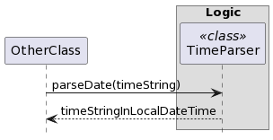

* Table of Contents
{:toc}

--------------------------------------------------------------------------------------------------------------------

## **Acknowledgements**

* The foundational code for add and find features are adapted from [AB-3](https://github.com/nus-cs2103-AY2324S1/tp).
* The formatting for the developer guide is inspired by [NUSCoursemates](https://ay2324s1-cs2103t-t17-4.github.io/tp/DeveloperGuide.html).

--------------------------------------------------------------------------------------------------------------------

## **Setting up, getting started**

Refer to the guide [_Setting up and getting started_](SettingUp.md).

--------------------------------------------------------------------------------------------------------------------

## **Design**

:bulb: **Tip:** The `.puml` files used to create diagrams in this document `docs/diagrams` folder. Refer to the [_PlantUML Tutorial_ at se-edu/guides](https://se-education.org/guides/tutorials/plantUml.html) to learn how to create and edit diagrams.

### Architecture

The ***Architecture Diagram*** given above explains the high-level design of the App.

Given below is a quick overview of main components and how they interact with each other.

**Main components of the architecture**

**`Main`** (consisting of classes [`Main`](https://github.com/se-edu/addressbook-level3/tree/master/src/main/java/seedu/address/Main.java) and [`MainApp`](https://github.com/se-edu/addressbook-level3/tree/master/src/main/java/seedu/address/MainApp.java)) is in charge of the app launch and shut down.
* At app launch, it initializes the other components in the correct sequence, and connects them up with each other.
* At shut down, it shuts down the other components and invokes cleanup methods where necessary.

The bulk of the app's work is done by the following four components:

* [**`UI`**](#ui-component): The UI of the App.
* [**`Logic`**](#logic-component): The command executor.
* [**`Model`**](#model-component): Holds the data of the App in memory.
* [**`Storage`**](#storage-component): Reads data from, and writes data to, the hard disk.

[**`Commons`**](#common-classes) represents a collection of classes used by multiple other components.

**How the architecture components interact with each other**

The *Sequence Diagram* below shows how the components interact with each other for the scenario where the user issues the command `delete 1`.

Each of the four main components (also shown in the diagram above),

* defines its *API* in an `interface` with the same name as the Component.
* implements its functionality using a concrete `{Component Name}Manager` class (which follows the corresponding API `interface` mentioned in the previous point).

For example, the `Logic` component defines its API in the `Logic.java` interface and implements its functionality using the `LogicManager.java` class which follows the `Logic` interface. Other components interact with a given component through its interface rather than the concrete class (reason: to prevent outside component's being coupled to the implementation of a component), as illustrated in the (partial) class diagram below.

The sections below give more details of each component.

### UI component

The **API** of this component is specified in [`Ui.java`](https://github.com/se-edu/addressbook-level3/tree/master/src/main/java/seedu/address/ui/Ui.java)

The UI consists of a `MainWindow` that is made up of parts e.g.`CommandBox`, `ResultDisplay`, `ApplicantListPanel`, `StatusBarFooter` etc. All these, including the `MainWindow`, inherit from the abstract `UiPart` class which captures the commonalities between classes that represent parts of the visible GUI.

The `UI` component uses the JavaFx UI framework. The layout of these UI parts are defined in matching `.fxml` files that are in the `src/main/resources/view` folder. For example, the layout of the [`MainWindow`](https://github.com/se-edu/addressbook-level3/tree/master/src/main/java/seedu/address/ui/MainWindow.java) is specified in [`MainWindow.fxml`](https://github.com/se-edu/addressbook-level3/tree/master/src/main/resources/view/MainWindow.fxml)

The `UI` component,

* executes user commands using the `Logic` component.
* listens for changes to `Model` data so that the UI can be updated with the modified data.
* keeps a reference to the `Logic` component, because the `UI` relies on the `Logic` to execute commands.
* depends on some classes in the `Model` component, as it displays `Applicant` object residing in the `Model`.

### Logic component

**API** : [`Logic.java`](https://github.com/se-edu/addressbook-level3/tree/master/src/main/java/seedu/address/logic/Logic.java)

Here's a (partial) class diagram of the `Logic` component:

The sequence diagram below illustrates the interactions within the `Logic` component, taking `execute("delete 1")` API call as an example.

:information_source: **Note:** The lifeline for `DeleteCommandParser` should end at the destroy marker (X) but due to a limitation of PlantUML, the lifeline reaches the end of diagram.

How the `Logic` component works:

1. When `Logic` is called upon to execute a command, it is passed to an `AddressBookParser` object which in turn creates a parser that matches the command (e.g., `DeleteCommandParser`) and uses it to parse the command.
2. This results in a `Command` object (more precisely, an object of one of its subclasses e.g., `DeleteCommand`) which is executed by the `LogicManager`.
3. The command can communicate with the `Model` when it is executed (e.g. to delete a applicant).
4. The result of the command execution is encapsulated as a `CommandResult` object which is returned back from `Logic`.

Here are the other classes in `Logic` (omitted from the class diagram above) that are used for parsing a user command:

How the parsing works:
* When called upon to parse a user command, the `AddressBookParser` class creates an `XYZCommandParser` (`XYZ` is a placeholder for the specific command name e.g., `AddCommandParser`) which uses the other classes shown above to parse the user command and create a `XYZCommand` object (e.g., `AddCommand`) which the `AddressBookParser` returns back as a `Command` object.
* All `XYZCommandParser` classes (e.g., `AddCommandParser`, `DeleteCommandParser`, ...) inherit from the `Parser` interface so that they can be treated similarly where possible e.g, during testing.

### Model component
**API** : [`Model.java`](https://github.com/se-edu/addressbook-level3/tree/master/src/main/java/seedu/address/model/Model.java)

The `Model` component,

* stores the address book data i.e., all `Applicant` objects (which are contained in a `UniqueApplicantList` object).
* stores the currently 'selected' `Applicant` objects (e.g., results of a search query) as a separate _filtered_ list which is exposed to outsiders as an unmodifiable `ObservableList<Applicant>` that can be 'observed' e.g. the UI can be bound to this list so that the UI automatically updates when the data in the list change.
* stores a `UserPref` object that represents the user’s preferences. This is exposed to the outside as a `ReadOnlyUserPref` objects.
* does not depend on any of the other three components (as the `Model` represents data entities of the domain, they should make sense on their own without depending on other components)

:information_source: **Note:** An alternative (arguably, a more OOP) model is given below. It has a `Tag` list in the `AddressBook`, which `Applicant` references. This allows `AddressBook` to only require one `Tag` object per unique tag, instead of each `Applicant` needing their own `Tag` objects. 

### Storage component

**API** : [`Storage.java`](https://github.com/se-edu/addressbook-level3/tree/master/src/main/java/seedu/address/storage/Storage.java)

The `Storage` component,
* can save both address book data and user preference data in JSON format, and read them back into corresponding objects.
* inherits from both `AddressBookStorage` and `UserPrefStorage`, which means it can be treated as either one (if only the functionality of only one is needed).
* depends on some classes in the `Model` component (because the `Storage` component's job is to save/retrieve objects that belong to the `Model`)

### Common classes

Classes used by multiple components are in the `seedu.addressbook.commons` package.

--------------------------------------------------------------------------------------------------------------------

## **Implementation**

This section describes some noteworthy details on how certain features are implemented.

### Add interview feature

#### Implementation

#### How is the command executed

#### Design consideration

### Find interview by job title feature

#### Implementation

The find interview by job title feature allows users to query the list of added interview for interviews that match the job title via the command `find-i KEYWORD [MORE_KEYWORD]... `, where `KEYWORD` must not
be an empty string. 

For more information on the command constrains, please refer to the [User Guide](https://ay2324s1-cs2103t-t11-2.github.io/tp/UserGuide.html).

The `find-i` command is facilitated by the `FindInterviewCommand`, `FindInterviewCommandParser`, and `JobContainsKeywordsPredicate`.
It uses `Model#updateFilteredInterviewList(Predicate<Interview> predicate)` to apply the `JobContainsKeywordsPredicate`
in order to produce a filtered list containing only entries whose job correspond to `KEYWORD [MORE_KEYWORD]...`.

#### How is the command executed
1. The user inputs the `find-i` command together with non-empty job-title as keyword(s);
2. The `LogicManager` receives the command string and forwarded it to the `AddressBookParser`.
3. The `AddressBookParser` checks the type of command and constructs `FindInterviewCommandParser` to parse the keyword(s).
4. The `FindInterviewCommandParser` constructs `JobContainsKeywordsPredicate` containing the keyword as predicate.
5. The `LogicManager` executes the `FindInterviewCommand` which calls the `Model#updateFilteredInterviewList(Predicate<Interview> predicate)` method.
6. The `FindInterviewCommand` construct `CommandResult` containing the number of successful interviews filtered in the final list and returns it to `LogicManager`.
7. The GUI will be updated automatically by when the list changes.

#### Design Consideration

**Aspect: Case-sensitivity in search:**

* **Alternative 1 (current choice):** Case-insensitive search.
    * Pros: Offers flexibility and speed up the input process without worrying on casing.
    * Cons: A less accurate filters as it will return any matched keyword regardless of casing which might not be intended by the user.

* **Alternative 2:** Case-sensitive search.
    * Pros: A more precise filtering as the string is exact match
    * Cons: Less flexible as the users need to be precise with the input.

**Aspect: Accept multiple keywords:**

* **Alternative 1 (current choice):** Accept multiple keywords.
    * Pros: Offers a stronger filter to search the interview easily.
    * Cons: Requires more care to parse the input correctly in order to not miss any keywords.

* **Alternative 2:** Accept one keyword.
    * Pros: Easier to control the input and filtering.
    * Cons: Less powerful since users can only search job based on one keyword.

### Find applicant feature

#### Implementation

The find applicant feature allows users to query the list of applicants for applicants
whose name, phone, email, address and tags match the given arguments.

This can be done
via the command `find-a [n/KEYWORDS [MORE_KEYWORDS]...] [p/NUMBER]
[e/KEYWORDS [MORE_KEYWORDS]...] [a/KEYWORDS [MORE_KEYWORDS]...] t/KEYWORDS [MORE_KEYWORDS]...]`.

The find applicant feature is facilitated by `FindApplicantCommand`, `FindApplicantCommandParser`,
`AddressContainsKeywordsPredicate`, `EmailContainsKeywordsPredicate`, `NameContainsKeywordsPredicate`,
`PhoneContainsNumberPredicate`, `TagContainsKeywordsPredicate`.
It uses `Model#updateFilteredApplicantList(Predicate<Applicant>)` to apply the predicates
in order to produce a filtered list containing only the filtered entries.

#### How is the command executed

#### Design Considerations

Aspect: How find applicant command filters applicants:
* **Alternative 1 (current choice):** Use a predicate for each field
    * Pros:
        * Decrease coupling and increases extensibility.
        * Easier to maintain
    * Cons:
        * More difficult and tedious to implement
        * More test cases needed for each predicate

* **Alternative 2:** Use one predicate for the entire applicant
    * Pros:
        * Easier to code and less code to write
    * Cons:
        * Harder to maintain
        * More coupling as predicates for different fields are not abstracted out

Aspect: Which find command format
* **Alternative 1 (current choice):** Accepts multiple space or comma separated keywords for each prefix
    * Pros:
        * Allows filtering using multiple keywords in a single find command
        * User can type the command quickly
    * Cons:
        * Only allows filtering by words and not phrases
* **Alternative 2:** Accepts one keyword for each prefix
    * Pros:
        * Easy to implement
        * User can type the command quickly
    * Cons:
        * Can only find using one keyword for each applicant field in a single find command
* **Alternative 3:** Accepts duplicate prefixes and a keyphrase for each prefix
    * Pros:
        * Allows filtering of multiple keywords or keyphrase in a single find command
        * The most specific filter out of all the alternatives
    * Cons:
        * Most difficult to implement of all alternatives considered
        * The command can be slow to type due to the need to type many prefixes

Aspect: How find command matches the arguments for name
* **Alternative 1 (current choice):** Match keywords to words in the name
    * Pros:
        * Can find a person with only the first name or last name
    * Cons:
        * Less specific than exact matching
* **Alternative 2:** Require exact match between arguments and name
    * Pros:
        * More specific search
    * Cons:
        * Users need to type longer commands to search for an applicant
        * Less flexibility
* **Alternative 3:** Check if argument is substring of the name
    * Pros:
        * Users can find an applicant without typing an entire word
        * More flexibility
    * Cons:
        * Too many applicants might show up in a single find command which defeats
          the purpose of the find command

### parseDate API

#### Implementation
This feature is implemented though the `TimeParser` class. This class contains several public static methods related to manipulating time:
- `TimeParser#parseDate(String date, boolean dateOnly)`  —  Takes in a time String as input, and returns a `Time` instance, which is a wrapper class for a LocalDateTime object which will store the time information (i.e. day, month, year, hour, minute) as well as providing utility methods for manipulating Time.
  
  - The `dateOnly` parameter is a flag to indicate how to parse the given `date`. If `dateOnly` is set to false, then the TimeParser will parse valid dates that are in the list of accepted date (without time) formats. Otherwise, if `dateOnly` is set to true, then the TimeParser will parse valid dates that are in the list of accepted date (with time) formats.
  - Accepted time formats:
      * DD/MM/YYYY and time:
          * `16 May 2024 1515`
          * `16 May 2024 3.15pm`
          * `16 May 2024 3pm`
          * `16-05-2024 1515`
          * `16-05-2024 3.15pm`
          * `16-05-2024 3pm`
          * `16-05-24 1515`
          * `16-05-24 3.15pm`
          * `16-05-24 3pm`
          * `16/05/2024 1515`
          * `16/05/2024 3.15pm`
          * `16/05/2024 3pm`
          * `16/05/24 1515`
          * `16/05/24 3.15pm`
          * `16/05/24 3pm`
      * MM, DD and time:
          * `16 May 1515`
          * `16 May 3.15pm`
          * `16 May 3pm`
          * `16 January 1515`
          * `16 January 3.15pm`
          * `16 January 3pm`
          * `16/5 1515`
          * `16/5 3.15pm`
          * `16/5 3pm`
          * `16/05 1515`
          * `16/05 3.15pm`
          * `16/05 3pm`
    - Accepted date formats
      * DD/MM/YYYY:
        * `16-05-2024`
        * `16/05/2024`
      * DD/MM:
        * `16/05`
        * `16 May`
          * _Must be a prefix of a valid month of at least 3 characters_

  - The sequence diagram shown below shows how the API is called by other classes:

    

#### How is the command executed
1. The caller passes in the `date` string, which contains the date information. The caller also passes in the boolean flag `dateOnly`, which will indicate whether the string should be parsed into a `Time` instance containing date and time, or strictly date only.
2. If the parsing was successful, a `Time` instance containing the Time info will be returned.
#### Design considerations

**Aspect: How `TimeParser#parseDate(String date, boolean dateOnly)` works:**

* **Alternative 1 (current choice):** Have two hardcoded list of acceptable time formats. One with date and time, the other for time
    * Pros:
      * Easy to implement
      * Avoids code duplication
    * Cons:
      * May have performance issues in terms of time (i.e. might have to loop through the whole list to find a suitable format)
      * Huge number of time formats available, hence there is a need to update the list of acceptable time formats in future iterations
      * Many errors possible due to the many time fields that the user could format wrongly, which makes implementation difficult
      * Using the same method to parse strings with date & time and strings with date only might be prone to bugs

* **Alternative 2 :** Have two hardcoded list of acceptable time formats. One with date and time, the other for time, but parse the two types of time string (i.e. strings with date & time, and strings with date only separately)
    * Pros:
        * Easy to implement
        * Less prone to bugs since there are now separate methods for parsing the two types of strings
    * Cons:
        * Causes code duplication since the algorithm is virtually the same for both `parseDate` methods 
        * Not an optimal implementation (i.e. might have to loop through the whole list to find a suitable format)
        * Huge number of time formats available, hence there is a need to update the list of acceptable time formats in future iterations if needed
        * Many errors possible due to the many time fields that the user could format wrongly, which makes implementation difficult

* **Alternative 3 (alternate choice):** Use other time libraries
    * Pros:
        * Might be a better alternative to alternative 1
        * Error checking already implemented
    * Cons:
        * Will have to overhaul the entire TimeParser class, which might be impractical
        * High risk; not guaranteed to be better after overhaul
        * Developer is not familiar with other time libraries

### List all free timing for a given day feature
#### Implementation
The list free times for a given day feature allows the user to list all the blocks of time that are not taken by a scheduled interview. This command is in the format `list-freetime DATE` where `DATE` is a valid date string.

The `list-freetime DATE` command is facilitated by the `ListFreeTimeCommand`, `ListFreeTimeCommandParser`, along with the other internal classes omitted for brevity.
#### How is the command executed
1. The user inputs the `list-freetime DATE`
2. The `LogicManager` receives the command string and forwards it to the `AddressBookParser`.
3. The `AddressBookParser` checks the type of command and constructs `ListFreeTimeCommandParser` to parse the keyword(s).
4. The `execute` method of the `ListFreeTimeCommandParser` is called, which will call the `parseDate` method of the `TimeParser` API class.
5. `parseDate` will take in the date string as argument. If valid, it will return a `Time` instance containing a LocalDateTime containing the date information.
6. The `ListFreeTimeCommandParser` constructs `ListFreeTimeCommand` with the Time instance (created by `parseDate` earlier) passed into its constructor.
7. The `LogicManager` executes the `ListFreeTimeCommand` which calls the `Model#listPocketsOfTimeOnGivenDay(Time givenDay)` method.
8. The `ListFreeTimeCommand` will then use an internal method, formatFreeTime(List<Pair<Time, Time>> freeTimes), to parse the list of free times into a string.
9. The `ListFreeTimeCommand` construct `CommandResult` containing the free times on the given day, and returns it to `LogicManager`.
10. The GUI will be updated automatically by when the list changes.
#### Design consideration
Aspect: How the command finds free times:
* **Alternative 1 (current choice):** implement a method in the `ModelManager` class
    * Pros:
        * Can access all the interviews that the user has scheduled that is within the `AddressBook` object instance, which maintains the information hiding principle
    * Cons:
        * The command will cause the control to be passed to `ModelManager` first, then to `AddressBook` where the logic for looking for free times happens. This results in an additional layer of abstraction, which increases the complexity of the command slightly

* **Alternative 2:** Use the getter methods of the `AddressBook` class
    * Pros:
        * One less layer of abstraction, reducing complexity
        * Easier to implement
    * Cons:
        * The `ListFreeTimeCommand` will have to call the `getAddressBook` method of the `ModelManager` object instance, and then use the getter method of the `AddressBook` object instance. Violates the _Law of Demeter_ principle since the methods of a stranger (i.e. `AddressBook`) is being called, which `ListFreeTimeCommand` is not closely related to
        * Increases coupling since `ListFreeTimeCommand` now has a dependency with `AddressBook`

### List all interviews for today feature

#### Implementation

#### How is the command executed

#### Design consideration

### List interviews done/not done feature

#### Implementation
The list interviews done/not done feature allows the user to see all the interviews that are done or not done in a single command. The command format is `list-i-done` to show all the interviews that are done, and `list-i-not-done` to show all interviews that are not done.
#### How is the command executed
1. The user inputs `list-i-done` or `list-i-not-done` 
2. The `LogicManager` receives the command string and forwards it to the `AddressBookParser`.
3. The `AddressBookParser` checks the type of command and returns a `ListInterviewsDoneCommand` instance or `ListInterviewsNotDoneCommand` instance
4. The `LogicManager` executes the `ListInterviewsDoneCommand` or `ListInterviewsNotDoneCommand`
5. The `execute` method of `ListInterviewsDoneCommand` or `ListInterviewsNotDoneCommand` will call `Model#updateFilteredInterviewList(Predicate<Interview> predicate)`, where an `InterviewIsDonePredicate` or `InterviewNotDonePredicate` is passed as the argument
6. `Model#updateFilteredInterviewList` will be called with the given predicate, thus updating the internal `FilteredList` of interviews to show only those that are done, or those that are not done. The `CommandResult` containing the success message will be returned to `LogicManager`.
7. The GUI will be updated automatically by when the list changes.
#### Design consideration
Aspect: How the command is implemented
* **Alternative 1 (current choice):** Use the existing open-closed principle of AB3 to add these new commands
    * Pros:
        * Reduces this to a problem that AB3 has already solved
        * Maintains consistency with the AB3 format
        * Consequently, it is easy to implement
    * Cons:
        * More command classes have to be added, which can increase coupling
### Rate interview feature

#### Implementation

#### How is the command executed

#### Design consideration

### Sort interview feature

#### Implementation
The sort interview feature allows the user to sort all the interviews that have scheduled via the commands `sort SORT_PARAMETER`, where `SORT_PARAMETER` can either be `rate` or `time`.

The `sort` command is facilitated by the `SortRateCommand` and the `SortTimeCommand`. It enables the user to sort all the scheduled interviews by rating or timing. For rating, the interviews will be sorted in descending order of rating. For interview times, the interviews will be sorted in ascending chronological order of start time. 
#### How is the command executed
1. The user inputs the `sort-rate` or `sort-time` command
2. The `LogicManager` receives the `sort-rate` or `sort-time` command string and forwards it to the `AddressBookParser`.
3. The `AddressBookParser` checks the type of command and returns either `SortRateCommand` or `SortTimeCommand`.
4. The `LogicManager` executes the `SortRateCommand` or `SortTimeCommand` which calls the `Model#sortInterviewList(Comparator<Interview> comparator)` method.
5. The `SortRateCommand` or `SortTimeCommand` has their own `Comparator` object instance. Their respective comparators will be passed into the `Model#sortInterviewList(Comparator<Interview> comparator)`
6. `Model#sortInterviewList(Comparator<Interview> comparator)` will then call the `AddressBook#sortInterview(Comparator<Interview> comparator)`, passing in the given comparator as argument. 
7. `Model#sortInterviewList(Comparator<Interview> comparator)` will call the `UniqueInterviewList#sort(Comparator<Interview> comparator)`, which will call the built-in `FXCollections#sort(Comparator<T> comparator)` method, which will then sort the internal list of interviews by either rating or timing. Note that `FXCollections#sort(Comparator<T> comparator)` is used since the list of interviews is implemented as an `ObservableList`
8. The GUI will be updated automatically by when the list changes.
#### Design consideration
Aspect: How the sort command works
* **Alternative 1 (current choice):** Implement the sort method in the `ModelManager`, `AddressBook`, and the `UniqueInterviewList` class
    * Pros:
        * Does not violate the _Law of Demeter_ principle, since the sort is called through `Model` in the `SortRateCommand` or `SortTimeCommand`, where the `Model` instance is passed as a parameter to the respective `execute` commands
        * Does not violate the _information hiding_ principle. This is because the internal list of interviews is never accessed nor modified directly by the `execute` command of the respective command objects
    * Cons:
        * The command will cause the control to be passed to `ModelManager` first, then to `AddressBook` and then finally to `UniqueInterviewList` where only in `UniqueInterviewList` is the internal list sorted. This results in an additional layer of abstraction, which increases the complexity of the command slightly

--------------------------------------------------------------------------------------------------------------------

## **Documentation, logging, testing, configuration, dev-ops**

* [Documentation guide](Documentation.md)
* [Testing guide](Testing.md)
* [Logging guide](Logging.md)
* [Configuration guide](Configuration.md)
* [DevOps guide](DevOps.md)

--------------------------------------------------------------------------------------------------------------------

## **Appendix: Requirements**

### Product scope

**Target user profile**:

* is a hiring manager working in Technology/Engineering field
* has a need to manage a significant number of job applicants and interviews
* prefer desktop apps over other types
* can type fast
* prefers typing to mouse interactions
* is reasonably comfortable using CLI apps

**Value proposition**: manage applicants and schedule interviews faster than a typical mouse/GUI driven contact and calendar app

### User stories

Priorities: High (must have) - `* * *`, Medium (nice to have) - `* *`, Low (unlikely to have) - `*`

| Priority | As a …​                                               | I want to …​                             | So that I can…​                                                           |
|----------|-------------------------------------------------------|------------------------------------------|---------------------------------------------------------------------------|
| `* * *`  | New user of the app                                   | see usage instructions                   | refer to instructions when I first started to use the App                 |
| `* * *`  | Engineering Manager ready for job applicant           | add a new applicant                      | save their contact details into the App                                   |
| `* * *`  | Engineering Manager opening a job role                | add a new job role                       | keep track of the job role available for application                      |
| `* * *`  | Engineering Manager ready to start an interview       | add a new interview slot                 | save the interview information into the App                               |
| `* * *`  | Engineering Manager ready for next round of interview | delete an applicant                      | remove their contact details that I no longer need                        |
| `* * *`  | Engineering Manager that finished an interview        | delete an interview                      | remove the interview that has already been completed                      |
| `* * *`  | Busy Engineering Manager                              | find an applicant by name                | locate details of applicants without having to go through the entire list |
| `* * *`  | Busy Engineering Manager                              | find a job role by name                  | easily locate the job role which are still available                      |
| `* *`    | Busy Engineering Manager                              | set reminder of interview                | stay organised and track upcoming interview                               |
| `* *`    | Engineering Manager with sensitive information        | hide private contact details             | protect the privacy of the applicants information in the App              |
| `* *`    | Engineering Manager with many applicants              | sort the applicants by skill             | prioritise and focus on the most promising candidates                     |
| `* *`    | Engineering Manager with many applicants              | rank the applicants                      | keep track of the applicants who have performed well                      |
| `* *`    | Engineering Manager                                   | update an applicant details              | easily update their information on the App                                |
| `* *`    | Engineering Manager                                   | update a job role                        | easily change the details about the job role                              |
| `* *`    | Engineering Manager with limited budget               | track the cost per hire                  | ensure that the company budget is not exceeded                            |
| `* *`    | Team-Oriented Engineering Manager                     | add other interviewer                    | facilitate collaboration and delegation of responsibilities               |
| `*`      | Organised Engineering Manager                         | sort applicants by name                  | locate an applicant easily                                                |
| `*`      | Engineering Manager with many contacts                | import contacts from other file          | add multiple contacts into the App smoothly                               |
| `*`      | Meticulous Engineering Manager                        | store the applicant's background         | make a more informed choice to benefit the company                        |
| `*`      | Engineering Manager with multiple rounds of interview | track the progress of each candidate     | maintain a clear overview of our recruitment efforts                      |
| `*`      | New Engineering Manager                               | analyse the performance of the interview | make improvements to my interview processes                               |
| `*`      | Helpful Engineering Manager                           | provide feedback to the applicant        | offer constructive advice to help them improve their skills               |
| `*`      | Long user of the app                                  | provide feedback to the developer        | suggest improvements and enhancements for the app                         |

### Use cases

(For all use cases below, the **System** is the `InterviewHub` and the **Actor** is the `hiring manager`, unless specified otherwise)

**Use case: UC01 Add an interview**

**MSS**

1. Hiring manager requests to add an interview.
2. InterviewHub adds the interview.

    Use case ends.

**Extensions**
* 1a. One of the user-provided parameters is invalid
    * 1a1. InterviewHub shows an error message.

      Use case resumes at step 1.

**Use case: UC02 List all interview**

**MSS**

1. Hiring manager requests to list all interviews.
2. InterviewHub displays all scheduled interviews.

    Use case ends.

**Extensions**
* 1a. The list is empty
  * 1a1. InterviewHub shows an error message.

    Use case ends.

**Use case: UC03 Delete an Interview**

**MSS**

1. Hiring manager <u> views the list of all interviews (UC02) </u>
2. Hiring manager requests to delete a specific interview
3. InterviewHub deletes the specified interview

    Use case ends.

**Extensions**

* 2a. The provided index is invalid
  * 2a1. InterviewHub shows an error message.

    Use case resumes at step 2.

**Use case: UC04 Add a job role**

**MSS**

1. Hiring manager requests to add a job role.
2. InterviewHub adds the job role.

    Use case ends.

**Extensions**
* 1a. One of the user-provided parameters is invalid
  * 1a1. InterviewHub shows an error message.

    Use case resumes at step 1.

**Use case: UC05 List all job roles**

**MSS**

1. Hiring manager requests to list all job roles.
2. InterviewHub displays all job roles.

    Use case ends.

**Extensions**
* 1a. The list is empty
  * 1a1. InterviewHub shows an error message.

    Use case ends.

**Use case: UC06 List all applicants for a job role**

**MSS**

1. Hiring manager <u> views the list of all job roles (UC05) </u>
2. Hiring manager requests to view all applicants for a specific job role.
3. InterviewHub displays all the applicants for the specific job role.

    Use case ends.

* 2a. The provided index is invalid
  * 2a1. InterviewHub shows an error message.

    Use case resumes at step 2.

**Use case: UC07 Delete a job role**

**MSS**

1. Hiring manager <u> views the list of all job roles (UC02) </u>
2. Hiring manager requests to delete a specific job role
3. InterviewHub deletes the specified job role

    Use case ends.

**Extensions**

* 2a. The provided index is invalid
  * 2a1. InterviewHub shows an error message.

    Use case resumes at step 2.

**Use case: UC08 Add an applicant**

**MSS**

1. Hiring manager requests to add an applicant.
2. InterviewHub adds the applicant.

   Use case ends.

**Extensions**
* 1a. One of the user-provided parameters is invalid
  * 1a1. InterviewHub shows an error message.

    Use case resumes at step 1.

**Use case: UC09 List all applicants**

**MSS**

1. Hiring manager requests to list all applicants.
2. InterviewHub displays all scheduled applicants.

   Use case ends.

**Extensions**
* 1a. The list is empty
  * 1a1. InterviewHub shows an error message.

      Use case ends.

**Use case: UC010 Delete an applicant**

**MSS**

1. Hiring manager <u> views the list of all applicants (UC09) </u>
2. Hiring manager requests to delete a specific applicant
3. InterviewHub deletes the specified applicant

   Use case ends.

**Extensions**

* 2a. The provided index is invalid
    * 2a1. InterviewHub shows an error message.

      Use case resumes at step 2.

### Non-Functional Requirements

1.  Should work on any _mainstream OS_ as long as it has Java `11` or above installed.
2.  Should be able to handle as many applicants as the user is able to manage in their workday/workweek.
3.  The app should be reasonably responsive to the entire set of user requests(i.e. within 1 second at maximum load).
4.  The system should have an interface that is very easy to pick up for our target audience(i.e. Engineering Managers
that have many years of programming experience).

### Glossary

* **Mainstream OS**: Windows, Linux, Unix, OS-X/MacOS
* **Private contact detail**: A contact detail that is not meant to be shared with others
* **Applicant**: The applicant applying to a particular job role.
* **Hiring manager**: The manager interviewing the applicant.
This manager is familiar with the technical aspects of the role. Also called engineering manager.
* **MSS**: Main Success Scenario. It describes the most straightforward
interaction in a use case where nothing goes wrong.
* **Extensions**: In a use case, an extension describes an alternative flow of events
that are different from the MSS.

--------------------------------------------------------------------------------------------------------------------

## **Appendix: Effort**

--------------------------------------------------------------------------------------------------------------------

## **Appendix: Planned Enhancement**
The current error message when adding an interview where the start and/or end date string is a valid date but is missing time is too general.
We plan to make the error message also mention why the command is not accepted and the reason for the failure:
Please enter an interview time!

The current implementation of mark-i allows the user to mark interviews before the interview has been completed,
based on the end time of the interview. We plan to not allow the user to mark interviews that have not passed.
So, interviews whose end time is after the current time cannot be marked as done.

The current implementation of the find-i and find-a commands does not display a constant status of whether the find
filter is being applied to the current list. E.g. When you perform a find-i command followed by some other command that
changes the interview list, you have no way to tell if the previous "find-i" filter is still being applied.
We plan to update the UI to display a constant status of what filter is currently being applied to the applicant and
interview list.

--------------------------------------------------------------------------------------------------------------------

## **Appendix: Instructions for manual testing**

Given below are instructions to test the app manually.

:information_source: **Note:** These instructions only provide a starting point for testers to work on;
testers are expected to do more *exploratory* testing.

### Launch and shutdown

1. Initial launch

   1. Download the jar file and copy into an empty folder

   2. Double-click the jar file Expected: Shows the GUI with a set of sample contacts. The window size may not be optimum.

2. Saving window preferences

   1. Resize the window to an optimum size. Move the window to a different location. Close the window.

   2. Re-launch the app by double-clicking the jar file. 
       Expected: The most recent window size and location is retained.

3. _{ more test cases …​ }_

### Viewing help

### Clearing all the data

### Exiting the program

### Saving the data
1. Dealing with missing/corrupted data files

    1. _{explain how to simulate a missing/corrupted file, and the expected behavior}_

2. _{ more test cases …​ }_

### Adding an applicant

### Deleting an applicant

1. Deleting an applicant while all applicants are being shown

    1. Prerequisites: List all applicants using the `list` command. Multiple applicants in the list.

    2. Test case: `delete 1` 
       Expected: First contact is deleted from the list. Details of the deleted contact shown in the status message. Timestamp in the status bar is updated.

    3. Test case: `delete 0` 
       Expected: No applicant is deleted. Error details shown in the status message. Status bar remains the same.

    4. Other incorrect delete commands to try: `delete`, `delete x`, `...` (where x is larger than the list size) 
       Expected: Similar to previous.

2. _{ more test cases …​ }_

### Editing an applicant

### Finding applicants from the list

### Listing all applicants

### Adding an interview

### Deleting an interview

### Editing an interview

### Finding interviews from the list

### Listing all interviews

### Listing all free timing for the given day
Command: `list-freetime` 
More information on usage: [list-freetime command]()

1. Listing the free time for a day using `DD/MM/YYYY` or `DD-MM-YYYY` format
   1. Prerequisites: The date string must be in the DD/MM/YYYY or DD-MM-YYYY format, and there should not be any interviews scheduled for the given date
   2. Test case: `list-freetime 12/12/2099` Expected: There should be 1 block of free time listed, which will span from 9am to 5pm on 12/12/2099
   3. Test case: `list-freetime 12-12-2099` Expected: There should be 1 block of free time listed, which will span from 9am to 5pm on 12/12/2099
   4. Success message shown in command box for both cases:  `Free times on 12/12/2099:` `from: 09:00 to: 17:00`
2. Listing the free time for a day using `DD/MM` or `DD MMM` format, where 
   1. Prerequisites: The date string must be in the DD/MM or DD MMM format, and there should not be any interviews scheduled for the given date
   2. Test case: `list-freetime 12/12` Expected: There should be 1 block of free time listed, which will span from 9am to 5pm on 12/12/2023
   3. Test case: `list-freetime 12 Dec` Expected: There should be 1 block of free time listed, which will span from 9am to 5pm on 12/12/2023
   4. Success message shown in command box for both cases:  `Free times on 12/12/2023:` `from: 09:00 to: 17:00`
3. Listing the free time for a date in the past
   1. Prerequisite: The date string must follow one of the accepted date formats
   2. Test case: `list-freetime 12-12-1970` Expected: Command does not execute.
   3. Error message shown in command box: `Input date cannot be in the past!`

### Listing all interviews for today

### Marking an interview as done

### Rating an interview

### Listing all completed interview
Command: `list-i-done` 
More information on usage: [list-i-done command]()

1. Listing completed interviews with exact command
    1. Test case: `list-i-done` Expected: The interview list should only show interviews which have been completed (i.e. those that are green). If there are no completed interviews, the interviews box will be empty 
2. Listing completed interviews with the command along with nonsensical parameters appended to the end
   1. Test case: `list-i-done I am a cat` Expected: Same expected result as test case 1
   
### Listing all incomplete interview
Command: `list-i-not-done` 
More information on usage: [list-i-not-done command]()

1. Listing completed interviews with exact command
    1. Test case: `list-i-not-done` Expected: The interview list should only show interviews which have been completed (i.e. those that are green). If there are no completed interviews, the interviews box will be empty
2. Listing completed interviews with the command along with nonsensical parameters appended to the end
    1. Test case: `list-i-not-done I am a cat` Expected: Same expected result as test case 1
   
### Sorting the interview list by rating

### Sorting the interview list by start-time
Command: `sort-time` 
More information on usage: [sort-time command]()

1. Listing completed interviews with exact command
   1. Test case: `sort-time` Expected: The interview list will be sorted in chronological order of start times. If there are no interviews scheduled, the interviews box will be empty. In the case that the list is filtered in some way, the sort will only sort on the filtered interview list
2. Listing completed interviews with the command along with nonsensical parameters appended to the end
    1. Test case: `sort-time I am a cat` Expected: Same expected result as test case 1
   
[Back to the Table of Contents](#table-of-contents)
