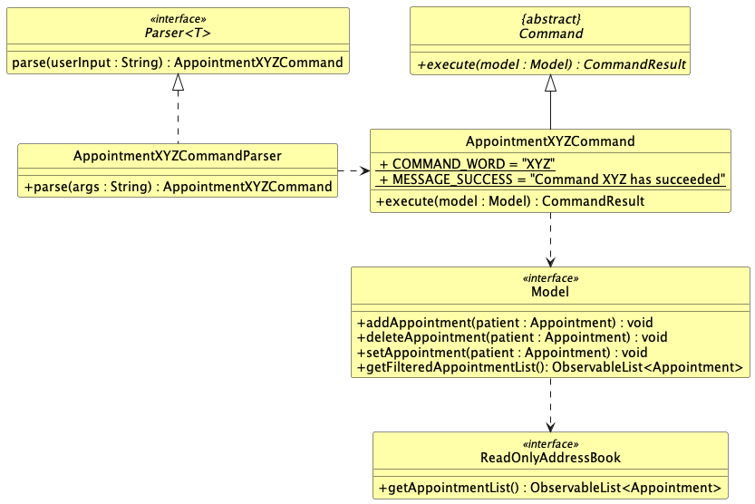
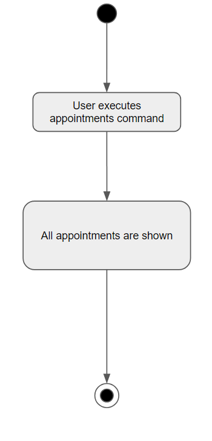
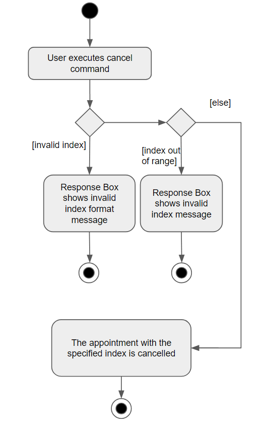
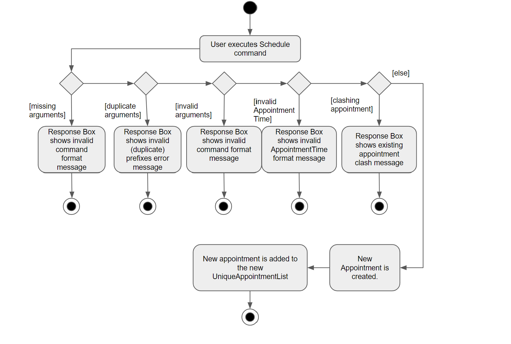
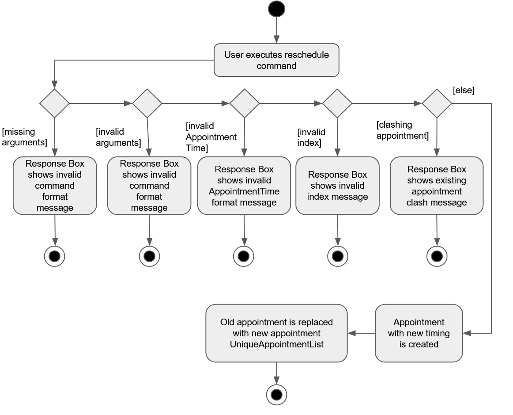
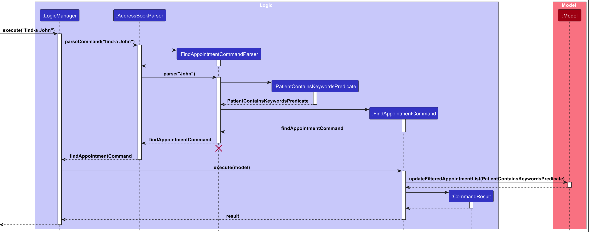
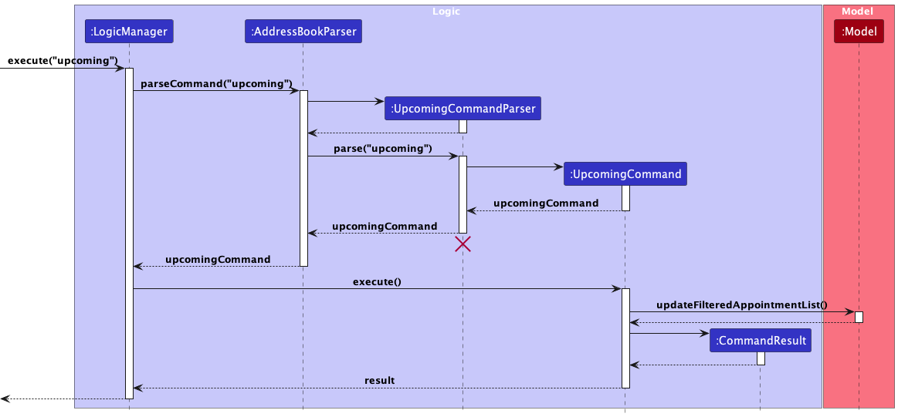
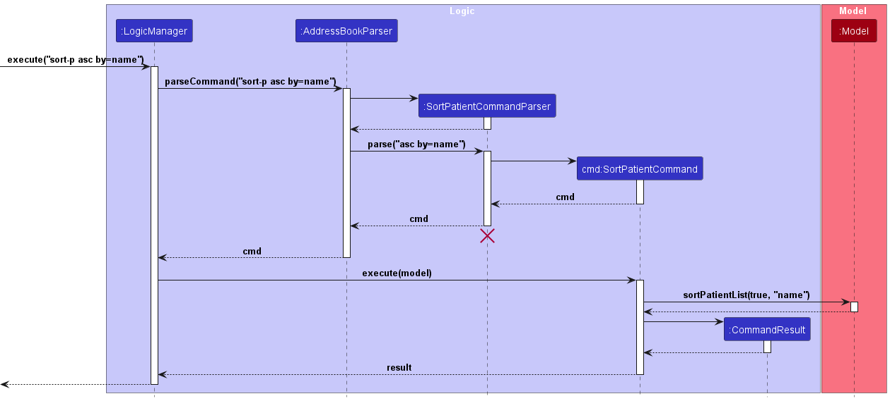
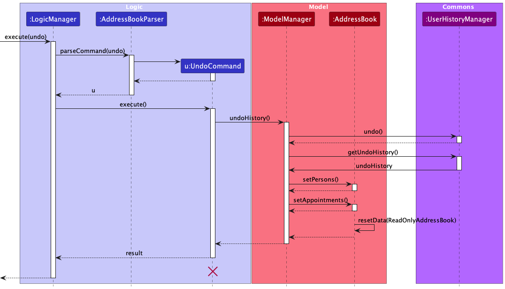
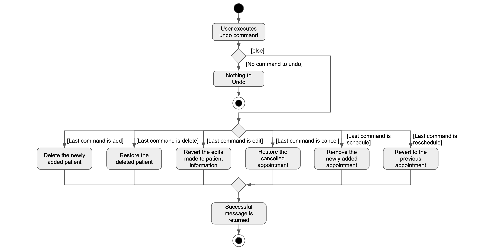

* Table of Contents
{:toc}

--------------------------------------------------------------------------------------------------------------------

## **Acknowledgements**

* Libraries used: [JavaFX](https://openjfx.io/), [Jackson](https://github.com/FasterXML/jackson), [JUnit5](https://github.com/junit-team/junit5)
* This project is based on the AddressBook-Level3 project created by the [SE-EDU initiative](https://se-education.org).
* The logo for the application is taken from here: [Hospital icons created by Pixel Buddha - Flaticon](https://www.flaticon.com/free-icons/hospital)

--------------------------------------------------------------------------------------------------------------------

## **Setting up, getting started**

Refer to the guide [_Setting up and getting started_](SettingUp.md).

--------------------------------------------------------------------------------------------------------------------

## **Design**

:bulb: **Tip:** The `.puml` files used to create diagrams in this document `docs/diagrams` folder. Refer to the [_PlantUML Tutorial_ at se-edu/guides](https://se-education.org/guides/tutorials/plantUml.html) to learn how to create and edit diagrams.

### Architecture

The ***Architecture Diagram*** given above explains the high-level design of the App.

Given below is a quick overview of main components and how they interact with each other.

**Main components of the architecture**

**`Main`** (consisting of classes [`Main`](https://github.com/se-edu/addressbook-level3/tree/master/src/main/java/seedu/address/Main.java) and [`MainApp`](https://github.com/se-edu/addressbook-level3/tree/master/src/main/java/seedu/address/MainApp.java)) is in charge of the app launch and shut down.
* At app launch, it initializes the other components in the correct sequence, and connects them up with each other.
* At shut down, it shuts down the other components and invokes cleanup methods where necessary.

The bulk of the app's work is done by the following four components:

* [**`UI`**](#ui-component): The UI of the App.
* [**`Logic`**](#logic-component): The command executor.
* [**`Model`**](#model-component): Holds the data of the App in memory.
* [**`Storage`**](#storage-component): Reads data from, and writes data to, the hard disk.

[**`Commons`**](#common-classes) represents a collection of classes used by multiple other components.

**How the architecture components interact with each other**

The *Sequence Diagram* below shows how the components interact with each other for the scenario where the user issues the command `delete 1`.

Each of the four main components (also shown in the diagram above),

* defines its *API* in an `interface` with the same name as the Component.
* implements its functionality using a concrete `{Component Name}Manager` class (which follows the corresponding API `interface` mentioned in the previous point).

For example, the `Logic` component defines its API in the `Logic.java` interface and implements its functionality using the `LogicManager.java` class which follows the `Logic` interface. Other components interact with a given component through its interface rather than the concrete class (reason: to prevent outside component's being coupled to the implementation of a component), as illustrated in the (partial) class diagram below.

The sections below give more details of each component.

### UI component

The **API** of this component is specified in [`Ui.java`](https://github.com/se-edu/addressbook-level3/tree/master/src/main/java/seedu/address/ui/Ui.java)

The UI consists of a `MainWindow` that is made up of parts e.g.`CommandBox`, `ResultDisplay`, `PersonListPanel`, `StatusBarFooter` etc. All these, including the `MainWindow`, inherit from the abstract `UiPart` class which captures the commonalities between classes that represent parts of the visible GUI.

The `UI` component uses the JavaFx UI framework. The layout of these UI parts are defined in matching `.fxml` files that are in the `src/main/resources/view` folder. For example, the layout of the [`MainWindow`](https://github.com/se-edu/addressbook-level3/tree/master/src/main/java/seedu/address/ui/MainWindow.java) is specified in [`MainWindow.fxml`](https://github.com/se-edu/addressbook-level3/tree/master/src/main/resources/view/MainWindow.fxml)

The `UI` component,

* executes user commands using the `Logic` component.
* listens for changes to `Model` data so that the UI can be updated with the modified data.
* keeps a reference to the `Logic` component, because the `UI` relies on the `Logic` to execute commands.
* depends on some classes in the `Model` component, as it displays `Person` object residing in the `Model`.

### Logic component

**API** : [`Logic.java`](https://github.com/se-edu/addressbook-level3/tree/master/src/main/java/seedu/address/logic/Logic.java)

Here's a (partial) class diagram of the `Logic` component:

The sequence diagram below illustrates the interactions within the `Logic` component, taking `execute("delete 1")` API call as an example.

:information_source: **Note:** The lifeline for `DeleteCommandParser` should end at the destroy marker (X) but due to a limitation of PlantUML, the lifeline reaches the end of diagram.

How the `Logic` component works:

1. When `Logic` is called upon to execute a command, it is passed to an `AddressBookParser` object which in turn creates a parser that matches the command (e.g., `DeleteCommandParser`) and uses it to parse the command.
2. This results in a `Command` object (more precisely, an object of one of its subclasses e.g., `DeleteCommand`) which is executed by the `LogicManager`.
3. The command can communicate with the `Model` when it is executed (e.g. to delete a person).
4. The result of the command execution is encapsulated as a `CommandResult` object which is returned back from `Logic`.

Here are the other classes in `Logic` (omitted from the class diagram above) that are used for parsing a user command:

How the parsing works:
* When called upon to parse a user command, the `AddressBookParser` class creates an `XYZCommandParser` (`XYZ` is a placeholder for the specific command name e.g., `AddCommandParser`) which uses the other classes shown above to parse the user command and create a `XYZCommand` object (e.g., `AddCommand`) which the `AddressBookParser` returns back as a `Command` object.
* All `XYZCommandParser` classes (e.g., `AddCommandParser`, `DeleteCommandParser`, ...) inherit from the `Parser` interface so that they can be treated similarly where possible e.g, during testing.

### Model component
**API** : [`Model.java`](https://github.com/se-edu/addressbook-level3/tree/master/src/main/java/seedu/address/model/Model.java)

The `Model` component,

* stores the address book data i.e., all `Person` objects (which are contained in a `UniquePersonList` object).
* stores the currently 'selected' `Person` objects (e.g., results of a search query) as a separate _filtered_ list which is exposed to outsiders as an unmodifiable `ObservableList<Person>` that can be 'observed' e.g. the UI can be bound to this list so that the UI automatically updates when the data in the list change.
* stores a `UserPref` object that represents the user’s preferences. This is exposed to the outside as a `ReadOnlyUserPref` objects.
* does not depend on any of the other three components (as the `Model` represents data entities of the domain, they should make sense on their own without depending on other components)

:information_source: **Note:** An alternative (arguably, a more OOP) model is given below. It has a `Tag` list in the `AddressBook`, which `Person` references. This allows `AddressBook` to only require one `Tag` object per unique tag, instead of each `Person` needing their own `Tag` objects. 

### Storage component

**API** : [`Storage.java`](https://github.com/se-edu/addressbook-level3/tree/master/src/main/java/seedu/address/storage/Storage.java)

The `Storage` component,
* can save both address book data and user preference data in JSON format, and read them back into corresponding objects.
* inherits from both `AddressBookStorage` and `UserPrefStorage`, which means it can be treated as either one (if only the functionality of only one is needed).
* depends on some classes in the `Model` component (because the `Storage` component's job is to save/retrieve objects that belong to the `Model`)

### Common classes

Classes used by multiple components are in the `seedu.addressbook.commons` package.

--------------------------------------------------------------------------------------------------------------------

## **Implementation**

This section describes some noteworthy details on how certain features are implemented.

### Implementation of appointments commands

The following diagram shows the overview of a generic appointment command `AppointmentXYZCommand` and the associated classes.
The generic appointment command can be `Schedule`, `Reschedule`, etc..

### View all appointments feature

Implementation

For _Appointments_ command, the noteworthy class is:
- `AppointmentsCommand.java` - For execution of the view all appointments command.

-- user input --  
Step 1. User executes appointments command to view all appointments.

-- `AddressBookParser` --  
Step 2. Returns new `AppointmentsCommand`

-- `AppointmentsCommand` --  
Step 3. Shows all appointments.

The following activity diagram shows how the view appointments operation works:

### Cancel feature

Implementation

For _Cancel_ command, the noteworthy classes are:

- `CancelCommandParser.java` - For passing the arguments to `CancelCommand`.
- `CancelCommand.java` - For execution of the cancel appointment command.

The following exceptions may be thrown during this process, namely:

- ParseException for invalid index format
- CommandException for index out of range
  
-- user input --  
Step 1. User executes cancel command with a valid appointment index.

-- `AddressBookParser` --  
Step 2. Returns new `CancelCommandParser`.

-- `CancelCommandParser` --   
Step 3. Verify that the index is correct.  
Step 4. Returns new `CancelCommand`.

-- `CancelCommand` --  
Step 5. Verify that the index is not out of range in the appointments list.  
Step 6. Appointment is cancelled and deleted from the appointments list.

The following activity diagram shows how the cancel operation works:

### Schedule feature 

[ScheduleCommandParser.java]: https://github.com/AY2324S1-CS2103T-T08-4/tp/blob/master/src/main/java/seedu/address/logic/parser/appointmentparser/ScheduleCommandParser.java
[ScheduleCommand.java]: https://github.com/AY2324S1-CS2103T-T08-4/tp/blob/master/src/main/java/seedu/address/logic/commands/appointmentcommands/ScheduleCommand.java

#### Implementation

The implementation of the schedule feature is similar to the implementation for adding a patient. The Schedule command 
takes in an _Appointment object_ (containing the Start Time, End Time and Appointment Description) and _Name object_ 
(containing the name of the patient for whom the appointment is booked). 

For _Schedule_ command, the noteworthy classes are:
- [`ScheduleCommandParser.java`][ScheduleCommandParser.java] - For parsing the arguments to `ScheduleCommand`.
- [`ScheduleCommand.java`][ScheduleCommand.java] - For execution.

The following exceptions may be thrown during this process, namely:
- ParseException for missing arguments
- ParseException for invalid arguments
- ParseException for Appointment Start Time after Appointment End Time
- CommandException for creating appointments for patients not in MediFlowR's records
- CommandException for identical appointments
- CommandException for appointments with clashing timeslots

-- user input --  
Step 1. User executes schedule command by starting command with the 'schedule' keyword, followed by 
correct and valid arguments.

-- `AddressBookParser` --  
Step 2. Returns new `ScheduleCommandParser`.

-- `ScheduleCommandParser` --   
Step 3. Verify that all argument prefixes are present and that no duplicates exist.  
Step 4. Verify that provided arguments are valid.     
Step 5. Returns new `ScheduleCommand`.

-- `ScheduleCommand` --   
Step 6. Verify that the patient for whom the Appointment is created exists in MediFlowR's records.   
Step 7. Verify that the Appointment Start Time appears before the Appointment End Time.  
Step 8. Verify that the same appointment has not already been added.  
Step 9. Verify that the new appointment to be added does not have time conflict with another appointment on the 
same day.  
Step 10. Appointment is scheduled. 

The following activity diagram shows how the schedule operation works:

### Reschedule feature

[RescheduleCommandParser.java]: https://github.com/AY2324S1-CS2103T-T08-4/tp/blob/master/src/main/java/seedu/address/logic/parser/appointmentparser/RescheduleCommandParser.java
[RescheduleCommand.java]: https://github.com/AY2324S1-CS2103T-T08-4/tp/blob/master/src/main/java/seedu/address/logic/commands/appointmentcommands/RescheduleCommand.java

#### Implementation

For _Reschedule_ command, the noteworthy classes are:
- [`RescheduleCommandParser.java`][RescheduleCommandParser.java] - For parsing the arguments to `RescheduleCommand`.
- [`RescheduleCommand.java`][RescheduleCommand.java] - For execution.

The following exceptions may be thrown during this process, namely:
- ParseException for missing arguments
- ParseException for invalid arguments
- CommandException for index out of range
- CommandException for identical appointments
- CommandException for appointments with clashing timeslots

-- user input --  
Step 1. User executes reschedule command with correct and valid arguments.

-- `AddressBookParser` --  
Step 2. Returns new `RescheduleCommandParser`.

-- `RescheduleCommandParser` --  
Step 3. Verify that all argument prefixes are present.  
Step 4. Verify that provided arguments are valid.  
Step 5. Returns new `RescheduleCommand`.  

-- `RescheduleCommand` --  
Step 6. Verify that the given index exist in UniqueAppointmentList.  
Step 7. Verify that the new appointment to be added does not have time conflict with another appointment on the same day.  
Step 8. Verify that the same appointment has not already been added.  
Step 9. Appointment is rescheduled.  

The following activity diagram shows how the reschedule operation works:

### Find patient appointments feature

[FindAppointmentCommandParser.java]: https://github.com/AY2324S1-CS2103T-T08-4/tp/blob/master/src/main/java/seedu/address/logic/parser/appointmentparser/FindAppointmentCommandParser.java
[FindAppointmentCommand.java]: https://github.com/AY2324S1-CS2103T-T08-4/tp/blob/master/src/main/java/seedu/address/logic/commands/appointmentcommands/FindAppointmentCommand.java

#### Implementation

For _FindAppointment_ command, the noteworthy classes involved are:

- [`FindAppointmentCommandParser.java`][FindAppointmentCommandParser.java] - This parses the user input, checks for its validity and creates a new `FindAppointmentCommand` object.

- [`FindAppointmentCommand.java`][FindAppointmentCommand.java] - This command object executes to update the filtered appointments list to show all appointments that is tagged to a patient whose named is specified through the keyword. 

The feature is implemented by first creating a predicate based upon the keywords input by the user. The predicate is then
used to the update the filtered appointment list stored in the model such that it will only display appointments tagged
to patients whose name matches the keywords.

Note: 
1) Multiple keywords, denoted by a space, can be used. 
2) Patient name must be an exact match to any one of the keywords keyed into the program (CASE-INSENSITIVE). 

The following sequence diagram shows how the find appointment command works:

### Display upcoming appointments feature

[UpcomingCommandParser.java]: https://github.com/AY2324S1-CS2103T-T08-4/tp/blob/master/src/main/java/seedu/address/logic/parser/appointmentparser/UpcomingCommandParser.java
[UpcomingCommand.java]: https://github.com/AY2324S1-CS2103T-T08-4/tp/blob/master/src/main/java/seedu/address/logic/commands/appointmentcommands/UpcomingCommand.java

#### Implementation

For _Upcoming_ command, the noteworthy classes involved are:

- [`UpcomingCommandParser.java`][UpcomingCommandParser.java] - This parses the user input and creates a new `UpcomingCommand` object.

- [`UpcomingCommand.java`][UpcomingCommand.java] - This command object executes to update the filtered appointments list to show all upcoming appointments (appointments after the current time) in the application.

The feature is implemented by updating the filtered appointment list stored in the model with a predicate that will only display
appointments with start date times after the current date time.

The following sequence diagram shows how the upcoming command works:

### Sort patients feature

[SortPatientCommandParser.java]: https://github.com/AY2324S1-CS2103T-T08-4/tp/blob/master/src/main/java/seedu/address/logic/parser/personparser/SortPatientCommandParser.java
[SortPatientCommand.java]: https://github.com/AY2324S1-CS2103T-T08-4/tp/blob/master/src/main/java/seedu/address/logic/commands/personcommands/SortPatientCommand.java

#### Implementation

For _sort-p_ command, the noteworthy classes involved are:

- [`SortPatientCommandParser.java`][SortPatientCommandParser.java] - This parses the user input and creates a new `SortPatientCommand` object.

- [`SortPatientCommand.java`][SortPatientCommand.java] - This command object executes to sort the patient list by ascending or descending order and by the given attribute to sort by.

The feature is implemented by sorting the unfiltered patient list stored in the model with using a custom comparator depending on each attribute.

The following sequence diagram shows how the sort patient command works:

#### Design considerations:
1. We decided to implement the comparator for names to compare the names after the names have been converted to lower case. This is as we want it to be sorted in that order, where john doe is considered smaller than Kevin Porter Jr.
2. We eventually want to sort from distance from the current location of the machine so we made the attributes easily expandable for future support.
#### Additional Info:
1. The sort command under appointments is implemented similarly but sorts the appointment list either by priority or time.

### Undo/Redo Feature

[UndoCommandParser.java]: https://github.com/AY2324S1-CS2103T-T08-4/tp/blob/master/src/main/java/seedu/address/logic/parser/UndoCommandParser.java
[UndoCommand.java]: https://github.com/AY2324S1-CS2103T-T08-4/tp/blob/master/src/main/java/seedu/address/logic/commands/UndoCommand.java
[RedoCommandParser.java]: https://github.com/AY2324S1-CS2103T-T08-4/tp/blob/master/src/main/java/seedu/address/logic/parser/RedoCommandParser.java
[RedoCommand.java]: https://github.com/AY2324S1-CS2103T-T08-4/tp/blob/master/src/main/java/seedu/address/logic/commands/RedoCommand.java

#### Implementation

For _Undo/Redo_ command, the noteworthy classes are:
- [`UndoCommandParser.java`][UndoCommandParser.java] - For parsing the arguments to `UndoCommand`.
- [`RedoCommandParser.java`][UndoCommandParser.java] - For parsing the arguments to `RedoCommand`.
- [`UndoCommand.java`][UndoCommand.java] - For execution.
- [`RedoCommand.java`][UndoCommand.java] - For execution.

The following sequence diagram shows how the undo patient command works:

The following exceptions may be thrown during this process, namely:
- ParseException for additional arguments with undo/redo command
- CommandException for attempting to execute undo when there is no command to undo
- CommandException for attempting to execute redo when there is no undone command to redo

Given below is an example usage scenario of how the _Undo_ command executes.

-- user input --  
Step 1. User executes a valid `add` command.

-- `AddCommand` --  
Step 2. Adds the `add` command as recent command.  
Step 3. Adds the added `person` as new patient.  

-- user input --  
Step 4. User executes `undo` command.

-- `UndoCommand` --  
Step 5. Verify that there is a command to undo.  
Step 6. Undo the most recent command (deletes the new patient).  

-- `RedoCommand` --  
Step 7. Verify that there is an undone command to undo.  
Step 8. Redo the most recent undone command (restores the deleted patient).  

The execution can be seen in the activity diagram given below.

_Activity Diagram for a typical `undo` command_

#### Design considerations:
1. undoHistory and redoHistory are implemented with Stacks as the behavior of always operating on the most recent action is consistent with the Last-In-First-Out (LIFO) nature of a Stack.
2. Although storing the state of the program after every user action is not memory efficient, our test runs revealed that the memory usage was insignificant and thus this design can be safely implemented.
3. The undo/redo commands does not support the following commands: `appointments`, `find`, `today`, `upcoming`, `find-i`, `find-p`, `patients`, `exit`, `help` and `list`. The rationale is as such:
    * The `find`, `today` and `upcoming` commands can be undone by the `appointments` and `list` command and vice versa.
    * The `find-i` and `find-p` commands can be undone by the `patients` and `list` vice versa.
    * The `exit` and `help` commands do not operate on the data, hence there is no need for them to be undone

--------------------------------------------------------------------------------------------------------------------

## **Documentation, logging, testing, configuration, dev-ops**

* [Documentation guide](Documentation.md)
* [Testing guide](Testing.md)
* [Logging guide](Logging.md)
* [Configuration guide](Configuration.md)
* [DevOps guide](DevOps.md)

--------------------------------------------------------------------------------------------------------------------

## **Appendix: Requirements**

### Product scope

**Target user profile**:
Healthcare Professionals who

* have a need to manage a significant number of patients at any given time
* can add, update, delete and search patient records
* are required to update, access and track multiple patients' treatment history
* manage the scheduling, rescheduling and cancelling of appointments
* prefer desktop apps over other types
* can type fast
* prefer typing to mouse interactions
* are reasonably comfortable using CLI apps

**Value proposition**: manage patients' medical records faster than a typical GUI driven app in a systematic manner

### User stories

Priorities: High (must have) - `* * *`, Medium (nice to have) - `* *`, Low (unlikely to have) - `*`

| Priority | As a …                  | I want to …                                                                                    | So that I can…                                                                   |
|----------|-------------------------|------------------------------------------------------------------------------------------------|----------------------------------------------------------------------------------|
| `* * *`  | healthcare professional | create new patient records with relevant demographic information                               | add new patient records into the system                                          |
| `* * *`  | healthcare professional | update patient records as needed                                                               | keep the patient's information accurate and up to date                           |
| `* * *`  | healthcare professional | delete patient records as needed                                                               | remove unused/outdated patient records                                           |
| `* * *`  | healthcare professional | search and retrieve patient records using their name quickly                                   | find the necessary information efficiently without going through the entire list |
| `* * *`  | healthcare professional | list all patients currently recorded in the system                                             | see the general workload of the service.                                         |
| `* * *`  | healthcare professional | sort patients by their name or birthdate                                                       | quickly organise the patients in the order I want                                |
| `* * *`  | healthcare professional | schedule appointments for patients                                                             | set the date and time of patients' next appointment                              |
| `* * *`  | healthcare professional | reschedule appointments when necessary                                                         | make sure my schedule does not clash with the appointments                       |
| `* * *`  | healthcare professional | cancel appointments when necessary                                                             | clear up my schedule if a patient is not able to make it                         |
| `* * *`  | healthcare professional | sort appointments by date or patient name                                                      | quickly organise the appointments in a chronological order                       |
| `* *`    | healthcare professional | add custom remarks to a patient's appointment                                                  | give them detailed instructions and feedback after consultation                  |
| `* *`    | healthcare professional | view a calendar with all scheduled appointments                                                | plan my day effectively                                                          |
| `*`      | healthcare professional | schedule appointments for patients and assign them to specific doctors with matching schedules | efficiently match patients with free doctors                                     |
| `*`      | healthcare professional | set reminders to patients for follow-up appointments                                           | ensure that patients know about the follow-up appointments                       |

### Use cases

(For all use cases below, the **System** is the `MediFlowR (MFR)` and the **Actor** is the `user`, unless specified otherwise)

**Use case 1 (UC1): Add a patient**

**MSS**

1.  User requests to add a patient with name
2.  MFR adds the patient and displays a confirmation message

    Use case ends.

**Extensions**

* 1a. Another patient with the same name already exists in the list.

    * 1a1. MFR shows duplicate patient error message.

        Use case resumes at step 1.

* 1b. The user inputs are invalid/incomplete.

    * 1b1. MFR shows an error message.

        Use case resumes at step 1.

**Use case 2 (UC2): Edit a patient**

**MSS**

1.  User requests to edit a patient's information at an index
2.  MFR edits the patient's information and displays a confirmation message

    Use case ends.

**Extensions**

* 1a. The given index is invalid

    * 1a1. MFR shows invalid index error message.

        Use case resumes at step 1.

* 1b. Another patient with the same name already exists in the list.

    * 1b1. MFR shows duplicate patient error message.

      Use case resumes at step 1.

* 1c. The user inputs are invalid/incomplete.

    * 1c1. MFR shows an error message.

        Use case resumes at step 1.

**Use case 3 (UC3): Delete a patient**

**MSS**

1. User requests to delete a patient at an index
2. MFR deletes the patient and displays a confirmation message

    Use case ends.

**Extensions**

* 1a. The given index is invalid

    * 1a1. MFR shows invalid index error message.

        Use case resumes at step 1.

**Use case 4 (UC4): List all patients**

**MSS**

1.  User asks for a list of all patients
2.  MFR displays a list of all patients

    Use case ends.

**Use case 5 (UC5): Search for a patient**

**MSS**

1.  User searches for a name of a patient
2.  MFR displays a list of patients which contain that name

    Use case ends.

**Use case 6 (UC6): Search for a patient with a certain illness**

**MSS**

1.  User searches for an illness name
2.  MFR displays a list of patients which have an illness with that name

    Use case ends.

**Use case 7 (UC7): Add illness to a patient**

**MSS**

1.  User uses the command to add one or more new illnesses to a patient at an index
2.  MFR displays a confirmation message

    Use case ends.

**Extensions**

* 1a. The given index is invalid

    * 1a1. MFR shows invalid index error message.

        Use case resumes at step 1.

* 1b. The given illness is not valid

    * 1b1. MFR shows invalid illness error message.

        Use case resumes at step 1.

**Use case 8 (UC8): Remove illness from a patient**

**MSS**

1.  User uses the command to remove one or more new illnesses from a patient at an index
2.  MFR displays a confirmation message

    Use case ends.

**Extensions**

* 1a. The given index is invalid

    * 1a1. MFR shows invalid index error message.

        Use case resumes at step 1.

* 1b. The given illness is not valid

    * 1b1. MFR shows invalid illness error message.

        Use case resumes at step 1.

**Use case 9 (UC9): Sort patients**

**MSS**

1.  User wants the current list of patients to be sorted by an attribute
2.  MFR displays a list of patients sorted by the given attribute

    Use case ends.

**Extensions**

* 1a. The user inputs are invalid/incomplete.

    * 1a1. MFR shows an error message.

      Use case resumes at step 1.

**Use case 10 (UC10): Schedule an appointment**

**MSS**

1.  User requests to schedule an appointment for a patient
2.  MFR adds the appointment and displays a confirmation message

    Use case ends.

**Extensions**

* 1a. The patient does not exist in the list

    * 1a1. MFR shows patient does not exist error message.

        Use case resumes at step 1.

* 1b. Another appointment with the same start and end already exists in the list

    * 1b1. MFR shows duplicate timeslot error message.

        Use case resumes at step 1.

* 1c. The user inputs are invalid/incomplete.

    * 1c1. MFR shows an error message.

        Use case resumes at step 1.

**Use case 11 (UC11): Reschedule an appointment**

**MSS**

1.  User requests to reschedule an appointment's start and end at an index
2.  MFR edits the appointment's start and end and displays a confirmation message

    Use case ends.

**Extensions**

* 1a. The given index is invalid

    * 1a1. MFR shows invalid index error message.

        Use case resumes at step 1.

* 1b. Another appointment with the same start and end already exists in the list

    * 1b1. MFR shows duplicate timeslot error message.

        Use case resumes at step 1.

* 1c. The user inputs are invalid/incomplete.

    * 1c1. MFR shows an error message.

        Use case resumes at step 1.

**Use case 12 (UC12): Cancel an appointment**

**MSS**

1. User requests to cancel an appointment at an index
2. MFR deletes the appointment and displays a confirmation message

    Use case ends.

**Extensions**

* 1a. The given index is invalid

    * 1a1. MFR shows invalid index error message.

        Use case resumes at step 1.

**Use case 13 (UC13): List all appointments**

**MSS**

1.  User asks for a list of all appointments
2.  MFR displays a list of all appointments

    Use case ends.

**Use case 14 (UC14): Sort appointments**

**MSS**

1.  User wants the current list of appointments to be sorted by an attribute
2.  MFR displays a list of appointments sorted by the given attribute

    Use case ends.

**Extensions**

* 1a. The user inputs are invalid/incomplete.

    * 1a1. MFR shows an error message.

        Use case resumes at step 1.

**Use case 15 (UC15): Search for appointment for a patient**

**MSS**

1.  User searches for a name of a patient
2.  MFR displays a list of appointments scheduled for patients which contain that name

    Use case ends.

**Use case 16 (UC16): Undo a command**

**MSS**

1.  User requests to undo previous command
2.  MFR displays a confirmation message

    Use case ends.

**Extensions**

* 1a. User has not executed any commands that are undo-able.

    * 1a1. MFR shows an error message.

      Use case resumes at step 1.

**Use case 17 (UC17): Redo a command**

**MSS**

1.  User requests to redo a command that was undone
2.  MFR displays a confirmation message

    Use case ends.

**Extensions**

* 1a. User has not undone any command.

    * 1a1. MFR shows an error message.

      Use case resumes at step 1.

**Use case 18 (UC18): Toggle dark/light mode**

**MSS**

1. User requests to toggle dark/light mode
2. MFR changes the display to dark/light mode

    Use case ends.

**Use case 19 (UC19): Clear Database**

**MSS**

1.  User requests clear all patients
2.  MFR clears the list and displays a confirmation message

    Use case ends.

**Use case 20 (UC20): Ask For Help**

**MSS**

1. User asks for help
2. MFR displays a link to the help page

    Use case ends.

### Non-Functional Requirements

1. Should work on any _mainstream OS_ as long as it has Java `11` or above installed.
2. Should be able to hold up to 1000 patients without a noticeable sluggishness in performance for typical usage.
3. A user with above average typing speed for regular English text (i.e. not code, not system admin commands) should be able to accomplish most of the tasks faster using commands than using the mouse.
4. The application should be able to be resized horizontally and vertically.
5. The app should be able to handle unexpected input and edge cases, without making the app to crash or any data loss.
6. The user interface should be friendly enough for users who are not tech-savvy.
7. The application does not require for internet connection to work properly.
8. The size of the application in the hard disk should be no larger than 100MB, exclusive of the data.

### Glossary

- **Mainstream OS**:
  - Refers to the most commonly used operating systems in the market, including Windows, Linux, Unix, and OS-X (MacOS). 

- **Command Line Interface (CLI)**:
  - A text-based interface way of interacting with a software by inputting commands.

- **User Interface (UI)**:
  - Refers to the application that the user interacts with.

- **Command**:
  - Refers to the input given by the user to perform certain operations or functions in the application.

--------------------------------------------------------------------------------------------------------------------

## **Appendix: Instructions for manual testing**

Given below are instructions to test the app manually.

:information_source: **Note:** These instructions only provide a starting point for testers to work on;
testers are expected to do more *exploratory* testing.

### Launch and shutdown

1. Initial launch

   1. Download the jar file and copy into an empty folder

   2. Double-click the jar file Expected: Shows the GUI with a set of sample contacts. The window size may not be optimum.

2. Saving window preferences

   1. Resize the window to an optimum size. Move the window to a different location. Close the window.

   2. Re-launch the app by double-clicking the jar file. 
       Expected: The most recent window size and location is retained.

3. _{ more test cases …​ }_

### Deleting a person

1. Deleting a person while all persons are being shown

   1. Prerequisites: List all persons using the `list` command. Multiple persons in the list.

   2. Test case: `delete 1` 
      Expected: First contact is deleted from the list. Details of the deleted contact shown in the status message. Timestamp in the status bar is updated.

   3. Test case: `delete 0` 
      Expected: No person is deleted. Error details shown in the status message. Status bar remains the same.

   4. Other incorrect delete commands to try: `delete`, `delete x`, `...` (where x is larger than the list size) 
      Expected: Similar to previous.

2. _{ more test cases …​ }_

### Saving data

1. Dealing with missing/corrupted data files

   1. _{explain how to simulate a missing/corrupted file, and the expected behavior}_

2. _{ more test cases …​ }_

--------------------------------------------------------------------------------------------------------------------

## **Appendix: Planned Enhancements**

1. The current success message after executing an undo or redo command is `Undo Successful.` or `Redo Successful.`, but
this is too general and does not provide any useful information. We plan to add the exact command that was undone or redone
to the success message so that the user knows exactly what command was undone or redone.

2. Currently, after scheduling an appointment for a patient, the user is not able to change the description of the appointment.
We plan to change the triage command so that it will allow the user to change the appointment description.

3. Currently, patients with the same name but with different casing, i.e. same letters but different in uppercase/lowercase,
can be added to the patient records. However, that can be very confusing for users, especially if they had accidentally added
a duplicate patient into the records but with a different casing for the patient name. We plan to make the checking for any
duplicates in patient names case-insensitive so that this will no longer be an issue.

4. Similar to Point 2, currently, illnesses with the same name but with different casing, i.e. same letters but different in uppercase/lowercase,
can be added to the same patient. However, that can be very confusing for users, especially if they had accidentally added
a duplicate illness to the same patient but with a different casing for the illness name. We plan to make the checking for any
duplicates in illness names case-insensitive so that this will no longer be an issue.

5. Similar to Point 2, currently to schedule an appointment for a patient, the full name of the patient including the correct casing
must be provided to the `schedule` command. We plan to change the `schedule`command such that it will accept the full name of a patient
in any casing.

6. Currently, gender can only be `MALE` or `FEMALE`, and the input has to match the words exactly, meaning that the input has to
be uppercase. However, in order to optimise for fast typists, we plan to treat the gender attribute as case-insensitive, so that
any input that is either `male` or `female` will be accepted without worrying about the casing.

7. Currently, a patient's birthdate can be set after the current date that the command is executed on. For example, `2023/10/20`
can be added as a patient's birthdate even though the current date might be `2023/08/08`. We plan to add a validation for birthdates
such that birthdates after the current date will not be considered a valid birthdate.

8. Currently, the find command only is able to find by name. We plan to add the functionality to find anything that 
matches the given conditions that could be other variables of a patient or appointment such as range of birthdays.

--------------------------------------------------------------------------------------------------------------------

## **Appendix: Effort**

### Difficulty Level 

MediFlowR is a brown-field project that has been inspired from and based upon AB3. We have modified AB3's existing 
model, Person, to accommodate our Patient records management. Moreover, we have extended the Person model to create 
an Appointments model to keep track of the appointments scheduled for the patients. Having 2 models (Person and 
Appointment) in MediFlowR that interact with each other has made it more complex than AB3. Moreover, we have incorporated
Priority Tags into the Appointments model which allows for triaging (sorting) of the appointments. The Appointment model
brings additional complexity to the project while also improving its functionality by facilitating interaction between
both models. 

### Challenges

During the initial phase, understanding the codebase was difficult as we were not familiar with it. There were multiple
dependencies and layers of abstraction which made it difficult to understand the flow of the project. As time went by,
we became more adept at understanding the underlying mechanism to tweak the program and finding bugs in the AB3 program.
As we added more functionalities, more dependencies were introduced and the program became increasingly complicated. In
light of that we focussed on developing a user-centric, intuitive interface that is direct. For example, under a healthcare system's
standpoint, we wanted to include a variety of ways for users to search for information (through patient name, illness, today's appointments, etc.). The command words used were designed in a way that the user had to conscientiously specify the way they intended to search. 

