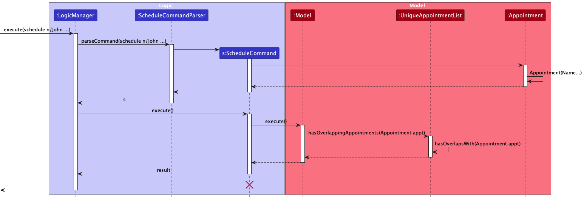

* Table of Contents
{:toc}

## 1. Introduction
### 1.1 Acknowledgements

* This project is based on the AddressBook-Level3 project created by the [SE-EDU initiative](https://se-education.org).

### 1.2 Setting up, getting started

Refer to the guide [_Setting up and getting started_](SettingUp.md).

## 2. Design

:bulb: **Tip:** The `.puml` files used to create diagrams in this document `docs/diagrams` folder. Refer to the [_PlantUML Tutorial_ at se-edu/guides](https://se-education.org/guides/tutorials/plantUml.html) to learn how to create and edit diagrams.

### 2.1 Architecture

The ***Architecture Diagram*** given above explains the high-level design of the App.

Given below is a quick overview of main components and how they interact with each other.

#### 2.1.1 Main components of the architecture

**`Main`** (consisting of classes [`Main`](https://github.com/se-edu/addressbook-level3/tree/master/src/main/java/seedu/address/Main.java) and [`MainApp`](https://github.com/se-edu/addressbook-level3/tree/master/src/main/java/seedu/address/MainApp.java)) is in charge of the app launch and shut down.
* At app launch, it initializes the other components in the correct sequence, and connects them up with each other.
* At shut down, it shuts down the other components and invokes cleanup methods where necessary.

The bulk of the app's work is done by the following four components:

* [**`UI`**](#22-ui-component): The UI of the App.
* [**`Logic`**](#23-logic-component): The command executor.
* [**`Model`**](#24-model-component): Holds the data of the App in memory.
* [**`Storage`**](#25-storage-component): Reads data from, and writes data to, the hard disk.

[**`Commons`**](#26-common-classes) represents a collection of classes used by multiple other components.

#### 2.1.2 How the architecture components interact with each other

The *Sequence Diagram* below shows how the components interact with each other for the scenario where the user issues the command `delete 1`.

Each of the four main components (also shown in the diagram above),

* defines its *API* in an `interface` with the same name as the Component.
* implements its functionality using a concrete `{Component Name}Manager` class (which follows the corresponding API `interface` mentioned in the previous point.

For example, the `Logic` component defines its API in the `Logic.java` interface and implements its functionality using the `LogicManager.java` class which follows the `Logic` interface. Other components interact with a given component through its interface rather than the concrete class (reason: to prevent outside component's being coupled to the implementation of a component), as illustrated in the (partial) class diagram below.

The sections below give more details of each component.

### 2.2 UI component

The **API** of this component is specified in [`Ui.java`](https://github.com/se-edu/addressbook-level3/tree/master/src/main/java/seedu/address/ui/Ui.java)

The UI consists of a `MainWindow` that is made up of parts e.g.`CommandBox`, `ResultDisplay`, `StudentListPanel`, `StatusBarFooter` etc. All these, including the `MainWindow`, inherit from the abstract `UiPart` class which captures the commonalities between classes that represent parts of the visible GUI.

The `UI` component uses the JavaFx UI framework. The layout of these UI parts are defined in matching `.fxml` files that are in the `src/main/resources/view` folder. For example, the layout of the [`MainWindow`](https://github.com/se-edu/addressbook-level3/tree/master/src/main/java/seedu/address/ui/MainWindow.java) is specified in [`MainWindow.fxml`](https://github.com/se-edu/addressbook-level3/tree/master/src/main/resources/view/MainWindow.fxml)

The `UI` component,

* executes user commands using the `Logic` component.
* listens for changes to `Model` data so that the UI can be updated with the modified data.
* keeps a reference to the `Logic` component, because the `UI` relies on the `Logic` to execute commands.
* depends on some classes in the `Model` component, as it displays `Student` object residing in the `Model`.

### 2.3 Logic component

**API** : [`Logic.java`](https://github.com/se-edu/addressbook-level3/tree/master/src/main/java/seedu/address/logic/Logic.java)

Here's a (partial) class diagram of the `Logic` component:

The sequence diagram below illustrates the interactions within the `Logic` component, taking `execute("delete 1")` API call as an example.

:information_source: **Note:** The lifeline for `DeleteCommandParser` should end at the destroy marker (X) but due to a limitation of PlantUML, the lifeline reaches the end of diagram.

How the `Logic` component works:

1. When `Logic` is called upon to execute a command, it is passed to an `WellNusParser` object which in turn creates a parser that matches the command (e.g., `DeleteCommandParser`) and uses it to parse the command.
1. This results in a `Command` object (more precisely, an object of one of its subclasses e.g., `DeleteCommand`) which is executed by the `LogicManager`.
1. The command can communicate with the `Model` when it is executed (e.g. to delete a student).
1. The result of the command execution is encapsulated as a `CommandResult` object which is returned back from `Logic`.

Here are the other classes in `Logic` (omitted from the class diagram above) that are used for parsing a user command:

How the parsing works:
* When called upon to parse a user command, the `WellNusParser` class creates an `XYZCommandParser` (`XYZ` is a placeholder for the specific command name e.g., `AddCommandParser`) which uses the other classes shown above to parse the user command and create a `XYZCommand` object (e.g., `AddCommand`) which the `WellNusParser` returns back as a `Command` object.
* All `XYZCommandParser` classes (e.g., `AddCommandParser`, `DeleteCommandParser`, ...) inherit from the `Parser` interface so that they can be treated similarly where possible e.g, during testing.

### 2.4 Model component

**API** : [`Model.java`](https://github.com/se-edu/addressbook-level3/tree/master/src/main/java/seedu/address/model/Model.java)

The `Model` component,

* stores the wellnus storage data i.e., all `Student` objects (which are contained in a `UniqueStudentList` object).
* stores the currently 'selected' `Student` objects (e.g., results of a search query) as a separate _filtered_ list which is exposed to outsiders as an unmodifiable `ObservableList<Student>` that can be 'observed' e.g. the UI can be bound to this list so that the UI automatically updates when the data in the list change.
* stores a `UserPref` object that represents the user’s preferences. This is exposed to the outside as a `ReadOnlyUserPref` objects.
* does not depend on any of the other three components (as the `Model` represents data entities of the domain, they should make sense on their own without depending on other components)

### 2.5 Storage component

**API** : [`Storage.java`](https://github.com/se-edu/addressbook-level3/tree/master/src/main/java/seedu/address/storage/Storage.java)

The `Storage` component,
* can save both wellnus storage data and user preference data in JSON format, and read them back into corresponding objects.
* inherits from both `WellNusStorage` and `UserPrefStorage`, which means it can be treated as either one (if only the functionality of only one is needed).
* depends on some classes in the `Model` component (because the `Storage` component's job is to save/retrieve objects that belong to the `Model`)

### 2.6 Common classes

Classes used by multiple components are in the `seedu.addressbook.commons` package.

## 3. WellNus Implementation

This section describes some noteworthy details on how certain features of WellNus are implemented.
### 3.1 Cancelling an Appointment

The canceling of an appointment is facilitated by the `CancelCommand`. It extends `Command` and allows the user to cancel an appointment at a specified index.

The sequence diagram below illustrates the interactions within the `Logic` component, taking `execute("cancel 1")` as an example.

**Design Considerations: How an Appointment should be canceled**

* **Current Choice:** Create a new `CancelCommand` class which handles the cancellation of an appointment.
    * Pros: User input will be shorter and easier to read.
    * Cons: More work to implement.

* **Alternative 1:** Add appointment cancellation functionality to the existing `DeleteCommand`.
    * Pros: Easier to implement.
    * Cons: User will have to type longer commands since appointment details can be lengthy, which may lead to more complex commands.

### 3.2 Student Notes feature

The adding of student notes is facilitated by `NoteCommand`. It extends `Command` and allows the addition of a `Note`
to the student at the index specified by the user.

The sequence diagram below illustrates the interactions within the `Logic` component,
taking `execute("note 1 note/Likes dogs.")` as an example.

**Design Considerations: How a `Note` should be added to a `Student`**

* **Alternative 1 (current choice):** Create a new `NoteCommand` class which handles the addition of a note
  to a `Student`.
    * Pros: User input will be shorter in length and easier to read
    * Cons: More work to implement

* **Alternative 2:** Add `Note` as a field in the `AddCommand`
    * Pros: Easier to implement
    * Cons: User will have to type much longer commands, since `Note` can be up to 200 characters long,
      leads to very lengthy commands

### 3.3 View Feature

This feature is facilitated by the use of the ViewCommand class which extends the Command interface.

The sequence diagram below illustrates the interactions within the `Logic` component, taking `execute("delete 1")` API call as an example.

:information_source: **Note:** The lifeline for `ViewCommandParser` should end at the destroy marker (X) but due to a limitation of PlantUML, the lifeline reaches the end of diagram.

View Command handles both the viewing of all students and all appointments. The workflow is shown below:

:information_source: **Note:** There should be a diamond connecting the 4 separate branches
but due to a limitation of PlantUML, the 4 branches leads to the "end" individually .

### 3.4 Check overlapping appointments feature

The *check overlapping appointments* mechanism is facilitated by `UniqueAppointmentList`. It implements the `Iterable`
interface that stores an `ObservableList` of type `Appointment`. When an `Appointment` is scheduled, the
`ScheduleCommand#execute(Model model)` method begins the check.

The following methods are implemented to facilitate the check clashing appointments process:

* `Model#hasOverlappingAppointments(Appointment toAdd)` —  The Model responsible for adding the appointment (In this case, `WellNUS.java`).
* `UniqueAppointmentList#hasOverlapWith(Appointment toAdd)` —  Checks if the appointment to add overlaps with any of the current appointments in the `UniqueAppointmentList`.
* `Appointments#isOverlappingAppointments(Appointment other)` —  Checks if this `Appointment` overlaps with the given `Appointment` supplied in the parameter.

The following sequence diagram shows how the class operates when an appointment is added:

When the user schedules a new command, the `UniqueAppointmentList` runs its `hasOverlappingAppointments()` method to check if the
new appointment clashes with any existing appointments. It raises a `OverlappingAppointmentsException` if the method returns true,
and prevents the user from scheduling that appointment.

The following activity diagram summarises what happens when a user schedules an apppointment:

:information_source: **Note:** There should be a diamond connecting the 3 separate branches
but due to a limitation of PlantUML, the 3 branches leads to the "end" individually .

## 4. Planned Enhancements

### 4.1 Customisable color for risk levels
The current colors for risk levels of low, medium and high are green, blue and red respectively.
Risk levels are color coded for easy identification by counsellors.
However, users may find the current risk level color contrast hard to see, hence we plan to make the colors customisable to cater for different preferences.

### 4.2 Allow name to include special characters
The current parameter constraints for name is name must only contain alphabetical characters and space, be unique up to 100 characters long, and cannot be blank.
However, we do acknowledge the need for special characters in names such as `Arjun S/O Kapoor`, hence we plan to include special characters to cater for diverse student names.

### 4.3 Command to view notes
The current method of viewing notes requires double-clicking on the `StudentCard` which reflects a GUI approach. To cater to users who prefer the CLI approach,
we plan to introduce a command that achieves the above equivalent function.

--------------------------------------------------------------------------------------------------------------------

## 5. Documentation, logging, testing, configuration, dev-ops

* [Documentation guide](Documentation.md)
* [Testing guide](Testing.md)
* [Logging guide](Logging.md)
* [Configuration guide](Configuration.md)
* [DevOps guide](DevOps.md)

## 6. Appendix: Requirements

### 6.1 Product scope

**Target user profile**:

* NUS Student Counsellors
* has a need to manage a significant number of students
* need to manage student details as well as appointments
* prefer desktop apps over other types
* can type fast
* prefers typing to mouse interactions
* is reasonably comfortable using CLI apps

**Value proposition**: This product is meant to help the counsellors better schedule their appointments with students faster than a typical mouse/GUI driven app. Users will be able to store details like personal information, appointment dates, number of visits, emergency contacts etc.

### 6.2 User stories

Priorities: High (must have) - `* * *`, Medium (nice to have) - `* *`, Low (unlikely to have) - `*`

| Priority | As a …​    | I want to …​                                 | So that I can…​                                                                      |
|----------|------------|----------------------------------------------|--------------------------------------------------------------------------------------|
| `* * *`  | counsellor | add a student profile                        | keep track of each student's information                                             |
| `* * `   | counsellor | set or edit a student's risk profile         | monitor the risk profile of each student                                             |
| `* * *`  | counsellor | remove a student profile                     | remove student in the event they do not require any further consultation             |
| `* * *`  | counsellor | view a student profile                       | look up a students relevant information, consultation notes etc.                     |
| `* * *`  | counsellor | view all students as a list                  | look up all students that require consultation                                       |
| `* *`    | counsellor | edit a student's profile                     | update student particulars should there be any changes                               |
| `* *`    | counsellor | filter list by types of student              | look up students in particular categories                                            |
| `* *`    | counsellor | find students by name or ID                  | look up particular students                                                          |
| `* *`    | counsellor | schedule an appointment                      | keep track of my appointments in the application                                     |
| `* *`    | counsellor | cancel an appointment                        | remove any appointments that have been cancelled                                     |
| `* *`    | counsellor | view my appointments                         | look through my timetable for the day/week                                           |
| `* *`    | counsellor | edit appointment info                        | plan my schedule accordingly if there are any last-minute changes                    |
| `* *`    | counsellor | sort appointments by date                    | organise my appointments and plan my timetable accordingly                           |
| `*`      | counsellor | block out busy times                         | prevent clashes in scheduling                                                        |
| `*`      | counsellor | prevent double booking                       | prevent clashes in scheduling                                                        |
| `*`      | counsellor | link students to the respective appointments | have easy access to the student profile that can help me prepare for the appointment |

### 6.3 Use cases

(For all use cases below, the **System** is `WellNUS` and the **Actor** is the `counsellor`, unless specified otherwise)

#### 6.3.1 #UC01: Add a student

**MSS**

1.  User requests to list students
2.  WellNUS shows the list of students
3.  User requests to add a new student to the list
4.  WellNUS adds the student, and shows confirmation message

    Use case ends.

**Extensions**

* 3a. The student name/contact number already exists.
  * 3a1. WellNUS shows an error message. 
    * Use case ends.

* 3b. The given name is invalid (non-alphabetical input), contact number is invalid (non-numerical input or not 8 digits long)
or address is invalid (> 200 characters long)
  * 3b1. WellNUS shows an error message.
    * Use case ends.

* 3c. The given name, contact number or address is omitted
  * 3c1. WellNUS shows an error message.
    * Use case ends.

#### 6.3.2 #UC02: View existing students

**MSS**

1.  User requests to list students
2.  WellNUS shows the list of students
3.  User can find student index that can be used for other use cases, eg. edit student info

    Use case ends.

**Extensions**

* 2a. The list is empty
  * Use case ends.

#### 6.3.3 #UC03: Edit an existing student

**MSS**

1.  User requests to list students
2.  WellNUS shows the list of students
3.  User can find student index
4.  Edit user by specifying the index and fields to edit
5.  Get confirmation of successful edit

    Use case ends.

**Extensions**

* 4a. The student index is invalid.
    * 4a1. WellNUS shows an error message.
        * Use case resumes from step 3.

* 4b. No fields to edit were specified
    * 4b1. WellNUS shows an error message.
        * Use case resumes from step 3.

* 4c. The contact number is invalid (non-numerical input or not 8 digits long)
  or address is invalid (> 200 characters long)
    * 4c1. WellNUS shows an error message.
        * Use case resumes from step 3.

#### 6.3.4 #UC04: Delete an existing student

**MSS**

1.  User requests to list students
2.  WellNUS shows the list of students
3.  User can find student index
4.  Delete user by specifying the index
5.  Get confirmation of successful delete

    Use case ends.

**Extensions**

* 4a. The student index is invalid.
  * 4a1. WellNUS shows an error message.
    * Use case resumes from step 3.

#### 6.3.5 #UC05: Tag student to risk level

**MSS**

1.  User requests to list students
2.  WellNUS shows the list of students
3.  User can find student index
4.  Tag/change student risk level using the student index
5.  Information gets updated for future reference

    Use case ends.

**Extensions**

* 4a. The student index is invalid.
  * 4a1. WellNUS shows an error message.
    * Use case resumes from step 3.

* 4b. The risk level is invalid (not high/medium/low)
  * 4b1. WellNUS shows an error message.
    * Use case resumes from step 3.

#### 6.3.6 #UC06: Add student notes for a specific student

**MSS**

1.  User requests to list students
2.  WellNUS shows the list of students
3.  User can find student index
4.  Add student note using the student index
5.  Information gets updated for future reference

    Use case ends.

**Extensions**

* 4a. The student index is invalid.
    * 4a1. WellNUS shows an error message.
        * Use case resumes from step 3.

* 4b. The note is invalid (> 500 characters long)
    * 4b1. WellNUS shows an error message.
        * Use case resumes from step 3.

#### 6.3.7 #UC07: Schedule an appointment

**MSS**

1.  User requests to list appointments
2.  WellNUS shows the list of appointments, along with some basic information like time and student
3.  User requests to schedule a new appointment to the list
4.  WellNUS adds the appointment 
5.  WellNUS shows confirmation message 
    
    Use case ends.

**Extensions**

* 3a. The student index is invalid.
  * 3a1. WellNUS shows an error message.
    * Use case resumes from step 3.

* 3b. The given time is invalid (wrong time format).
  * 3b1. WellNUS shows an error message.
    * Use case resumes from step 3.

* 3c. The given time overlaps with an existing appointment.
  * 3c1. WellNUS shows an error message.
    * Use case resumes from step 3.

#### 6.3.8 #UC08: View existing appointments

**MSS**

1.  User requests to list appointments
2.  WellNUS shows the list of appointments
3.  User can view appointment information such as student involved and time of appointment
    
    Use case ends.

**Extensions**

* 2a. User unable to view appointment information as list is empty

    Use case ends.

#### 6.3.9 #UC09: Cancel an existing appointment

**MSS**

1.  User requests to list appointments
2.  WellNUS shows the list of appointments
3.  User cancels an appointment at chosen index
4.  WellNUS deletes the appointment with index specified by user and display status

    Use case ends.

**Extensions**

* 3a. WellNUS detects an error in the entered index

    Use case resumes from step 3.

#### 6.3.10 #UC10: Find students by name together with their appointments

1. User requests to find students using their name
2. WellNUS shows the list of students that match the given name
3. WellNUS shows the appointments of the filtered list of students shown
4. User can view the information of the filtered students and his/her appointments

    Use case ends.

**Extensions**

* 4a. User does not see any students and appointments as no students match the given name

  Use case ends.

#### 6.3.11 #UC11: Filter an appointment by date

1. User requests to list appointments for a given date
2. WellNUS shows the list of appointments for the date
3. User can view appointment information for the appointments in the given date

    Use case ends.

**Extensions**

* 3a. User does not see any appointments as there are no appointments scheduled on that day

  Use case ends.

* 3b. The given date is invalid (wrong date format).
    * 3b1. WellNUS shows an error message.
        * Use case resumes from step 1.

### 6.4 Non-Functional Requirements
1.  Cross-Platform Compatibility:
    - Should work on any _mainstream OS_ as long as it has Java `11` or above installed.
2.  Scalability and Performance:
    - Should be able to hold up to 1000 students without a noticeable sluggishness in performance for typical usage.
    - Should support efficient data retrieval and manipulation for the specified contact volume.
3.  Usability and Efficiency:
    - A user with above average typing speed for regular English text (i.e. not code, not system admin commands) should 
    be able to perform the majority of tasks more quickly using _CLI_ commands compared to using a mouse on the _GUI_.
    - The _CLI_ interface should prioritise efficiency by providing clear and concise commands, minimising unnecessary prompts,
    and offering time-saving shortcuts.
4. Updates and Maintenance:
    - Updates should not disrupt the user's workflow or data.

*{More to be added}*

### 6.5 Glossary

* **Mainstream OS**: Windows, Linux, Unix, OS-X
* **Private contact detail**: A contact detail that is not meant to be shared with others
* **CLI**: Command Line Interface. Usually the in-built terminal or in the IDE the application is run on.
* **GUI**: Graphical User Interface.
* **Risk Level**: Students can be classified as high, medium, or low-risk level determined by the counsellor.

## 7. Appendix: Instructions for manual testing

Given below are instructions to test the app manually.

:information_source: **Note:** These instructions only provide a starting point for testers to work on;
testers are expected to do more *exploratory* testing.

### 7.1 Launch and shutdown

1. Initial launch

   1. Download the jar file and copy into an empty folder

   2. Double-click the jar file 
   
   Expected: Shows the GUI with a set of sample contacts. The window size may not be optimum.

2. Saving window preferences

   1. Resize the window to an optimum size. Move the window to a different location. Close the window.

   2. Re-launch the app by double-clicking the jar file. 
          Expected: The most recent window size and location is retained.

### 7.2 Student Features
#### 7.2.1 Add Student
Adds a student with their relevant details.

Format: `add n/STUDENT_NAME c/CONTACT_NUMBER a/HOME_ADDRESS [r/RISK_LEVEL]`

1. Use the find feature (9.2.#) to ensure student with that name does not exist.
2. Test Case 1: `add n/Ethan Tan c/98765432 a/252 ANG MO KIO AVENUE 4 01-225`
   - Expectation: Confirmation message that includes student information.
3. Test Case 2: `add n/Rachel Teo c/87654321 a/Block 30 Kallang Place #01-23/24 r/HIGH`
   - Expectation: Same as above
4. Test Case 3: `add n/Ethan Tan c/98765432 a/252 ANG MO KIO AVENUE 4 01-225` again
   - Expectation: Warning `This student already exists in the student list`
5. False commands:
   - Try missing fields: Get a message stating the format of the input
   - Incorrect Phone Number: Get a message stating that phone numbers must be 8 digits long

#### 7.2.2 Delete Student
Deletes a student and all related data

Format: `delete STUDENT_INDEX`

1. List all students using the view command.
2. Test Case 1: `delete 1` 
   - Expectation: Confirmation message is shown, Appointments and Notes are deleted as well
3. Test Case 2: `delete 0`
   - Expectation: Invalid command format message (Index must be positive)
4. Try other invalid commands like `delete a` or using an index greater than the number of students that exists. Displays Error message

#### 7.2.3 Adding/Deleting notes for a Student
This command either adds a note to an existing student (overwriting any existing note) or deletes a note
depending on the command format given, as further shown in examples below

Format: `note STUDENT_INDEX note/NOTE`

1. Test Case 1: `note 1 note/Exam stress in building`
   - Expectation: Confirmation message is shown. Message shown when double-clicking the student
2. Test Case 2: `note 1 note/` or `note 1`
   - Expectation: All notes get deleted
3. Other invalid tests would include invalid student index, handled similar to the case in `delete`

Double-clicking on the Student card displays the Student notes under the Notes section!
The “Notes” column will inform you if there are no student notes for a particular Student.

#### 7.2.4 Finding Students by Name
Find students and their related appointments based on their name. Can choose to find student based on their first name, last name or full name.

Format: `find STUDENT_NAME`

1. Student name must match exactly to the first name, last name or full name
2. Use existing student information or add students before conducting the following tests.
3. Test Case 1: `find David`
   - Expectation: All students with the name 'David' as first name or last name is shown is shown
4. Test Case 2: `find Li`
   - Expectation: All students with 'Li' as first name or last name is shown
5. Test Case 3: `find David Li`
   - Expectation: The student 'David Li' is shown
6. Test Case 4: `find Abigail`
   - Expectation: Message stating `No student found`
7. Other invalid commands should show respective error messages.

#### 7.2.5 Assigning risk level to Student
This command either adds a tag to an existing student (overwriting any existing tag), or deletes a tag
depending on the command format given, as further shown in examples below

Format: `tag STUDENT_INDEX r/RISK_LEVEL`

1. Student must be found in the list
2. Risk level can only be `low`/`medium`/`high`
3. Test Case 1: `tag 2 r/HIGH`
   - Expectation: Show student information with stated risk level
4. Test Case 2: `tag 2 r/moderate`
   - Expectation: Message stating `Risk level should be one of the following three: high/medium/low`
5. Other invalid test cases would include invalid student index (Handled similar to above cases) and invalid tags (like Test Case 2)

#### 7.2.6 Editing Student details
Edit a student's contact number or address.

Format `edit STUDENT_INDEX [c/CONTACT_NUMBER] [a/HOME_ADDRESS]`

1. This feature cannot be used to edit student risk level. Use `tag` instead
2. At least 1 feature should be included
3. Test Case 1: `edit 3 c/97865423`
   - Expectation: Confirmation message shown with the updated contact
4. Test Case 2: `edit 3 a/10 Tampines Central 1 #11-14 Tampines 1`
   - Expectation: Same as above, with updated address
5. Test Case 3: `edit 3 c/98762345 a/3791 Jalan Bukit Merah 09-27 E-Centre Redhill`
   - Expectation: Same as above, both fields updated
6. Test Case 4: `edit 3`
   - Expectation: Error Message `At least one field to edit must be provided.` shown

### 7.3 Appointment Commands

#### 7.3.1 Scheduling an Appointment
Schedules a new appointment for a student.

Format: `schedule n/STUDENT_NAME date/DATE from/START_TIME to/END_TIME d/DESCRIPTION`

1. Student must exist before an appointment is scheduled
2. Student name must be in full and match exactly
3. Must have a valid date and time
4. Test Case 1: `schedule n/Ethan Tan date/2023-12-30 from/16:30 to/17:30 d/monthly check-up`
   - Expectation: Confirmation message for appointment is shown, appointment added to the column according to date and time.
5. Test Case 2: `schedule n/Ethan date/2023-12-28 from/16:30 to/17:30 d/monthly check-up`
   - Expectation: `No such student exists for this appointment` Message
6. Test Case 3: `schedule n/Ethan Tan date/2023-12-30 from/16:30 to/17:30 d/monthly check-up` again
   - Expectation: `This appointment already exists` Message
7. Test Case 4: `schedule n/David Li date/2023-12-30 from/16:30 to/17:30 d/monthly check-up`
   - Expectation: `This appointment overlaps with an existing appointment` Message
8. Test Case 5: `schedule n/David Li date/2025-12-30 from/16:30 to/17:30 d/monthly check-up`
   - Expectation: `Appointment can only be scheduled within a year` Message
9. Other invalid test cases includes other forms of invalid date, students that do not exist or clashes. All should show respective error messages.

#### 7.3.2 Cancelling an Appointment
Cancels an existing appointment.

Format: `cancel APPOINTMENT_INDEX`

1. Appointment must exist
2. Test Case 1: `cancel 1`
   - Expectation: Confirmation message is shown
3. Test Case 2: `cancel 0`
   - Expectation: Invalid command format message (Index must be positive)
4. Try other invalid commands like `cancel a` or using an index greater than the number of appointments that exists. Displays Error message accordingly.

#### 7.3.3 Filtering Appointments by Date: `filter`

Filters appointments based on given date.

Format: `filter DATE`

1. Date must be in the yyyy-MM-dd format
2. Test Case 1: `filter 2023-12-14`
   - Expectation: Shows appointments on that day
3. Test Case 2: `filter 2023-11-24`
   - Expectation: `0 appointments listed`
4. All invalid date format: Message shows required date format

### 7.4 Others

#### 7.4.1 Viewing all Students and/or Appointments

Shows a list of all available Students and/or Appointments, depending on specified input.

Format: `view g/CATEGORY`

1. Category must be `students`, `appointments` or `all`
2. Test Case 1: `view g/all`
   - Expectation: Shows all students and appointments
3. Test Case 2: `view g/appointments`
   - Expectation: Shows all appointments in the list
4. Test Case 3: `view g/students`
   - Expectation: Shows all students in the list
5. Any other command is considered invalid
   - Expectation: Error message to direct user to one of the above

#### 7.4.2 Exiting the program: `exit`

Exits the program.

Format: `exit`

#### 7.4.3 Clearing storage: `clear`

Resets the storage, deleting **all** Appointments and Students.

Format: `clear`

## 8. Appendix: Effort

### 8.1 Design Challenges

* WellNUS, in contrast to AB3 which exclusively manages one entity type: `Person`,
has the intricate challenge of handling two distinct entity types: `Student` and `Appointment`.
* One challenge encountered was the need to manage dependencies between the two entity types.
Specifically, the system had to be designed to prevent the scheduling of appointments unless a corresponding student entity existed. 
Additionally, to maintain data integrity, the deletion of a student entity necessitated the simultaneous cancellation of all associated appointments.
* In tackling these challenges, we leveraged existing components to streamline development efforts. 
Recognising the `Person` entity in AB3, we opted to adapt the `Person` entity and repurpose to `Student` entity within WellNUS.
* Another challenge we faced was designing a new `Appointment` entity from scratch. The process was challenging and required tedious class refactoring mid-implementation.
Initially, we designed `Appointment` to have an attribute `DateTime` to store the date and time of the appointment. 
To facilitate the comparison of appointments and prevent overlaps and clashes, we soon realised there was a need for a start and end time.
However, having `DateTime start` and `DateTime end` results in a duplication of date, as the appointment was bound to be on the same date. 
Hence, we refactored `DateTime` into `Date` and `Time` to allow for 3 attributes: `Date appointmentDate`, `Time startTime`, `Time endTime`
* For the UI of WellNUS, we also faced challenges handling `Appointment` and `Note`, specifically, how these
entities are to be displayed to the user. For `Appointment`, we settled on having an `Appointment` list similar to the
`Person` list in AB3, and simultaneously display 2 lists for `Student` and `Appointment`.
* On the other hand, while we initially displayed `Note` under its corresponding `Student`, similar to `Remark` in
AB3, we eventually decided against it. Our `Note` was designed for counsellors to make consultation notes in addition
to remarks for students, and is usually much longer than a typical `Remark` in AB3, this led to each
row in the `Student` list becoming much more cluttered and wordy. Eventually, we created a separate column that
specifically displays a single `Note` of the user's choice.

### 8.2 Technical Challenges

* Since WellNUS manages both `Student` and `Appointment` entities, one of the challenges we faced was refactoring our
`Storage` component to handle both entities simultaneously. While saving `Student` and `Appointment` data to the storage
file was much easier since we could reference AB3's `Storage` component, loading data from file proved to be a much
larger challenge especially in a brownfield project.
* The loading in AB3 simply checks if there are any duplicate `Persons`, on the other hand, having
an `Appointment` entity meant that, we had to perform checks for duplicate `Appointments`, overlapping `Appointments`
and also whether the `Student` provided in the `Appointment` exists in the given WellNUS data file.
* In addition, because we decided to refactor `Person` in AB3 into `Student`, the initial refactoring for `Person` was
tedious and proved to be a challenge. Removing redundant fields like `Email` and `Tags` and adding fields like `RiskLevel`
and `Note` meant that a large portion of the AB3 had to be refactored, since the majority of the code in AB3 involved
the `Person` entity, including tests, sample data and UI.
* We decided that adding student notes was essential to our application as it is part of a counsellor's job. While it was 
easy to add a student note, it was difficult to find a convenient way to display the `Note` as the `Note` for the student can be very long.
We could not simply just show the `Note` together with rest of the details in the `StudentCard` as it will not be
visually-pleasing. We wanted to make it easy by double-clicking on a student card to display the student notes separately.
It proved to be challenging to handle event-listeners from various components of the UI as only after
trying different workflows, we realised that the best way is pass a FunctionalInterface from the `StudentNotePanel` over to the `StudentCard`
to update the `StudentNotePanel` when the event is triggered. This was especially difficult as most events originally were triggered by
command inputs.
