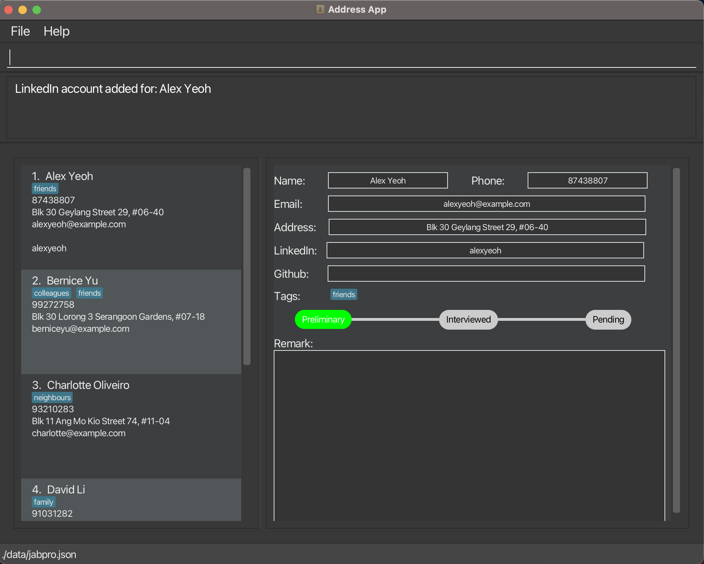
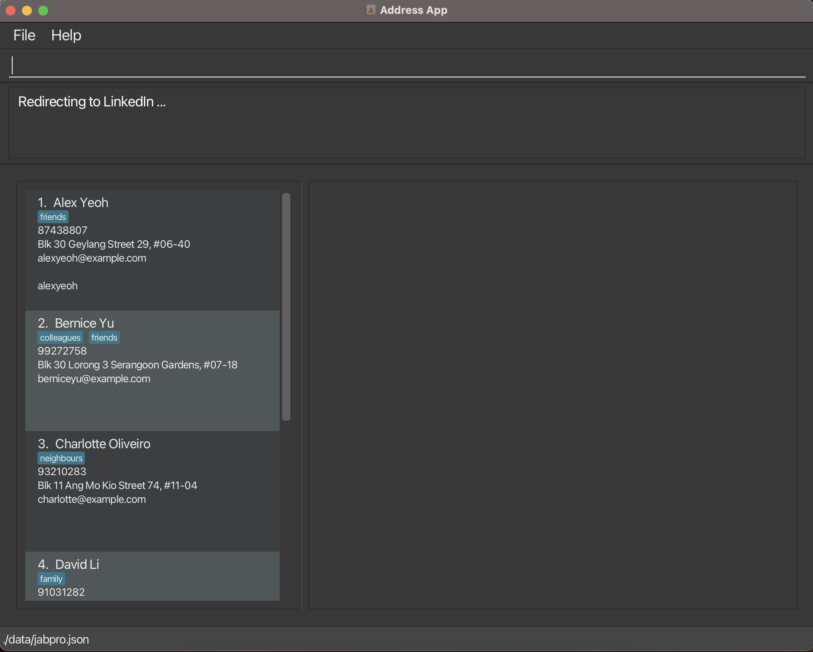
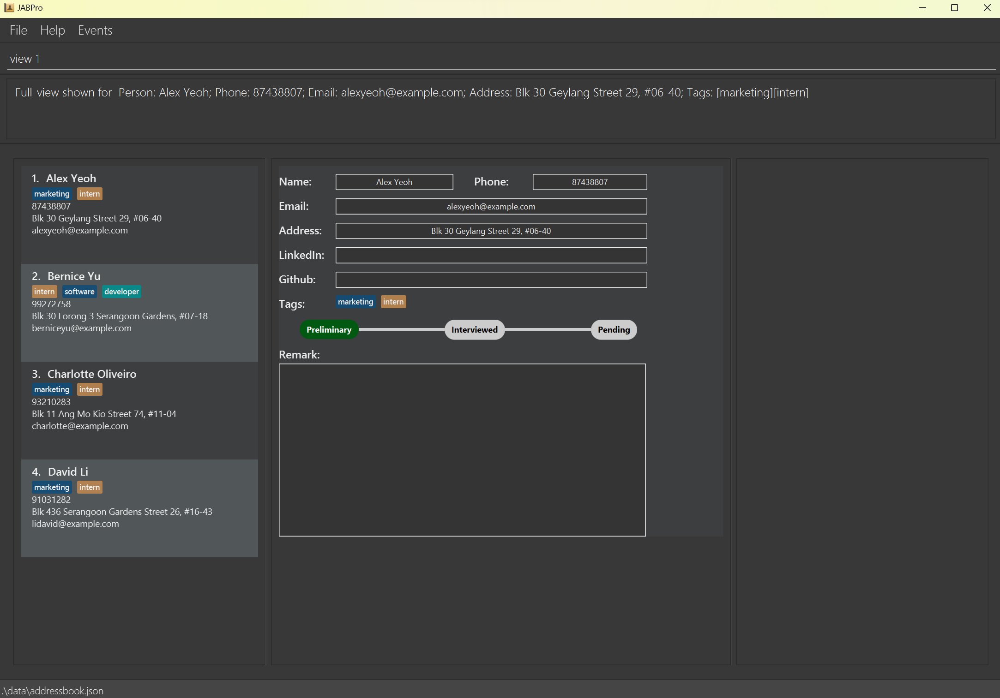
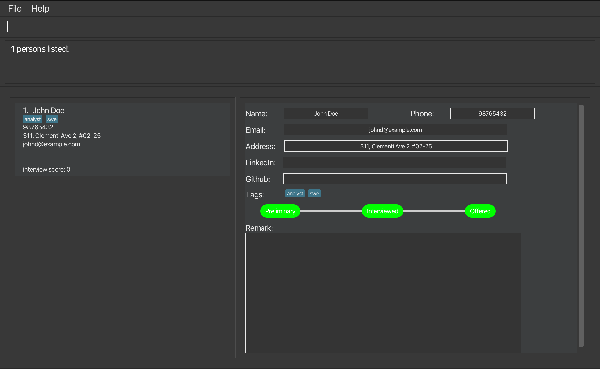
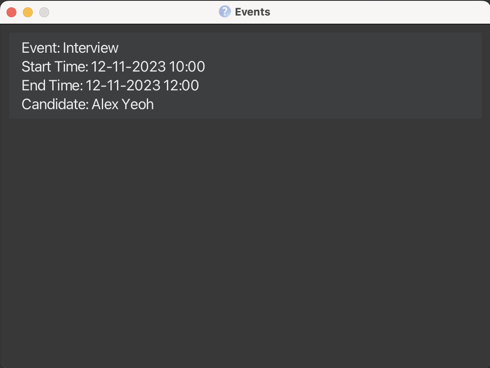

# JABPro Developer Guide

<!-- * Table of Contents -->
<page-nav-print />

--------------------------------------------------------------------------------------------------------------------

## **Acknowledgements**

This is based on the AddressBook-Level3 project created by the [SE-EDU initiative](https://se-education.org).

_{ list here sources of all reused/adapted ideas, code, documentation, and third-party libraries -- include links to the original source as well }_

--------------------------------------------------------------------------------------------------------------------

## **Setting up, getting started**

Refer to the guide [_Setting up and getting started_](SettingUp.md).

--------------------------------------------------------------------------------------------------------------------

## **Design**

### Architecture

<puml src="diagrams/ArchitectureDiagram.puml" width="280" />

The ***Architecture Diagram*** given above explains the high-level design of the App.

Given below is a quick overview of main components and how they interact with each other.

**Main components of the architecture**

**`Main`** (consisting of classes [`Main`](https://github.com/se-edu/addressbook-level3/tree/master/src/main/java/seedu/address/Main.java) and [`MainApp`](https://github.com/se-edu/addressbook-level3/tree/master/src/main/java/seedu/address/MainApp.java)) is in charge of the app launch and shut down.
* At app launch, it initializes the other components in the correct sequence, and connects them up with each other.
* At shut down, it shuts down the other components and invokes cleanup methods where necessary.

The bulk of the app's work is done by the following four components:

* [**`UI`**](#ui-component): The UI of the App.
* [**`Logic`**](#logic-component): The command executor.
* [**`Model`**](#model-component): Holds the data of the App in memory.
* [**`Storage`**](#storage-component): Reads data from, and writes data to, the hard disk.

[**`Commons`**](#common-classes) represents a collection of classes used by multiple other components.

**How the architecture components interact with each other**

The *Sequence Diagram* below shows how the components interact with each other for the scenario where the user issues the command `delete 1`.

<puml src="diagrams/ArchitectureSequenceDiagram.puml" width="574" />

Each of the four main components (also shown in the diagram above),

* defines its *API* in an `interface` with the same name as the Component.
* implements its functionality using a concrete `{Component Name}Manager` class (which follows the corresponding API `interface` mentioned in the previous point.

For example, the `Logic` component defines its API in the `Logic.java` interface and implements its functionality using the `LogicManager.java` class which follows the `Logic` interface. Other components interact with a given component through its interface rather than the concrete class (reason: to prevent outside component's being coupled to the implementation of a component), as illustrated in the (partial) class diagram below.

<puml src="diagrams/ComponentManagers.puml" width="300" />

The sections below give more details of each component.

### UI component

The **API** of this component is specified in [`Ui.java`](https://github.com/se-edu/addressbook-level3/tree/master/src/main/java/seedu/address/ui/Ui.java)

<puml src="diagrams/UiClassDiagram.puml" alt="Structure of the UI Component"/>

The UI consists of a `MainWindow` that is made up of parts e.g.`CommandBox`, `ResultDisplay`, `PersonListPanel`, `StatusBarFooter` etc. All these, including the `MainWindow`, inherit from the abstract `UiPart` class which captures the commonalities between classes that represent parts of the visible GUI.

The `UI` component uses the JavaFx UI framework. The layout of these UI parts are defined in matching `.fxml` files that are in the `src/main/resources/view` folder. For example, the layout of the [`MainWindow`](https://github.com/se-edu/addressbook-level3/tree/master/src/main/java/seedu/address/ui/MainWindow.java) is specified in [`MainWindow.fxml`](https://github.com/se-edu/addressbook-level3/tree/master/src/main/resources/view/MainWindow.fxml)

The `UI` component,

* executes user commands using the `Logic` component.
* listens for changes to `Model` data so that the UI can be updated with the modified data.
* keeps a reference to the `Logic` component, because the `UI` relies on the `Logic` to execute commands.
* depends on some classes in the `Model` component, as it displays `Person` object residing in the `Model`.

### Logic component

**API** : [`Logic.java`](https://github.com/se-edu/addressbook-level3/tree/master/src/main/java/seedu/address/logic/Logic.java)

Here's a (partial) class diagram of the `Logic` component:

<puml src="diagrams/LogicClassDiagram.puml" width="550"/>

The sequence diagram below illustrates the interactions within the `Logic` component, taking `execute("delete 1")` API call as an example.

<puml src="diagrams/DeleteSequenceDiagram.puml" alt="Interactions Inside the Logic Component for the `delete 1` Command" />

<box type="info" seamless>

**Note:** The lifeline for `DeleteCommandParser` should end at the destroy marker (X) but due to a limitation of PlantUML, the lifeline reaches the end of diagram.
</box>

How the `Logic` component works:

1. When `Logic` is called upon to execute a command, it is passed to an `AddressBookParser` object which in turn creates a parser that matches the command (e.g., `DeleteCommandParser`) and uses it to parse the command.
1. This results in a `Command` object (more precisely, an object of one of its subclasses e.g., `DeleteCommand`) which is executed by the `LogicManager`.
1. The command can communicate with the `Model` when it is executed (e.g. to delete a person).
1. The result of the command execution is encapsulated as a `CommandResult` object which is returned back from `Logic`.

Here are the other classes in `Logic` (omitted from the class diagram above) that are used for parsing a user command:

<puml src="diagrams/ParserClasses.puml" width="600"/>

How the parsing works:
* When called upon to parse a user command, the `AddressBookParser` class creates an `XYZCommandParser` (`XYZ` is a placeholder for the specific command name e.g., `AddCommandParser`) which uses the other classes shown above to parse the user command and create a `XYZCommand` object (e.g., `AddCommand`) which the `AddressBookParser` returns back as a `Command` object.
* All `XYZCommandParser` classes (e.g., `AddCommandParser`, `DeleteCommandParser`, ...) inherit from the `Parser` interface so that they can be treated similarly where possible e.g, during testing.

### Model component
**API** : [`Model.java`](https://github.com/se-edu/addressbook-level3/tree/master/src/main/java/seedu/address/model/Model.java)

<puml src="diagrams/ModelClassDiagram.puml" width="450" />

The `Model` component,

* stores the address book data i.e., all `Person` objects (which are contained in a `UniquePersonList` object).
* stores the event book data i.e., all `Event` objects (which are contained in a `UniqueEventList`)
* stores the currently 'selected' `Person` objects (e.g., results of a search query) as a separate _filtered_ list which is exposed to outsiders as an unmodifiable `ObservableList<Person>` that can be 'observed' e.g. the UI can be bound to this list so that the UI automatically updates when the data in the list change.
* stores the currently 'selected' `Event` objects as a separate _filtered_ list which is exposed to outsiders as an unmodifiable `ObservableList<Event>`
* stores a `UserPref` object that represents the user’s preferences. This is exposed to the outside as a `ReadOnlyUserPref` objects.
* does not depend on any of the other three components (as the `Model` represents data entities of the domain, they should make sense on their own without depending on other components)

<box type="info" seamless>

**Note:** An alternative (arguably, a more OOP) model is given below. It has a `Tag` list in the `AddressBook`, which `Person` references. This allows `AddressBook` to only require one `Tag` object per unique tag, instead of each `Person` needing their own `Tag` objects. 

<puml src="diagrams/BetterModelClassDiagram.puml" width="450" />

</box>

### Storage component

**API** : [`Storage.java`](https://github.com/se-edu/addressbook-level3/tree/master/src/main/java/seedu/address/storage/Storage.java)

<puml src="diagrams/StorageClassDiagram.puml" width="550" />

The `Storage` component,
* can save address book data, event book data and user preference data in JSON format, and read them back into corresponding objects.
* inherits from `AddressBookStorage`, `EventBookStorage` and `UserPrefStorage`, which means it can be treated as either one (if only the functionality of only one is needed).
* depends on some classes in the `Model` component (because the `Storage` component's job is to save/retrieve objects that belong to the `Model`)

### Common classes

Classes used by multiple components are in the `seedu.addressbook.commons` package.

--------------------------------------------------------------------------------------------------------------------

## **Implementation**

This section describes some noteworthy details on how certain features are implemented.

### LinkedIn/Github feature

#### Implementation

The LinkedIn/Github feature consists of two parts - adding the linkedin/github username to the candidate's data, and viewing the profile. 

The addition is performed by the `AddLCommand` and `AddGCommand` classes. They extend `Command` and override the `execute()` method to add the username to the candidate's existing details. 

It involves the command `AddLCommand` and `AddGCommand` classes, and their corresponding parsers `AddLCommandParser` and `AddGCommandParser`, that take in user input and return either `AddLCommand` or `AddGCommand` objects.

When executed, `AddLCommand` and `AddGCommand` find the person at the specified index in the list, and adds either their linkedin or github username to the `LinkedIn` or `Github` class associated with that `Person`. The list is then updated, and a `CommandResult` object is returned.

The viewing is performed by the `LinkedInCommand` and `GithubCommand` classes. They extend `Command` and override the `execute()` method to redirect the user to the candidate's LinkedIn or Github profile on the browser.

It involves the command `LinkedInCommand` and `GithubCommand` classes, and their corresponding parsers `LinkedInCommandParser` and `GithubCommandParser`, that take in user input and return either `LinkedInCommand` or `GithubCommand` objects.

When executed, `LinkedInCommand` and `GithubCommand` append the username of the person to the base URLs for LinkedIn and Github, and open the URL in the browser.

Given below is an example usage scenario and how the linkedin and github feature behaves at each step.

**Step 1.** The user launches the application. `JABPro` will be initialized with the current saved state

User should see the UI as shown below.

**Step 2.** The user wants to add the LinkedIn username to the first person in the list. The user enters the command `addL 1 u/alexyeoh` to add the username to the candidate's existing details.

The following sequence diagram shows how the AddL and AddG operations work:

<puml src="diagrams/AddLSequenceDiagram.puml" alt="AddLSequenceDiagram" />
<puml src="diagram/AddGSequenceDiagram.puml" alt="AddGSequenceDiagram" />

User should see the UI as shown below after entering `addL 1 u/alexyeoh`

**Step 3.** The user can then view the linkedin profile for the candidate at index 1. The user enters the command `linkedin 1`.

User should see the UI asa shown below after entering `linkedin 1`

#### Alternatives considered ####

Alternative 1 (Chosen): 

`LinkedIn` and `Github` are attributes of a `Person` that can be added using the `AddLCommand` and `AddGCommand` and are initially provided with default string values when a Person is initialised.

Pros: There may be candidates who do not provide their LinkedIn or Github profiles as part of their application.

Cons: Person is always initialised with empty values for LinkedIn and Github, and those values would have to be manually set using the commands.

Alternative 2:

`LinkedIn` and `Github`, like all other attributes of `Person`, are required to be non null.

Pros: These details will be provided at the time of addition of a new Person, without having to add them later separately.

Cons: It limits the scope for candidates that do not possess a LinkedIn or Github account.

Alternative 3:

`LinkedIn` and `Github` are attributes of `Person` but are allowed to be null.

Pros: This accounts for candidates that do not have those social profiles, and allows for their addition at the time of Person creation

Cons: With defensive programming in mind, not the best approach having to deal with null values.

=======
### View feature

#### Implementation

The view feature is implemented using the `ViewCommand` class. It extends `Command` and overrides the `execute()` method to display the person's details in full in a new window.

Like every other command class, it involves a command `ViewCommand` class and a parser `ViewCommandParser`. `ViewCommand Parser` takes in the user input and returns a `ViewCommand` object.    
  
When executed, `ViewCommand` saves the index of the person to be viewed as `LastViewedPersonIndex` in the `Model` and returns a `CommandResult` object with `isView` property being true.  

By having a `isView` property in `CommandResult`, the `MainWindow` component is able to toggle the `UI` to the view the person of the `LastViewedPersonIndex` after the command has been executed.

Given below is an example usage scenario and how the view feature behaves at each step.

Step 1. The user launches the application. The `AddressBook` will be initialized with the current saved address book state

User should see the UI as shown below.  

Step 2. The user wants to see the full information displayed for the first person in the displayed list. The user enters the command `view 1` to view the first person in the list.

The following sequence diagram shows how the view operation works:

<puml src="diagrams/ViewSequenceDiagram.puml" alt="ViewSequenceDiagram" />

**Note:** The lifeline for `RemarkCommand` and `RemarkCommandParser` should end at the destroy marker (X) but due to a limitation of PlantUML, the lifeline reaches the end of diagram.

User should see the UI as shown below after entering `View 1`  

Step 3. The user can then read or process the information stored for the viewed person.

**Note:** The view command can be most effectively used with `search` and `list`. Since the view index is dependent on the Index on the filtered list shown, the user can view the profile after filtering for specific properties in a person using `search` and sorting them using `list`.

Alternatives considered

Alternative 1 (Chosen):   
The view feature is implemented using the `ViewCommand` class. It extends `Command` and overrides the `execute()` method to display the person's details in full in a new window.  

Pros: Follows the Software Design Patterns of Command. This is the same pattern used for all other commands thus creating consistency.  

Cons: Tougher to implement since other commands do not have the ability to trigger the `ViewCommand` in their execution.  That is we specifically need to set the isView property to true if we want the `ViewCommand` to occur simultaneously with another command.  

Alternative 2 (Not Chosen):  
The view feature is implemented using the `ViewCommand` class. It extends `Command` and overrides the `execute()` method to display the person's details in full in a new window.  
Commands that involved viewing will extend `ViewCommand` instead of the `Command` class. All of them are returned as `ViewCommand` to ensure toggling of the UI after command is executed.    

Pros: Arguably a more OOP approach since all commands that trigger view IS-A `ViewCommand`.  

Cons: You cannot implement any command that does not involve viewing but inherits from any command that is a children of `ViewCommand`.  
An example could be trying to create identical commands that does not toggle the UI after execution. This would require duplication of the exact same command code but inheriting from `Command` instead of `ViewCommand`.

### Search feature

#### Implementation

The search feature is implemented using the `SearchCommand` class. It extends `Command` and overrides the `execute()` method to
filter users by the specified parameters.

The search parameters from the user input are parsed using the parse method in the `SearchCommandParser` class. `SearchCommandParser::Parse`
takes in the search parameters from the user input and combines them into a list of predicates. This list of predicates is then 
passed as an argument to the `SearchCommand` constructor and the method returns a `SearchCommand` instance with the associated list of predicates.

Currently, the search parameters could belong to any of the three following categories: `Name`, `Status`, and `Tag`. Prefixes
`n/`, `st/` and `t/` are used to denote the category of the search parameters respectively. E.g. `search n/alex st/interviewed t/swe`

The list of predicates is a list comprising predicate objects whose classes implement the `Predicate` class in Java.
Each category has its own predicate class i.e. `NameContainsKeywordPredicate`, `StatusContainsKeywordPredicate`, `TagContainsKeywordPredicate`
and each class overrides the `test` method which returns true if the persons list contains any of the given names/status/tags.

Finally, the execute method in `SearchCommand` class invokes the `updateFilteredPersonList(predicatesList)` which will 
update the list of persons displayed.

Given below is an example usage scenario and how the search mechanism behaves at each step.

Step 1. The user launches the application.

Step 2. The user executes `search n/john st/offered t/swe` command to filter candidates having the name john,
offered status and tagged as swe. 

The following sequence diagram shows how the search operation works:

**Note:** The lifeline for `SearchCommand` and `SearchCommandParser` should end at the destroy marker (X) but due to a limitation of PlantUML, the lifeline reaches the end of diagram.

<puml src="diagrams/SearchSequenceDiagram.puml" alt="SearchSequenceDiagram" />

Step 3. The user should see the UI below upon entering `search n/john st/interviewed t/friends`.

**Note:** The current implementation of search allows users to search by any of the categories individually or by different combinations of the categories.
It also allows users to specify more than one search parameter for each category e.g. `search n/alex bernice`

## Events feature

#### Implementation

The Events feature extends the original ideas of the `AddressBook` to store two types of entities - Candidates and Events associated with candidates.

It consists of two parts - adding the events to JABPro, and viewing the events.

THe addition is performed by the `EventCommand` class. It extends `Command` and overrides the `execute()` method to add the event to JABPro.

It involves the `EventCommand` class and its corresponding parser, `EventCommandParser`, that takes in the user input and returns an `EventCommand` object.

When executed, `EventCommand` finds the person the event is associated with, and adds the name of the person, and other details such as description and start and end time, as input by the user. The existing `EventBook` is then updated to reflect this addition, and a `CommandResult` object is returned.

The viewing is performed by the `ScheduleCommand`. It extends `Command` and overrides the `execute()` method to open the `Events Window` and display the events.

<box type="info" seamless>

**Note:** There is another way of viewing events, that is through the `Events` tab. Refer to the [UserGuide](UserGuide.md#viewing-events-schedule) for more information.

</box>

Given below is an example usage scenario highlighting how the `Events` feature behaves at each step.

**Step 1.** The user launches the application. The `EventBook` will be initialized with the current saved event book state.

User should see the UI as shown below.

**Step 2.** The user wishes to add an "Interview" event for the first candidate in the list. The user enters the following command:

`event 1 d/Interview bt/2023-11-12 10:00 et/2023-11-12 12:00`

This command adds a new event to the `EventBook` that is associated with the first person in the list, with the description as "Interview" and the start and end time as specified.

<box type="info" seamless>

**Note:** The start and end times are required to follow a specific format. Refer to the [UserGuide](UserGuide.md#adding-an-event-event) for more information.

</box>

The following sequence diagram shows how the `Event` operation works:

<puml src="diagrams/EventSequenceDiagram.puml" altText="EventSequenceDiagram"></puml>

User should see the UI as shown below after executing the aforementioned command [It is assumed that the first candidate in the list is Alex Yeoh].

#### Alternatives considered ####

***Duplicate Events***

Alternative 1 (chosen):

`Events` associated with the same `Person`, having the same description are allowed. It is upto the user to input more detailed descriptions to differentiate between them, and to promote readability.

Pros: It makes the `EventBook` a complete product of the user's choice as no restrictions are imposed, and the user can enter data as per their preferences and their convenience.

Cons: It might lead to confusion if multiple events of the same person, having the same description are added. Hence, it is recommended that the user enters detailed descriptions to distinguish events from one another.

Alternative 2:

`Events` associated with the same `Person`, having the same description are considered duplicate `Events` and hence, are rejected by the system.

Pros: It prevents redundant data from being stored and accidental addition of multiple events of the same type for the same person

Cons: It restricts users from entering data that might be understandable or convenient for them. [For example: If the user creates two Events with the description "Interview" for the same person, they might have a distinct idea of what each of those Events mean, but the system prevents them for making this addition].

### \[Proposed\] Data archiving

_{Explain here how the data archiving feature will be implemented}_

--------------------------------------------------------------------------------------------------------------------

## **Documentation, logging, testing, configuration, dev-ops**

* [Documentation guide](Documentation.md)
* [Testing guide](Testing.md)
* [Logging guide](Logging.md)
* [Configuration guide](Configuration.md)
* [DevOps guide](DevOps.md)

--------------------------------------------------------------------------------------------------------------------

## **Appendix: Requirements**

### Product scope

**Target user profile**:

* has a need to manage a significant number of candidates contacts
* wants to view and manage candidates information in a single place
* wants to filter and sort candidates based on their skills, experience, or application date
* wants to compare candidates using their information
* prefer desktop apps over other types
* can type fast
* prefers typing to mouse interactions
* is reasonably comfortable using CLI apps

**Value proposition**:

JABPro aims to solve the problem of HR managers having to sort through tons of job applications.

It makes their life easier by allowing them to easily fetch important info about job applicants such as their contact details, application status etc.

It serves as a one-stop addressbook for managing job applications.

### User stories

Priorities: High (must have) - `* * *`, Medium (nice to have) - `* *`, Low (unlikely to have) - `*`

| Priority | As a …​          | I want to …​                                                                                                                  | So that I can…​                                                                                          |
|---------|------------------|-------------------------------------------------------------------------------------------------------------------------------|----------------------------------------------------------------------------------------------------------|
| `* * *` | Hiring Manager   | add a candidate's contact information, including name, email, phone number                                                    | I can easily access and reach out to candidates when needed                                              |
| `* * *` | Hiring Manager   | add notes and comments to candidate profiles to document interview feedback and impressions                                   | I can maintain a record of interactions and feedback                                                     |
| `* * *` | Hiring Manager   | delete job applicants information                                                                                             | I can remove redundant/unecessary data bloat and also to abide to privacy laws                           |
| `* * *` | Hiring Manager   | view a specific job applicant's resume or portfolio                                                                           | I can check whether they meet the requirements requested by other department heads                       |
| `* * *` | Hiring Manager   | search for all job applicants that have a particular skill mentioned in their application                                     | I can find suitable candidates for a project                                                             |
| `* * *` | Hiring Manager   | List all candidate's information                                                                                              | I can easily view each candidates information                                                            |
| `* * `  | Hiring Manager   | update the application status for a candidate (e.g. "Interviewed", "Rejected", "Offered")                                     | I can keep track of each candidate's progress in the hiring process                                      |
| `* * `  | Hiring Manager   | filter candidates based on their skills, experience, or application date                                                      | I can efficiently evaluate compare candidates                                                            |
| `* * `  | Hiring Manager   | compare candidates that I am handling using the information i have stored such as that comparing CAP, Years of experience etc | so that I can choose the best candidates to the next stage of the hiring process                         |
| `* * `  | Hiring Manager   | collate job applicants who were rejected but have potential for other positions in the company                                | I can forward this data to other departments who might need it                                           |
| `* * `  | Hiring Manager   | collate job applicants who were offered the job and accepted it as well as deleting their details from JABPro                 | I can send this data to the HR department that manages existing employees                                |
| `* * `  | Hiring Manager   | collate job applicants who were offered the job but rejected it                                                               | I can contact them to ask why they rejected the offer and get feedback                                   |
| `* * `  | Hiring Manager   | add candidates key features into a multi-formatted form                                                                       | I can have a visual way to objectively view a candidates skills and information                          |
| `* *` | Hiring Manager | view a schedule/summary of events relating to the candidates | I can make preparations and arrangements for the events beforehand, and also get an idea of where each candidate is in the hiring process. |
| `*` | Hiring Manager   | easily get summary statistics such as total offers given out, rejections, cost associated with total offers                   | I can have a summary overview without going into each candidate data specifically                        |
| `*` | Hiring Manager   | get data on which positions are lacking job applicants                                                                        | I can update the external recruitment team to focus on head hunting applicants for these roles           |
| `*` | Hiring Manager   | get data on which positions already have too many applicants                                                                  | I can forward this to the department heads to see if they still want to keep the job posting or close it |
| `*` | Hiring Manager   | get a visual alert or a section to display urgent task                                                                        | I can stay organized and ensure that remain up to date and on task with the hiring process               |
| `*` | Hiring Manager   | export candidate information and application data to a spreadsheet                                                        | I can perform further analysis using alternate tools on candidate data                                   |
*{More to be added}*

### Use cases

(For all use cases below, the **System** is the `JABPro` and the **Actor** is the `hiring manager`, unless specified otherwise)

**Use case: Add a person**

**MSS**
1. User requests to add a person.
2. JABPro shows that command has been executed successfully.
3. JABPro adds the person to the list of persons.
4. JABPro shows the person added at the end of the list of persons.   
Use case ends.

**Extensions**
* 2a. User does not provide the correct information for a person to be added.
    * 2a1. JABPro shows an error message and provides course of action for remedy.  
    Use case resumes at step 1.
* 2b. User has already been added to the list of persons.
    * 2b1. JABPro shows an error message and provides course of action for remedy.   
    Use case resumes at step 1.

**Use case: Add a remark to a person**

**MSS**
1. User requests to add a remark to a person.
2. JABPro shows that command has been executed successfully.
3. JABPro adds the remark to the person.  
Use case ends.

**Extensions**
* 2a. User provides invalid index.
    * 2a1. JABPro shows an error message and provides course of action for remedy.  
    Use case resumes at step 1.
* 2b. User does not provide a remark.
    * 2b1. JABPro adds an empty remark to the person, remark no longer seen.  
    Use case ends.

**Use case: List all persons**

**MSS**
1. User  requests to view a list of all persons.
2. JABPro retrieves the list of all persons from the database.
3. JABPro displays the list of all persons to the user.
4. If the user specifies an attribute to sort by, e.g., "s/name" for sorting by name, the application sorts the list accordingly. If no attribute is provided, the list remains unsorted.
5. The sorted or unsorted list is displayed to the user in ascending order based on the specified attribute.  
Use case ends.

**Extensions**
* 2a. User provides an incorrect attribute for sorting (e.g., "list s/phone").
  * 2a1. JABPro shows an error message and provides course of action for remedy.  
  Use case resumes at step 1.
* 2b. User attempts to list persons when there are no entries in the address book.
  * 2b1. JABPro shows a message indicating that there are no persons to display.   
  Use case ends.

**Use case: Search persons by the specified categories(name, status and/ tag)**

**MSS**
1.  Hiring manager types in search parameters to search users by the specified categories.
2.  JABPro shows a list of persons whose profile matches the given parameters.
Use case ends.

**Extensions**

* 1a. The given name/status/tag parameter is invalid.
    * 1a1. JABPro shows an error message.
      Use case resumes at step 1.
* 2a. The list is empty.  
  Use case ends.

**Use case: Delete a person**

**MSS**
1. User requests to list persons.
2. AddressBook shows a list of persons.
3. User requests to delete a specific person in the list by providing either the person's index or tags.
4. AddressBook deletes the specified person(s).   
Use case ends.

**Extensions**
* 2a. The list is empty.
    * 2a1. AddressBook displays a message indicating that the list is empty.   
      Use case ends.
* 3a. The given index is invalid.
    * 3a1. AddressBook shows an error message indicating that the specified index is invalid.  
      Use case resumes at step 3.
* 3b. The given tags do not match any persons. 
    * 3b1. AddressBook shows an error message indicating that no persons with the specified tags were found.  
    Use case resumes at step 3
* 4a. Deletion encounters an error
    * 4a1. AddressBook displays an error message indicating that the deletion process failed.  
      Use case ends.

**Use case: Set a person's status**

**MSS**
1.  User requests to list persons.
2.  AddressBook shows a list of persons.
3.  User requests to set the status of a specific person in the list.
4.  AddressBook sets the status of that person in the list.  
    Use case ends.

**Extensions**
* 2a. The list is empty.
    * 2a1. AddressBook displays a message indicating that the list is empty.  
      Use case ends.
* 3a. The given index is invalid.
    * 3a1. AddressBook shows an error message indicating that the specified index is invalid.  
      Use case resumes at step 3.
* 3b. The given status is invalid.
    * 3b1. AddressBook shows an error message indicating that the specified status is invalid.  
      Use case resumes at step 3.

**Use case: View a person's details**

**MSS**
1.  User requests to list persons.
2.  AddressBook shows a list of persons.
3.  User requests to view a specific person in the current displayed AddressBook.
4.  The UI shows the details of that person.  
    Use case ends.

**Extensions**
* 2a. The list is empty.
    * 2a1. AddressBook displays a message indicating that the list is empty.  
      Use case ends.
* 3a. The given index is invalid.
    * 3a1. AddressBook shows an error message indicating that the specified index is invalid.  
      Use case resumes at step 3.

* 3b. User decides to search for a person based on a criteria such as name.
    * 3b1. Displayed AddressBook changes to match that of search result.  
      Use case resumes at step 3.

**Use case: Export the current data to excel**

**MSS**
1.  User requests to export persons.
2.  JABPro exports the list of persons to a .csv file.
    Use case ends.

**Extensions**
* 2a. The .csv file to edit is open
    * 2a1. AddressBook displays a message indicating that we cannot write to it as it is open.
      Use case ends.

**Use case: Add social profile to person's details**

**MSS**
1. User requests to add social profile (linkedin or github).
2. JABPro shows that command has been executed successfully.
3. JABPro adds the social profile to the person's existing details in the list.  
   Use case ends.

**Extensions**
* 2a. User does not provide valid information for the person.
    * 2a1. JABPro displays error message.  
      Use case resumes at Step 1.
* 2b. User requests to add social profile other than LinkedIn or Github
    * 2b1. JABPro displays error message.  
      Use case resumes at Step 1.

**Use case: Open social profile for a person**

**MSS**
1. User requests to open social profile for a person.
2. JABPro shows that command has been executed successfully.
3. JABPro redirects to the webpage of the corresponding profile.  
   Use case ends.

**Extension**
* 1a. Person does not exist in the list.
    * 1a1. JABPro displays error message.  
    Use case ends.
* 1b. Social profile requested other than LinkedIn or Github.
    * 1b1. JABPro displays error message.  
    Use case ends.
* 3a. User does not exist on the social platform.  
  Use case ends.

**Use case: Add events relating to candidates**

**MSS**
1. User requests to add an event relating to a candidate
2. JABPro shows that command has been executed successfully.
3. JABPro adds the event to the list of events.
   Use case ends.

**Extension**
* 2a. User does not provide the correct information for an event to be added.
  * 2a1. JABPro shows an error message anf provides course of action for remedy. Use case resumes at step 1.
* 2b. Event has already been added to the list of events.
  * 2b1. JABPro shows an error message and provides course of action for remedy. Use case resumes at step 1.

*{More to be added}*

### Non-Functional Requirements

1.  Should work on any _mainstream OS_ as long as it has Java `11` or above installed.
2.  Should be able to `hold up to 1000 persons` without a noticeable sluggishness in performance for typical usage.
3.  A user with above `average typing speed for regular English text` (i.e. not code, not system admin commands) should be able to accomplish most of the tasks faster using commands than using the mouse.
4.  System should respond within a `reasonable amount of time` (e.g. < 2 second) for typical usage (e.g. listing 1000 persons).
5.  Should not deal with `external database` or `network connections`.
6.  Product is expected to be used by a `single user` only.
7.  Product is `not expected to contain API` for other software to communicate with.
8.  Product is expected to be used in a system with at least 4GB RAM and `1GB free disk space`.
9.  Product Visuals should be `unambiguous` and clear to the user
10. Commands should be `easy to remember` and `intuitive` to use
11. Product should be `consistent` in its visuals and commands formatting

*{More to be added}*

### Glossary

* **Mainstream OS**: Windows, Linux, Unix, OS-X
* **Hiring Manager**: Inter-changable with users in this context
* **Candidate**: Inter-changable with persons/job applicants in this context
* **AddressBook**: Inter-changable with JABPro in this context since this is an evolve project built on-top of AB3 functionality
* **Keyword**: Search parameter

--------------------------------------------------------------------------------------------------------------------

## **Appendix: Instructions for manual testing**

Given below are instructions to test the app manually.

<box type="info" seamless>

**Note:** These instructions only provide a starting point for testers to work on;
testers are expected to do more *exploratory* testing.

</box>

### Launch and shutdown

1. Initial launch

   1. Download the jar file and copy into an empty folder

   1. Double-click the jar file Expected: Shows the GUI with a set of sample contacts. The window size may not be optimum.

1. Saving window preferences

   1. Resize the window to an optimum size. Move the window to a different location. Close the window.

   1. Re-launch the app by double-clicking the jar file. 
       Expected: The most recent window size and location is retained.

1. _{ more test cases …​ }_

### Deleting a person

1. Deleting a person while all persons are being shown

   1. Prerequisites: List all persons using the `list` command. Multiple persons in the list.

   1. Test case: `delete 1` 
      Expected: First contact is deleted from the list. Details of the deleted contact shown in the status message. Timestamp in the status bar is updated.

   1. Test case: `delete 0` 
      Expected: No person is deleted. Error details shown in the status message. Status bar remains the same.

   1. Other incorrect delete commands to try: `delete`, `delete x`, `...` (where x is larger than the list size) 
      Expected: Similar to previous.

1. _{ more test cases …​ }_

### Saving data

1. Dealing with missing/corrupted data files

   1. _{explain how to simulate a missing/corrupted file, and the expected behavior}_

1. _{ more test cases …​ }_

## Adding a person while all persons are being shown 

1. Adding a person while all persons are being shown  
   1. Prerequisites: List all persons using the `list` command. Multiple persons in the list.
    
   1. Test case:   
      `add n/John Poh p/98765432 e/johnpoe@gmail.com a/ 311, Clementi Ave 2, #02-25 r/ 2 years of experience in software development`  
   
      **Note**:  The current AddressBook cannot contain anyone named `John Poh`  
      Expected: New person is added to the list. Details of the new person shown in the status message. 
   2. Test case:   
      `add n/John Poh p/98765432 e/johnpoe@gmail.com a/ 311, Clementi Ave 2, #02-25 r/ 2 years of experience in software development`  
      **Note**:  The current AddressBook should contain a person named `John Poh`
      Expected: No person is added. Error details shown in the status message. List of persons remains the same.
   

--------------------------------------------------------------------------------------------------------------------
## Planned Enhancements

### Deleting tags : `delete tag`

While certainly useful, JABPro currently does not have feature to delete existing tags. However, this feature will be implemented
in future iterations.

<box type="tip" seamless>

**Tip:**
* If you are an advanced user, you are welcome to delete your tags manually by editing the json file!
  </box>

### Editing tags : `edit tag`

JABPro currently does not support editing tags i.e. editing tag name or category. This feature will be implemented in future iterations.

**Tip:**
* If you are an advanced user, you are welcome to edit your tags manually by editing the json file!
  </box>

### Exporting events : `export`

JABPro currently does not support exporting Events. This feature will be implemented in future iterations.

