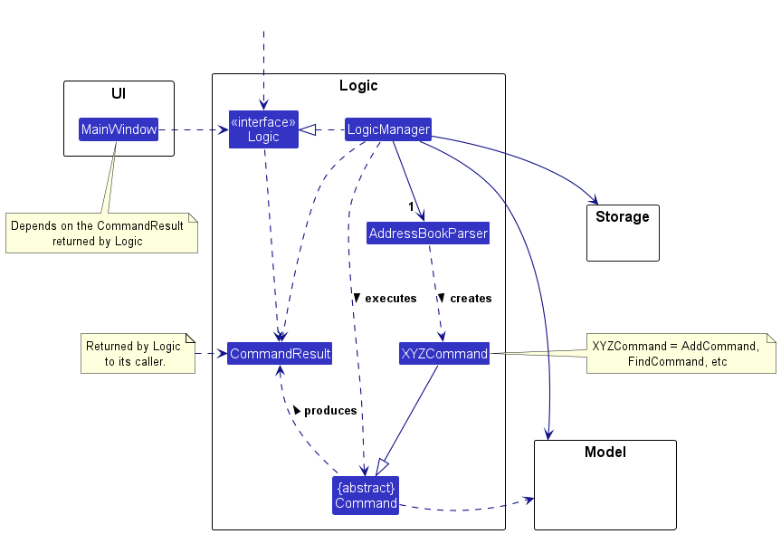
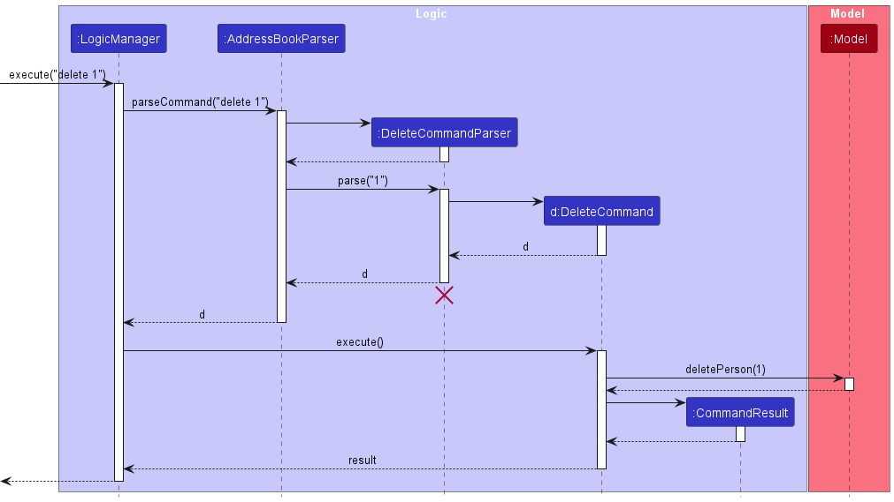
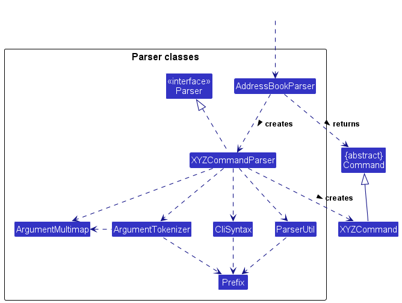

# LinkTree Developer Guide

## Table of Contents
* [Acknowledgements](#acknowledgements)
* [Setting up, getting started](#setting-up-getting-started)
* [Design](#design)
    * [Architecture](#architecture)
    * [Ui component](#ui-component)
    * [Logic component](#logic-component)
    * [Model component](#model-component)
    * [Storage component](#storage-component)
    * [Common classes](#common-classes)
* [Implementation](#implementation)
* [Add developer command](#add-a-developer)
    * [Feature usage](#usage)
    * [Feature implementation](#function-implementation)
* [Remove developer command](#remove-a-developer)
    * [Feature usage](#usage)
    * [Feature implementation](#function-implementation-1)
* [Edit developer command](#)
    * [Feature usage](#)
    * [Feature implementation](#)
* [Find developer command](#)
    * [Feature usage](#)
    * [Feature implementation](#)
* [Create team command](#)
    * [Feature usage](#)
    * [Feature implementation](#)
    * [Design considerations](#)
* [Add dev to team command](#)
    * [Feature usage](#)
    * [Feature implementation](#)
    * [Design considerations](#)
* [Delete team command](#)
    * [Feature usage](#)
    * [Feature implementation](#)
* [Remove dev from team command](#)
    * [Feature usage](#)
    * [Feature implementation](#)
* [Edit team name command](#)
    * [Feature usage](#)
    * [Feature implementation](#)
* [Edit team leader command](#)
    * [Feature usage](#)
    * [Feature implementation](#)
* [Find team command](#)
    * [Feature usage](#)
    * [Feature implementation](#)
* [List command](#)
    * [Feature usage](#)
    * [Feature implementation](#)
* [Display tree command](#)
    * [Feature usage](#)
    * [Feature implementation](#)
* [Help Command](#)
    * [Feature usage](#)
    * [Feature implementation](#)
* [Clear command](#)
    * [Feature usage](#)
    * [Feature implementation](#)
* [Documentation, logging, testing, configuration & dev-ops](#documentation-logging-testing-configuration-dev-ops)
* [Appendix A: Requirements](#appendix-a-requirements)
    * [Product Scope](#product-scope)
    * [User stories](#user-stories)
    * [Use cases](#use-cases)
    * [Non-Functional Requirements](#non-functional-requirements)
    * [Glossary](#glossary)
* [Appendix B: Instructions for manual testing](#appendix-b-instructions-for-manual-testing)
    * [Launch and shutdown](#launch-and-shutdown)
    * [Deleting a developer](#deleting-a-person)
    * [Saving data](#saving-data)
* [Appendix C: Effort](#appendix-c-effort)
* [Appendix D: Future enhancements](#appendix-d-future-enhancements)

<page-nav-print />

--------------------------------------------------------------------------------------------------------------------
 

## **Acknowledgements**

This project and developer guide is based on [_AB3_](https://github.com/se-edu/addressbook-level3)

--------------------------------------------------------------------------------------------------------------------

## **Setting up, getting started**

Refer to the guide [_Setting up and getting started_](SettingUp.md).

--------------------------------------------------------------------------------------------------------------------

## **Design**
 

### Architecture

<puml src="diagrams/ArchitectureDiagram.puml" width="280" />

The ***Architecture Diagram*** given above explains the high-level design of the App.

Given below is a quick overview of main components and how they interact with each other.

**Main components of the architecture**

**`Main`** (consisting of classes [`Main`](https://github.com/se-edu/addressbook-level3/tree/master/src/main/java/seedu/address/Main.java) and [`MainApp`](https://github.com/se-edu/addressbook-level3/tree/master/src/main/java/seedu/address/MainApp.java)) is in charge of the app launch and shut down.
* At app launch, it initializes the other components in the correct sequence, and connects them up with each other.
* At shut down, it shuts down the other components and invokes cleanup methods where necessary.

The bulk of the app's work is done by the following four components:

* [**`UI`**](#ui-component): The UI of the App.
* [**`Logic`**](#logic-component): The command executor.
* [**`Model`**](#model-component): Holds the data of the App in memory.
* [**`Storage`**](#storage-component): Reads data from, and writes data to, the hard disk.

[**`Commons`**](#common-classes) represents a collection of classes used by multiple other components.

**How the architecture components interact with each other**

The *Sequence Diagram* below shows how the components interact with each other for the scenario where the user issues the command `delete 1`.

<puml src="diagrams/ArchitectureSequenceDiagram.puml" width="574" />

Each of the four main components (also shown in the diagram above),

* defines its *API* in an `interface` with the same name as the Component.
* implements its functionality using a concrete `{Component Name}Manager` class (which follows the corresponding API `interface` mentioned in the previous point.

For example, the `Logic` component defines its API in the `Logic.java` interface and implements its functionality using the `LogicManager.java` class which follows the `Logic` interface. Other components interact with a given component through its interface rather than the concrete class (reason: to prevent outside component's being coupled to the implementation of a component), as illustrated in the (partial) class diagram below.

<puml src="diagrams/ComponentManagers.puml" width="300" />

The sections below give more details of each component.

### UI component

<puml src="diagrams/UiClassDiagram.puml" width="574" />

The **API** of this component is specified in [`Ui.java`](https://github.com/se-edu/addressbook-level3/tree/master/src/main/java/seedu/address/ui/Ui.java)

The UI consists of a `MainWindow` that is made up of parts e.g.`CommandBox`, `ResultDisplay`, `PersonListPanel`,
`StatusBarFooter` etc. All these, including the `MainWindow`, inherit from the abstract `UiPart` class which captures
the commonalities between classes that represent parts of the visible GUI.

The `UI` component uses the JavaFx UI framework. The layout of these UI parts are defined in matching `.fxml` files
that are in the `src/main/resources/view` folder. For example, the layout of the [`MainWindow`](https://github.com/se-edu/addressbook-level3/tree/master/src/main/java/seedu/address/ui/MainWindow.java) is specified in
[`MainWindow.fxml`](https://github.com/se-edu/addressbook-level3/tree/master/src/main/resources/view/MainWindow.fxml)

The `UI` component,

* executes user commands using the `Logic` component.
* listens for changes to `Model` data so that the UI can be updated with the modified data.
* keeps a reference to the `Logic` component, because the `UI` relies on the `Logic` to execute commands, and it also
displays the statistical information of how many developers and teams are there at the moment.
* depends on some classes in the `Model` component, as it displays `Person` and `Team` object residing in the `Model`.

 

### Logic component

**API** : [`Logic.java`](https://github.com/AY2324S1-CS2103T-W11-4/tp/tree/master/src/main/java/seedu/address/logic/Logic.java)

Here's a (partial) class diagram of the `Logic` component:

The display in UI is depended on the `CommandResult` returned by Logic component.
For example, UI will have a **new window** for displaying "LinkTree" if command
`Tree` is received by the Logic component.

The sequence diagram below illustrates the interactions within the `Logic` component, taking `execute("delete 1")` API call as an example.

<puml src="diagrams/DeleteSequenceDiagram.puml" alt="Interactions Inside the Logic Component for the `delete 1` Command" />

<box type="info" seamless>

**Note:** The lifeline for `DeleteCommandParser` should end at the destroy marker (X) but due to a limitation of PlantUML, the lifeline reaches the end of diagram.
</box>

How the `Logic` component works:

1. When `Logic` is called upon to execute a command, it is passed to an `AddressBookParser` object which in turn creates a parser that matches the command (e.g., `DeleteCommandParser`) and uses it to parse the command.
1. This results in a `Command` object (more precisely, an object of one of its subclasses e.g., `DeleteCommand`) which is executed by the `LogicManager`.
1. The command can communicate with the `Model` when it is executed (e.g. to delete a person).
1. The result of the command execution is encapsulated as a `CommandResult` object which is returned back from `Logic`.

Here are the other classes in `Logic` (omitted from the class diagram above) that are used for parsing a user command:

How the parsing works:
* When called upon to parse a user command, the `AddressBookParser` class creates an `XYZCommandParser` (`XYZ` is a placeholder for the specific command name e.g., `AddCommandParser`) which uses the other classes shown above to parse the user command and create a `XYZCommand` object (e.g., `AddCommand`) which the `AddressBookParser` returns back as a `Command` object.
* All `XYZCommandParser` classes (e.g., `AddCommandParser`, `DeleteCommandParser`, ...) inherit from the `Parser` interface so that they can be treated similarly where possible e.g, during testing.

 

### Model component
**API** : [`Model.java`](https://github.com/AY2324S1-CS2103T-W11-4/tp/blob/master/src/main/java/seedu/address/model/Model.java)

<puml src="diagrams/ModelClassDiagram.puml" width="450" />

The `Model` component:
* stores the addressbook and teambook date i.e., all `Person` objects and `Team` objects (which are contained in a `UniquePersonList` and `UniqueTeamList` respectively).
* maintains a filtered list of `Person`, `Team` objects and stores the currently 'selected' `Person` or `Team` objects (eg., results of a search query) as a separate filtered list which is exposed to outsiders as an unmodifiable `ObservableList<Person>` and `ObservableList<Team>` that can be observed.
* stores a `UserPref` object that represents the user’s preferences. This part is exposed to the outside as a `ReadOnlyUserPref` objects.
* does not depend on any of the other three components (as the `Model` represents data entities of the domain, this means that model should make sense on their own without depending on other components).
<box type="info" seamless>

**Note:** An alternative (arguably, a more OOP) model is given below. It has a `Tag` list in the `AddressBook`, which `Person` references. This allows `AddressBook` to only require one `Tag` object per unique tag, instead of each `Person` needing their own `Tag` objects. 

<puml src="diagrams/BetterModelClassDiagram.puml" width="450" />

</box>

 

### Storage component

**API**: [`Storage.java`](https://github.com/AY2324S1-CS2103T-W11-4/tp/blob/master/src/main/java/seedu/address/storage/Storage.java)

<puml src="diagrams/Storage.puml" width="450" />

The `Storage` component:
- Can save address book data, user preference data, and team book data in JSON format, and read them back into corresponding objects.
- Inherits from `AddressBookStorage`, `UserPrefStorage`, and `TeamBookStorage`, which means it can be treated as any one of them (if only the functionality of one is needed).
- Depends on some classes in the `Model` component (because the `Storage` component's job is to save/retrieve objects that belong to the `Model`).

### Common classes

Classes used by multiple components are in the `seedu.addressbook.commons` package.

--------------------------------------------------------------------------------------------------------------------
 

## **Implementation**

This section describes some noteworthy details on how certain features are implemented.

###  **Add a developer**

The `add` command implemented in the AddCommand class, allows users to add new developers to the addressbook. This command extends the`Command` class.

#### Usage
Given below is an example usage scenario and how the function behaves at each step.

- **Command Syntax**: `add n/[Developer Name] p/[Phone Number] e/[Email] a/[Address] (OPTIONAL r/[Remark] t/Tags)`
- **Example**: `add n/John Doe p/98765432 e/johnd@example.com a/311, Clementi Ave 2, #02-25 r/likes to swim`
  - Adds a developer called John to the addressbook with the given details(provided there isn't already another developer with the same name).

LinkTree provides a feedback based on whether the operation was successful or not.

<box type="info" seamless>

**Note:** If a command fails its execution, it will not call `Model#addPerson()`, so the `developer` will not be saved to `AddressBook`.

</box>

#### Function Implementation

- AddCommandParser class parses the inputs and checks if the command format is given correctly. It throws an exception if there is any format mismatch.
- The `execute` method in AddCommand class first checks if a developer with the specified name already exists in the addressbook. It throws an exception if this is true.
- Upon successful execution of the `execute` method, a message is displayed to the user confirming that a new developer has been added to the addressbook.

 

###  **Remove a developer**

The `delete` command implemented in the DeleteCommand class, allows users to remove developers from the addressbook. This command extends the`Command` class.

#### Usage
Given below is an example usage scenario and how the function behaves at each step.

- **Command Syntax**: `delete [index]`
- **Example**: `delete 1`
  - Deletes a developer with the given index number.

LinkTree provides a feedback based on whether the operation was successful or not.

<box type="info" seamless>

**Note:** The index should be a postive integer. The command will succeed only if such a positive integer is a valid index in the addressbook.

</box>

#### Function Implementation

- DeleteCommandParser class parses the inputs and checks if the command format is given correctly. It throws an exception if there is any format mismatch.
- The `execute` method in DeleteCommand class first checks if the given index is valid. It throws an exception if this is false.
- After mapping the given index to the correct developer, checks are done to see if this developer is a teamleader of any team. If they are currently a teamleader, this developer cannot be deleted. An exception is thrown to notify the user of the same. The `Model#developerIsTeamLeader()` method carries out this check.
- The `execute` command also checks if this developer is part of any team. If yes, they are deleted from all such teams that they are a developer in. This is carried out by the `Model#removeDeveloperFromAllTeams()` method.
- Upon successful execution of the `execute` method, a message is displayed to the user confirming that the developer has been deleted, and also been removed from all teams(if any).

 

###  **Edit a developer**

The add developer feature is facilitated by the AddCommand. It extends `Command` class.

The operations are exposed in the `Model` interface as `Model#addTeam()`.

#### Usage
Given below is an example usage scenario and how the function behaves at each step.

Step 1. The user launches the application and uses the `newteam` command and specifies a `teamname` and `teamLeader` name.

Step 2. The user executes the `newteam` command `newteam tn/Team1 tl/John` to create a new team `Team1` with `John` set as team leader.

Step 3. LinkTree provides a feedback based on whether the operation was successful or not.

<box type="info" seamless>

**Note:** If a command fails its execution, it will not call `Model#addTeam()`, so the `team` will not be saved to `TeamBook`.

</box>

#### Function Implementation

(Add basic implementation here)

 

### **Find a developer**

#### Introduction
The `FindCommand` class, enables keyword-based searches for individuals. This intuitive command extends `Command` and utilizes `NameContainsKeywordsPredicate`.

#### Usage
- **Syntax**: `find KEYWORD [MORE_KEYWORDS]...`
- **Example**: `find Alice Bob`
  - Searches for entries containing 'Alice', 'Bob', or both.

##### Function implementation

- **Execution**: `FindCommand.execute` filters entries using the provided keywords and returns a `CommandResult` with the count of matches.
- **Filtering**: Uses `NameContainsKeywordsPredicate` to identify matching entries based on names or descriptions.

##### Design and Functionality

- **Flexibility**: Supports partial keyword matching for broader search results, accommodating memory gaps or partial information.
- **User Experience**: Case-insensitive search enhances usability.
- **Error Handling**: Provides clear feedback for invalid inputs or no keyword scenarios.

##### Considerations

- **Search Methodology**:
- **Partial Keyword Matching**: Default choice for its user-friendly approach and broader match potential.

###  **List a developer** (Optional to show implementation?)

The add developer feature is facilitated by the AddCommand. It extends `Command` class.

The operations are exposed in the `Model` interface as `Model#addTeam()`.

#### Usage
Given below is an example usage scenario and how the function behaves at each step.

Step 1. The user launches the application and uses the `newteam` command and specifies a `teamname` and `teamLeader` name.

Step 2. The user executes the `newteam` command `newteam tn/Team1 tl/John` to create a new team `Team1` with `John` set as team leader.

Step 3. LinkTree provides a feedback based on whether the operation was successful or not.

<box type="info" seamless>

**Note:** If a command fails its execution, it will not call `Model#addTeam()`, so the `team` will not be saved to `TeamBook`.

</box>

#### Function Implementation

(Add basic implementation here)

 

###  **Create a new team**

The `newteam` command implemented in the AddTeamCommand class, allows users to create new teams which are added to the teambook. This command extends the`Command` class.

#### Usage
Given below is an example usage scenario and how the function behaves at each step.

- **Command Syntax**: `newteam tn/[TEAMNAME] tl/[TeamLeader]`
- **Example**: `newteam tn/Test Team 1 tl/John`
  - Creates a new team called `Test Team 1` with `John` as the leader.

LinkTree provides a feedback based on whether the operation was successful or not.

<box type="info" seamless>

**Note:** If a command fails its execution, it will not call `Model#addTeam()`, so the `team` will not be saved to `TeamBook`.

</box>

#### Function Implementation

- The `AddTeamCommandParser` class parses inputs from the users and checks if the command is in the correct format. An exception is thrown if there is any format mismatch.
- The `execute` method checks if the specified teamname has already been taken up by another team. If yes, an exception is thrown to indicate this. The `Model#hasTeam` does this check.
- The `execute` method also checks if a developer with the given name exists. If no such developer exists, an error message is displayed to indicate this. The `Model#containsPerson` does this check.
- If no exception is thrown, a new team with specified `teamname` is created and the developer with given name is set as `teamleader`. The `Model#addTeam` carries out this process.
- A message is displayed to the user to indicate that the team has been created. It can immediately be seen at the bottom of the TeamList in the UI.

<puml src="diagrams/AddTeamCommandDiagram.puml" width="574" />

#### Design considerations:

**Aspect: Where the team is stored:**

* **Alternative 1 (current choice):** Store the teams in a separate class called UniqueTeamList.
  * Pros: Better use of OOP.
  * Cons: Multiple layers of abstraction(through Model, TeamBook, UniqueTeamList).

* **Alternative 2:** Store the teams in the same class as Persons in the class AddressBook.
  * Pros: Easier implementation.
  * Cons: Breaks principle of abstraction and OOP. Information hiding is also not done.

 

###  **Add developers to an existing team**

The `dev2team` command implemented in the AddDevToTeamCommand class, allows users to add developers to an existing team in the teambook. This command extends the`Command` class.

#### Usage
Given below is an example usage scenario and how the function behaves at each step.

- **Command Syntax**: `dev2team tn/[TEAMNAME] n/[Developer name]`
- **Example**: `dev2team tn/Test Team 1 tl/Jason`
  - Adds `Jason` to a team called `Test Team 1

LinkTree provides a feedback based on whether the operation was successful or not.

<box type="info" seamless>

**Note:** If a command fails its execution, it will not call `Model#addToTeam()`, so the specified `developer` will not be added to the `team`.

</box>

#### Function Implementation

- The `AddDevToTeamParser` class parses inputs from the users and checks if the command is in the correct format. An exception is thrown if there is any format mismatch.
- The `execute` method checks if the specified teamname is valid and exists in the teambook. If no, an exception is thrown to indicate this. The `Model#invalidAddToTeam` does this check.
- The `execute` method also checks if a developer with the given name exists. If no such developer exists, an error message is displayed to indicate this. The `Model#containsPerson` does this check.
- In addition, the `execute` method also checks if the given developer is already a teamleader in the same team or already exists as a developer in that team. In both cases, the `excecute` method will throw an exception indicating these scenarios. The `Model#personAlreadyInTeam` and `Model#isLeaderOfTeam` methods carry out these checks.
- If no exception is thrown, the developer is added to the team. This process is carried out by the `Model#addToTeam`
- A message is displayed to the user to indicate that the developer has been added to the team. The change can immediately be seen on the TeamBook part of the UI.

<puml src="diagrams/AddDevToTeamCommandDiagram.puml" width="1100"/>

#### Design considerations:

**Aspect: Can a team leader also be a developer in his team? :**

* **Alternative 1 (current choice):** Team leader of a team cannot be added as a developer in his team.

* **Alternative 2:** Store the teams in the same class as Persons in the class AddressBook.
* Generally, though a team leader also works on the code that he is in charge of, adding himself as a developer in the team that he manages would be redundant. Hence we settled with this current design.

 

### **Remove an existing Team**

Removing an existing team feature is facilitated by the `DeleteTeamCommand`. It extends the `Command` class.

The operations are exposed in the `Model` interface as `Model#deleteTeam()`.

#### Usage

Given below is an example usage scenario and how the "Remove an existing team" feature behaves at each step.

##### Step 1

The user launches the application and uses the `deleteteam` command to specify the `teamname` they want to delete.

##### Step 2

The user executes the `deleteteam` command `deleteteam tn/Team1` to delete the team named `Team1`.

##### Step 3

LinkTree provides feedback based on whether the operation was successful or not.

**Note:** If a command fails its execution, it will not call `Model#deleteTeam()`, so the team will not be removed from `TeamBook`.

#### Function Implementation

1. Create a `deleteteam` parser class called `DeleteTeamCommandParser` to parse input from the user. This class implements the `Parser` interface for the type `DeleteTeamCommand`.

2. Create a `parse` method in `DeleteTeamCommandParser` that parses the user input and specifies the user flag used for `teamName` (e.g., `tn/` for teamName).

3. Add the flag for user input to the `CliSyntax` class.

4. For the `DeleteTeamCommand` class, specify the Command Word, which is `deleteteam`.

5. Add relevant error messages for use cases like "The team name provided is invalid".

6. Implement the `execute` method in `DeleteTeamCommand`. Handle cases where a team with the specified `teamName` does not exist.

7. Use the `Model#deleteTeam` method to perform these checks.

8. Throw exceptions in the case where deleting the team is not possible.

9. If no such exception is thrown, proceed to delete the team.

10. Run the `Model#deleteTeam` method to remove the specified team from TeamBook.

11. `Model#deleteTeam` calls `TeamBook#removeTeamByName`, which in turn calls `UniqueTeamList#remove`. Finally, this method calls `ObservableList#remove` to remove the team from the list.

#### Design Considerations

**Aspect: Where the teams are stored:**

- **Alternative 1 (current choice):** Store the teams in a separate class called `UniqueTeamList`.

    - Pros: Better use of object-oriented programming.
    - Cons: Multiple layers of abstraction (through Model, TeamBook, UniqueTeamList).

- **Alternative 2:** Store the teams in the same class as persons in the `AddressBook` class.

    - Pros: Easier implementation.
    - Cons: Breaks the principle of abstraction and object-oriented programming. Information hiding is also not maintained.

The choice between these alternatives depends on your specific project requirements and architectural preferences.

### Find Team by Keywords

The `findteam` command, implemented in the `FindTeamCommand` class, allows users to search for teams using keywords. This command extends the `Command` class and uses `TeamContainsKeywordsPredicate` for keyword-based filtering.

#### Usage
- **Command Syntax**: `findteam KEYWORD [MORE_KEYWORDS]...`
- **Example**: `findteam alpha beta gamma`
    - Finds all teams whose names contain any of the specified keywords (case-insensitive).

#### Implementation Steps

##### Command Execution
- `FindTeamCommand.execute` uses `model.updateFilteredTeamList(predicate)` to filter teams and produces a `CommandResult` based on the number of matching teams.

##### Predicate for Filtering
- `TeamContainsKeywordsPredicate` checks if a team's name contains the specified keywords, utilized in `FindTeamCommand` for filtering.

#### Function Implementation

- **Handling No Keywords**: Throws `ParseException` when no keywords are provided, guiding users on correct usage.
- **Case Insensitivity**: Enhances user experience and search flexibility.
- **Partial vs. Full Match**: Allows partial matching for broader search results. Full match was considered but not implemented due to its restrictive nature.

1. **Parser Class Creation**: `FindTeamCommandParser` for parsing user input.
2. **Parse Method**: Parses input and handles the format of keywords.
3. **Command Class Specification**: `FindTeamCommand` with command word `findteam`.
4. **Execution Method**: Implements logic for filtering and displaying search results.
5. **Model Interaction**: Utilizes `Model#updateFilteredTeamList` and `Model#getFilteredTeamList`.

<puml src="diagrams/FindTeamCommandDiagram.puml" width="1100"/>

##### Design Considerations

**Aspect: Search Methodology**
In designing the `findteam` command, two primary alternatives for matching team names with user-provided keywords were evaluated:

- **Alternative 1 (Current Choice): Partial Keyword Matching**
    - **Description**: Matches teams whose names contain the provided keywords as substrates, e.g., 'alpha' matches 'Alpha Team', 'Alphabeta', and 'Gamma Alpha'.
    - **Pros**:
        - **Broader Search Results**: Captures a wider range of potential matches.
        - **User-Friendly**: Accommodates partial information or memory gaps.
    - **Cons**:
        - **Over-Inclusive**: May return too many irrelevant results.
        - **Ambiguity**: Potential confusion with similar substrings in names.

- **Alternative 2: Full Keyword Matching**
    - **Description**: Requires an exact match between the keywords and the team names.
    - **Pros**:
        - **Precision**: Offers precise search results.
        - **Clarity**: Reduces ambiguity in the search results.
    - **Cons**:
        - **Restrictive**: Limits effectiveness for users who don't recall exact names.
        - **User Unfriendliness**: Requires exact input.

_{more aspects and alternatives to be added}_

### \[Proposed\] Data archiving

_{Explain here how the data archiving feature will be implemented}_

--------------------------------------------------------------------------------------------------------------------

## **Documentation, logging, testing, configuration, dev-ops**

* [Documentation guide](Documentation.md)
* [Testing guide](Testing.md)
* [Logging guide](Logging.md)
* [Configuration guide](Configuration.md)
* [DevOps guide](DevOps.md)

--------------------------------------------------------------------------------------------------------------------

## **Appendix A: Requirements**

### Product scope

**Target user profile**:

* Project managers engaged in software projects at the startup/small level companies;
* Collaborates frequently with multiple teams or departments;
* Requires quick access to contact details of other team members based on their roles and responsibilities;
* Prefers an organized and streamlined method for contact management;
* Tech-savvy and open to adopting new tools for enhancing productivity.

**Value proposition**: LinkTree is the top contact solution for software professionals. Using our unique tag-based system, access contacts by roles and responsibilities instantly. With LinkTree, swiftly connect with the right stakeholder, ensuring smooth project execution and superior collaboration.

### User stories

Priorities: High (must have) - `* * *`, Medium (nice to have) - `* *`, Low (unlikely to have) - `*`

| Priority | As a …          | I want to …                                                   | So that I can…​                                                           |
|----------|-----------------|---------------------------------------------------------------|---------------------------------------------------------------------------|
| `* * *`  | project manager | view all members of my project                                | get their email address/contact                                           |
| `* * *`  | project manager | search contacts using a tag-based system                      | swiftly find contacts relevant to specific responsibilities               |
| `* * *`  | project manager | view the leader of any team                                   | contact him when I want to find out about the status of a task            |
| `* *`    | project manager | edit or update my information                                 | easily update my info                                                     |
| `* *`    | project manager | search contact with partial information                       | find the person without remembering their full name                       |
| `* *`    | project manager | add a tag/short bio about every developer                     | I can know the specialities/traits of every developer                     |
| `* * *`  | project manager | access the names of all my developers                         | contact them regarding the project                                        |
| `* * *`  | project manager | view all my team leaders                                      | contact them when collaborating on developing a certain feature           |
| `* * *`  | project manager | assign a node for a team leader                               | target team leaders can fill in their information by themselves           |
| `* * *`  | project manager | remove another user                                           | if he leaves the team/company                                             |
| `*`      | project manager | archive old contacts or groups                                | keep active list clutter-free while retaining old information             |
| `*`      | project manager | get notifications on birthdays                                | maintain relationships through personal touches                           |
| `*`      | project manager | create a public profile for my project                        | external stakeholders can find and reach out to the right member          |
| `* * *`  | project manager | use a help command                                            | understand available functions of the app                                 |
| `* *`    | project manager | use a bye command                                             | close the app easily                                                      |
| `*`      | project manager | receive request to change contact information                 | stay updated on team changes                                              |
| `* * *`  | project manager | view my teams and all members in my organisation side by side | have a glance at the current structure of my organisation                 |
| `* * *`  | project manager | remove all the users and teams                                | create a new project with new team members.                               |
| `* * *`  | project manager | create a new team                                             | reflect the changes done in actual project structure accurately           |
| `* * *`  | project manager | add new developers after a team is created                    | reflect the growth in size of my teams                                    |
| `* * *`  | project manager | remove developers from a team                                 | keep my information up to date when a developer shifts to another project |
| `* * *`  | project manager | receive request to change contact information                 | stay updated on team changes                                              |

### Use cases

(For all use cases below, the **System** is the `LinkTree` and the **Actor** is the `user`, unless specified otherwise)

**Use case: View all members of my project**
**Actor: Project Manager**

**MSS**

1. Project manager requests to list members.
2. LinkTree displays a list of team members.
3. Project manager views the members' contact information.

    Use case ends.

**Extensions**

* 2a. The member list is empty.
  * 2a1. LinkTree indicates there are no members currently.
    Use case ends.

---

**Use case: Search for team leaders**
**Actor: Project Manager **

**MSS**

1. User wants to find team leader of a given team.
2. User inputs the desired team name into LinkTree.
3. LinkTree displays the name of the team leader.

    Use case ends.

**Extensions**

* 2a. No such team exists
  * 2a1. LinkTree shows a message that no such team exists.
    Use case ends.

---

**Use case: Access names of developers**
**Actor: Project Manager**

**MSS**

1. Project manager requests a list of all developers.
2. LinkTree displays the list of developers.

    Use case ends.

---

**Use case: Edit or update information**
**Actor: Project Manager**

**MSS**

1. User wants to update the contact info of a developer.
2. User provides the name of person and info to edit
3. LinkTree confirms the updates.

    Use case ends.

**Extensions**

* 2a. No such person exists
    * 2a1. LinkTree shows a message that no such person exists.
      Use case ends.

---

**Use case: Change the team leader**
**Actor: Project Manager**

**MSS**

1. Project manager wants to change the team leader of a team.
2. Project manager selects the team and provides a new team leader name.
3. LinkTree confirms the change.

    Use case ends.

**Extensions**

* 2a. No such team exists
    * 2a1. LinkTree shows a message that no such team exists.
      Use case ends.
  2b. No such person exists
    * 2b1. LinkTree shows a message that no such person exists.
    * Use case ends.
---

**Use case: Remove a person from project**
**Actor: Project Manager**

**MSS**

1. Project manager wants to remove a person from project.
2. Project manager provides name and requests the removal.
3. LinkTree confirms the removal of the person.

    Use case ends.

**Extensions**

* 2a. No such person exists
    * 2a1. LinkTree shows a message that no such person exists.
      Use case ends.

---

**Extensions**

* 2a. No such team exists
    * 2a1. LinkTree shows a message that no such team exists.
      Use case ends.

---

---

**Use case: Create a new team**

**MSS**

1. User provides a team name and team leader name.
2. LinkTree creates team with given name and with team leader set to the provided name.
3. LinkTree confirms creation of team

    Use case ends.

**Extensions**

* 1a. Team already exists
    * 1a1. LinkTree shows a message that you are trying to create a duplicate team.
      Use case ends.
  * 1b. No such person with given name exists
      * 1b1. LinkTree shows a message that the person you are trying to set as team leader does not exist.
        Use case ends.
---

**Use case: Display the tree of organisation**

**MSS**

1. User requests for tree to be shown.
2. LinkTree displays existing tree
3. User views the tree.

    Use case ends.

4. **Extensions**

* 1a. Tree is empty
    * 1a1. LinkTree shows a message that the tree is empty.
      Use case ends.
---

### Non-Functional Requirements

1.  Should work on any _mainstream OS_ as long as it has Java `11` or above installed.
2.  Should be able to hold up to 500 persons without a noticeable sluggishness in performance for typical usage.
3.  A user with above average typing speed for regular English text (i.e. not code, not system admin commands) should be able to accomplish most of the tasks faster using commands than using the mouse.
4.  Should be able to generate output in less than 5 seconds.
5. Should be able to show correct input format in case the user enters the input in wrong format.
6. The system should be usable by a new project manager who has not used such a software before.

### Glossary

* **Mainstream OS**: Windows, Linux, Unix, OS-X
* **Private contact detail**: A contact detail that is not meant to be shared with others
* **Team Directory**: The system or platform where all the contact details of developers, team leaders, and project managers are stored.
* **Tag-Based System**: A system in LinkTree that allows contacts to be tagged with specific roles or responsibilities, like "Database Management" or "Code Review".
* **Public Profile**: A profile in the Team Directory visible to all users, containing non-sensitive information about a team or individual.
* **Status Feature**: A tool enabling users to set and display their current status or availability (e.g., online, busy, away) within the Team Directory.
* **Inventory Checking**: A feature that logs the state of an item (like an apartment) at a specific time, allowing for easy comparison at a later date.

--------------------------------------------------------------------------------------------------------------------

## **Appendix B: Instructions for manual testing**

Given below are instructions to test the app manually.

<box type="info" seamless>

**Note:** These instructions only provide a starting point for testers to work on;
testers are expected to do more *exploratory* testing.

</box>

### Launch and shutdown

1. Initial launch

   1. Download the jar file and copy into an empty folder

   1. Double-click the jar file Expected: Shows the GUI with a set of sample contacts. The window size may not be optimum.

1. Saving window preferences

   1. Resize the window to an optimum size. Move the window to a different location. Close the window.

   1. Re-launch the app by double-clicking the jar file. 
       Expected: The most recent window size and location is retained.

1. _{ more test cases …​ }_

### Deleting a person

1. Deleting a person while all persons are being shown

   1. Prerequisites: List all persons using the `list` command. Multiple persons in the list.

   1. Test case: `delete 1` 
      Expected: First contact is deleted from the list. Details of the deleted contact shown in the status message. Timestamp in the status bar is updated.

   1. Test case: `delete 0` 
      Expected: No person is deleted. Error details shown in the status message. Status bar remains the same.

   1. Other incorrect delete commands to try: `delete`, `delete x`, `...` (where x is larger than the list size) 
      Expected: Similar to previous.

1. _{ more test cases … }_

### Saving data

1. Dealing with missing/corrupted data files

   1. _{explain how to simulate a missing/corrupted file, and the expected behavior}_

1. _{ more test cases … }_

## **Appendix C: Effort**

### Overview

Our team managed to create this application LinkTree, which is designed to assist **project managers** and **developers** in startups. LinkTree aims to streamline team management, drawing inspiration from the existing AB3 features and introducing unique elements tailored to the needs of project managers and developers. The use of a distinctive tree structure allows startups to easily locate the right person at the right time.

### Challenges and Solutions:

We have made the following efforts to tackle the challenges we faced in this project. With constant discussion among our team members we managed to come with solutions for each problem.
1. **Modification of Storage Structure:**
    - **Challenge:** Initially, we encountered difficulties in modifying the storage structure to accommodate two JSON files - address book to manage developers and team book to manage the teams.
    - **Solution:** We conducted thorough research and discussions to design a storage system that efficiently separated the address book and team book data. Implementation involved understanding various UML diagrams, and AB3's implementation of addressbook.

2. **Integration of Team Management Features:**
    - **Challenge:** Adapting the existing AB3 features, such as `add`, `delete`, `edit`, `find`, and `list`, to incorporate our team management implementation posed a significant challenge.
    - **Solution:** Through collaborative efforts, we systematically modified each feature to support team-related functionalities. This involved adjusting data manipulation logic, modifying diagrams, and providing new user interfaces for team-related operations.

3. **Upgrading the User Interface:**
    - **Challenge:** Changing the existing UI to display the details of team members was another challenge that we encounterd in this project.
    - **Solution:** We have decided to create a new panel beside developers panel to display the team name, team leader name and developer names in the team.

4. **Design and Implementation of Tree Structure:**
    - **Challenge:** Designing the tree structure for effective team hierarchy was a conceptual challenge. The practical implementation proved more complex than anticipated.
    - **Solution:** After finalizing the conceptual design, we engaged in iterative development and testing. Refinements were made to the implementation based on feedback, resulting in a simple tree structure that displays all the developers and teams in the addressbook and teambook.

5. **Testing and Documentation:**
    - **Challenge:** The final stages of testing and documentation required meticulous attention to detail and comprehensive coverage.
    - **Solution:** We established a comprehensive testing framework, including unit tests, integration tests, and user acceptance testing to maximise our test coverage. Documentation was created concurrently with development, ensuring that each feature, modification, and usage scenario was well-documented for our target users.

### Results and Achievements

1. **Timely Feature Implementation:** All planned features, including the innovative tree structure, were successfully implemented within the given deadline.

2. **Effective Tree Structure and UI Implementation:** The implementation of the unique tree structure proved to be a success and  providing an intuitive UI was one of the efficient way to manage teams within the application.

3. **Testing Process:** We have done enough testing procedures to ensure the reliability and stability of the application. This included unit testing, integration testing, and user acceptance testing that we have learnt CS2103T.

## **Appendix D: Future Enhancements**
**We have several feature enhancements and quality of life improvements in the pipeline.**
**Some of them are as follows:**

1. Currently, a new person can be added to the addressbook if they have the same phone number of email as another existing person. We plan to fix this in a future release to make sure that persons with the same phone number/email as an existing person cannot be added even if they have a different name.
2. Currently, when the tree is displayed, if there are not enough teams to display to fill the windows, a white background fills up the empty space by default. This will be patched in a future release so that the empty space will carry the same default colour as the UI.
3. Currently, when the tree is actively being displayed, it does not get refreshed when commands are run. For example, when a new developer is added to the addressbook, it does not reflect on the tree even though there is a feedback in the UI stating success. The tree gets refreshed only upon closing and reopening the tree. The auto-refresh feature will be implemented in a future release.
4. When `delete 0` command is run, the command error stating `invalid command format` is too general. Even though it specifies that the index has to be a positive integer, we can change it in the future to give better information to specify that the index number has to be positive. So when typing this command, the new error would be like `Index provided is incorrect. It has to be a positive integer. Please try again.`
5. Currently, the `help` command displays some of the most commonly used commands and their formats. Some commands like `findteam` and `hi` are not mentioned here. A future version of LinkTree will have a more comprehensive command summary page that will include all the valid commands and their formats.
