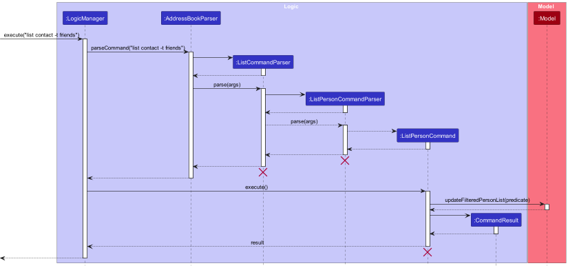
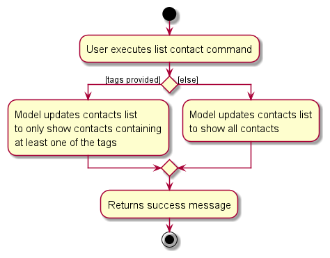

# KeepInTouch Developer Guide

<!-- * Table of Contents -->
<page-nav-print />

--------------------------------------------------------------------------------------------------------------------

## **Acknowledgements**

_{ list here sources of all reused/adapted ideas, code, documentation, and third-party libraries -- include links to the original source as well }_

--------------------------------------------------------------------------------------------------------------------

## **Setting up, getting started**

Refer to the guide [_Setting up and getting started_](SettingUp.md).

--------------------------------------------------------------------------------------------------------------------

## **Design**

### Architecture

<puml src="diagrams/ArchitectureDiagram.puml" width="280" />

The ***Architecture Diagram*** given above explains the high-level design of the App.

Given below is a quick overview of main components and how they interact with each other.

**Main components of the architecture**

**`Main`** (consisting of classes [`Main`](https://github.com/AY2324S1-CS2103T-W16-1/tp/tree/master/src/main/java/seedu/address/Main.java) and [`MainApp`](https://github.com/ay2324s1-cs2103t-w16-1/tp/blob/master/src/main/java/seedu/address/MainApp.java)) is in charge of the app launch and shut down.
* At app launch, it initializes the other components in the correct sequence, and connects them up with each other.
* At shut down, it shuts down the other components and invokes cleanup methods where necessary.

The bulk of the app's work is done by the following four components:

* [**`UI`**](#ui-component): The UI of the App.
* [**`Logic`**](#logic-component): The command executor.
* [**`Model`**](#model-component): Holds the data of the App in memory.
* [**`Storage`**](#storage-component): Reads data from, and writes data to, the hard disk.

[**`Commons`**](#common-classes) represents a collection of classes used by multiple other components.

**How the architecture components interact with each other**

The *Sequence Diagram* below shows how the components interact with each other for the scenario where the user issues the command `delete contact 1`.

<puml src="diagrams/ArchitectureSequenceDiagram.puml" width="574" />

Each of the four main components (also shown in the diagram above),

* defines its *API* in an `interface` with the same name as the Component.
* implements its functionality using a concrete `{Component Name}Manager` class (which follows the corresponding API `interface` mentioned in the previous point.

For example, the `Logic` component defines its API in the `Logic.java` interface and implements its functionality using the `LogicManager.java` class which follows the `Logic` interface. Other components interact with a given component through its interface rather than the concrete class (reason: to prevent outside component's being coupled to the implementation of a component), as illustrated in the (partial) class diagram below.

<puml src="diagrams/ComponentManagers.puml" width="300" />

The sections below give more details of each component.

### UI component

The **API** of this component is specified in [`Ui.java`](https://github.com/AY2324S1-CS2103T-W16-1/tp/blob/master/src/main/java/seedu/address/ui/Ui.java)

<puml src="diagrams/UiClassDiagram.puml" alt="Structure of the UI Component"/>

The UI consists of a `MainWindow` that is made up of parts e.g.`CommandBox`, `ResultDisplay`, `PersonListPanel`, `StatusBarFooter` etc. All these, including the `MainWindow`, inherit from the abstract `UiPart` class which captures the commonalities between classes that represent parts of the visible GUI.

The `UI` component uses the JavaFx UI framework. The layout of these UI parts are defined in matching `.fxml` files that are in the `src/main/resources/view` folder. For example, the layout of the [`MainWindow`](https://github.com/AY2324S1-CS2103T-W16-1/tp/tree/master/src/main/java/seedu/address/ui/MainWindow.java) is specified in [`MainWindow.fxml`](https://github.com/AY2324S1-CS2103T-W16-1/tp/tree/master/src/main/resources/view/MainWindow.fxml)

The `UI` component,

* executes user commands using the `Logic` component.
* listens for changes to `Model` data so that the UI can be updated with the modified data.
* keeps a reference to the `Logic` component, because the `UI` relies on the `Logic` to execute commands.
* depends on some classes in the `Model` component, as it displays `Person` object residing in the `Model`.

### Logic component

**API** : [`Logic.java`](https://github.com/AY2324S1-CS2103T-W16-1/tp/tree/master/src/main/java/seedu/address/logic/Logic.java)

Here's a (partial) class diagram of the `Logic` component:

<puml src="diagrams/LogicClassDiagram.puml" width="550"/>

The sequence diagram below illustrates the interactions within the `Logic` component, taking `execute("delete contact 1")` API call as an example.

<puml src="diagrams/DeleteSequenceDiagram.puml" alt="Interactions Inside the Logic Component for the `delete contact 1` Command" />

<box type="info" seamless>

**Note:** The lifeline for `DeleteCommandParser` should end at the destroy marker (X) but due to a limitation of PlantUML, the lifeline reaches the end of diagram.
</box>

How the `Logic` component works:

1. When `Logic` is called upon to execute a command, it is passed to an `AddressBookParser` object which in turn creates a parser that matches the command (e.g., `DeleteCommandParser`) and uses it to parse the command.
1. This results in a `Command` object (more precisely, an object of one of its subclasses e.g., `DeleteCommand`) which is executed by the `LogicManager`.
1. The command can communicate with the `Model` when it is executed (e.g. to delete a person).
1. The result of the command execution is encapsulated as a `CommandResult` object which is returned back from `Logic`.

Here are the other classes in `Logic` (omitted from the class diagram above) that are used for parsing a user command:

<puml src="diagrams/ParserClasses.puml" width="600"/>

How the parsing works:
* When called upon to parse a user command, the `AddressBookParser` class creates an `XYZCommandParser` (`XYZ` is a placeholder for the specific command name e.g., `AddCommandParser`) which uses the other classes shown above to parse the user command and create a `XYZCommand` object (e.g., `AddCommand`) which the `AddressBookParser` returns back as a `Command` object.
* All `XYZCommandParser` classes (e.g., `AddCommandParser`, `DeleteCommandParser`, ...) inherit from the `Parser` interface so that they can be treated similarly where possible e.g, during testing.
* Some commands contains secondary command, like `add contact`, `add note` and `add event`.
*   - In this case, the primary command parser (in the example it is `AddCommand`) will check the secondary command word and use the correspond secondary command parser (like `AddPersonCommandParser`, `AddEventCommandParser` and `AddNoteCommandParser`) to continue parsing the command.
* The parser will turn the arguments in the command from raw `String` into corresponding Object. During this process, the parser also needs to check whether the arguments are valid or not.
*   - The parsing method for each types of arguments are mainly in `ParserUtil.java`
* If the command is correct in format, the parser will then return a Command Object for the execution of the command.

### Model component
**API** : [`Model.java`](https://github.com/AY2324S1-CS2103T-W16-1/tp/tree/master/src/main/java/seedu/address/model/Model.java)

<puml src="diagrams/ModelClassDiagram.puml" width="600" />

The `Model` component,

* stores the address book data i.e., all `Person` objects (which are contained in a `UniquePersonList` object).
* stores the currently 'selected' `Person` objects (e.g., results of a search query) as a separate _filtered_ list which is exposed to outsiders as an unmodifiable `ObservableList<Person>` that can be 'observed' e.g. the UI can be bound to this list so that the UI automatically updates when the data in the list change.
* stores a `UserPref` object that represents the user’s preferences. This is exposed to the outside as a `ReadOnlyUserPref` objects.
* does not depend on any of the other three components (as the `Model` represents data entities of the domain, they should make sense on their own without depending on other components)

### Storage component

**API** : [`Storage.java`](https://github.com/AY2324S1-CS2103T-W16-1/tp/tree/master/src/main/java/seedu/address/storage/Storage.java)

<puml src="diagrams/StorageClassDiagram.puml" width="550" />

The `Storage` component,
* can save both address book data and user preference data in JSON format, and read them back into corresponding objects.
* inherits from both `AddressBookStorage` and `UserPrefStorage`, which means it can be treated as either one (if only the functionality of only one is needed).
* depends on some classes in the `Model` component such as `Person`, `Note`, and `Event` because the `Storage` component's job is to save/retrieve objects that belong to the `Model`.

### Common classes

Classes used by multiple components are in the `seedu.addressbook.commons` package.

--------------------------------------------------------------------------------------------------------------------

## **Implementation**

This section describes some noteworthy details on how certain features are implemented.

### List Contact with Tags feature

This feature allows users to filter the contact list by tags. It serves as an effective way to search through a long list of contacts.
The filtered contact list will then be reflected in the UI, which is facilitated by the `Model` interface through this following operation:

* `Model#updateFilteredPlanList(Predicate)` - Filters the contact list based on the predicate input.

The execution of the list command starts with parsing the arguments using `ListCommandParser` and `ListPersonCommandParser`
, which then the `ListContactCommand` result will be executed and reflected in the UI.

#### Implementing `ListPersonCommandParser`

Using the `Parser` interface, it first checks for tags in the command.
These tags will then be parsed into a `Set` and passed on to create `ListPersonCommand` object.
An empty set will be passed in the case where no tags are given.

#### Implementing `ListPersonCommand`

From the `Set<tag>` passed to construct the `ListPersonCommand` object, the `Set` can be empty or non-empty.
This is how the `execute` method is implemented:

* In the case where the `Set` is empty, it will simply use `Model#updateFilteredPlanList(Predicate)`
  where the predicate will be `PREDICATE_SHOW_ALL_PERSONS` which will show the entire contact list.

* In the case where the `Set` is not empty (there are tag inputs),
  the `Predicate` used in `Model#updateFilteredPlanList(Predicate)` will be
  checking whether one of the tags in the contact is in the `Set`.
  This will result in showing only the contacts with at least one of the tags from the `Set`.

Given below is an example usage scenario and how the `list contact` command mechanism behaves at each step.

Step 1. The user launches the application, it will show the list of all contacts.

Step 2. The user executes `list contact -t friends` command
to list only the contacts containing the tag friends.
As described by the above implementations, a `ListPersonCommand` object will be created.

Step 3. The `LogicManager` will call `ListPersonCommand#execute`
where it will then call `Model#updateFilteredPlanList(Predicate)` and return the `CommandResult`.

Step 4. The filtered list and success message will be reflected in the UI.

The following sequence diagram shows how the `list contact` command works:

The following activity diagram shows how the `list contact` command works:

### Tag feature
This feature allows users to add and remove `Tag` to any `Person` in the contact list. It provides an easy way for users to catrgorize their contacts.

#### Overview:
The adding and removing of `Tag` begins with the parsing of the `AddTagCommand` and `DeleteTagCommand` using the `AddTagCommandParser` and `DeleteTagCommandparser` respectively. The `AddTagCommand` and `DeleteTagCommand` will then be executed by the `Model`.

The activity diagram below shows the action sequence of adding one or more `Tag` to a contact.

<puml src="diagrams/tag/TagSequenceDiagram.puml"/>

<box type="info" seamless>

**Note:** The sequence diagram for removing `Tag` is similar to adding `Tag`. Simply replace `AddCommandParser` with `DeleteCommandParser`, `AddTagCommandParser` with `DeleteTagCommandParser`, and `AddTagCommand` with `DeleteTagCommand`.

</box>

##### Implementing `AddTagCommandParser` and `DeleteTagCommandParser`
Both implements the `Parser` interface, parsing two main arguments:
1. `contactId`: the one-based index of the contact shown in the GUI.
1. `taglist`: the unique set of `Tag` to add/delete.
   * The set of tags is parsed using the `parseTags` method in the `ParseUtil` utility class, which puts the collection of tag names given by the user into a `HashSet`.

`contactId` and `taglist` is then use to create the `AddTagCommand`/`DeleteTagCommand` object.
   
For the details of how parsing works, see the section on [Logic Component](#logic-component).

##### Implementing `AddTagCommand`
`AddTagCommand` extends from the abstract class `AddCommand`, inheriting `add` as the primary command word and having `tag` as its secondary command word. It internally stores `contactId` (the index of the contact) and `toAdd` (the set `Tag` to add) which is given by the [parser](#implementing-addtagcommandparser-and-deletetagcommandparser).

When the command is execute, it carries out the following operations:
1. Using the `contactId`, it will first check if the `person` exist in the address book by calling `Model`'s `findPersonByUserFriendlyId` method.
    * A `CommandException` is thrown if the person does not exist.
1. The set of tags is then added to the person's tag list by calling the `addTags` method in `Person`.
1. The `Model`'s `setPerson` method is used to update the person.
1. Lastly a `CommandResult` with the success message is returned.

The following activity diagram summarizes what happens when `AddTagCommand` is executed:

<puml src="diagrams/tag/AddTagActivityDiagram.puml"/>

##### Implementing `DeleteTagCommand`
`DeleteTagCommand` extends from the abstract class `DeleteCommand`, inheriting `delete` as the primary command word and having `tag` as its secondary command word. It internally stores `contactId` (the index of the contact) and `toDelete` (the set `Tag` to delete) which is given by the [parser](#implementing-addtagcommandparser-and-deletetagcommandparser).

When the command is execute, it carries out the following operations:
1. Using the `contactId`, it will first check if the `person` exist in the address book by calling `Model`'s `findPersonByUserFriendlyId` method.
    * A `CommandException` is thrown if the person does not exist.
1. Loop through every `Tag` that the person has, separating those that be found in `toDelete` and those not found.
1. The set of tags found in `toDelete` is then deleted from the person's tag list by calling the `removeTags` method in `Person`.
1. The `Model`'s `setPerson` method is used to update the person.
1. Lastly a `CommandResult` with the success message is returned.

The following activity diagram summarizes what happens when the `DeleteTagCommand` is executed:

<puml src="diagrams/tag/DeleteTagActivityDiagram.puml"/>

#### Design Considerations:

**Aspect: Deletion of non-existing tag:**

* **Alternative 1:** Ignore and proceed as normal.
  * Pros: Easy to implement. Furthermore, since outcome of proceeding and not proceeding is the same, there will not be a severe consequence of proceeding.
  * Cons: Does not reflect true behavior, and users may be confused by success message.

* **Alternative 2:** Does not proceed.
  * Pros: Users will be made aware of their mistake and prevents executing potentially wrong commands.
  * Cons: If the command was intentional, time is wasted for user to correct their command.

* **Alternative 3 (current choice):** Proceed but inform user that some tags are non-existing.
  * Pros: Users will be made aware of their mistake. Does not waste time on correcting the command if the command was intentional.
  * Cons: Harder to implement. 

### Notes feature
This feature allows users to add and remove `Note` to any `Person` in the contact list. It provides an easy way for users to record additional information about the contacts.

#### Overview:
The adding and removing of `Note` begins with the parsing of the `AddNoteCommand` and `DeleteNoteCommand` using the `AddNoteCommandParser` and `DeleteNoteCommandParser` respectively. The `AddNoteCommand` and `DeleteNoteCommand` will then be executed by the `Model`.

The activity diagram below shows the action sequence of adding a `Note` to a contact.

<puml src="diagrams/note/NoteSequenceDiagram.puml"/>

<box type="info" seamless>

**Note:** The sequence diagram for removing `Note` is similar to adding `Note`. Simply replace `AddCommandParser` with `DeleteCommandParser`, `AddNoteCommandParser` with `DeleteNoteCommandParser`, and `AddNoteCommand` with `DeleteNoteCommand`.

</box>

##### Implementing `AddNoteCommandParser`
Implements the `Parser` interface, parsing three main arguments:
1. `contactId`: the one-based index of the contact shown in the GUI.
2. `noteTitle`: the title of the note to add.
3. `noteContent`: the content of the note to add.

`noteTitle` and `noteContent` are then used to create the `Note` object. After that, `contactId` and the `Note` object created are then used to create the `AddNoteCommand` object.

For the details of how parsing works, see the section on [Logic Component](#logic-component).

##### Implementing `DeleteNoteCommandParser`
Implements the `Parser` interface, parsing two main arguments:
1. `contactId`: the one-based index of the contact shown in the GUI.
2. `noteId`: the one-based index of the note shown in the GUI.

`contactId` and `noteId` are then used to create the `DeleteNoteCommand` object.

For the details of how parsing works, see the section on [Logic Component](#logic-component).

##### Implementing `AddNoteCommand`
`AddNoteCommand` extends from the abstract class `AddCommand`, inheriting `add` as the primary command word and having `note` as its secondary command word. It internally stores `contactId` (the index of the contact) and `toAdd` (the `Note` to add) which is given by the [parser](#implementing-addnotecommandparser).

When the command is executed, it carries out the following operations:
1. Using the `contactId`, it will first check if the `person` exist in the address book by calling `Model`'s `findPersonByUserFriendlyId` method.
    * A `CommandException` is thrown if the person does not exist.
2. The note is then added to the person's note list by calling the `addNote` method in `Person`.
3. Lastly a `CommandResult` with the success message is returned.

The following activity diagram summarizes what happens when `AddNoteCommand` is executed:

<puml src="diagrams/note/AddNoteActivityDiagram.puml"/>

##### Implementing `DeleteNoteCommand`
`DeleteNoteCommand` extends from the abstract class `DeleteCommand`, inheriting `delete` as the primary command word and having `note` as its secondary command word. It internally stores `contactId` (the index of the contact) and `noteIdToDelete` (the `Note` to delete) which is given by the [parser](#implementing-deletenotecommandparser).

When the command is executed, it carries out the following operations:
1. Using the `contactId`, it will first check if the `person` exist in the address book by calling `Model`'s `findPersonByUserFriendlyId` method.
    * A `CommandException` is thrown if the person does not exist.
2. Using the `noteIdToDelete`, it will delete the note from the person in the address book by calling `Person`'s `removeNoteByUserFriendlyId` method.
    * A `CommandException` is thrown if the note does not exist.
3. Lastly a `CommandResult` with the success message is returned.

The following activity diagram summarizes what happens when the `DeleteNoteCommand` is executed:

<puml src="diagrams/note/DeleteNoteActivityDiagram.puml"/>

### Enhanced help feature

#### Design considerations:

**Rationale**

  * Previous help feature simply opens a page with a link to the website, this is bad because:
    * The flow is lengthy
    * User may not be able to access website when operating without the internet

    Therefore, we want to make this better by simplifying the flow. We do this by adding:
    * Making the help command return things in the application console
    * Letting users enter an extra argument to specify what command they need guiding on

### \[Proposed\] Undo/redo feature

#### Proposed Implementation

The proposed undo/redo mechanism is facilitated by `VersionedAddressBook`. It extends `AddressBook` with an undo/redo history, stored internally as an `addressBookStateList` and `currentStatePointer`. Additionally, it implements the following operations:

* `VersionedAddressBook#commit()` — Saves the current address book state in its history.
* `VersionedAddressBook#undo()` — Restores the previous address book state from its history.
* `VersionedAddressBook#redo()` — Restores a previously undone address book state from its history.

These operations are exposed in the `Model` interface as `Model#commitAddressBook()`, `Model#undoAddressBook()` and `Model#redoAddressBook()` respectively.

Given below is an example usage scenario and how the undo/redo mechanism behaves at each step.

Step 1. The user launches the application for the first time. The `VersionedAddressBook` will be initialized with the initial address book state, and the `currentStatePointer` pointing to that single address book state.

<puml src="diagrams/UndoRedoState0.puml" alt="UndoRedoState0" />

Step 2. The user executes `delete 5` command to delete the 5th person in the address book. The `delete` command calls `Model#commitAddressBook()`, causing the modified state of the address book after the `delete 5` command executes to be saved in the `addressBookStateList`, and the `currentStatePointer` is shifted to the newly inserted address book state.

<puml src="diagrams/UndoRedoState1.puml" alt="UndoRedoState1" />

Step 3. The user executes `add n/David …​` to add a new person. The `add` command also calls `Model#commitAddressBook()`, causing another modified address book state to be saved into the `addressBookStateList`.

<puml src="diagrams/UndoRedoState2.puml" alt="UndoRedoState2" />

<box type="info" seamless>

**Note:** If a command fails its execution, it will not call `Model#commitAddressBook()`, so the address book state will not be saved into the `addressBookStateList`.

</box>

Step 4. The user now decides that adding the person was a mistake, and decides to undo that action by executing the `undo` command. The `undo` command will call `Model#undoAddressBook()`, which will shift the `currentStatePointer` once to the left, pointing it to the previous address book state, and restores the address book to that state.

<puml src="diagrams/UndoRedoState3.puml" alt="UndoRedoState3" />

<box type="info" seamless>

**Note:** If the `currentStatePointer` is at index 0, pointing to the initial AddressBook state, then there are no previous AddressBook states to restore. The `undo` command uses `Model#canUndoAddressBook()` to check if this is the case. If so, it will return an error to the user rather
than attempting to perform the undo.

</box>

The following sequence diagram shows how the undo operation works:

<puml src="diagrams/UndoSequenceDiagram.puml" alt="UndoSequenceDiagram" />

<box type="info" seamless>

**Note:** The lifeline for `UndoCommand` should end at the destroy marker (X) but due to a limitation of PlantUML, the lifeline reaches the end of diagram.

</box>

The `redo` command does the opposite — it calls `Model#redoAddressBook()`, which shifts the `currentStatePointer` once to the right, pointing to the previously undone state, and restores the address book to that state.

<box type="info" seamless>

**Note:** If the `currentStatePointer` is at index `addressBookStateList.size() - 1`, pointing to the latest address book state, then there are no undone AddressBook states to restore. The `redo` command uses `Model#canRedoAddressBook()` to check if this is the case. If so, it will return an error to the user rather than attempting to perform the redo.

</box>

Step 5. The user then decides to execute the command `list`. Commands that do not modify the address book, such as `list`, will usually not call `Model#commitAddressBook()`, `Model#undoAddressBook()` or `Model#redoAddressBook()`. Thus, the `addressBookStateList` remains unchanged.

<puml src="diagrams/UndoRedoState4.puml" alt="UndoRedoState4" />

Step 6. The user executes `clear`, which calls `Model#commitAddressBook()`. Since the `currentStatePointer` is not pointing at the end of the `addressBookStateList`, all address book states after the `currentStatePointer` will be purged. Reason: It no longer makes sense to redo the `add n/David …​` command. This is the behavior that most modern desktop applications follow.

<puml src="diagrams/UndoRedoState5.puml" alt="UndoRedoState5" />

The following activity diagram summarizes what happens when a user executes a new command:

<puml src="diagrams/CommitActivityDiagram.puml" width="250" />

#### Design considerations:

**Aspect: How undo & redo executes:**

* **Alternative 1 (current choice):** Saves the entire address book.
  * Pros: Easy to implement.
  * Cons: May have performance issues in terms of memory usage.

* **Alternative 2:** Individual command knows how to undo/redo by
  itself.
  * Pros: Will use less memory (e.g. for `delete`, just save the person being deleted).
  * Cons: We must ensure that the implementation of each individual command are correct.

--------------------------------------------------------------------------------------------------------------------

## **Planned Enhancements**

This section describes some enhancement that can be made to the existing app.

### User Interface

* In the current version, long names (usually longer than 40 characters) are truncated in the interface. Wrapping of names can be implemented so that long names are displayed in a more readable and user-friendly manner.
* The highlight of the contact entries is gray in color and the color of the text is white. The low contrast of the two colors decreases the readability of the texts. The color of the highlight can be changed to a darker color.
* The viewing the list of events using the `list events` command, the details of the contact which the event belongs to, is not present. This is incovenient for users as they will have to look through the contact list manually to find the contact. Future updates can append the contact details together with the event details when listing events.

--------------------------------------------------------------------------------------------------------------------

## **Documentation, logging, testing, configuration, dev-ops**

* [Documentation guide](Documentation.md)
* [Testing guide](Testing.md)
* [Logging guide](Logging.md)
* [Configuration guide](Configuration.md)
* [DevOps guide](DevOps.md)

--------------------------------------------------------------------------------------------------------------------

## **Appendix: Requirements**

### Product scope

**Target user profile**:

* is seeking and applying to many jobs
* has the habit of taking many notes
* prefer desktop apps over other types
* can type fast
* prefers typing to mouse interactions
* is reasonably comfortable using CLI apps

**Value proposition**: manage information regarding many job offers in a organised and uncluttered manner for users who is comfortable with CLI apps.

### User stories

Priorities: High (must have) - `* * *`, Medium (nice to have) - `* *`, Low (unlikely to have) - `*`

| Priority | As a …​                            | I want to …​                  | So that I can…​                                                                                                             |
|----------|------------------------------------|-------------------------------|-----------------------------------------------------------------------------------------------------------------------------|
| `* * *`  | new user                           | get help on commands          | know how to use the commands and their parameters                                                                           |
| `* * *`  | user                               | add a new contact             | record one person's phone number and email address                                                                          |
| `* * *`  | user                               | delete a contact              | remove a contact (by name) that I do not need                                                                               |
| `* * *`  | user                               | view all contacts             | easily see and know what contacts are currently stored in the application in one place                                      |
| `* *`    | user                               | find a contact                | easily find contacts which names match one of the specified keywords.                                                       |
| `* *`    | user                               | add a note to a contact       | record additional information about that contact as a note                                                                  |
| `* *`    | user                               | delete a note from a contact  | remove additional information about that contact that are no longer relevant                                                |
| `* *`    | user who has some event to do      | add an event                  | record an event with start time and also end time, location and any additional information like what to do during the event |
| `* *`    | user who has/had some event to do  | delete an event               | remove an event after it is obsolete, cancelled or no longer needed to be recorded                                          |
| `* *`    | user who has some event to do      | filter events                 | easily see and know which events are within a specified time interval                                                       |
| `* *`    | tidy user                          | tag a contact with a label    | keep my contacts oraganised and categorised                                                                                 |
| `* *`    | tidy user                          | delete tags from a contact    | remove tags that are no longer relevant                                                                                     |
| `* *`    | tidy user                          | filter contacts based on tags | easily see and know which contacts contain one of the specified tags                                                        |
| `* *`    | user                               | clear all data                | remove all unused data and start managing a new contact list                                                                |
| `* * *`  | user who finishes using the application | exit the program              | exit the program normally while ensuring all my data is currectly saved                                                     |

### Use cases

(For all use cases below, the **System** is the `KeepInTouch` and the **Actor** is the `user`, unless specified otherwise)

**Use case: UC01 - Get help on commands**

**MSS**

1.  User requests for help.
2.  KeepInTouch returns relevant documentation.

    Use case ends.

**Extensions**

* 1a. User inputs with no extra argument.

    * 1a1. KeepInTouch shows a list of all command words.

      Use case ends.

* 1b. User inputs with an extra argument corresponding to a command.

    * 1b1. Extra argument is a command word.

        * KeepInTouch returns documentation on that command word.

    * 1b2. Extra argument is not a command word, but is quite similar to a command.

        * KeepInTouch suggests the command word with the highest degree of similarity to the command input.

    * 1b3. Extra argument is not a command word, and isn't recognizably close to a command word.

        * KeepInTouch lets the user know that the command is unrecognizable.

      Use case ends.

**Use case: UC02 - Add a new contact**

**MSS**

1.  User requests to add a new contact.
2.  KeepInTouch adds the contact to the list.
3.  KeepInTouch shows the updated list of contacts.

    Use case ends.

**Extensions**

* 1a. User inputs incomplete or invalid data.

    * 1a1. KeepInTouch shows a message indicating incomplete or invalid data.

      Use case resumes at step 1.

**Use case: UC03 - Delete a contact**

**MSS**

1.  User requests to delete a contact.
2.  KeepInTouch deletes the contact.

    Use case ends.

**Extensions**

* 1a. User inputs a contact that does not exist.

    * 1a1. KeepInTouch shows a message indicating that the contact cannot be found.
      Use case ends.

**Use case: UC04 - View all contacts**

**MSS**

1.  User requests to view all contacts.
2.  KeepInTouch shows all contacts.

    Use case ends.

**Use case: UC05 - Find a contact**

**MSS**

1.  User requests to find contacts which name matches one of the specified keywords.
2.  KeepInTouch shows contacts with matching names.

    Use case ends.

**Use case: UC06 - Add a note to a contact**

**MSS**

1.  User requests to add a note to a contact.
2.  KeepInTouch adds a note to the contact.

    Use case ends.

**Extensions**

* 1a. User inputs incomplete data.

    * 1a1. KeepInTouch shows a message indicating incomplete data.

      Use case resumes at step 1.

* 1b. User inputs a contact that does not exist.

    * 1b1. KeepInTouch shows a message indicating that the contact cannot be found.

      Use case resumes at step 1.

**Use case: UC07 - Delete a note from a contact**

**MSS**

1.  User requests to delete an existing note from a contact.
2.  KeepInTouch deletes the specified note from the contact.

    Use case ends.

**Extensions**

* 1a. User inputs incomplete data.

    * 1a1. KeepInTouch shows a message indicating incomplete data.

      Use case ends.

* 1b. User inputs a contact that does not exist.

    * 1b1. KeepInTouch shows a message indicating that the contact cannot be found.

      Use case ends.

* 1c. User inputs a note that does not exist.

    * 1c1. KeepInTouch shows a message indicating that the note cannot be found.

      Use case ends.

**Use case: UC08 - Add an event**

**MSS**

1.  User requests to add an event.
2.  KeepInTouch adds the event.

    Use case ends.

**Extensions**

* 1a. User inputs incomplete data.

    * 1a1. KeepInTouch shows a message indicating incomplete data.

      Use case resumes at step 1.

**Use case: UC09 - Delete an event**

**MSS**

1.  User requests to delete an event.
2.  KeepInTouch deletes the event.

    Use case ends.

**Extensions**

* 1a. User inputs incomplete data.

    * 1a1. KeepInTouch shows a message indicating incomplete data.

      Use case ends.

* 1b. User inputs an event that does not exist.

    * 1b1. KeepInTouch shows a message indicating that the event cannot be found.

      Use case ends.

**Use case: UC10 - Filter events**

**MSS**

1.  User requests to find events within a specified time interval.
2.  KeepInTouch shows the events within the specified time interval.

    Use case ends.

**Extensions**

* 1a. User inputs incomplete or invalid data.

    * 1a1. KeepInTouch shows a message indicating incomplete or invalid data.

      Use case ends.

**Use case: UC11 - Add tags to a contact**

**MSS**

1.  User requests to add tags to a contact.
2.  KeepInTouch appends that tags to the specified contact.

    Use case ends.

**Extensions**

* 1a. User inputs incomplete data.

    * 1a1. KeepInTouch shows a message indicating incomplete data.

      Use case ends.

* 1b. User inputs a non-alphanumeric tag.
    * 1b1. KeepInTouch shows a message indicating that tags should be alphanumeric.

      Use case ends.

* 1c. User inputs a contact that does not exist.

    * 1c1. KeepInTouch shows a message indicating that the contact cannot be found.

      Use case ends.

**Use case: UC12 - Delete tags from a contact**

**MSS**

1.  User requests to delete tags from a contact.
2.  KeepInTouch deletes the tags from the specified contact.

    Use case ends.

**Extensions**

* 1a. User inputs incomplete data.

    * 1a1. KeepInTouch shows a message indicating incomplete data.

      Use case ends.

* 1b. User inputs a non-alphanumeric tag.
    * 1b1. KeepInTouch shows a message indicating that tags should be alphanumeric.

      Use case ends.

* 1c. User inputs a contact that does not exist.

    * 1c1. KeepInTouch shows a message indicating that the contact cannot be found.

      Use case ends.

**Use case: UC13 - Filter contacts based on tags**

**MSS**

1.  User requests to find contacts with one of the specified tags.
2.  KeepInTouch shows the filtered contacts.

    Use case ends.

**Use case: UC14 - Clear all data**

**MSS**

1.  User requests to remove all unused data.
2.  KeepInTouch clears all the data.

    Use case ends.

**Use case: UC15 - Exit the program**

**MSS**

1.  User requests to exit the program.
2.  KeepInTouch exits the program.

    Use case ends.

### Non-Functional Requirements

1.  Should work on any _mainstream OS_ as long as it has Java `11` or above installed. 
2.  Should be able to hold up to 10000 contacts without a noticeable sluggishness in performance for typical usage. 
3.  All commands should be executed within two seconds. 
4.  Should be offered as a free application. 
5.  Should work without requiring any installer. 
6.  Should work without requiring any internet connection. 
7.  A user with above average typing speed for regular English text (i.e. not code, not system admin commands) should be able to accomplish most of the tasks faster using commands than using the mouse. 
8.  The GUI should work well for standard screen resolutions 1920x1080 and higher, and, for screen scales 100% and 125%. 
9.  The GUI should be intuitive and user-friendly. 
10. Should not require user to have prior technical knowledge.

### Glossary

* **Mainstream OS**: Windows, Linux, Unix, OS-X

--------------------------------------------------------------------------------------------------------------------

## **Appendix: Instructions for manual testing**

Given below are instructions to test the app manually.

<box type="info" seamless>

**Note:** These instructions only provide a starting point for testers to work on;
testers are expected to do more *exploratory* testing.

</box>

### Launch and shutdown

1. Initial launch

   1. Download the jar file and copy into an empty folder

   1. Double-click the jar file Expected: Shows the GUI with a set of sample contacts. The window size may not be optimum.

1. Saving window preferences

   1. Resize the window to an optimum size. Move the window to a different location. Close the window.

   1. Re-launch the app by double-clicking the jar file. 
       Expected: The most recent window size and location is retained.

1. _{ more test cases …​ }_

### Deleting a person

1. Deleting a person while all persons are being shown

   1. Prerequisites: List all persons using the `list` command. Multiple persons in the list.

   1. Test case: `delete 1` 
      Expected: First contact is deleted from the list. Details of the deleted contact shown in the status message. Timestamp in the status bar is updated.

   1. Test case: `delete 0` 
      Expected: No person is deleted. Error details shown in the status message. Status bar remains the same.

   1. Other incorrect delete commands to try: `delete`, `delete x`, `...` (where x is larger than the list size) 
      Expected: Similar to previous.

1. _{ more test cases …​ }_

### Saving data

1. Dealing with missing/corrupted data files

   1. _{explain how to simulate a missing/corrupted file, and the expected behavior}_

1. _{ more test cases …​ }_
