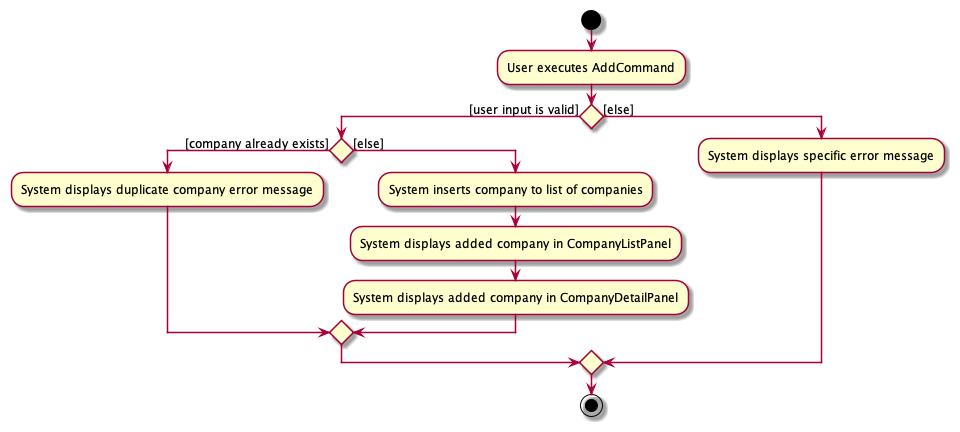
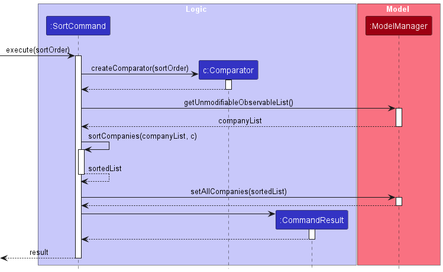

* Table of Contents
{:toc}

--------------------------------------------------------------------------------------------------------------------

## **Acknowledgements**
* [File icon](https://www.flaticon.com/free-icon/document_2258853?term=file&page=1&position=6&origin=search&related_id=2258853) and [Help icon](https://www.flaticon.com/free-icon/question_471664?term=help&page=1&position=2&origin=search&related_id=471664) used in the main window are from Flaticon.

* Useful notations in the User Guide was inspired from a past project [TaskBook](https://ay2223s1-cs2103t-t13-4.github.io/tp/UserGuide.html#useful-notations).
* Technical Terms in the User Guide was inspired from a past project [Sellah](https://ay2122s1-cs2103t-t12-1.github.io/tp/UserGuide.html#321-technical-terms).
* {list here sources of all reused/adapted ideas, code, documentation, and third-party libraries -- include links to the original source as well}

--------------------------------------------------------------------------------------------------------------------

## **Setting up, getting started**

Refer to the guide [_Setting up and getting started_](SettingUp.md).

--------------------------------------------------------------------------------------------------------------------

## **Design**

:bulb: **Tip:** 
The `.puml` files used to create diagrams in this document `docs/diagrams` folder. Refer to the [_PlantUML Tutorial_ at se-edu/guides](https://se-education.org/guides/tutorials/plantUml.html) to learn how to create and edit diagrams.

### Architecture

The ***Architecture Diagram*** given above explains the high-level design of the App.

Given below is a quick overview of main components and how they interact with each other.

**Main components of the architecture**

**`Main`** (consisting of classes [`Main`](https://github.com/AY2324S1-CS2103T-T13-4/tp/blob/master/src/main/java/seedu/address/Main.java) and [`MainApp`](https://github.com/AY2324S1-CS2103T-T13-4/tp/blob/master/src/main/java/seedu/address/MainApp.java)) is in charge of the app launch and shut down.
* At app launch, it initializes the other components in the correct sequence, and connects them up with each other.
* At shut down, it shuts down the other components and invokes cleanup methods where necessary.

The bulk of the app's work is done by the following four components:

* [**`UI`**](#ui-component): The UI of the App.
* [**`Logic`**](#logic-component): The command executor.
* [**`Model`**](#model-component): Holds the data of the App in memory.
* [**`Storage`**](#storage-component): Reads data from, and writes data to, the hard disk.

[**`Commons`**](#common-classes) represents a collection of classes used by multiple other components.

**How the architecture components interact with each other**

The *Sequence Diagram* below shows how the components interact with each other for the scenario where the user issues the command `delete 1`.

Each of the four main components (also shown in the diagram above),

* defines its *API* in an `interface` with the same name as the Component.
* implements its functionality using a concrete `{Component Name}Manager` class (which follows the corresponding API `interface` mentioned in the previous point.

For example, the `Logic` component defines its API in the `Logic.java` interface and implements its functionality using the `LogicManager.java` class which follows the `Logic` interface. Other components interact with a given component through its interface rather than the concrete class (reason: to prevent outside component's being coupled to the implementation of a component), as illustrated in the (partial) class diagram below.

The sections below give more details of each component.

### UI component

The **API** of this component is specified in [`Ui.java`](https://github.com/AY2324S1-CS2103T-T13-4/tp/blob/master/src/main/java/seedu/address/ui/Ui.java)

The UI consists of a `MainWindow` that is made up of parts e.g.`CommandBox`, `ResultDisplay`, `PersonListPanel`, `StatusBarFooter` etc. All these, including the `MainWindow`, inherit from the abstract `UiPart` class which captures the commonalities between classes that represent parts of the visible GUI. Notably, Profile is a separate set of classes that handle the UI of the `view` command, which will be covered later in this document.

The `UI` component uses the JavaFx UI framework. The layout of these UI parts are defined in matching `.fxml` files that are in the `src/main/resources/view` folder. For example, the layout of the [`MainWindow`](https://github.com/AY2324S1-CS2103T-T13-4/tp/blob/master/src/main/java/seedu/address/ui/MainWindow.java) is specified in [`MainWindow.fxml`](https://github.com/AY2324S1-CS2103T-T13-4/tp/blob/master/src/main/resources/view/MainWindow.fxml)

The `UI` component,

* executes user commands using the `Logic` component.
* listens for changes to `Model` data so that the UI can be updated with the modified data.
* keeps a reference to the `Logic` component, because the `UI` relies on the `Logic` to execute commands.
* depends on some classes in the `Model` component, as it displays `Person` object residing in the `Model`.

### Logic component

**API** : [`Logic.java`](https://github.com/AY2324S1-CS2103T-T13-4/tp/blob/master/src/main/java/seedu/address/logic/Logic.java)

Here's a (partial) class diagram of the `Logic` component:

The sequence diagram below illustrates the interactions within the `Logic` component, taking `execute("delete 1")` API call as an example.

:information_source: **Note:** The lifeline for `DeleteCommandParser` should end at the destroy marker (X) but due to a limitation of PlantUML, the lifeline reaches the end of diagram.

How the `Logic` component works:
1. When `Logic` is called upon to execute a command, it is passed to an `AddressBookParser` object which in turn creates a parser that matches the command (e.g., `DeleteCommandParser`) and uses it to parse the command.
1. This results in a `Command` object (more precisely, an object of one of its subclasses e.g., `DeleteCommand`) which is executed by the `LogicManager`.
1. The command can communicate with the `Model` when it is executed (e.g. to delete a person).
1. The result of the command execution is encapsulated as a `CommandResult` object which is returned back from `Logic`.

Here are the other classes in `Logic` (omitted from the class diagram above) that are used for parsing a user command:

How the parsing works:
* When called upon to parse a user command, the `AddressBookParser` class creates an `XYZCommandParser` (`XYZ` is a placeholder for the specific command name e.g., `AddCommandParser`) which uses the other classes shown above to parse the user command and create a `XYZCommand` object (e.g., `AddCommand`) which the `AddressBookParser` returns back as a `Command` object.
* All `XYZCommandParser` classes (e.g., `AddCommandParser`, `DeleteCommandParser`, ...) inherit from the `Parser` interface so that they can be treated similarly where possible e.g, during testing.

### Model component
**API** : [`Model.java`](https://github.com/AY2324S1-CS2103T-T13-4/tp/blob/master/src/main/java/seedu/address/model/Model.java)

The `Model` component,

* stores the address book data i.e., all `Person` objects (which are contained in a `UniquePersonList` object).
* stores the currently 'selected' `Person` objects (e.g., results of a search query) as a separate _filtered_ list which is exposed to outsiders as an unmodifiable `ObservableList<Person>` that can be 'observed' e.g. the UI can be bound to this list so that the UI automatically updates when the data in the list change.
* stores a `UserPref` object that represents the user’s preferences. This is exposed to the outside as a `ReadOnlyUserPref` objects.
* does not depend on any of the other three components (as the `Model` represents data entities of the domain, they should make sense on their own without depending on other components)

:information_source: **Note:** An alternative (arguably, a more OOP) model is given below. It has a `Tag` list in the `AddressBook`, which `Person` references. This allows `AddressBook` to only require one `Tag` object per unique tag, instead of each `Person` needing their own `Tag` objects. 

### Storage component

**API** : [`Storage.java`](https://github.com/AY2324S1-CS2103T-T13-4/tp/blob/master/src/main/java/seedu/address/storage/Storage.java)

The `Storage` component,
* can save both address book data and user preference data in JSON format, and read them back into corresponding objects.
* inherits from both `AddressBookStorage` and `UserPrefStorage`, which means it can be treated as either one (if only the functionality of only one is needed).
* depends on some classes in the `Model` component (because the `Storage` component's job is to save/retrieve objects that belong to the `Model`)

### Common classes

Classes used by multiple components are in the `seedu.addressbook.commons` package.

--------------------------------------------------------------------------------------------------------------------

## **Selected Implementation**

This section describes some noteworthy details on how certain features are implemented.

### View feature

Called `PersonProfile` or simply "profile" internally. The profile follow this structure:

Except notes and tags, all other fosterer details are handled using dynamically created copies of `PersonProfileField`.

- `PersonProfileHeader` serves as headers for the data, and cannot be edited by the user.
- `PersonProfileField` handles a field key and a field value, where the value can be edited.
- `PersonProfileNote` is similar to a field, except it contains a `TextArea` and supports multiline input.
- `PersonProfileTags` also supports multiline input, but when in read mode displays tags in a `FlowPane`.

The following is a sequence diagram that shows two sequential processes: the user starting an edit in a field,
and the user successfully completing that edit. The alternative paths to this process are numerous, and covering them exhaustively
is likely not productive. Instead, this represents the "success path" of a successful edit, where nearly every step handles potential failure.

Step 1. The user begins by entering "mail" in the command box of the main UI.

Step 2. The `MainWindow` finds the correct field that corresponds to the user input, and tells `PersonProfile`.

Step 3. `PersonProfile` locates the relevant `PersonProfileField`, and forwards the request for focus.

Step 4. The user's cursor now jumps to the relevant `PersonProfileField`, and thus their next action is handled directly from `PersonProfileField`.

Step 5. The user presses the `enter` key, which alongside the `esc` key, are special keys involved in the confirmation or cancellation of the edit.

Step 6. `PersonProfileField` checks that the entered information is valid for that particular field.

Step 7. `PersonProfileField` then updates the `PersonProfile` about the change.

Step 8. `PersonProfileField` triggers the event `AFTER_CONFIRM` because the user started a confirmation.

Step 9. One of the event handlers listening to the `AFTER_CONFIRM` event is `handleFieldLockIn`, which initiates the next two steps.

Step 10. `handleFieldLockIn` checks that the new `Person` object described by the fields is valid, and creates one.

Step 11. `handleFieldLockIn` then asks the `MainWindow` to tell the user that the `Person` is created.

Further details on the `MainWindow` side are omitted in this explanation and diagram.

### Add feature

#### Implementation

The add mechanism allows users to add new fosterers to the address book. This feature is facilitated by the `AddCommand` and `AddCommandParser` classes, to handle user input and create the appropriate `Person` object. Specifically, the feature is implemented through the following components and operations:

* `AddCommand` — The core component responsible for executing the addition of a new fosterer to the address book. It handles the validation of input fields and ensures there are no duplicate persons in the address book.
* `Person` — Represents the structure of a person, including attributes such as name, phone, email, address, housing, availability, animal name, animal type, and associated tags.
* `ParserUtil` and `AddCommandParser` — Contains parsing methods for various input fields (e.g., name, phone, email, etc.) to ensure they are valid by meeting specific requirements and conditions.
* `ArgumentMultimap` — Tokenizes and manages command arguments.

Given below is an example usage scenario and how the add mechanism behaves at each step. To make the sequence diagram for adding a fosterer more 
readable, the following replacements for the lengthy add command format are used:

1. `add n/Pete Tay p/98765411 e/pete@example.com a/Happy street block 5 housing/Condo availability/Available animal/nil animalType/able.Cat` 
is replaced with `add command`.
2. `n/Pete Tay p/98765411 e/pete@example.com a/Happy street block 5 housing/Condo availability/Available animal/nil animalType/able.Cat` 
is replaced with `arguments`.
3. `Pete Tay, 98765411, pete@example.com, Happy street block 5, Condo, Available, nil, able.Cat` is replaced with `attributes`.

:information_source: **Note:** The lifeline for `AddCommandParser` should end at the destroy marker (X) but due to a limitation of PlantUML, the lifeline reaches the end of diagram.

Step 1. The user enters the `add` command with relevant details for the new fosterer. The `AddCommandParser` is invoked to parse the user's input.

Step 2. The `AddCommandParser` processes the user's input and verifies the presence of mandatory fields inputted in the correct format (omitted from diagram for simplicity). 
If this check fails, the system will generate a specific error message indicating which field format is invalid. 
For example, if the email format is incorrect, the system will report that the email input is invalid. The error message will be displayed to the user, providing clear feedback about the issue and the specific constraints that are not met.

Step 3. If all mandatory fields are present with the valid format, the new person is created using the `Person` class. The person's details, including their name, phone, email, address, housing, availability, animal name, animal type, and tags, are recorded, and the Person class also ensures that there is no conflicting data (omitted from diagram for simplicity). 
If this check fails, the system will generate a specific error message indicating which field is invalid, and how can it be resolved.

Step 4. The `Person` is then passed to the new `AddCommand` created, which adds the person to the address book, ensuring that it is not a duplicate of an existing entry. This check is performed in the `execute` method of the `AddCommand`.

Step 5. A success message is displayed to the user to confirm that the new fosterer has been added to the address book.

The add feature ensures that user input is correctly parsed and validated, and it prevents duplicate entries in the address book.

The following activity diagram summarizes what happens when a user executes an add command:

#### Design considerations:

* **Data Validation** — The add feature performs thorough validation on input data, ensuring that it adheres to constraints for each field.
* **Duplicates** — The system checks for duplicate persons to prevent the addition of redundant data.

**Aspect: Handling duplicate persons:**

* **Alternative 1:** Checks for duplicates based on the person's name, which is case-sensitive.
    * Pros: Easy to implement, and is simple and effective.
    * Cons: May not catch duplicates with different names but similar attributes or similar names in different letter case.

* **Alternative 2:** Implement a more comprehensive duplicate check considering multiple attributes.
    * Pros: Provides better duplicate detection by comparing multiple attributes.
    * Cons: May be more complex to implement.

* **Alternative 3 (current choice):** Implement a more effective duplicate check considering the presence of multiple spaces between different words of the same name, and case-sensitivity of names.
    * Pros: Provides better duplicate detection by identifying fosterers with the same name, but inputted in different formats.
    * Cons: May be more complex to implement and such cases might be less likely to happen.

**Aspect: How add executes:**

* **Alternative 1 (current choice):** Add only one fosterer at a time.
    * Pros: Easy to implement.
    * Cons: May be time-inefficient and inconvenient if there is an influx of new fosterers to be added.

* **Alternative 2:** Add multiple fosterers at once.
    * Pros: Do not have to parse user input multiple times in order for the user to perform mass addition of new fosterers.
    * Cons: The add command would be even more convoluted due to the increase in length with all the fields/arguments required, making the UI less desirable.

### Editing and Saving the Changes in Profile Page Feature

#### Parsing Commands In Profile Page 

While the profile page is opened, `LogicManager` class utilizes a `ViewModeParser` instead of the `AddressbookParser` which is used while in the main window. 

Given below is a sequence diagram that explains how `LogicManager` class chooses which parser class to use: 

As the diagram suggests, the `executeInView()` method is used when personListPanelPlaceHolder UI element - the placeholder that contains the normal fosterer list - is invisible, which means the user sees the profile page. This triggers the `ViewModeParser` instance in `LogicManager` class to be used to parse the command. 

 

#### Handling UI Changes In Profile Page 

While the profile page is opened, `MainWindow` classes checks the `CommandType` Enum value that `CommandResult` object carries. Depending on the types of the commands, `MainWindow` assigns handler methods to handle the corresponding UI changes. 

The sequence diagram give below illustrates the types of handlers `MainWindow` class deals with. 

As the diagram suggests, depending on the different types of commands, `MainWindow` class executes handlers corresponding to them. 

 

#### Editing A Fosterer In Profile Page  

The mechanism allows the user to edit details of a fosterer in their profile page. This feature is facilitated by `ViewModeParser`, and `EditFieldCommand` classes, to handle user input in the profile page and edit the correct detail of a fosterer. This feature is implemented using the following components and operations: 

* `ViewModeParser` - Represents the parser that parses commands that are executed in a fosterer's profile. 
* `EditFieldCommand` - The core component responsible for executing the edit of a fosterer in the address book. 
* `MainWindow` - The UI component that handles navigating through fields.
* `CommandType` - The Enum class that represents the type of command which MainWindow checks to handle the UI change.

Given below is an example usage scenario and how the mechanism behaves at each step, given that the user already opened person profile page:

Step 1. The user enters the name of the field. e.g. "name". Since the normal person list is invisible, "name" is passed to `executeInView()` method in `MainWindow` class.

Step 2. With `executeInView()`, `ViewModeParser` is used to parse the command which returns `EditFieldCommand`.

Step 3. `EditFieldCommand` is executed, and with the `CommandType.EDIT_FIELD` carried by `CommandResult`, `MainWindow` calls `handleEditField()` method. The interaction between `MainWindow` and `PersonProfile` is covered in detail in **[View Feature](#view-feature)**. 

 

### Saving the Changes in Profile Page Feature 

The mechanism allows the user to save the edited details of a fosterer in their profile page. This feature is facilitated by `ViewModeParser`, and `SaveCommand` classes, to handle user input in the profile page and save the updated fosterer. This feature is implemented using the following components and operations:

* `ViewModeParser` - Represents the parser that parses commands that are executed in a fosterer's profile.
* `SaveCommand` - The core component responsible for saving the changes made by the user.
* `MainWindow` - The UI component that handles navigating through fields.
* `CommandType` - The Enum class that represents the type of command which MainWindow checks to handle the UI change.

Given below is an example usage scenario and how the save mechanism behaves at each step, given that the user already opened person profile page:

Step 1. The user enters `save` command. Since the normal person list is invisible, the command text "save" is passed to `executeInView()` method in `MainWindow` class. 

Step 2. With `executeInView()`, `ViewModeParser` is used to parse the command text which returns `SaveCommand`.

Step 3. `EditFieldCommand` is executed, and `setPerson()` method from `Model` class is called with personToEdit and targetIndex obtained from `MainWindow` class.

 

Step 4. From `MainWindow`, `handleSave()` handler method is called which calls `resetValues()` in `PersonProfile` class that updates the field values to the currently saved fosterer's details and change the text color from red, if exists, back to black.

### Delete feature

#### Implementation

The delete mechanism allows users to delete fosterers in the address book. This feature is facilitated by the `DeleteCommand`, `DeleteCommandParser` and `Indices` classes, to handle user input and delete the correct fosterers.  This feature is implemented using the following components and operations:

* `DeleteCommand` — The core component responsible for executing the deletion of fosterers in the address book.
* `Indices` — Represents the indices that the user inputs, each index corresponding to a fosterer in the last seen list of fosterers. This class encapsulates one or more `Index` objects. 
* `ParserUtil` and `DeleteCommandParser` — Contains the parsing methods for string input of the user. They ensure that the indices are valid by meeting specific requirements. 

Given below is an example usage scenario and how the delete mechanism behaves at each step. The sequence diagram for deleting multiple fosterers is similar to the example in [Logic](#logic-component).

:information_source: **Note:** The lifeline for `DeleteCommandParser` should end at the destroy marker (X) but due to a limitation of PlantUML, the lifeline reaches the end of diagram.

Step 1. The user enters the delete command with at least one index. In this example, the user inputs indices `1 2 3`, which means that they want to delete the first, second and third fosterers in the currently displayed list. The `DeleteCommandParser` is invoked to parse the user's input. 

Step 2. `DeleteCommandParser` will then invoke the `ParserUtil` to check for the validity of indices (invocation of methods in `ParserUtil` and `Indices` classes are omitted from diagram for simplicity). If indices are invalid, the system will generate an error message. The error message will be displayed to the user, providing feedback about the issue and the specific constraints that are not met.

Step 3. For each valid index, the `DeleteCommand` will execute the deletion by obtaining that fosterer from the list of unique persons in the address book, and then updating the model to remove the fosterer. This is done in the `execute` method of `DeleteCommand`.

Step 4. A success message is displayed to the user to confirm that the selected fosterers have been deleted from the address book.

Therefore, by ensuring that the user input indices are correctly parsed and validated, this delete feature allows the user to delete multiple fosterers at once.

#### Design considerations:

**Aspect: How delete executes:**

* **Alternative 1 (current choice):** Delete multiple fosterers at once.
    * Pros: Do not have to parse user input multiple times in order for the user to perform mass deletion.
    * Cons: Slightly harder to implement.

* **Alternative 2:** Delete only one fosterer at a time.
    * Pros: Easy to implement. 
    * Cons: Overhead associated with the chain of delete commands should the user choose to perform multiple deletions.

### Sort feature
#### Implementation

The Sort feature allows the user to sort the list of fosterers alphabetically by name, to make the address book more organised. 
This is facilitated by the `SortCommand`, `Model`, `AddressBook`, and `UniquePersonList` classes:

* `SortCommand` — This class represents the command to sort the list of persons by name. It calls the `sortByName` method in the `Model` class.
* `Model` and `ModelManager` — Declares and implements the `sortByName` method, specifying a comparator based on the person's name. It calls the `sortNames` method in the `AddressBook` class.
* `AddressBook` — Implements the `sortNames` method which uses `sort` on the `persons` UniquePersonList.
* `UniquePersonList` — Contains the `sort` method to perform the sorting operation by using the method on its `internalList`.

Given below is an example usage scenario and how the sort feature behaves at each step. 

Step 1. The user enters the `sort` command. The `SortCommand` is invoked, and it calls the `sortByName` method in the `Model` interface, which is implemented in the `ModelManager` class.

Step 2. The `sortByName` method creates a comparator based on the name of a person.
It then calls the `sortNames` method in the `AddressBook` class (omitted from diagram for simplicity).

Step 3. The `sortNames` method initiates the sorting process and sorts the list of persons using the provided comparator.
It calls the `sort` method on the `persons` UniquePersonList (omitted from diagram for simplicity).

Step 4. The `sort` method in the `UniquePersonList` class performs the actual sorting operation on its `internalList`.

Step 5. A success message is displayed to the user to confirm that the address book has been sorted alphabetically by the names of the fosterers.

The sort feature offers the user a choice to ensure that the list of fosterers in the address book is collated neatly and systematically.

#### Design considerations:

**Aspect: How sort executes:**

* **Alternative 1 (current choice):** Sort alphabetically only based on the fosterers' names.
    * Pros: Easier to implement.
    * Cons: Users may have different preferences for sorting (e.g., sorting by first name, last name, or a combination)..

* **Alternative 2:** Customisable sorting - Allow the user to choose to sort the list alphabetically based on either the fosterers' names or the names of the animals fostered.
    * Pros: Offers greater flexibility for the users to choose which sorting criteria he/she prefers.
    * Cons: If two animals have the same name or if both are `nil`, the sorting operation may change their relative order.

**Aspect: Reverting the sort operation:**

* **Alternative 1 (current choice):** Implement an `undo` command to revert the list back to its original state (sorted chronologically based on when the fosterer is added).
    * Pros: Maintains consistency with undo mechanisms used in other features of Foster Family.
    * Cons: If `sort` is executed multiple times consecutively followed by `undo`, the list will not revert back to its original state with the current implementation of `undo`, which only allows the users to undo the last valid command.

* **Alternative 2:** Implement another `sort` command like `sort time` to revert the list back to its original state (sorted chronologically based on when the fosterer is added).
    * Pros: Offers an explicit and clear command for reverting to the original sorting of the address book list.
    * Cons: Introduces additional commands, potentially leading to increased cognitive load for the users.

### Statistics feature
#### Implementation

The Statistics feature provides a summary of selected address book data to the user. The data we can provide insights to are those of available fosterers, current fosterers and housing type of fosterers. Statistics include _number_ and _percentage_ information.  
This is facilitated by the `StatsCommand`, `StatsAvailCommand`, `StatsCurrentCommand` and `StatsHousingCommand` classes, as well as the `StatsCommandParser` class. The relationship between the Stats command classes are shown below.

* `StatsCommand` — This is an abstract class that contains utility methods used by its subclasses for percentage calculation.
* `StatsAvailCommand` — Contains methods to calculate statistics of available fosterers and the animals they can foster. 
* `StatsCurrentCommand` — Contains methods to calculate statistics of current fosterers and the animals they are currently fostering. 
* `StatsHousingCommand` — Contains methods to calculate statistics of the different housing types of fosterers. 
* `StatsCommandParser` — Contains the parsing methods for string input of the user. It is in charge of parsing the type of statistics requested by the user, and creating the corresponding `StatsCommand`. 

Given below is an example usage scenario and how the statistics feature behaves at each step. It shows the execution of a `stats avail` command, which requests for statistics about available fosterers. 

:information_source: **Note:** The lifeline for `StatsCommandParser` should end at the destroy marker (X) but due to a limitation of PlantUML, the lifeline reaches the end of diagram.

Step 1. The user enters the `stats avail` command. 

Step 2. `StatsCommandParser` is then invoked to parse the argument inputted with the `stats` command, in this case it is `avail`. If the argument is not `avail`, `curr` or `housing`, the `StatsCommandParser` will generate an error message to the user, indicating that the requested statistic is not available. 

Step 3. The `StatsAvailCommand` will then call relevant methods to obtain the needed numbers and percentages, done in the `execute` command.

:information_source: **Note:** The activation bar of the execute method is omitted for simplicity in the sd frame.

Step 4. A success message with the statistics will then be displayed to the user.

The other commands `stats curr` and `stats housing` have a similar execution path, replacing `StatsAvailCommand` with `StatsCurrCommand` and `StatsHousingCommand` respectively.

#### Design considerations:

**Aspect: How to display the statistics:**

* **Alternative 1 (current choice):** Show the availability and current statistics separately.
    * Pros: Displayed statistics are specific to the user's query, showing only the relevant data.
    * Cons: User may need to query multiple times to get all desired statistics.

* **Alternative 2:** Show availability and current statistics together.
    * Pros: Easier to implement. More convenient for user, only one query needed to get all statistics.
    * Cons: Result message displayed will be very long, making the UI less desirable.

**Aspect: Which list should the statistics be calculated from:**

* **Alternative 1 (current choice):** Calculated from the currently displayed list.
    * Pros: The resulting statistic corresponds to what the user sees, allowing for easy verification.
    * Cons: The user may first need to perform a `find` or `list` command to query the list of interest before entering the stats command. 

* **Alternative 2:** Calculated from the main list of fosterers.
    * Pros: The resulting statistic corresponds to the whole address book, which may cause less confusion for the user.
    * Cons: Less flexibility for the user.

--------------------------------------------------------------------------------------------------------------------
## Planned Enhancements

### Shorter Command Formats
Currently, the default add command may be too long for an average typer to key in quickly. A future enhancement we are planning would be to allow the addition of a fosterer with just the basic details, such as their name, phone number, email, housing type and availability. The rest of the fields will be set to `nil` by default.
Only when the fosterer is ready to foster, then other details such as animal name, animal type and address need to be filled in via the `edit` command.

We are also planning to shorten some input parameters when adding or editing a fosterer:

| Current                   | Enhancement  |
|---------------------------|--------------|
| availability/Available    | avail/true   |
| availability/NotAvailable | avail/false  |
| availability/nil          | avail/nil    |
| animalType/               | type/        |

With this, the command `add n/Jerry Tan p/98765412 e/jerry123@example.com housing/HDB avail/true` will be a valid add
command. 

### Reduce Coupling Between Availability and Animal Type
Currently, the `animalType` field also contains information about the availability of a fosterer. 
e.g. if the `animalType` field of a fosterer is `able.Dog`, it suggests that the fosterer is available, and is 
able to foster a dog. However, the user will still need to enter the `availability` field as `available`.  

Building on the enhancement in [Shorter Command Formats](#shorter-command-formats), we will be revising the 
`AVAILABILITY` and `ANIMAL_TYPE` parameters:

| Parameter             | About                                                             | Values                 | 
|-----------------------|-------------------------------------------------------------------|------------------------|
| `AVAILABILITY`        | Indicates availability of fosterer                                | `false`, `true`, `nil` |     
| `ABLE_ANIMAL_TYPE`    | Indicates the type of animals the fosterer can foster             | `dog`, `cat`, `nil`    |     
| `CURRENT_ANIMAL_TYPE` | Indicates the type of animals the fosterer is currently fostering | `dog`, `cat`, `nil`    |

### Support More Animal Types

Building on the enhancement in [Reduce Coupling Between Availability and Animal Type](#reduce-coupling-between-availability-and-animal-type), we can support more animal types by allowing the addition of animals other than cats and dogs under `ABLE_ANIMAL_TYPE` and `CURRENT_ANIMAL_TYPE`. Some examples include 
`hamster` and `rabbit`. This will make our product available to more animal shelters.

### Allow Fosterers To Foster More Than One Animal At A Time

Currently, we only allow the assignment of one fosterer to one animal. To improve this, we can make the `ANIMAL_NAME`,
`ABLE_ANIMAL_TYPE` and `CURRENT_ANIMAL_TYPE` fields to be maintained as lists instead. This will allow one fosterer to be associated with more than one animal.

### Case-sensitivity of Inputs
Currently, the fields and parameters for housing, availability and animal type are case-sensitive. An enhancement to this would be to make these fields and their parameters case-insensitive to improve the user experience. Moreover, the aforementioned enhancements will also be case-insensitive.

### Allow Symbols in Name
Currently, names in Foster Family must be alphanumeric. However, this excludes certain legal names that have other 
characters such as `/`. For example, we currently do not allow  `s/o` in a person's name as the `/` is used as a command
delimiter. Hence, one possible improvement is to enforce that the name inputted by the user must be enclosed in quotation marks for parsing, and to allow symbols such as `/`, `'`, `-` etc. using regex. Additionally, we will disallow the use of numeric values in names, to prevent the case where a number is inputted as a name.

e.g. `n/"Henry Tan"` and `n/"Nagaratnam s/o Suppiah"` are now valid name parameters.

### Phone Number Input

Currently, phone numbers in Foster Family accept more than 8 digits as a valid input. This might cause invalid phone numbers to 
be recorded without error messages to warn the user of such mistakes, especially in the situation where local phone numbers are used.
Hence, one possible improvement is to enforce that the phone number inputted by the user must be restricted to a maximum of 15 
digits (according to the international phone numbering plan).

e.g. `p/90876534567890234567` is now an invalid phone number parameter.

### Prevent Foster Family from crashing due to the Corruption of Data File 

Currently, the Foster Family data is saved automatically as a JSON file, and in the case where the data file is updated directly
and made invalid, Foster Family would either discard all data and start with an empty data file at the next run or the app would 
not start at all. Even though it is advised in the user guide that user should not make changes to the data file directly, one 
possible improvement to be made to prevent such incidents would be to either use a database with username and password authentication 
or implement encryption. An alternative solution would be to account for all the cases to handle an invalid fosterer entry in the data file 
by editing the classes in `storage` (for example, `JsonAdaptedPerson`) such that the user would be informed of the steps to take 
to rectify the errors made.

### Notes Feature as a Separate Command

Currently, the notes feature is only available in the profile page, and its content, which can only be recorded via the
`save` command, is inputted through the text box visible next to the `Notes` field. However, it could potentially be 
inconvenient for the user to have to use a combination of different commands (an example would be `view`, followed by `notes` and 
`save`) in order to record additional crucial information with regard to a particular fosterer. This breeds inefficiency in some 
scenarios, especially in the situation where an animal with existing medical conditions is fostered and its health status has to 
be frequently updated. Hence, an enhancement to this feature would be to make the notes feature a separate command, such that the
user would be able to add important notes in the main window, without having to navigate to the profile page and using the 
additional `save` command to add the notes. 

e.g. `notes 1 n/require an urgent visit to the vet` would add the notes "require an urgent visit to the vet" under the fosterer
listed at index 1.

### Specificity of Error Messages

Currently, when the user attempts to add a fosterer with an invalid combination of availability, animal name and animal type,
the same error message with multiple details of how to rectify different errors is sometimes shown, which can be confusing for the user.
In particular, in the following three cases, the same error message is displayed:

Cases:
1. `availability/nil` but `animalType/` is not `nil`.
2. `availability/Available` with `animalType/` values set to other values which are NOT `able.Cat`, `able.Dog` or `nil`.
3. `availability/NotAvailable` with `animalType/` values set to other values which are NOT `current.Cat`, `current.Dog` or `nil`.

Error message: 
"If fosterer is available, animal type should be 'able.Dog' / 'able.Cat'.  
If animal type information is not available, it should be inputted as 'nil'.  
If fosterer is NOT available and is currently fostering, animal type should be 'current.Dog' / 'current.Cat'.  
If fosterer is currently unable to foster, animal type should be inputted as 'nil'.  
If availability is 'nil', animal type should be 'nil' too." 

Hence, an enhancement would be to split the error message up to only show when each specific case occur, instead of grouping them
all together into a single message. This would reduce confusion for the user and provide more convenience as the user is no longer
required to read long error messages with details that might be irrelevant to the specific error made.

| Cases                                                                                                                         | Enhanced error message                                                                                                                                                                            |
|-------------------------------------------------------------------------------------------------------------------------------|---------------------------------------------------------------------------------------------------------------------------------------------------------------------------------------------------|
| `availability/nil` but `animalType/` is not `nil`                                                                             | If availability is 'nil', animal type should be 'nil' too.                                                                                                                                        |
| `availability/Available` with `animalType/` values set to other values which are NOT `able.Cat`, `able.Dog` or `nil`          | If fosterer is available, animal type should be 'able.Dog' / 'able.Cat'. If animal type information is not available, it should be inputted as 'nil'.                                             |
| `availability/NotAvailable` with `animalType/` values set to other values which are NOT `current.Cat`, `current.Dog` or `nil` | If fosterer is NOT available and is currently fostering, animal type should be 'current.Dog' / 'current.Cat'. If fosterer is currently unable to foster, animal type should be inputted as 'nil'. |

--------------------------------------------------------------------------------------------------------------------

## **Documentation, logging, testing, configuration, dev-ops**

* [Documentation guide](Documentation.md)
* [Testing guide](Testing.md)
* [Logging guide](Logging.md)
* [Configuration guide](Configuration.md)
* [DevOps guide](DevOps.md)

--------------------------------------------------------------------------------------------------------------------

## **Appendix: Requirements**

### Product scope

**Target user profile**:
* Foster manager of non-profit animal shelters for cats and dogs, who currently do not have a good logistical workflow to keep track of their fosterers
* Prefer desktop apps over other types
* Can type fast
* Prefers typing to mouse interactions
* Is reasonably comfortable using CLI apps

**Value proposition**: Low budget and efficient system that manages fosterers 

### User stories

Priorities: High (must have) - `* * *`, Medium (nice to have) - `* *`, Low (unlikely to have) - `*`

| Priority  | As a …                  | I want to …                                                                                    | So that I can…                                                                                                                                  |
|-----------|-------------------------|------------------------------------------------------------------------------------------------|-------------------------------------------------------------------------------------------------------------------------------------------------|
| `* * *`   | foster manager          | delete a fosterer from the list when they want to stop fostering with us                       | update the list to see the fosterers who are currently in our program                                                                           |
| `* * *`   | foster manager          | delete multiple fosterers at once                                                              | perform mass deletions quickly                                                                                                                  |
| `* * *`   | foster manager          | add each fosterer's details efficiently                                                        | know how to contact the fosterer should I have animals that require fostering                                                                   |
| `* * *`   | foster manager          | provide details of the fostered animal of concern to the fosterer                              | ensure that the animal is well taken care by informing the fosterer of existing health conditions to prepare for                                |
| `* * *`   | foster manager          | update a fosterer's details                                                                    | keep track of fosterer's most up-to-date information, including information about the animal fostered                                           |
| `* * *`   | foster manager          | search for a specific animal / fosterer’s detail  instead of browsing through the entire list  | be more productive when searching for suitable fosterers for the animal that needs fostering                                                    |
| `* * *`   | foster manager          | to be aware of the address of the fosterer                                                     | conduct checks on the fosterer to ensure the animal is well taken care of                                                                       |
| `* * *`   | foster manager          | retrieve information about the foster family                                                   | provide the necessary information to the Nparks authorities for audit                                                                           |
| `* * *`   | foster manager          | sort the list of fosterers alphabetically                                                      | have a neater, and more organised view of all the fosterers                                                                                     |
| `* * * `  | foster manager          | know the distribution of the different housing types among fosterers                           | correctly allocate the animals to foster homes that are able to accommodate them                                                                |
| `* * *`   | foster manager          | obtain statistics about the currently available fosterers                                      | better estimate shelter capacity                                                                                                                |
| `* * `    | foster manager          | have the fosterer’s important information collated neatly                                      | get all the information I need with one glance                                                                                                  |
| `* * `    | foster manager          | have an easily accessible and visible help button                                              | get help when I am unsure of what command to use                                                                                                |
| `* * `    | foster manager          | undo my previous command                                                                       | quickly resolve errors caused by the erroneous command                                                                                          |
| `* *`     | new foster manager      | have my initial data file pre-populated with sample data                                       | work with this sample data as an introduction to the app                                                                                        |
| `* *`     | new foster manager      | purge all current data from address book                                                       | remove all sample/ experimental data I used to explore the app                                                                                  |
| `* *`     | careless foster manager | be asked to confirm my decision before purging all fosterer data                               | prevent myself from accidentally deleting all fosterer records                                                                                  |
| `* *`     | foster manager          | view which volunteer is assigned to which animal                                               | properly balance workload and ensure that no volunteer is overburdened                                                                          |
| `* *`     | foster manager          | retrieve documentation of all species of pet under purview of the shelter                      | ensure compliance with regulations for wildlife, protected or endangered species (Nparks audit)                                                 |
| `* *`     | foster manager          | retrieve inventory information about food supplies for fostered animals                        | verify that the requirement of a “well-balanced and nutritional diet” is met, and is not expired (Nparks audit)                                 |
| `* *`     | foster manager          | retrieve history of whereabouts of an animal                                                   | ensure accountability for pets’ accommodations, and verify that pets are monitored daily for signs of illness, injury or disease (Nparks audit) |

### Use cases

(For all use cases below, the **System** is the `Foster Family`, and the **Actor**  is the `Foster Manager`, unless specified otherwise)

**Use case: UC1 - Add Fosterer**

**Preconditions**: Foster Manager has collected fosterer details.

**MSS**

1. Foster Manager requests to add fosterer to the System. 
2. System adds the specified fosterer.

   Use case ends.

**Extensions**

* 1a. System detects a format error in the entered command.
    * 1a1. System indicates the error and requests for data to be inputted in the correct format.
    * 1a2. Foster Manager enters new command.

      Steps 1a1 - 1a2 are repeated until the command entered is in the correct format.
  
      Use case resumes from step 2.
  
    
**Use case: UC2 - List / Find Fosterers**

**MSS**

1. Foster Manager requests to list fosterers.
2. System displays list of fosterers that matches the Foster Manager's query.

   Use case ends.

**Extensions**

* 1a. System detects a format error in the entered command.
    * 1a1. System indicates the error and requests for data to be inputted in the correct format.
    * 1a2. Foster Manager enters new command.

      Steps 1a1 - 1a2 are repeated until the command entered is in the correct format. 

      Use case resumes from step 2.

**Use case: UC3 - Edit Fosterer**

**MSS**

1. Foster Manager lists fosterers (UC2).
2. Foster Manager requests to edit a fosterer referenced by their index shown in the list.
3. System displays details of the selected fosterer. 
4. Foster Manager enters the desired changes. 
5. Foster Manager requests to save the changes. 
6. System displays the updated list of fosterers.

   Use case ends.

**Extensions**
* 1a. System detects an invalid index.
    * 1a1. System indicates the error and requests for a valid index.
    * 1a2. Foster Manager enters new command.

      Steps 1a1 - 1a2 are repeated until the entered index is valid.

      Use case resumes from step 2.
  
* 4a. System detects that the Foster Manager did not fill up compulsory fields.
    * 4a1. System indicates missing field error.
    * 4a2. Foster Manager fills up the missing compulsory fields.
    * 4a3. Foster Manager requests to save the changes.

      Steps 4a1-4a3 are repeated until every compulsory field is filled.
  
      Use case resumes from step 5.

**Use case: UC4 - Delete Fosterers**

**MSS**

1. Foster Manager lists fosterers (UC2).
2. Foster Manager requests to delete fosterers referenced by their index shown in the list.
3. System deletes selected fosterers.
4. System displays updated list of fosterers.

   Use case ends.

**Extensions**

* 2a. The displayed list is empty.
  * 2a1. System indicates error as there are no fosterers to delete.
  
    Use case ends.
  

* 2b. System detects invalid indices.
    * 2b1. System indicates the error and requests for valid indices.
    * 2b2. Foster Manager enters new command.

      Steps 2b1 - 2b2 are repeated until all entered indices are valid.

      Use case resumes from step 3.

**Use case: UC5 - Sort List Of Fosterers**

**MSS**

1. Foster Manager lists fosterers (UC2).
2. Foster Manager requests to sort the list of fosterers.
3. System displays the updated list of fosterers, sorted alphabetically by name.

   Use case ends.

**Extensions**

* 1a. System detects an error in the entered command.
    * 1a1. System indicates the error.
    * 1a2. Foster Manager <u>requests for command 'help' (UC8)</u>.
    * 1a3. Foster Manager enters new command.

      Steps 1a1 - 1a3 are repeated until the command entered is correct.

      Use case resumes from step 2.

**Use case: UC6 - View Statistics**

**MSS**

1. Foster Manager lists fosterers (UC2). 
2. Foster Manager requests to view a certain statistic of the displayed fosterers.
3. System displays the relevant statistic.

   Use case ends.

**Extensions**

* 2a. The displayed list is empty.
  * 2a1. System indicates error.
  
    Use case ends.  
  
  
* 2b. Requested statistic is invalid.
  * 2b1. System indicates error, and prompts Foster Manager to request for a valid statistic. 
  * 2b2. Foster Manager enters new command.

    Steps 2b1 - 2b2 are repeated until a valid statistic is requested.
  
    Use case resumes from step 3.

**Use case: UC7 - Undo Previous Command**

**MSS**

1. Foster Manager requests to undo the previous command.
2. System undoes the previous command.

   Use case ends.

**Extensions**

* 1a. No more undo history is found.
    * 1a1. System indicates error.

      Use case ends.

**Use case: UC8 - Request For Command Help**

**MSS**

1. Foster Manager requests for help.
2. System displays the help page link.

   Use case ends.

**Use case: UC9 - Reset System**

**MSS**

1. Foster Manager requests to reset the System.
2. System requests for confirmation.
3. Foster Manager confirms.
4. System purges all fosterer data from the system.

   Use case ends.

**Extensions**

* 2a. Foster Manager chooses to cancel reset.

    Use case ends.

**Use case: UC10 - Exit**

**MSS**

1. Foster Manager requests to exit the program.
2. System closes program.

   Use case ends.

### Non-Functional Requirements

1.  Should work on any _mainstream OS_ as long as it has Java `11` or above installed.
2.  Should be able to hold up to 500 fosterers without a noticeable sluggishness in performance for typical usage.
3.  A user with above average typing speed for regular English text (i.e. not code, not system admin commands) should be able to accomplish most of the tasks faster using commands than using the mouse.
4.  The system should be usable by a novice foster manager who has never tried out keeping track of fosterers through this new system. 
5.  The system should respond within two seconds. (i.e. each time a valid command is entered or there is any use action)
6.  The user interface should be intuitive enough for users who are not IT-savvy. 
7.  The user guide should be easily understood by target users. (foster managers of animal shelters, assuming they have no relevant technical knowledge)
8.  The system should be able to detect invalidity of command within 2 seconds. 
9.  The system must be able to scale up or down as needed (in the case where there is a sudden fosterers).
10. The system should not contain the fosterer's private information in the case that the fosterer did not give consent.
11. The system must comply with all applicable laws and regulations like the Personal Data Protection Act (PDPA). 
12. The system should be reliable, easy to maintain, and accessible 24/7. 
13. The product should be able to run on mainstream OS.

### Glossary

* **Mainstream OS**: Windows, Linux, Unix, OS-X
* **Fosterer**: A person who temporarily cares for an animal in their own home
* **Housing type**: Categorised into HDB, Condo, Landed
* **Types of animal fostered**: Categorised into solely cats and/or dogs (current.Dog/Cat or able.Dog/Cat depends on availability of fosterer)
* **Current list**: The currently displayed list obtained from a list command or its variants

--------------------------------------------------------------------------------------------------------------------

## **Appendix: Instructions for manual testing**

Given below are instructions to test the app manually.

:information_source: **Note:** These instructions only provide a starting point for testers to work on;
testers are expected to do more *exploratory* testing.

### Launch and shutdown

1. Initial launch

   1. Download the jar file and copy into an empty folder

   1. Double-click the jar file Expected: Shows the GUI with a set of sample contacts. The window size may not be optimum.

1. Saving window preferences

   1. Resize the window to an optimum size. Move the window to a different location. Close the window.

   1. Re-launch the app by double-clicking the jar file. 
       Expected: The most recent window size and location is retained.

### Adding a fosterer

1. Adding a fosterer after collecting all the mandatory details to be inputted

    1. Prerequisites: Foster Manager has collected fosterer details such as name, phone number, email, address, housing type, availability, name of animal fostered 
   (if currently fostering) and type of animal fostered (if currently fostering).

    1. Test case (valid): `add n/Anne Lim p/98765422 e/anne123@example.com a/Baker street, block 6, #27-01 housing/Landed availability/NotAvailable animal/Bucky animalType/current.Dog` 
       Expected: Fosterer named Anne Lim is added to the list. Details of the added fosterer are shown in the status message.

    1. Test case (invalid): 

| Scenario                                                                                                                        | Example command                                                                                                                                                                 | Expected Error Message                                                                                                                                                                                                                                                                                                                                                                                                                                                 |
|---------------------------------------------------------------------------------------------------------------------------------|---------------------------------------------------------------------------------------------------------------------------------------------------------------------------------|------------------------------------------------------------------------------------------------------------------------------------------------------------------------------------------------------------------------------------------------------------------------------------------------------------------------------------------------------------------------------------------------------------------------------------------------------------------------|
| Without any of the following: `n/`, `p/`,`e/`, `a/`, `housing/`, `availability/`, `animal/`, `animalType/`                      | `add n/Jerry Tan p/98765412 e/jerry123@example.com a/Baker street, block 5, #27-01 housing/HDB animal/Dexter animalType/current.Cat t/Urgent`                                   | `Invalid command format! add: Adds a person to the address book. Parameters: n/NAME p/PHONE e/EMAIL a/ADDRESS housing/HOUSING availability/AVAILABILITY animal/ANIMAL_NAME animalType/ANIMAL_TYPE [t/TAG]... Note: If information for that field is not available, put 'nil'. Example: add n/John Doe p/98765432 e/johnd@example.com a/311, Clementi Ave 2, #02-25 housing/HDB availability/NotAvailable animal/Dexter animalType/current.Dog t/Urgent t/goodWithDogs` |
| `availability/nil` but `animal/` is not 'nil'                                                                                   | `add n/Jerry Tan p/98765412 e/jerry123@example.com a/Baker street, block 5, #27-01 housing/HDB availability/nil animal/Dexter animalType/nil t/Urgent`                          | `When an animal name is provided, availability should not be 'Available' or 'nil'.`                                                                                                                                                                                                                                                                                                                                                                                    |
| `availability/Available` but `animal/` is not 'nil'                                                                             | `add n/Jerry Tan p/98765412 e/jerry123@example.com a/Baker street, block 5, #27-01 housing/HDB availability/Available animal/Dexter animalType/nil t/Urgent`                    | `When an animal name is provided, availability should not be 'Available' or 'nil'.`                                                                                                                                                                                                                                                                                                                                                                                    |
| `housing/` with values other than ‘HDB’, ‘Condo’, ‘Landed’, ‘nil’                                                               | `add n/Jerry Tan p/98765412 e/jerry123@example.com a/Baker street, block 5, #27-01 housing/hdb availability/NotAvailable animal/Dexter animalType/current.Cat t/Urgent`         | `Housing type should be either 'HDB', 'Condo', 'Landed' or 'nil'`                                                                                                                                                                                                                                                                                                                                                                                                      |
| `availability/` with values other than ‘Available’, ‘NotAvailable’, ‘nil’                                                       | `add n/Jerry Tan p/98765412 e/jerry123@example.com a/Baker street, block 5, #27-01 housing/HDB availability/available animal/Dexter animalType/current.Cat t/Urgent`            | `Availability should be either 'Available', 'NotAvailable' or 'nil'`                                                                                                                                                                                                                                                                                                                                                                                                   |
| `availability/nil` but `animalType/` is not 'nil'                                                                               | `add n/Jerry Tan p/98765412 e/jerry123@example.com a/Baker street, block 5, #27-01 housing/HDB availability/nil animal/nil animalType/able.Cat t/Urgent`                        | `If fosterer is available, animal type should be 'able.Dog' / 'able.Cat'. If animal type information is not available, it should be inputted as 'nil'. If fosterer is NOT available and is currently fostering, animal type should be 'current.Dog' / 'current.Cat'. If fosterer is currently unable to foster, animal type should be inputted as 'nil'. If availability is 'nil', animal type should be 'nil' too.`                                                   |
| `availability/Available` with `animalType/` values set to other values which are NOT ‘able.Cat’ or ‘able.Dog’ or 'nil'          | `add n/Jerry Tan p/98765412 e/jerry123@example.com a/Baker street, block 5, #27-01 housing/HDB availability/Available animal/nil animalType/current.Cat t/Urgent`               | `If fosterer is available, animal type should be 'able.Dog' / 'able.Cat'. If animal type information is not available, it should be inputted as 'nil'. If fosterer is NOT available and is currently fostering, animal type should be 'current.Dog' / 'current.Cat'. If fosterer is currently unable to foster, animal type should be inputted as 'nil'. If availability is 'nil', animal type should be 'nil' too.`                                                   |
| `availability/NotAvailable` with `animalType/` values set to other values which are NOT ‘current.Cat’ or ‘current.Dog' or 'nil' | `add n/Jerry Tan p/98765412 e/jerry123@example.com a/Baker street, block 5, #27-01 housing/HDB availability/NotAvailable animal/Dexter animalType/able.Cat t/Urgent`            | `If fosterer is available, animal type should be 'able.Dog' / 'able.Cat'. If animal type information is not available, it should be inputted as 'nil'. If fosterer is NOT available and is currently fostering, animal type should be 'current.Dog' / 'current.Cat'. If fosterer is currently unable to foster, animal type should be inputted as 'nil'. If availability is 'nil', animal type should be 'nil' too.`                                                   |
| `availability/NotAvailable` with `animalType/` values set to 'nil' but `animal/` values NOT 'nil'                               | `add n/Jerry Tan p/98765412 e/jerry123@example.com a/Baker street, block 5, #27-01 housing/HDB availability/NotAvailable animal/Dexter animalType/nil t/Urgent`                 | `When availability is 'NotAvailable', animal name and type have to either be both 'nil' or both not 'nil'.`                                                                                                                                                                                                                                                                                                                                                            |
| `availability/NotAvailable` with `animal/` values set to 'nil' but `animalType/` values NOT 'nil'                               | `add n/Jerry Tan p/98765412 e/jerry123@example.com a/Baker street, block 5, #27-01 housing/HDB availability/NotAvailable animal/nil animalType/current.Cat t/Urgent`            | `When availability is 'NotAvailable', animal name and type have to either be both 'nil' or both not 'nil'.`                                                                                                                                                                                                                                                                                                                                                            |

### Deleting a fosterer

1. Deleting a fosterer while all fosterers are being shown

   1. Prerequisites: List all fosterers using the `list` or `find` command. At least 3 fosterers in the list.

   1. Test case: `delete 1` 
      Expected: First fosterer is deleted from the list. Details of the deleted fosterer are shown in the status message.
   
   1. Test case: `delete 1 2 3` 
      Expected: First, second and third fosterers are deleted from the list. Number of deleted fosterers, and their details are shown in the status message.

   1. Test case: `delete 0` 
      Expected: No person is deleted. Error details are shown in the status message.

   1. Other incorrect delete commands to try: `delete`, `delete x`,  (where x is larger than the list size) 
      Expected: Similar to previous.
