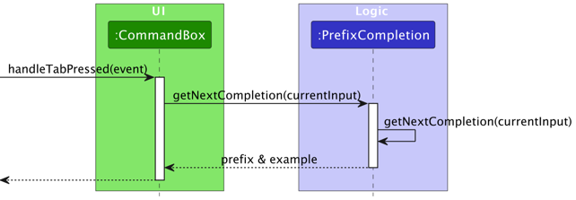
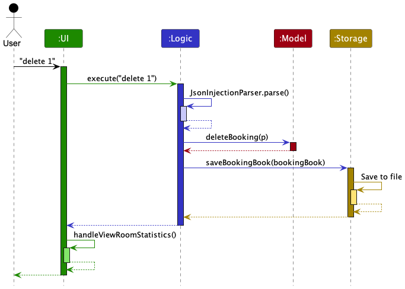

* Table of Contents
{:toc}

---

CheckMate is a powerful room booking and management system designed for hotel employees, especially those in administrative and management positions. It streamlines the process of room bookings, offering real-time room data visualization, search functionality, and efficient booking management.

## **Acknowledgements**

* CheckMate logo generated by:  [BrandCrowd](https://www.brandcrowd.com/maker/logo/modern-pillar-letter-c-84777?text=CheckMate&isSearch=True)
* Doughnut Chart inspired by and template taken from user`jewelsea`'s comment in this Stack Overflow [post](https://stackoverflow.com/questions/24121580/can-piechart-from-javafx-be-displayed-as-a-doughnut)

--------------------------------------------------------------------------------------------------------------------

## **Setting up, getting started**

Refer to the guide [_Setting up and getting started_](SettingUp.md).

--------------------------------------------------------------------------------------------------------------------

## **Design**

:bulb: **Tip:** The `.puml` files used to create diagrams in this document `docs/diagrams` folder. Refer to the [_PlantUML Tutorial_ at se-edu/guides](https://se-education.org/guides/tutorials/plantUml.html) to learn how to create and edit diagrams.

### Architecture

The ***Architecture Diagram*** given above explains the high-level design of the App.

Given below is a quick overview of main components and how they interact with each other.

**Main components of the architecture**

**`Main`** (consisting of classes [`Main`](https://github.com/se-edu/addressbook-level3/tree/master/src/main/java/seedu/address/Main.java) and [`MainApp`](https://github.com/se-edu/addressbook-level3/tree/master/src/main/java/seedu/address/MainApp.java)) is in charge of the app launch and shut down.
* At app launch, it initializes the other components in the correct sequence, and connects them up with each other.
* At shut down, it shuts down the other components and invokes cleanup methods where necessary.

The bulk of the app's work is done by the following four components:

* [**`UI`**](#ui-component): The UI of the App.
* [**`Logic`**](#logic-component): The command executor.
* [**`Model`**](#model-component): Holds the data of the App in memory.
* [**`Storage`**](#storage-component): Reads data from, and writes data to, the hard disk.

[**`Commons`**](#common-classes) represents a collection of classes used by multiple other components.

**How the architecture components interact with each other**

The *Sequence Diagram* below shows how the components interact with each other for the scenario where the user issues the command `delete 1`.

Each of the four main components (also shown in the diagram above),

* defines its *API* in an `interface` with the same name as the Component.
* implements its functionality using a concrete `{Component Name}Manager` class (which follows the corresponding API `interface` mentioned in the previous point.

For example, the `Logic` component defines its API in the `Logic.java` interface and implements its functionality using the `LogicManager.java` class which follows the `Logic` interface. Other components interact with a given component through its interface rather than the concrete class (reason: to prevent outside component's being coupled to the implementation of a component), as illustrated in the (partial) class diagram below.

The sections below give more details of each component.

### UI component

The **API** of this component is specified in [`Ui.java`](https://github.com/se-edu/addressbook-level3/tree/master/src/main/java/seedu/address/ui/Ui.java)

The UI consists of a `MainWindow` that is made up of parts e.g.`CommandBox`, `ResultDisplay`, `PersonListPanel`, `StatusBarFooter` etc. All these, including the `MainWindow`, inherit from the abstract `UiPart` class which captures the commonalities between classes that represent parts of the visible GUI.

The `UI` component uses the JavaFx UI framework. The layout of these UI parts are defined in matching `.fxml` files that are in the `src/main/resources/view` folder. For example, the layout of the [`MainWindow`](https://github.com/se-edu/addressbook-level3/tree/master/src/main/java/seedu/address/ui/MainWindow.java) is specified in [`MainWindow.fxml`](https://github.com/se-edu/addressbook-level3/tree/master/src/main/resources/view/MainWindow.fxml)

The `UI` component,

* executes user commands using the `Logic` component.
* listens for changes to `Model` data so that the UI can be updated with the modified data.
* keeps a reference to the `Logic` component, because the `UI` relies on the `Logic` to execute commands.
* depends on some classes in the `Model` component, as it displays `Person` object residing in the `Model`.

### Logic component

**API** : [`Logic.java`](https://github.com/se-edu/addressbook-level3/tree/master/src/main/java/seedu/address/logic/Logic.java)

Here's a (partial) class diagram of the `Logic` component:

The sequence diagram below illustrates the interactions within the `Logic` component, taking `execute("delete 1")` API call as an example.

:information_source: **Note:** The lifeline for `DeleteCommandParser` should end at the destroy marker (X) but due to a limitation of PlantUML, the lifeline reaches the end of diagram.

How the `Logic` component works:

1. When `Logic` is called upon to execute a command, it is passed to an `AddressBookParser` object which in turn creates a parser that matches the command (e.g., `DeleteCommandParser`) and uses it to parse the command.
2.This results in a `Command` object (more precisely, an object of one of its subclasses e.g., `DeleteCommand`) which is executed by the `LogicManager`.
3.The command can communicate with the `Model` when it is executed (e.g. to delete a person).
4.The result of the command execution is encapsulated as a `CommandResult` object which is returned back from `Logic`.

Here are the other classes in `Logic` (omitted from the class diagram above) that are used for parsing a user command:

How the parsing works:
* When called upon to parse a user command, the `AddressBookParser` class creates an `XYZCommandParser` (`XYZ` is a placeholder for the specific command name e.g., `AddCommandParser`) which uses the other classes shown above to parse the user command and create a `XYZCommand` object (e.g., `AddCommand`) which the `AddressBookParser` returns back as a `Command` object.
* All `XYZCommandParser` classes (e.g., `AddCommandParser`, `DeleteCommandParser`, ...) inherit from the `Parser` interface so that they can be treated similarly where possible e.g, during testing.

### Model component
**API** : [`Model.java`](https://github.com/se-edu/addressbook-level3/tree/master/src/main/java/seedu/address/model/Model.java)

The `Model` component,

* stores the address book data i.e., all `Person` objects (which are contained in a `UniquePersonList` object).
* stores the currently 'selected' `Person` objects (e.g., results of a search query) as a separate _filtered_ list which is exposed to outsiders as an unmodifiable `ObservableList<Person>` that can be 'observed' e.g. the UI can be bound to this list so that the UI automatically updates when the data in the list change.
* stores a `UserPref` object that represents the user’s preferences. This is exposed to the outside as a `ReadOnlyUserPref` objects.
* does not depend on any of the other three components (as the `Model` represents data entities of the domain, they should make sense on their own without depending on other components)

:information_source: **Note:** An alternative (arguably, a more OOP) model is given below. It has a `Tag` list in the `AddressBook`, which `Person` references. This allows `AddressBook` to only require one `Tag` object per unique tag, instead of each `Person` needing their own `Tag` objects. 

### Storage component

**API** : [`Storage.java`](https://github.com/se-edu/addressbook-level3/tree/master/src/main/java/seedu/address/storage/Storage.java)

The `Storage` component,
* can save both address book data and user preference data in JSON format, and read them back into corresponding objects.
* inherits from both `AddressBookStorage` and `UserPrefStorage`, which means it can be treated as either one (if only the functionality of only one is needed).
* depends on some classes in the `Model` component (because the `Storage` component's job is to save/retrieve objects that belong to the `Model`)

### Common classes

Classes used by multiple components are in the `seedu.addressbook.commons` package.

--------------------------------------------------------------------------------------------------------------------

## **Implementation**

This section describes some noteworthy details on how certain features are implemented.

### Room Statistics PieChart

#### Implementation

The Room Statistics PieChart is facilitated by the RoomPieChart class, and the actual pie chart object is created using
the DoughnutChart class. This is designed to enable hotel receptionists to be able to determine the
number of available and unavailable rooms at a glance during the hustle and bustle of handling multiple
guest check ins, allowing them to be able to either report to their manager or supervisor the current number of rooms
occupied, or to inform a guest that they are entertaining that perhaps a specific room that they desire is not available
due to the large number of rooms occupied on that day.

The primary functions of the class include:

- `RoomPieChart(ObservableList<Booking> bookingList)` - Creates the pie chart object with the appropriate dimensions and labels.

The RoomPieChart object is updated by the `handleViewRoomStatistics()` method declared in /main/java/seedu/address/ui/MainWindow.java class,
which is called after every command except `find` command is returned. The reason why it is not updated after `find` is because
the pie chart is generated using the filteredList returned after every command, and since `find` generates a filteredList
based on the user's input, we do not want to update the pie chart with only the Bookings that fit the user's input.

The following sequence diagram provides a visual representation of the pie chart being updated after each command result is returned:

#### Design Considerations:

**Aspect: Execution of handleViewRoomStatistics():**

- **Choice:** Edit the CommandResult method signature to take in another boolean parameter to indicate whether handleViewRoomStatistics is called.
    - Pros: For every command, it is easy to edit the command's class to either update the pie chart or not.
    - Cons: Might be too simple of an implementation. If the developer chooses to add in more complex commands that rely on other commands, regressions may occur.

- **Alternative:** Use a ListChangeListener object to monitor the list to see if there is a change in the number of bookings, and call handleViewRoomStatistics accordingly.
    - Pros: Reduces chances of regressions occuring when more complex commands are added as updating the pie chart only relies on any changes to the Bookings list.
    - Cons: Demands a more complex implementation.

**Aspect: Indication of room pie chart failures:**
- **Choice:** Show pie chart
    - Pros: Visually noticeable to users as they can see if there is no change to the pie chart when there should be or the pie chart is not shown at all.
    - Cons: Users may somehow not notice that the pie chart is not changing.

### Prefix Autocomplete

#### Implementation

The prefix autocomplete mechanism is facilitated by the `PrefixCompletion` class. This class is designed to recommend possible prefixes that a user can use to complete their commands more efficiently.

The primary functions of the class include:

- `PrefixCompletion#getNextCompletion(String currentInput)` - Provides the next possible prefix recommendation based on the user's current input.

`PrefixCompletion` is used in the `CommandBox` class. When the user presses the `TAB` key, the `handleTabPressed` method is invoked, which runs the `PrefixCompletion` to auto-complete the user's current input.

Given below is an example usage scenario and how the prefix completion mechanism behaves at each step.

1. The user starts typing a command in the command box.
2. Upon pressing the `TAB` key, the current text in the command box is passed to the `PrefixCompletion#getNextCompletion` method.
3. The method checks the user's input to determine the appropriate command (e.g., `add`, `edit`) and use necessary `PrefixFinder` to find the unused prefix.
4. If a suitable prefix is identified, it is appended to the user's current input in the command box, accompanied by an example value. The example value is highlighted for easy replacement by the user.
5. If no suitable prefix is identified or if the user's input isn't recognized, the command box runs `CommandBox#indicateCompletionFailure()` which signals the user to adjust their input by adjusting the text color for 0.5s.

The following sequence diagram provides a visual representation of the prefix autocomplete operation within the `CommandBox`:

#### Design Considerations:

**Aspect: Execution of prefix autocomplete:**

- **Choice:** Uses a predefined list of prefixes and examples for each command.
    - Pros: Simplified implementation. Easy to maintain and update.
    - Cons:
      -Limited to predefined prefixes and commands.
      -Subject to manual change when prefix changes.

- **Alternative:** Dynamically generate example suggestions based on user's history or frequently used parameter.
    - Pros: Offers more personalized and relevant suggestions.
    - Cons: Demands a more complex implementation. Requires a mechanism to track and evaluate user's command history.

**Aspect: Indication of prefix autocomplete failures:**

- **Choice:** Flash the command box with an error style briefly.
    - Pros: Visually noticeable. Informs the user that the autocomplete attempt was unsuccessful.
    - Cons: Might be considered intrusive by some users.

- **Alternative:** Display a tooltip or a message below the command box.
    - Pros: Less intrusive. Clearly communicates the message to the user.
    - Cons: Potential to clutter the UI if not managed gracefully.

### RoomType Tags

#### Implementation

The Room class uses the RoomType enumeration to categorize rooms by type and employs the RoomTypeTag class to generate 
corresponding UI labels. The RoomType enumeration inside the Room class is equipped with a static mapping from room 
numbers to their associated types, enabling swift identification of a room's category based on its number. 
This categorization is then visually represented in the UI by creating RoomTypeTag objects that serve as labels for each room.

The primary functions of the class include:

- `RoomType getRoomTypeByNumber(int roomNumber)` - Uses an internal map to associate room numbers with specific room types, thus enabling quick determination of a room's type.

Given below is an example usage senario and how the prefix completion mechanism behaves at each step.

1. The user enters the `add`command with the room number.
2. A Room object is instantiated with a room number passed as a string to the constructor.
3. The constructor parses the string into an integer and calls RoomType.getRoomTypeByNumber to ascertain the room's category.
4. A RoomTypeTag object is created using the name of the determined RoomType, which then facilitates the creation of a UI label for display.

The following sequence diagram provides a visual representation of the prefix autocomplete operation within the `CommandBox`:

#### Design Considerations:

**Aspect: Management of room types:**

- **Choice:** Utilize the RoomType enumeration within the Room class.
    - Pros: Ensures clear and centralized room type definitions, simplifying updates and maintenance.
    - Cons:
        -The static nature of enumeration can limit flexibility, making it harder to adapt to dynamic changes.
        -The direct association between room numbers and types might not easily support modifications in room categorization.

- **Alternative:** Implement a separate RoomType class with dynamic properties.
    - Pros: Adds the ability to handle dynamic changes and offers potential for future scalability.
    - Cons: Complicates the implementation, possibly necessitating new mechanisms for maintaining and retrieving room type information.

**Aspect: Representation of room types as UI labels:**

- **Choice:** Create RoomTypeTag objects from the names of RoomType enumeration constants.
    - Pros: This direct conversion guarantees that the data model aligns seamlessly with the UI's visual elements.
    - Cons:
        -Utilizes the RoomTypeTag class, which may have been initially intended for a broader tagging purpose.
        -Could lead to unnecessary complexity if the RoomTypeTag class functionality significantly overlaps with the RoomType enumeration.

- **Alternative:** Design a specialized UI component dedicated to room types.
    - Pros: Enables custom behavior and appearance specific to room type representation.
    - Cons: Requires additional development work and may result in code redundancy if not carefully integrated with the existing UI components.

### JSON Injection Parser

#### Implementation

The JSON Injection Parser is facilitated by the `JsonInjectionParser` class. It is simply the first parser to be used when parsing through the user input, meant to prevent the user
from inputting possible JSON commands that may be executed when dealing with storing or retrieving memory from the JSON file.

The primary functions of the class include:

- `parse(String args) throws ParseException` - Parses through the user input to check if the input contains any escape characters or characters that could be used to form a JSON command,
and throws a ParseException if the input does contain any of the banned characters.

The following sequence diagram provides a visual representation of the JsonInjectionParser.parse() method being used after a command is passed to Logic.

#### Design Considerations:

**Aspect: Execution of parse():**

- **Choice:** Prevent the user from inputting any characters that may constitute a JSON command.
    - Pros: Simple to implement.
    - Cons: This may cause inconvenience to the user.

- **Alternative:** Sanitise the input, ie: remove the banned characters from the input and execute the command.
    - Pros: Less inconvenience to the user.
    - Cons:
        -More complex implementation.
        -Due to the input having some characters removed, the command may either may no sense at all, or in successful execution the details of the command may not make sense to the user at all.

--------------------------------------------------------------------------------------------------------------------

## **Appendix: Requirements**

### Product scope
**Target User profile**

* Hotel employees, especially those in administrative and management roles.
* Has a need to manage a significant number of bookings in a hotel.
* Prefer desktop apps over other types
* Can type fast
* Prefers typing to mouse interactions
* Is reasonably comfortable using CLI apps

**Value Proposition**

CheckMate empowers hotel employees to efficiently manage room bookings, optimize room-booking matching, and enhance guest experiences. It offers real-time room availability, service scheduling, and amenity management. It is optimized for administrative roles, ensuring seamless room allocation and guest service.

### User stories

Priorities: High (must have) - `* * *`, Medium (nice to have) - `* *`, Low (unlikely to have) - `*`

| Priority | As a …​        | I want to …​                                 | So that I can…​                                      |
|----------|----------------|----------------------------------------------|------------------------------------------------------|
| `* * *`  | hotel employee | add a new room booking                       | keep track of who is staying in which room           |
| `* * *`  | hotel employee | cancel an existing room booking              | manage changes in client plans or circumstances      |
| `* * *`  | hotel employee | edit details of an existing booking          | make changes as required                             |
| `* * *`  | hotel employee | view a list of all bookings                  | quickly understand room occupancy                    |
| `* * *`  | hotel employee | search for a booking using the client's name | quickly retrieve their details                       |
| `* * *`  | hotel employee | view room availability                       | manage and plan room allocations effectively         |
| `* * *`  | hotel employee | view a client's check-in/check-out times     | keep records for management and service improvement  |
| `* *`    | hotel employee | assign a specific room number to a client    | ensure clients know where to stay                    |
| `* *`    | hotel employee | reassign a different room number to a client | accommodate changes or needs                         |
| `* *`    | hotel employee | leave notes on a booking                     | note special requests or important information       |
| `* *`    | hotel employee | handle special requests                      | provide personalized service to clients              |
| `* *`    | admin          | set different room categories                | offer diverse accommodation options                  |
| `* *`    | hotel employee | check out a client from their room           | manage room availability at the end of stays         |
| `*`      | admin          | set room rates                               | ensure clients are charged appropriately             |
| `*`      | hotel employee | apply discounts to a booking                 | provide promotions and special offers to clients     |
| `*`      | hotel employee | handle client complaints                     | ensure customer satisfaction and address issues      |
| `*`      | hotel employee | schedule room cleaning                       | maintain cleanliness and readiness of rooms          |
| `*`      | hotel employee | block rooms for maintenance                  | ensure no bookings are made for unavailable rooms    |
| `*`      | hotel employee | view the history of a room                   | track and understand room usage over time            |
| `*`      | hotel employee | process payments for room bookings           | manage financial transactions for stays              |
| `*`      | hotel employee | issue refunds                                | manage cancellations and returns appropriately       |
| `*`      | admin          | generate daily reports                       | understand hotel operations and finances             |
| `*`      | admin          | set schedules for hotel employees            | ensure adequate staffing for hotel operations        |
| `*`      | admin          | add new rooms to the hotel's inventory       | expand and update the hotel's room offerings         |
| `*`      | hotel employee | archive old bookings                         | keep the system organized and up-to-date             |
| `*`      | admin          | set up promotional offers                    | attract clients and offer competitive services       |
| `*`      | hotel employee | manage online bookings                       | handle reservations made through digital platforms   |
| `*`      | hotel employee | send booking confirmation emails             | inform clients about their booking status            |
| `*`      | hotel employee | handle emergency situations                  | ensure safety and rapid response in crises           |
| `*`      | admin          | manage the hotel's inventory                 | maintain adequate supplies of necessary items        |
| `*`      | hotel employee | manage group bookings                        | accommodate events or large groups effectively       |
| `*`      | admin          | monitor hotel security                       | ensure safety and security within the hotel premises |
| `*`      | hotel employee | receive and manage client feedback           | improve services based on client suggestions         |
| `*`      | hotel employee | coordinate with other departments            | provide seamless service across the hotel            |
| `*`      | hotel employee | manage lost and found items                  | assist clients with their misplaced belongings       |
| `*`      | hotel employee | manage long-term bookings                    | cater to clients staying for extended periods        |
| `*`      | hotel employee | organize transport for clients               | provide additional services for client convenience   |

### Use cases

(For all use cases below, the **System** is the `CheckMate` and the **Actor** is the `user`, unless specified otherwise)

#### Use case: Delete a person

**MSS**

1. Hotel employee requests to add a booking.
2. CheckMate prompts for booking details.
3. Hotel employee enters the booking details.
4. CheckMate adds the booking and confirms the addition.

    Use case ends.

**Extensions:**

* 3a. The entered details are invalid.
    * 3a1. CheckMate shows an error message.
    * 3a2. Hotel employee re-enters the details.

  Use case resumes at step 3.

#### Use case: Cancel a booking

**MSS:**

1. Hotel employee requests to list all bookings.
2. CheckMate displays the list of bookings.
3. Hotel employee selects a booking to cancel.
4. CheckMate cancels the selected booking and confirms the cancellation.

   Use case ends.

**Extensions:**

* 2a. The booking list is empty.

  Use case ends.

* 3a. The selected booking index is invalid.
    * 3a1. CheckMate shows an error message.

  Use case resumes at step 2.

#### Use case: Edit a booking

**MSS:**

1. Hotel employee requests to edit a booking.
2. CheckMate prompts for the booking index and new details.
3. Hotel employee enters the booking index and new details.
4. CheckMate updates the booking and confirms the changes.

   Use case ends.

**Extensions:**
* 3a. The provided index or details are invalid.
    * 3a1. CheckMate displays an error message.

  Use case resumes at step 2.

#### Use case: View all bookings

**MSS:**

1. Hotel employee requests to view all bookings.
2. CheckMate displays a list of all bookings.

   Use case ends.

#### Use case: Search for a booking

**MSS:**

1. Hotel employee requests to search for a booking.
2. CheckMate prompts for search criteria.
3. Hotel employee enters search criteria.
4. CheckMate displays bookings matching the criteria.

   Use case ends.

**Extensions:**

* 3a. No bookings match the search criteria.
    * 3a1. CheckMate shows a message that no matches were found.

  Use case resumes at step 2.

###  Non-Functional Requirements

1.  Should work on any _mainstream OS_ as long as it has Java `11` or above installed.
2.  Should be able to hold up to 1000 bookings without a noticeable sluggishness in performance for typical usage.
3.  A user with above average typing speed for regular English text (i.e. not code, not system admin commands) should be able to accomplish most of the tasks faster using commands than using the mouse.
4.  Should have a user-friendly and intuitive graphical user interface (GUI) that complements the command line interface (CLI), making it accessible for users who may not be as comfortable with CLI.
5.  Response time for any command should not exceed 2 seconds, ensuring quick feedback and a smooth user experience.

### Glossary

* **Mainstream OS**: Windows, Linux, Unix, OS-X
* **Private contact detail**: A contact detail that is not meant to be shared with others

--------------------------------------------------------------------------------------------------------------------

## **Appendix: Instructions for manual testing**

Given below are instructions to test the app manually.

:information_source: **Note:** These instructions only provide a starting point for testers to work on;
testers are expected to do more *exploratory* testing.

### Launch and shutdown

1. Initial launch

    1. Download the jar file and copy into an empty folder

    1. Double-click the jar file Expected: Shows the GUI with a set of sample contacts. The window size may not be optimum.

1. Saving window preferences

    1. Resize the window to an optimum size. Move the window to a different location. Close the window.

    1. Re-launch the app by double-clicking the jar file. 
       Expected: The most recent window size and location is retained.

1. _{ more test cases …​ }_

### Deleting a person

1. Deleting a person while all persons are being shown

    1. Prerequisites: List all persons using the `list` command. Multiple persons in the list.

    1. Test case: `delete 1` 
       Expected: First contact is deleted from the list. Details of the deleted contact shown in the status message. Timestamp in the status bar is updated.

    1. Test case: `delete 0` 
       Expected: No person is deleted. Error details shown in the status message. Status bar remains the same.

    1. Other incorrect delete commands to try: `delete`, `delete x`, `...` (where x is larger than the list size) 
       Expected: Similar to previous.

1. _{ more test cases …​ }_

### Saving data

1. Dealing with missing/corrupted data files

    1. _{explain how to simulate a missing/corrupted file, and the expected behavior}_

1. _{ more test cases …​ }_
