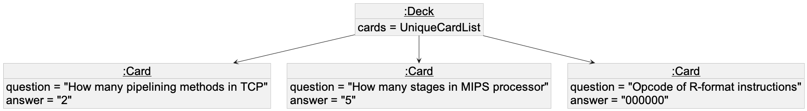
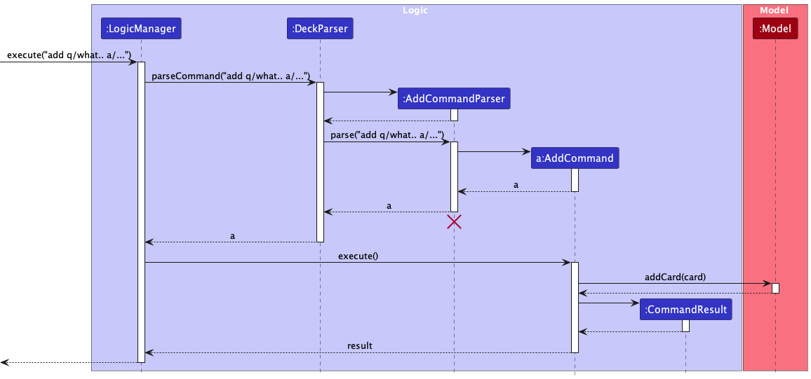
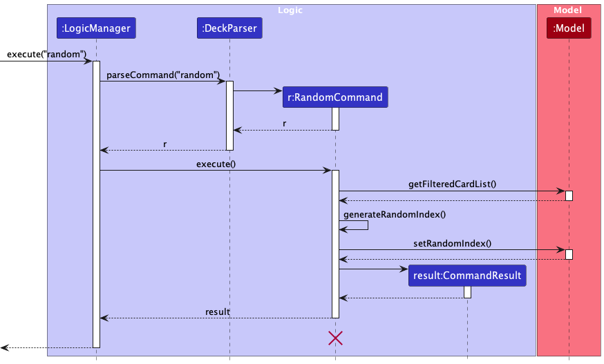

# Developer Guide for <span style="color: green;">lesSON</span> 

## Table of Contents
1. [Acknowledgements](#acknowledgements)
2. [Setting up, getting started](#setting-up-getting-started)
3. [Design](#design)
   - [Architecture](#architecture)
   - [UI component](#ui-component)
   - [Logic component](#logic-component)
   - [Model component](#model-component)
   - [Storage component](#storage-component)
   - [Common classes](#common-classes)
4. [Implementation](#implementation)
   - [Add](#add-command)
   - [Delete](#delete-command)
   - [Filter by tag](#filtering-by-tag)
   - [Random](#random-command)
   - [Markdown Support](#markdown-support-feature)
   - [Space Repetition](#spaced-repetition-feature)
   - [Data Transfer](#data-transfer-functionality)
   - [(Proposed) Undo/Redo](#proposed-undoredo-feature)
5. [Documentation, logging, testing, configuration, dev-ops](#documentation-logging-testing-configuration-dev-ops)
6. [Appendix: Planned Enhancements](#appendix-planned-enhancements)
7. [Appendix: Effort](#appendix-effort)
8. [Appendix: Requirements](#appendix-requirements)
   - [Product scope](#product-scope)
   - [User stories](#user-stories)
   - [Use cases](#use-cases)
   - [Non-Functional Requirements](#non-functional-requirements)
   - [Glossary](#glossary)
9. [Appendix: Instructions for manual testing](#appendix-instructions-for-manual-testing)

--------------------------------------------------------------------------------------------------------------------

## **Acknowledgements**

* This project is a **part of the se-education.org** initiative. If you would like to contribute code to this project, see [se-education.org](https://se-education.org#https://se-education.org/#contributing) for more info.

--------------------------------------------------------------------------------------------------------------------

## **Setting up, getting started**

Refer to the guide [_Setting up and getting started_](SettingUp.md).

--------------------------------------------------------------------------------------------------------------------

## **Design**

<div markdown="span" class="alert alert-primary">

:bulb: **Tip:** The `.puml` files used to create diagrams in this document `docs/diagrams` folder. Refer to the [_PlantUML Tutorial_ at se-edu/guides](https://se-education.org/guides/tutorials/plantUml.html) to learn how to create and edit diagrams.
</div>

### Architecture


The ***Architecture Diagram*** given above explains the high-level design of the App.

Given below is a quick overview of main components and how they interact with each other.

**Main components of the architecture**

**`Main`** (consisting of classes [`Main`](https://github.com/AY2324S1-CS2103T-W17-4/tp/blob/master/src/main/java/seedu/address/Main.java) and [`MainApp`](https://github.com/AY2324S1-CS2103T-W17-4/tp/blob/master/src/main/java/seedu/address/MainApp.java)) is in charge of the app launch and shut down.
* At app launch, it initializes the other components in the correct sequence, and connects them up with each other.
* At shut down, it shuts down the other components and invokes cleanup methods where necessary.

The bulk of the app's work is done by the following four components:

* [**`UI`**](#ui-component): The UI of the App.
* [**`Logic`**](#logic-component): The command executor.
* [**`Model`**](#model-component): Holds the data of the App in memory.
* [**`Storage`**](#storage-component): Reads data from, and writes data to, the hard disk.

[**`Commons`**](#common-classes) represents a collection of classes used by multiple other components.

**How the architecture components interact with each other**

The *Sequence Diagram* below shows how the components interact with each other for the scenario where the user issues the command `delete 1`.


Each of the four main components (also shown in the diagram above),

* defines its *API* in an `interface` with the same name as the Component.
* implements its functionality using a concrete `{Component Name}Manager` class (which follows the corresponding API `interface` mentioned in the previous point.

For example, the `Logic` component defines its API in the `Logic.java` interface and implements its functionality using the `LogicManager.java` class which follows the `Logic` interface. Other components interact with a given component through its interface rather than the concrete class (reason: to prevent outside component's being coupled to the implementation of a component), as illustrated in the (partial) class diagram below.


The sections below give more details of each component.

### UI component

The **API** of this component is specified in [`Ui.java`](https://github.com/AY2324S1-CS2103T-W17-4/tp/blob/master/src/main/java/seedu/address/ui/Ui.java)


The UI consists of a `MainWindow` that is made up of parts e.g.`CommandBox`, `ResultDisplay`, `CardListPanel`, `StatusBarFooter` etc. All these, including the `MainWindow`, inherit from the abstract `UiPart` class which captures the commonalities between classes that represent parts of the visible GUI.

The `UI` component uses the JavaFx UI framework. The layout of these UI parts are defined in matching `.fxml` files that are in the `src/main/resources/view` folder. For example, the layout of the [`MainWindow`](https://github.com/AY2324S1-CS2103T-W17-4/tp/blob/master/src/main/java/seedu/address/ui/MainWindow.java) is specified in [`MainWindow.fxml`](https://github.com/AY2324S1-CS2103T-W17-4/tp/blob/master/src/main/resources/view/MainWindow.fxml)

The `UI` component,

* executes user commands using the `Logic` component.
* listens for changes to `Model` data so that the UI can be updated with the modified data.
* keeps a reference to the `Logic` component, because the `UI` relies on the `Logic` to execute commands.
* depends on some classes in the `Model` component, as it displays `Card` object residing in the `Model`.
* answer of the Card created is hidden from the user when they browse the Deck
* user can scroll to see the different `Card` listed in lesSON

### Logic component

**API** : [`Logic.java`](https://github.com/AY2324S1-CS2103T-W17-4/tp/blob/master/src/main/java/seedu/address/logic/Logic.java)

Here's a (partial) class diagram of the `Logic` component:


The sequence diagram below illustrates the interactions within the `Logic` component, taking `execute("delete 1")` API call as an example.


<div markdown="span" class="alert alert-info">:information_source: **Note:** The lifeline for `DeleteCommandParser` should end at the destroy marker (X) but due to a limitation of PlantUML, the lifeline reaches the end of diagram.
</div>

How the `Logic` component works:

1. When `Logic` is called upon to execute a command, it is passed to an `DeckParser` object which in turn creates a parser that matches the command (e.g., `DeleteCommandParser`) and uses it to parse the command.
1. This results in a `Command` object (more precisely, an object of one of its subclasses e.g., `DeleteCommand`) which is executed by the `LogicManager`.
1. The command can communicate with the `Model` when it is executed (e.g. to delete a card).
1. The result of the command execution is encapsulated as a `CommandResult` object which is returned back from `Logic`.

Here are the other classes in `Logic` (omitted from the class diagram above) that are used for parsing a user command:


How the parsing works:
* When called upon to parse a user command, the `DeckParser` class creates an `XYZCommandParser` (`XYZ` is a placeholder for the specific command name e.g., `AddCommandParser`) which uses the other classes shown above to parse the user command and create a `XYZCommand` object (e.g., `AddCommand`) which the `DeckParser` returns back as a `Command` object.
* All `XYZCommandParser` classes (e.g., `AddCommandParser`, `DeleteCommandParser`, ...) inherit from the `Parser` interface so that they can be treated similarly where possible e.g, during testing.

### Model component
**API** : [`Model.java`](https://github.com/AY2324S1-CS2103T-W17-4/tp/blob/master/src/main/java/seedu/address/model/Model.java)


The `Model` component,

* stores the flashcard deck data i.e., all `Card` objects (which are contained in a `UniqueCardList` object).
* stores the currently 'selected' `Card` objects (e.g., results of a search query) as a separate _filtered_ list which is exposed to outsiders as an unmodifiable `ObservableList<Card>` that can be 'observed' e.g. the UI can be bound to this list so that the UI automatically updates when the data in the list change.
* stores a `UserPref` object that represents the user’s preferences. This is exposed to the outside as a `ReadOnlyUserPref` objects.
* does not depend on any of the other three components (as the `Model` represents data entities of the domain, they should make sense on their own without depending on other components)

<div markdown="span" class="alert alert-info">:information_source: **Note:** An alternative (arguably, a more OOP) model is given below. It has a `Tag` list in the `Deck`, which `Card` references. This allows `Deck` to only require one `Tag` object per unique tag, instead of each `Card` needing their own `Tag` objects.<br>


</div>


### Storage component

**API** : [`Storage.java`](https://github.com/AY2324S1-CS2103T-W17-4/tp/blob/master/src/main/java/seedu/address/storage/Storage.java)


The `Storage` component,
* can save both deck data and user preference data in JSON format, and read them back into corresponding objects.
* inherits from both `DeckStorage` and `UserPrefStorage`, which means it can be treated as either one (if only the functionality of only one is needed).
* depends on some classes in the `Model` component (because the `Storage` component's job is to save/retrieve objects that belong to the `Model`)

### Common classes

Classes used by multiple components are in the `seedu.address.commons` package.

Below is an example of the object diagram of how the cards are stored in the `Deck` class




--------------------------------------------------------------------------------------------------------------------
## **Implementation**

This section describes some noteworthy details on how certain features are implemented.

### Add Command

The add command can be found in the `LogicManager` class. User input is first parsed into the `DeckParser` class using the `parseCommand` to validate if its add command with the specified fields and format.

The add command is exposed in the `Model` interface as the `Model#addCard`
Below is the overview on the add command:


Here is the flow of how the add command is featured.

1. User inputs the following valid input `add q/what does + mean in boolean algebra? a/it means OR.`
2. The command is parsed into the `DeckParser` to verify that it has the correct format and parameters
3. Add command is executed, and if there is no duplicate entry found in `DeckStorage`, a new flashcard with the corresponding
data will be created
4. New generated flashcard is then stored in the `DeckStorage`

Below is the sequence diagram for this flow:



#### Design Considerations

**Aspect: Duplicate Entry Detection:**

* **Alternative 1 (current choice):** No restriction on case sensitivity and mark down syntax
    * Pros: Increased flexibility on how users wish to create flashcards, up to user's choice, duplicate entry is
  determined only by the question and the answer input.
    * Cons: Might lead to duplicate entries of cards of similar content .

* **Alternative 2:** Clean the user input to obtain their intended question and answer
    * Pros: Reduces chances of duplicate cards in deck
    * Cons: Increased developer time to create such filtering functionality with little benefit

### Delete Command

The delete command can be found in the `LogicManager` class. User input is first parsed into the `DeckParser` class using the `parseCommand`
to validate if it is a valid delete command with the specified fields and format.

The delete command is exposed in the `Model` interface as the `Model#setCard`

Below is the overview on the delete command:


Here is the flow of how the delete command is featured.

1. User inputs the following valid input `delete 1`
2. The command is parsed into the `DeckParser` to verify that it has the correct format and parameter
3. Delete command is now executed. If the index is valid, when it is greater than 0 and a card exists at the specified index, the specified card is now deleted from view.
4. The corresponding card is also deleted from storage.

Below is the sequence diagram for this flow:


### Filtering by Tag

The `list` command supports filtering the deck by tag by entering the relevant tag(s) in the command parameters. This allows the users to
view specific groups of cards under the same `tag`, granting them more control over their study material.

<div markdown="span" class="alert alert-info">
:information_source: **Note:** The `list` command also provides support for filtering by question keywords. The implementation is largely the same as filtering by tag.
</div>

#### Implementation

Performing a `list` command involves executing `ListCommand`.
* This command is parsed by `ListCommandParser`.
* `ListCommandParser#parse()` parses the user input to return a `ListCommand` object that will be executed.

Given below is an example usage of the `list` command to filter the deck and how the filtering mechanism behaves at each step.

1. Suppose the user has a deck containing some cards with the tag `CS2103T`. The user keys in this command to filter by the `CS2103T` tag.
    ```
    list t/CS2103T
    ```

    <div markdown="span" class="alert alert-info">
    :information_source: **Note:** At least one tag should be provided.
    </div>

2. The `ListCommandParser` will execute to get the field and keyword pairs 
using the `ArgumentTokenizer`. This parses every parameter into a list of `Predicate<Card>` objects.
The parser then returns a `ListCommand` object with the list of predicates.

3. The `ListCommand#execute()` method is invoked by the `LogicManager`.
The list of predicates is combined into a single `Predicate<Card>` object.
Then, `ListCommand` calls `Model#updateFilteredCardList()` with the `Predicate<Card>`
to update the filtered flashcard list with a new list, filtered by the tag entered.

4. Finally, the `ListCommand` creates a `CommandResult` object that
contains feedback and displays the filtered flashcard list to the
user. This result is then returned to the `LogicManager`. As a result, 
the deck will now display only the cards with the `CS2103T` tag.

The sequence diagram below shows the process of filtering the deck with tags.


<div markdown="span" class="alert alert-info">
:information_source: **Note:** The lifeline for `ListCommandParser` and `ListCommand`
should end at the destroy marker (X)
but due to a limitation of PlantUML, the lifeline reaches the end of diagram.
</div>

#### Design considerations:

**Aspect: How `list` executes with filter parameters:**

* **Alternative 1 (current choice):** Filter through the whole deck using the filter method on a stream of cards.
    * Pros: Easy to implement.
    * Cons:
      1. May have performance issues when Deck eventually gets too big.
      2. Inefficient if specific tag is a small fraction of Deck.
* **Alternative 2:** Construct a \'mini-deck\' for each tag.
    * Pros: Quick search for all cards with specific tag.
    * Cons:
      1. Will use more memory.
      2. Adding/Deleting/Editing cards will require modifications to \'mini-deck\'.

### Random Command

The `random` command enables the user to practise with a random card from the deck. 
It offers compatibility with the `solve` and `set` commands by making sure the index of the 
randomly selected card is remembered for those commands.

#### Implementation

Performing a `random` command involves executing `RandomCommand`.
* This command does not have its own parser because it does not require any parameters.
* Hence, this command is directly executed by `LogicManager`

1. Suppose the user has a deck containing some cards. The user keys in this command to practise a random card.
    ```
    random
    ```

2. A new `RandomCommand` object is created by `DeckParser`.
    <div markdown="span" class="alert alert-info">
    :information_source: **Note:** This is slightly different from other commands, as there is no need for 
    parsing by its own parser because there are no additional parameters to be parsed for this command.
    </div>

3. The `RandomCommand#execute()` method is invoked by the `LogicManager`.
`RandomCommand` then calls `Model#getFilteredCardList()` to get the deck list, so as to generate a random index.
The random index is generated by calling `RandomCommand#generateRandomIndex()`.
This random index is saved in the `Model` by calling `Model#setRandomIndex()`.
This is so that the index can be accessed later by commands `solve` and `set`.

4. A random card is selected with the newly generated index, which is then used to return a `CommandResult` to `LogicManager`.
As a result, the randomly selected card's question will be shown to the user to practise with.

The sequence diagram below shows the process of randomly selecting a card to practise.



<div markdown="span" class="alert alert-info">
:information_source: **Note:** The lifeline for `RandomCommand`
should end at the destroy marker (X)
but due to a limitation of PlantUML, the lifeline reaches the end of diagram.
</div>

#### Design considerations:

**Aspect: How random command is parsed:**

* **Alternative 1:** Modify `PractiseCommand` and `PractiseCommandParser` to accept an `r` parameter to practise a random question
    * Pros: Similar command format with `solve` and `set`, so it may be easier to use for some users.
    * Cons: Harder to manage codebase because `PractiseCommand` will have two different responsibilities (i.e. practising in order and randomly)
* **Alternative 2 (Current Choice):** Implement a new command `random` instead of adding it as an option on `practise`
    * Pros: 
      1. Easier to implement and manage code
      2. More extensible in the future if random needs to accept any parameters
    * Cons: No significant cons

### Markdown support feature

#### Implementation

The feature aims to support Markdown based language for inputs and renders the corresponding display (i.e. ** Bold ** will become **Bold**).
This provides users the freedom to adapt the content within the card, granting them more control over their study material. Users would be able to highlight more specific
part of the `Answer` which would be the key concept tested in the exam.

Given below is an example usage of the Markdown support feature.

1. User creates a card.

2. User executes `add q/ What base is hexadecimal in? a/ Hexadecimal is in **Base 16**`

3. `AddCommandParser` will parse in the input and then, parse in the values collected in the multimap to a `MarkdownParser`
to create a new `Card`.

4. The `Card` is added to the `Model` to be added to the `Deck`.

5. The `UI` renders the `Card` with the relevant fields meant to be written in Markdown.

#### Design considerations:

**Aspect: How Markdown support executes:**

* **Alternative 1 :** Use existing libraries that support Markdown using JavaFX.
    * Pros: Easy to implement.
    * Cons:
      1. Dependency on third party library.
      2. Increase application size
      3. Many features included in the library are redundant
* **Alternative 2 (Current Choice):** Individually support each type of Markdown language by creating our own implementation for each syntax.
    * Pros: Scope of support can be determined by developer.
    * Cons:
        1. Time-consuming.
        2. Potential for Bugs


**Finalised Implementation:**

Settled on using alternative 2 as it allows us to be flexible on what Markdown Syntax we want to implement. We decided to implement bold, 
italic and underline since they are the most commonly used ones. This also greatly reduces the application file size.


### Spaced Repetition Feature

#### Implementation

This features aim to implement a Spaced Repetition system to schedule cards based on the level of difficulty indicated by the user.
In combination with the difficulty feature, Spaced Repetition determines when is the next recommended revision date
for each flashcard, to make users give more of their attention to the difficult ones and practice it earlier, optimising learning.

Using the difficulty system, we can decide a `nextPracticeDate` for the specified card based on the difficulty selected by the user.
This helps to remove the need to manually set `nextPracticeDate`, and provides user with a more intuitive way to determine their `nextPracticeDate` based on `difficulty`.
This is also a key feature of the app, which allows for automatic scheduling of cards and removes it off the users hands.

Possible difficulty inputs: `easy`, `medium`, `hard`

Any wrong input will result in an error being flagged out

Given below is an example usage of the Spaced Repetition Feature.

1. Assuming the user has existing cards in lesson, with their own set of questions and answers. These
questions are sorted by a due date `nextPracticeDate`. Cards also have a hidden field known as `lastPracticeDate`.

2. After the user uses the `practise` command and `solve` command, he uses the `set` command to set how difficult
he felt the card was when he was practising the card.

3. After setting the difficulty, the system will calculate a new `nextPracticeDate`.
Firstly, it applies a multiplier (based on difficulty: 3, 1.5, 0.5 for easy, medium, hard respectively)
to the amount of time between `lastPracticeDate` and `nextPracticeDate`, obtaining a duration.
This duration is then added to the current `nextPracticeDate` to calculate the new `nextPracticeDate`.
If there is no suitable `lastPracticeDate` to use, then this calculation alternatively
adds a base duration (of 4 hours) * multiplier to `nextPracticeDate`.

4. The card's `nextPracticeDate` and `lastPracticeDate` is then updated with the new fields.

5. The card is automatically sorted in the list according to the new `nextPracticeDate` and the more difficult cards
will now appear earlier when using the `practice` command without index now.


### Data Transfer Functionality

Both export and import features are not to be mistaken as a **Command** as it is meant to be used before the user decides to use our application
for revision purposes.


#### Export 

We implemented an export functionality to allow our users to port over their data with ease.

The export button will allow users to access a copy of the `deck.json` file and has a copy button function that allows
users to copy over their deck.json file with ease.

#### Design considerations:

**Aspect: How can we showcase the data while preventing users from editing directly:**

* We decided that showing a copy of the text found in `deck.json` will prevent the user from directly editing
`deck.json`, and thus prevents any accidental erasure of the deck should the user tamper with it unknowningly.

Given below is an example usage of the Export Feature.

1. User generates cards according to their needs and produced a deck for revision

2. User wishes to share their deck with peers or online, and needs a fixed format
to be used across all lesSON applications

3. User navigates to the menu bar at the top of the screen and presses on it.

4. The dropdown menu displays the export function, and it produces the text of the `deck.json` to be copied

5. User proceeds to click on the copy data button, and it is copied to the users clipboard

### Import

We implemented an import functionality to allow our users to port over their data with ease.

The Import button will allow users who have received the text from the Export function to transfer the deck of carss over, thereby
effectively importing over the shared deck of cards generated by another user.

#### Design considerations:

**Aspect: Ineffective way to modify state of deck from Import window :**

* **Alternative 1 :** Investigate more into how we can update the deck of cards from Import window
    * Pros: Smoother user experience as the application stays running
    * Cons: Requires more extensive testing and research

* **Alternative 2:** Make the application restart so that it re-opens with the updated deck
    * Pros: Saves a lot of time as the logic to do so hinges on pre-existing features to operate.
    * Cons: User is forced to exit the application upon import, which might lead to a less than ideal user experience.

Given below is an example usage of the Import Feature.

1. User A has used lesSON and already a pre-existing deck of cards.

2. User A then clicks on the Export button (mentioned above).

3. User B receives the text from User A either via message, text or email.

4. User B opens lesSON and clicks on the menu button.

5. User B clicks on the Import menu button and copies and pastes the text received from A into the text field.

6. User B clicks on Import data button which will then import the data and closes the application

7. User B re-opens lesSON to see his new functional deck of cards.


### \[Proposed\] Undo/redo feature

#### Proposed Implementation

The proposed undo/redo mechanism is facilitated by `VersionedDeck`. It extends `Deck` with an undo/redo history, stored internally as an `deckStateList` and `currentStatePointer`. Additionally, it implements the following operations:

* `VersionedDeck#commit()`Saves the current deck state in its history.
* `VersionedDeck#undo()`Restores the previous deck state from its history.
* `VersionedDeck#redo()`Restores a previously undone deck state from its history.

These operations are exposed in the `Model` interface as `Model#commitDeck()`, `Model#undoDeck()` and `Model#redoDeck()` respectively.

Given below is an example usage scenario and how the undo/redo mechanism behaves at each step.

1. The user launches the application for the first time. The `VersionedDeck` will be initialized with the initial deck state, and the `currentStatePointer` pointing to that single deck state.

    

2. The user executes `delete 5` command to delete the 5th card in the deck. The `delete` command calls `Model#commitDeck()`, causing the modified state of the deck after the `delete 5` command executes to be saved in the `deckStateList`, and the `currentStatePointer` is shifted to the newly inserted deck state.

    

3. The user executes `add q/What …​` to add a new card. The `add` command also calls `Model#commitDeck()`, causing another modified deck state to be saved into the `deckStateList`.

    

    <div markdown="span" class="alert alert-info">:information_source: **Note:** If a command fails its execution, it will not call `Model#commitDeck()`, so the deck state will not be saved into the `deckStateList`.
    
    </div>

4. The user now decides that adding the card was a mistake, and decides to undo that action by executing the `undo` command. The `undo` command will call `Model#undoDeck()`, which will shift the `currentStatePointer` once to the left, pointing it to the previous deck state, and restores the deck to that state.

    

    <div markdown="span" class="alert alert-info">:information_source: **Note:** If the `currentStatePointer` is at index 0, pointing to the initial Deck state, then there are no previous Deck states to restore. The `undo` command uses `Model#canUndoDeck()` to check if this is the case. If so, it will return an error to the user rather
    than attempting to perform the undo.
    
    </div>

    The following sequence diagram shows how the undo operation works:
    
    
    
    <div markdown="span" class="alert alert-info">:information_source: **Note:** The lifeline for `UndoCommand` should end at the destroy marker (X) but due to a limitation of PlantUML, the lifeline reaches the end of diagram.
    
    </div>
    
    The `redo` command does the opposite — it calls `Model#redoDeck()`, which shifts the `currentStatePointer` once to the right, pointing to the previously undone state, and restores the deck to that state.
    
    <div markdown="span" class="alert alert-info">:information_source: **Note:** If the `currentStatePointer` is at index `deckStateList.size() - 1`, pointing to the latest deck state, then there are no undone Deck states to restore. The `redo` command uses `Model#canRedoDeck()` to check if this is the case. If so, it will return an error to the user rather than attempting to perform the redo.
    
    </div>

5. The user then decides to execute the command `list`. Commands that do not modify the deck, such as `list`, will usually not call `Model#commitDeck()`, `Model#undoDeck()` or `Model#redoDeck()`. Thus, the `deckStateList` remains unchanged.

    

6. The user executes `clear`, which calls `Model#commitDeck()`. Since the `currentStatePointer` is not pointing at the end of the `deckStateList`, all deck states after the `currentStatePointer` will be purged. Reason: It no longer makes sense to redo the `add q/What …​` command. This is the behavior that most modern desktop applications follow.

    

The following activity diagram summarizes what happens when a user executes a new command:


#### Design considerations:

**Aspect: How undo & redo executes:**

* **Alternative 1 (current choice):** Saves the entire deck.
    * Pros: Easy to implement.
    * Cons: May have performance issues in terms of memory usage.

* **Alternative 2:** Individual command knows how to undo/redo by
  itself.
    * Pros: Will use less memory (e.g. for `delete`, just save the card being deleted).
    * Cons: We must ensure that the implementation of each individual command are correct.

--------------------------------------------------------------------------------------------------------------------

## **Documentation, logging, testing, configuration, dev-ops**

* [Documentation guide](Documentation.md)
* [Testing guide](Testing.md)
* [Logging guide](Logging.md)
* [Configuration guide](Configuration.md)
* [DevOps guide](DevOps.md)

--------------------------------------------------------------------------------------------------------------------
## **Appendix: Planned Enhancements**

1. The current logic for adding and editing `tag` allows for duplicate `tag` for a single flashcard.
    - Users that use the `edit` or `add` command with duplicate `tags` in the command can create a flashcard with redundant
      tags for a single flashcard.
    - We plan to enforce uniqueness in the list of `tags` by using a Java Set data structure instead of
      a Java List data structure.

2. The current parser logic for `hint` does not support the use of `r` index.
   - Users that use `random` to practise a random question are unable to use `hint r` to check the hint of the question.
   - We plan to allow `hint` command to accept `r` index to that it can show the user the hint of the randomly selected question.

3. Current logic for Markdown syntax does not allow for the multiple Markdown syntax to be stacked for a single phrase.
    - Users that want to create a bold and underlined phrase might try `<u>**WORD**</u>`. However, this does not result
      in the expected outcome "<u>**WORD**</u>" and cause unexpected styling in the DisplayView.
    - We plan to refine the parsing of Markdown syntax to ensure the parsing of syntax for a particular phrase checks
      for every syntax instead of the first valid syntax, so that user can apply more than 1 font styles to a part of the text.

---------------------------------------------------------------------------

## **Appendix: Effort**

### Project Overview

Our project, lesSON, emerged from the adaptation of AB3 code into a dynamic flashcard application. Users engage in a 
two-phase learning process, viewing flashcards initially and then practicing recall. The collaborative efforts of our 
5-person team resulted in a feature-rich app encompassing CRUD operations, dual-phase learning, spaced repetition, and 
additional features like hints and goal-setting.

### Project Challenges

Adapting existing code required meticulous modifications to align with the unique requirements of a flashcard app. The main differentiating 
design consideration was the transition from AB3, which was mainly an information hub, to lesSON which required a 2 stage
design so that the user can create and practise cards with ease.

### Development Effort

The development effort invested in lesSON covered various aspects, including feature implementation, refactoring, and 
quality assurance. The team dedicated substantial time to refine and optimize the codebase, ensuring a robust and 
user-friendly flashcard application. Additionally, the presence of the automated codecov bot ensured that the code we pushed
was well covered and would flag out any possible flaws in our implementation that was not covered by automated testing.

### Achievements

Noteworthy achievements include successful CRUD operations, dual-phase learning, spaced repetition, and additional 
user-centric features.

### Comparison with AB3

lesSON differentiates itself from AB3 by introducing a more dynamic and engaging learning experience. The two-phase 
structure, combined with features like difficulty settings and prioritized card ordering, positions lesSON as a more 
advanced and versatile educational tool. We introduced the element of spaced repetition so that our users can benefit the most
from the studying experience. Additionally, we also include an auto priority system that would place cards that required more attention
at the very front so that users can practise them more often.

### Conclusion

The successful transformation of AB3 into lesSON highlights the team's adaptability and technical expertise. Overcoming 
challenges, especially during the refactoring phase, demonstrates our commitment to delivering a robust and innovative 
flashcard application. Despite the similar looking UI, much of the consideration and design implementation went towards 
brainstorming how the 2 stages were to be implemented such that they complement each other and were intuitive to the user.


---------------------------------------------------------------------------
## **Appendix: Requirements**

### Product scope

**Target user profile**:

* is a Computer Science University student in NUS
* wishes to excel in their studies
* requires a learning aid that enforces their understanding and memorisation of the content taught
* may take several courses at once and each course is expected to have multiple topics/concepts
* prefer desktop apps over other types
* can type fast
* prefers typing to mouse interactions
* is reasonably comfortable using CLI apps
* decently familiar with the idea of flashcards and their usages in an academic setting

**Value proposition**: For Computing students in University who struggle with memorisation and consolidation of knowledge, our app provides users the ability to create categorised flashcards to organise concepts taught to them fast. Optimised for CLI and users who type fast.


### User stories

Priorities: High (must have) - `* * *`, Medium (nice to have) - `* *`, Low (unlikely to have) - `*`

| Priority | As a …​                                | I want to …​                                                                                    | So that I can…​                                  |
|----------|----------------------------------------|-------------------------------------------------------------------------------------------------|--------------------------------------------------|
| `* * *`  | new user                               | create a new flashcard                                                                          | start adding content                             |
| `* * *`  | user                                   | edit the content of an existing flashcard                                                       | update my study materials                        |
| `* * *`  | user                                   | delete a flashcard                                                                              | remove irrelevant content                        |
| `* * *`  | user                                   | view a list of all my flashcards                                                                | quickly access my study materials                |
| `* * *`  | user                                   | organise my flashcards with tags                                                                | manage my study materials efficiently            |
| `*`      | user                                   | search for a specific flashcard                                                                 | edit the card accordingly                        |
| `* *`    | user                                   | sort my flashcards by date created or modified                                                  | view them in an organised manner                 |
| `*`      | user who learns better with pictures   | add images to my flashcards                                                                     | enhance my learning experience                   |
| `* * *`  | user who wants to update my flashcards | modify answers to my flashcard                                                                  | make sure that my content is up to date          |
| `* * *`  | user                                   | practise with my flashcards                                                                     | test my knowledge                                |
| `* *`    | user                                   | shuffle the order of my flashcards during practice                                              | avoid memorising in a fixed sequence             |
| `* * *`  | user                                   | mark a flashcard as "learnt" during practice                                                    | track my progress                                |
| `*`      | user                                   | see statistics on my practice sessions, such as the number of cards reviewed and the time spent |                                                  |
| `* * *`  | user                                   | tag my flashcards with course IDs and coursework                                                | easily categorise them by subject                |
| `* * *`  | user                                   | tag my flashcards with the type of concept (e.g., definitions, formulas, field)                 | filter them for specific study needs             |
| `* *`    | user                                   | can change my tag colours                                                                       | personalise my studying methods                  |
| `* *`    | user                                   | enable spaced repetition for my flashcards                                                      | optimise my memorization process                 |
| `* *`    | user                                   | adjust the spacing intervals for spaced repetition                                              | personalise my learning experience               |
| `* *`    | diligent user                          | review flashcards due for repetition                                                            | reinforce my memory                              |
| `* *`    | experienced user                       | format the text on my flashcards using Markdown or a similar markup language                    | create personalised rich content                 |
| `*`      | experienced user                       | preview the formatted text on my flashcards                                                     | ensure it appears as intended                    |
| `* *`    | picky user                             | customise the app's colour scheme and interface                                                 | personalise my learning environment              |
| `* *`    | user                                   | reset my progress and start fresh with my flashcards                                            | can reattempt my studies                         |
| `* *`    | user                                   | export my flashcards to a file                                                                  | back up my data or share it with others          |
| `* *`    | user                                   | import flashcards from an external file                                                         | easily migrate or collaborate on study materials |
| `* * *`  | user                                   | access a user guide                                                                             | learn how to use the app effectively             |
| `* *`    | user                                   | receive notifications to remind me of my study sessions and flashcard reviews                   |                                                  |
| `* *`    | user                                   | set daily or weekly study goals                                                                 | track my progress toward my learning objectives  |
| `*`      | user                                   | provide feedback or report issues to the app developers                                         | contribute to app improvement                    |
| `*`      | multilingual user                      | input non-english characters                                                                    | study in other languages                         |

### Use cases

(For all use cases below, the **System** is `lesSON` and the **Actor** is the `user`, unless specified otherwise)

**Use case: UC01 Creating a card**

**MSS:**

1. User inputs command to create a card, along with the necessary details.
2. lesSON displays a success message.
3. The answer generated is not visible to the user until card selected is practised.

Use case ends.

**Extension:**

- 1a. lesSON detects that the given parameters are invalid
    - 1a1. lesSON displays an error message.

Use case ends.

- 1b. lesSON detects that the necessary parameters are missing
    - 1b1. lesSON displays an error message.
  
Use case ends

- 1c. lesSON detects that any parameters input is empty (no input after prefix)
    - 1c1. lesSON displays an error message.

Use case ends.


**Use case: UC02 deleting a card**

**MSS:**

1. User displays all cards (UC04).
2. User inputs command to delete a card, along with the index of the card.
3. lesSON displays a success message.

Use case ends.

**Extension:**

- 1a. lesSON detects that the given index is invalid
    - 1a1. lesSON displays an error message.

Use case ends.


**Use case: UC03 filtering the card deck**

**MSS:**

1. User displays all cards (UC04).
2. User inputs command to filter the cards, including the tags to filter the deck.
3. lesSON displays the cards that fulfill the condition using the tags.

Use case ends.

**Extension:**

-   1a. lesSON detects the given parameters are invalid
    - 1a1. lesSON displays an error message.

Use case ends.

**Use case: UC04 displaying all cards**

**MSS:**

1. User inputs command to view all cards.
2. lesSON displays all cards.

Use case ends.


**Use case: UC05 editing a card**

**MSS:**

1. User displays all cards (UC04).
2. User inputs command to edit a card, along with the necessary details.
3. lesSON displays a success message.

Use case ends.

**Extension:**

- 1a. lesSON detects that the given parameters are invalid
    - 1a1. lesSON displays a error message.

Use case ends.


**Use case: UC06 practise a card**

**MSS:**

1. User displays all cards (UC04).
2. User inputs command to practise a card with its index.
3. lesSON displays the question of the specified card.

Use case ends.

**Extension:**

- 1a. lesSON detects that the given index is invalid
    - 1a1. lesSON displays a error message.

Use case ends.

**Use case: UC07 solve a card**

**MSS:**

1. User displays all cards (UC04).
2. User inputs command to solve a card with its index.
3. lesSON displays the question and the answer of the specified card.

Use case ends.

**Extension:**

- 1a. lesSON detects that the given index is invalid
    - 1a1. lesSON displays a error message.

Use case ends.

**Use case: UC08 set difficulty for a card**

**MSS:**

1. User displays all cards (UC04).
2. User inputs command to set a difficulty of a card, by specifying its index and the difficulty.
3. lesSON displays the question and the answer of the specified card.

Use case ends.

**Extension:**

- 1a. lesSON detects that the given parameters are invalid
    - 1a1. lesSON displays a error message

Use case ends.

### Non-Functional Requirements

1.  Should work on any _mainstream OS_ as long as it has Java `11` or above installed.
2.  Should be able to hold up to 1000 flashcards without a noticeable sluggishness in performance for typical usage.
3.  A user with above average typing speed for regular English text (i.e. not code, not system admin commands) should be able to accomplish most of the tasks faster using commands than using the mouse.
4.  User must be educated and willing to use flashcards to learn the content
5.  Display box should be able to show the user's full input


### Glossary

* **Mainstream OS**: Windows, Linux, Unix, OS-X
* **Flashcard**: A two-sided card containing a question and an answer
* **Tag**: A label used to categorise flashcards
* **Deck**: A series of cards that is stored in lesSON
* **Index**: The position of the card in the deck
* **CLI**: A text-based interface where you interact with the software by typing commands into a terminal or command prompt, providing more direct and precise control over the system.
* **GUI**: A user-friendly interface that allows you to interact with the software through visual elements like windows, icons, buttons, and menus, making it easy to navigate with a mouse and keyboard.

--------------------------------------------------------------------------------------------------------------------

## **Appendix: Instructions for manual testing**

Given below are instructions to test the app manually.

<div markdown="span" class="alert alert-info">:information_source: **Note:** These instructions only provide a starting point for testers to work on;
testers are expected to do more *exploratory* testing.

</div>

### Launch and shutdown

1. Initial launch

   1. Download the jar file and copy into an empty folder

   1. Double-click the jar file Expected: Shows the GUI with a set of sample contacts. The window size may not be optimum.

1. Saving window preferences

   1. Resize the window to an optimum size. Move the window to a different location. Close the window.

   1. Re-launch the app by double-clicking the jar file.<br>
       Expected: The most recent window size and location is retained.

1. Exiting the application

   1. Press the exit button in the`File` menu button or enter the `exit` command.

   2. Application window should close and exit as normal.


### Adding a card

1. Adding a card with question and answer parameters.

   1. Prerequisites: List all cards using the `list` command. Multiple cards in the list.
   
   1. Test case: `add q/What is the opcode for R-format instructions a/000000` <br>
     Expected: Addition of card with its details shown in the result display. Card is added to deck.

   2. Test case: `add q/What is the opcode for R-format instructions` <br>
     Expected: Card is not created, error message appears mentioning correct format to follow.

   3. Test case: `add q/What is the opcode for R-format instructions a/000000` <br>
                `add q/What is the opcode for R-format instructions a/000000` <br>
     Expected: Duplicate card is detected, error message appears mentioning no duplicate cards allowed

      
### Deleting a card

1. Deleting a card while all card are being shown

   1. Prerequisites: List all cards using the `list` command. Multiple cards in the list.

   2. Test case: `delete 1`<br>
      Expected: First card is deleted from the list. Details of the deleted card shown in the status message.

   3. Test case: `delete 0`<br>
      Expected: No card is deleted. Error details shown in the status message.

   4. Other incorrect delete commands to try: `delete`, `delete x`, `...` (where x is larger than the list size)<br>
      Expected: Similar to previous.

### Listing cards

1. Listing all cards
   1. Prerequisites: List all cards using the `list` command. Multiple cards in the list.
   2. Test case: `list t/CS2100`<br>
      Expected: All cards with the CS2100 tag is shown in the deck.
   
   3. Test case: `list q/What`<br>
      Expected: All cards starting with What is shown in the deck.
   
   4. Test case: `list potato`<br>
      Expected: All cards in deck is shown, extraneous input is ignored.
   
### Editing a card

1. Editing a card's question
   1. Prerequisite: A card which you wish to edit is already in the deck.
   
   2. Test case: `edit 1 q/Question 1`<br>
      Expected: Edits the first card's question to be set as Question 1.
   
   3. Test case: `edit 1 q/ `<br>
      Expected: Blank input detected after parameter, error message appears.

   4. Other incorrect edit commands to try: `edit`, `edit 1 x/`, `...` (where x is other prefixes)<br>
      Expected: Similar to previous.

2. Editing a card's answer
    1. Prerequisite: A card which you wish to edit is already in the deck.

    2. Test case: `edit 1 a/Answer 1`<br>
       Expected: Edits the first card's Answer to be set as Answer 1.

    3. Test case: `edit 1 a/ `<br>
       Expected: Blank input detected after parameter, error message appears.
   
   4. Other incorrect edit commands to try: `edit`, `edit 1 x/`, `...` (where x is other prefixes)<br>
      Expected: Similar to previous.
   
3. Editing a card's tag
    1. Prerequisite: A card which you wish to edit is already in the deck.

    2. Test case: `edit 1 t/Tag 1`<br>
       Expected: Edits the first card's Tag to be set as Tag 1.

    3. Test case: `edit 1 t/`<br>
       Expected: Removes the tag from the card.

    4. Other incorrect edit commands to try: `edit`, `edit 1 x/`, `...` (where x is other prefixes)<br>
       Expected: Error message appears.
   

4. Editing a card's hint
    1. Prerequisite: A card which you wish to edit is already in the deck.

    2. Test case: `edit 1 h/Hint 1`<br>
       Expected: Edits the first card's Tag to be set as Tag 1.

    3. Test case: `edit 1 h/`<br>
       Expected: Blank input detected after parameter, error message appears.

    4. Other incorrect edit commands to try: `edit`, `edit 1 x/`, `...` (where x is other prefixes)<br>
       Expected: Similar to previous.


### Practising a card

1. Practising a card
    1. Prerequisite: A card which you wish to practise is already in the deck.

    2. Test case: `practise 1`<br>
       Expected: Practises the first card in the deck.

    3. Test case: `practise 1 potato`<br>
       Expected: Additional input detected after index, error message appears.

    4. Other incorrect practise commands to try: `practise`, `practise 1 x/`, `...` (where x is other prefixes)<br>
       Expected: Similar to previous.

### Solving a card

1. Solving a card

   1. Prerequisites: List all cards using the `list` command. Multiple cards in the list.
   1. Test case: `solve`<br>
      Expected: The answer of the first card is displayed.
   1. Test case: `solve 2`<br>
         Expected: The answer of the second card is displayed.
   1. Test case: `solve 0`<br>
      Expected: No card is solved. Error details shown in the status message.
   1. Other incorrect delete commands to try: `solve x`, `...` (where x is larger than the list size or negative)<br>
      Expected: Similar to previous.

### Setting difficulty of a card

1. Setting difficulty of a card

    1. Prerequisites: List all cards using the `list` command. Multiple cards in the list.
    1. Test case: `set d/easy`<br>
       Expected: The difficulty of the first card is set to easy and new difficulty is displayed. The 'due date' of the
       card is changed to reflect the difficulty based on the spaced repetition system.
    1. Test case: `set 2 d/medium`<br>
       Expected: Similar to previous but difficulty is now medium and new 'due date' is later.
    1. Test case: `set d/invalid`<br>
       Expected: Difficulty is not set. Error details shown in the status message.
    1. Test case: `set 0 d/hard`<br>
       Expected: Difficulty is not set. Error details shown in the status message.
    1. Other incorrect delete commands to try: `set x d/hard`, `set d/y`, `...`
       (where x is larger than the list size or negative and y is any other invalid difficulty)<br>
       Expected: Similar to previous.

### Setting a goal

1. Setting goal of a session

    1. Test case: `goal 1`<br>
       Expected: Goal of the session is set to 1 and displayed in the goal box. 
    1. Test case: `goal invalid`<br>
       Expected: Goal is not updated. Error details shown in the status message.
    1. Test case: `goal 0`<br>
       Expected: Goal is not updated. Error details shown in the status message.
    1. Other incorrect delete commands to try: `goal`, `goal x`, `...`
       (where x is larger than the MAX_INTEGER or negative)<br>
       Expected: Similar to previous.

### Choosing a random card

1. Selecting a random card
    1. Prerequisite: There are multiple cards shown in the deck.

    2. Test case: `random`<br>
       Expected: Randomly chooses a card in the deck and sets its index as `r`

    3. Test case: `random x`<br>
       Expected: Additional input detected after index, error message appears.

    4. Other incorrect random commands to try: `random`, `random 1 x/`, `...` (where x is other prefixes)<br>
       Expected: Similar to previous.

### Clearing a deck

1. Cleansing a deck of all cards
    1. Prerequisite: There are multiple cards shown in the deck.

    2. Test case: `clear`<br>
       Expected: Removes all cards in the deck.

    4. Other incorrect random commands to try: `clearx` (where x is other prefixes)<br>
       Expected: Error message appears.

### Getting help

1. Getting help from user guide

   1. Test case: `help`<br>
       Expected: Help window pops up with the link to user guide.
   2. Other incorrect random commands to try: `helpx` (where x is other prefixes)<br>
   Expected: Error message appears.

