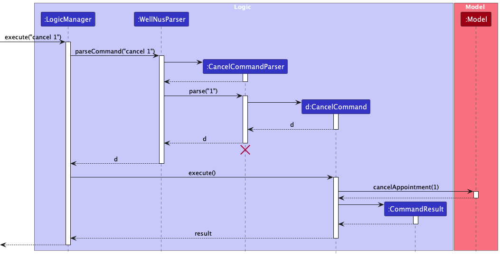
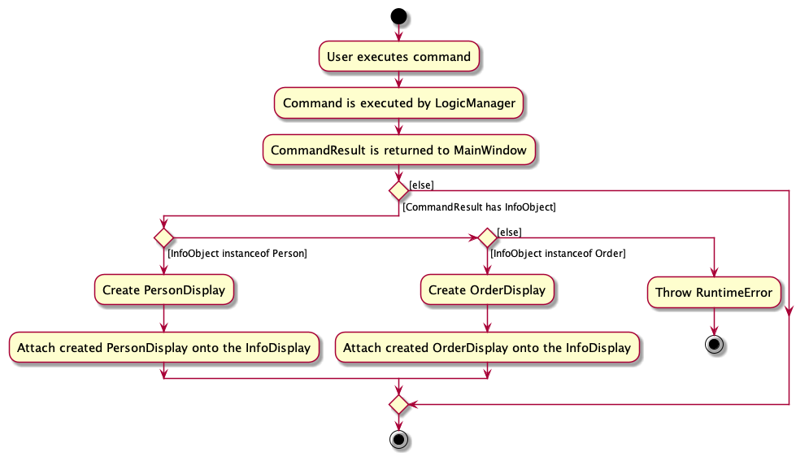
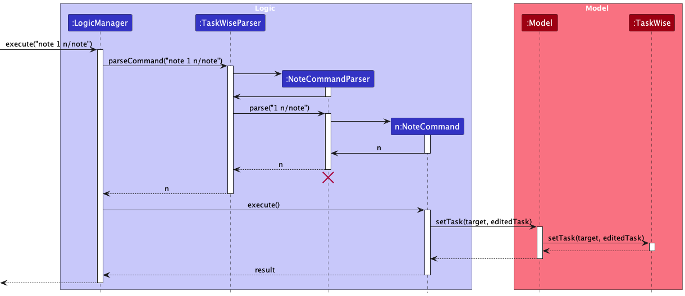

* Table of Contents
{:toc}

--------------------------------------------------------------------------------------------------------------------

## 1. Introduction

### 1.1 Acknowledgements

* This project is based on the AddressBook-Level3 project created by the [SE-EDU initiative](https://se-education.org).

### 1.2 Setting up, getting started

Refer to the guide [_Setting up and getting started_](SettingUp.md).

--------------------------------------------------------------------------------------------------------------------

### 2. Design

:bulb: **Tip:** The `.puml` files used to create diagrams in this document `docs/diagrams` folder. Refer to the [_PlantUML Tutorial_ at se-edu/guides](https://se-education.org/guides/tutorials/plantUml.html) to learn how to create and edit diagrams.

### 2.1 Architecture

The ***Architecture Diagram*** given above explains the high-level design of the App.

Given below is a quick overview of main components and how they interact with each other.

#### 2.1.1 Main components of the architecture

**`Main`** (consisting of classes [`Main`](https://github.com/se-edu/addressbook-level3/tree/master/src/main/java/seedu/address/Main.java) and [`MainApp`](https://github.com/se-edu/addressbook-level3/tree/master/src/main/java/seedu/address/MainApp.java)) is in charge of the app launch and shut down.
* At app launch, it initializes the other components in the correct sequence, and connects them up with each other.
* At shut down, it shuts down the other components and invokes cleanup methods where necessary.

The bulk of the app's work is done by the following four components:

* [**`UI`**](#22-ui-component): The UI of the App.
* [**`Logic`**](#23-logic-component): The command executor.
* [**`Model`**](#24-model-component): Holds the data of the App in memory.
* [**`Storage`**](#25-storage-component): Reads data from, and writes data to, the hard disk.

[**`Commons`**](#26-common-classes) represents a collection of classes used by multiple other components.

#### 2.1.2 How the architecture components interact with each other

The *Sequence Diagram* below shows how the components interact with each other for the scenario where the user issues the command `delete 1`.

Each of the four main components (also shown in the diagram above),

* defines its *API* in an `interface` with the same name as the Component.
* implements its functionality using a concrete `{Component Name}Manager` class (which follows the corresponding API `interface` mentioned in the previous point.

For example, the `Logic` component defines its API in the `Logic.java` interface and implements its functionality using the `LogicManager.java` class which follows the `Logic` interface. Other components interact with a given component through its interface rather than the concrete class (reason: to prevent outside component's being coupled to the implementation of a component), as illustrated in the (partial) class diagram below.

The sections below give more details of each component.

### 2.2 UI component

The **API** of this component is specified in [`Ui.java`](https://github.com/se-edu/addressbook-level3/tree/master/src/main/java/seedu/address/ui/Ui.java)

The UI consists of a `MainWindow` that is made up of parts e.g.`CommandBox`, `ResultDisplay`, `StudentListPanel`, `StatusBarFooter` etc. All these, including the `MainWindow`, inherit from the abstract `UiPart` class which captures the commonalities between classes that represent parts of the visible GUI.

The `UI` component uses the JavaFx UI framework. The layout of these UI parts are defined in matching `.fxml` files that are in the `src/main/resources/view` folder. For example, the layout of the [`MainWindow`](https://github.com/se-edu/addressbook-level3/tree/master/src/main/java/seedu/address/ui/MainWindow.java) is specified in [`MainWindow.fxml`](https://github.com/se-edu/addressbook-level3/tree/master/src/main/resources/view/MainWindow.fxml)

The `UI` component,

* executes user commands using the `Logic` component.
* listens for changes to `Model` data so that the UI can be updated with the modified data.
* keeps a reference to the `Logic` component, because the `UI` relies on the `Logic` to execute commands.
* depends on some classes in the `Model` component, as it displays `Student` object residing in the `Model`.

### 2.3 Logic component

**API** : [`Logic.java`](https://github.com/se-edu/addressbook-level3/tree/master/src/main/java/seedu/address/logic/Logic.java)

Here's a (partial) class diagram of the `Logic` component:

The sequence diagram below illustrates the interactions within the `Logic` component, taking `execute("delete 1")` API call as an example.

:information_source: **Note:** The lifeline for `DeleteCommandParser` should end at the destroy marker (X) but due to a limitation of PlantUML, the lifeline reaches the end of diagram.

How the `Logic` component works:

1. When `Logic` is called upon to execute a command, it is passed to an `WellNusParser` object which in turn creates a parser that matches the command (e.g., `DeleteCommandParser`) and uses it to parse the command.
1. This results in a `Command` object (more precisely, an object of one of its subclasses e.g., `DeleteCommand`) which is executed by the `LogicManager`.
1. The command can communicate with the `Model` when it is executed (e.g. to delete a student).
1. The result of the command execution is encapsulated as a `CommandResult` object which is returned back from `Logic`.

Here are the other classes in `Logic` (omitted from the class diagram above) that are used for parsing a user command:

How the parsing works:
* When called upon to parse a user command, the `WellNusParser` class creates an `XYZCommandParser` (`XYZ` is a placeholder for the specific command name e.g., `AddCommandParser`) which uses the other classes shown above to parse the user command and create a `XYZCommand` object (e.g., `AddCommand`) which the `WellNusParser` returns back as a `Command` object.
* All `XYZCommandParser` classes (e.g., `AddCommandParser`, `DeleteCommandParser`, ...) inherit from the `Parser` interface so that they can be treated similarly where possible e.g, during testing.

### 2.4 Model component

**API** : [`Model.java`](https://github.com/se-edu/addressbook-level3/tree/master/src/main/java/seedu/address/model/Model.java)

The `Model` component,

* stores the address book data i.e., all `Student` objects (which are contained in a `UniqueStudentList` object).
* stores the currently 'selected' `Student` objects (e.g., results of a search query) as a separate _filtered_ list which is exposed to outsiders as an unmodifiable `ObservableList<Student>` that can be 'observed' e.g. the UI can be bound to this list so that the UI automatically updates when the data in the list change.
* stores a `UserPref` object that represents the user’s preferences. This is exposed to the outside as a `ReadOnlyUserPref` objects.
* does not depend on any of the other three components (as the `Model` represents data entities of the domain, they should make sense on their own without depending on other components)

### 2.5 Storage component

**API** : [`Storage.java`](https://github.com/se-edu/addressbook-level3/tree/master/src/main/java/seedu/address/storage/Storage.java)

The `Storage` component,
* can save both address book data and user preference data in JSON format, and read them back into corresponding objects.
* inherits from both `WellNusStorage` and `UserPrefStorage`, which means it can be treated as either one (if only the functionality of only one is needed).
* depends on some classes in the `Model` component (because the `Storage` component's job is to save/retrieve objects that belong to the `Model`)

### 2.6 Common classes

Classes used by multiple components are in the `seedu.addressbook.commons` package.

--------------------------------------------------------------------------------------------------------------------
## 3. WellNus Implementation

This section describes some noteworthy details on how certain features of WellNus are implemented.

### 3.1 Cancelling an Appointment

The canceling of an appointment is facilitated by the `CancelCommand`. It extends `Command` and allows the user to cancel an appointment at a specified index.

The sequence diagram below illustrates the interactions within the `Logic` component, taking `execute("cancel 1")` as an example.

#### Design Considerations:

**Aspect: How an Appointment should be canceled**

* **Current Choice:** Create a new `CancelCommand` class which handles the cancellation of an appointment.
    * Pros: User input will be shorter and easier to read.
    * Cons: More work to implement.

* **Alternative 1:** Add appointment cancellation functionality to the existing `DeleteCommand`.
    * Pros: Easier to implement.
    * Cons: User will have to type longer commands since appointment details can be lengthy, which may lead to more complex commands.

### 3.2 View Feature

This feature is facilitated by the use of the ViewCommand class which extends the Command interface.

The sequence diagram below illustrates the interactions within the `Logic` component, taking `execute("delete 1")` API call as an example.

:information_source: **Note:** The lifeline for `ViewCommandParser` should end at the destroy marker (X) but due to a limitation of PlantUML, the lifeline reaches the end of diagram.

View Command handles both the viewing of all students and all appointments. The workflow is shown below:

:information_source: **Note:** There should be a diamond connecting the 4 separate branches
but due to a limitation of PlantUML, the 4 branches leads to the "end" individually .

### 3.3 Student Notes feature

The adding of student notes is facilitated by `NoteCommand`. It extends `Command` and allows the addition of a `Note`
to the student at the index specified by the user.

The sequence diagram below illustrates the interactions within the `Logic` component, 
taking `execute("note 1 note/Likes dogs.")` as an example.

#### Design considerations:

**Aspect: How a `Note` should be added to a `Student`**

* **Alternative 1 (current choice):** Create a new `NoteCommand` class which handles the addition of a note 
to a `Student`.
    * Pros: User input will be shorter in length and easier to read
    * Cons: More work to implement

* **Alternative 2:** Add `Note` as a field in the `AddCommand`
    * Pros: Easier to implement
    * Cons: User will have to type much longer commands, since `Note` can be up to 200 characters long,
  leads to very lengthy commands
      
### 3.4 \[Proposed\] Check clashing appointments feature

#### Proposed Implementation

The proposed check clashing appointments mechanism is facilitated by `UniqueAppointmentList`. It implements the `Iterable`
interface that stores an `ObservableList` of type `Appointment`.

The following methods are implemented to facilitate the check clashing appointments process:

* `UniqueAppointmentList#hasOverlap(Appointment appt1, Appointment appt2)` —  Checks if two appointments have overlapping time.
* `UniqueAppointmentList#hasOverlappingAppointments(Appointment newAppt)` —  Compares the new appointment to schedule with every other appointment currently in `UniqueAppointmentList`.

The following sequence diagram shows how the class operates when an appointment is added:

When the user schedules a new command, the `UniqueAppointmentList` runs its `hasOverlappingAppointments()` method to check if the
new appointment clashes with any existing appointments. It raises a `OverlappingAppointmentsException` if the method returns true,
and prevents the user from scheduling that appointment.

The following activity diagram summarises what happens when a user schedules an apppointment:

:information_source: **Note:** There should be a diamond connecting the 3 separate branches
but due to a limitation of PlantUML, the 3 branches leads to the "end" individually .

--------------------------------------------------------------------------------------------------------------------

## 4. Documentation, logging, testing, configuration, dev-ops

* [Documentation guide](Documentation.md)
* [Testing guide](Testing.md)
* [Logging guide](Logging.md)
* [Configuration guide](Configuration.md)
* [DevOps guide](DevOps.md)

--------------------------------------------------------------------------------------------------------------------

## 5. Appendix: Requirements

### 5.1 Product scope

**Target user profile**:

* NUS Student Counsellors
* has a need to manage a significant number of students
* need to manage student details as well as appointments
* prefer desktop apps over other types
* can type fast
* prefers typing to mouse interactions
* is reasonably comfortable using CLI apps

**Value proposition**: This product is meant to help the counsellors better schedule their appointments with students faster than a typical mouse/GUI driven app. Users will be able to store details like personal information, appointment dates, number of visits, emergency contacts etc.

### 5.2 User stories

Priorities: High (must have) - `* * *`, Medium (nice to have) - `* *`, Low (unlikely to have) - `*`

| Priority | As a …​    | I want to …​                                 | So that I can…​                                                                      |
|----------|------------|----------------------------------------------|--------------------------------------------------------------------------------------|
| `* * *`  | counsellor | add a student profile                        | keep track of each student's information                                             |
| `* * `   | counsellor | set or edit a student's risk profile         | monitor the risk profile of each student                                             |
| `* * *`  | counsellor | remove a student profile                     | remove student in the event they do not require any further consultation             |
| `* * *`  | counsellor | view a student profile                       | look up a students relevant information, consultation notes etc.                     |
| `* * *`  | counsellor | view all students as a list                  | look up all students that require consultation                                       |
| `* *`    | counsellor | edit a student's profile                     | update student particulars should there be any changes                               |
| `* *`    | counsellor | filter list by types of student              | look up students in particular categories                                            |
| `* *`    | counsellor | find students by name or ID                  | look up particular students                                                          |
| `* *`    | counsellor | schedule an appointment                      | keep track of my appointments in the application                                     |
| `* *`    | counsellor | cancel an appointment                        | remove any appointments that have been cancelled                                     |
| `* *`    | counsellor | view my appointments                         | look through my timetable for the day/week                                           |
| `* *`    | counsellor | edit appointment info                        | plan my schedule accordingly if there are any last-minute changes                    |
| `* *`    | counsellor | sort appointments by date                    | organise my appointments and plan my timetable accordingly                           |
| `*`      | counsellor | block out busy times                         | prevent clashes in scheduling                                                        |
| `*`      | counsellor | prevent double booking                       | prevent clashes in scheduling                                                        |
| `*`      | counsellor | link students to the respective appointments | have easy access to the student profile that can help me prepare for the appointment |
| `*`      | counsellor | add todos items                              | keep track of todos for each student                                                 |
| `*`      | counsellor | view todos items                             | view todos for students at a glance                                                  |
| `*`      | counsellor | link todos items to students                 | have easy access to the contact information for the students                         |
| `*`      | counsellor | sort todos items by dateline                 | organise my appointments and plan my schedule accordingly                            |

### 5.3 Use cases

(For all use cases below, the **System** is `WellNUS` and the **Actor** is the `counsellor`, unless specified otherwise)

#### 5.3.1 #UC01: Add a student

**MSS**

1.  User requests to list students
2.  WellNUS shows the list of students
3.  User requests to add a new student to the list
4.  WellNUS adds the student, and shows confirmation message

    Use case ends.

**Extensions**

* 3a. The student name/contact number already exists.
  * 3a1. WellNUS shows an error message. 
    * Use case ends.

* 3b. The given name is invalid (non-alphabetical input) or contact number is invalid (non-numerical input).
  * 3b1. WellNUS shows an error message.
    * Use case ends.

#### 5.3.2 #UC02: View existing students

**MSS**

1.  User requests to list students
2.  WellNUS shows the list of students
3.  User can find student index that can be used for other use cases, eg. edit student info

    Use case ends.

**Extensions**

* 2a. The list is empty
  * Use case ends.

#### 5.3.3 #UC03: Delete an existing student

**MSS**

1.  User requests to list students
2.  WellNUS shows the list of students
3.  User can find student index
4.  Delete user by specifying the index
5.  Get confirmation of successful delete

    Use case ends.

**Extensions**

* 3a. The student index is invalid.
  * 3a1. WellNUS shows an error message.
    * Use case ends.

#### 5.3.4 #UC04: Tag student to risk level

**MSS**

1.  User requests to list students
2.  WellNUS shows the list of students
3.  User can find student index
4.  Tag/change student risk level using the student index
5.  Information gets updated for future reference

    Use case ends.

**Extensions**

* 4a. The student index is invalid.
  * 4a1. WellNUS shows an error message.
    * Use case ends.

* 4b. The risk level is invalid (not high/medium/low)
  * 4b1. WellNUS shows an error message.
    * Use case ends.

#### 5.3.5 #UC05: Schedule an appointment

**MSS**

1.  User requests to list appointments
2.  WellNUS shows the list of appointments, along with some basic information like time and student
3.  User requests to schedule a new appointment to the list
4.  WellNUS adds the appointment 
5.  WellNUS shows confirmation message 
    
    Use case ends.

**Extensions**

* 3a. The student index is invalid.
  * 3a1. WellNUS shows an error message.
    * Use case ends.

* 3b. The given time is invalid (wrong time format).
  * 3b1. WellNUS shows an error message.
    * Use case ends.

* 3c. The given time overlaps with an existing appointment.
  * 3c1. WellNUS shows an error message.
    * Use case ends.

#### 5.3.6 #UC06: View existing appointments

**MSS**

1.  User chooses to list appointments
2.  WellNUS shows the list of appointments
3.  User can view appointment information such as student involved and time of appointment
    
    Use case ends.

**Extensions**

* 2a. User unable to view appointment information as list is empty

    Use case ends.

#### 5.3.7 #UC07: Cancel an existing appointment

**MSS**

1.  User chooses to list appointments
2.  WellNUS shows the list of appointments
3.  User cancels an appointment at chosen index
4.  WellNUS deletes the appointment with index specified by user and display status

    Use case ends.

**Extensions**

* 3a. WellNUS detects an error in the entered index

    Use case resumes from step 1.

#### 5.3.8 #UC08: Tag student to appointment

**MSS**

1.  User chooses to list appointments
2.  WellNUS shows the list of appointments
3.  User chooses to list students
4.  WellNUS shows the list of students
5.  User tags student to appointment
6.  WellNUS tags student to appointment and display status
    
    Use case ends.

**Extensions**
* 5a. WellNUS detects an error in either the entered student index or appointment index
    
  Use case resumes from step 1.

#### 5.3.9 #UC09: Add a ToDo

**MSS**

1.  User requests to list existing ToDos
2.  WellNUS shows the list of ToDos, along with some basic information like dateline and student
3.  User requests to add a new ToDo to the list
4.  WellNUS adds the ToDo, and shows confirmation message

    Use case ends.

**Extensions**

* 3a. The given student name does not exist.

    * 3a1. WellNUS shows an error message.

    Use case ends.

* 3b. The given student name is invalid (non-alphabetical input) / dateline is invalid (past dateline, invalid format).

    * 3b1. WellNUS shows an error message.

    Use case ends.

#### 5.3.10 #UC10: View existing ToDos

**MSS**

1.  User requests to list ToDos
2.  WellNUS shows the list of ToDos
3.  Users can find information like dateline, student, etc.

    Use case ends.

**Extensions**

* 2a. The list is empty.

  Use case ends.

#### 5.3.11 #UC11: Delete an existing ToDo

**MSS**

1.  User requests to list ToDos
2.  WellNUS shows the list of ToDos
3.  User can find ToDos index
4.  Delete ToDos by specifying the index
5.  Get confirmation of successful delete

    Use case ends.

**Extensions**

* 3a. The ToDo index is invalid.

    * 3a1. WellNUS shows an error message.

    Use case ends.

#### 5.3.12 #UC12: Tag student to ToDo

**MSS**

1.  User requests to list students
2.  WellNUS shows the list of students
3.  User can find student index
4.  Tag/change student to ToDo
5.  Information gets updated for future reference

    Use case ends.

**Extensions**

* 3a. The given index is invalid.

    * 3a1. WellNUS shows an error message.

    Use case ends.

* 3b. The referenced ToDo is invalid.

    * 3a1. WellNUS shows an error message.

    Use case ends.

*{More to be added}*

### 5.4 Non-Functional Requirements
1.  Cross-Platform Compatibility:
    - Should work on any _mainstream OS_ as long as it has Java `11` or above installed.
2.  Scalability and Performance:
    - Should be able to hold up to 1000 students without a noticeable sluggishness in performance for typical usage.
    - Should support efficient data retrieval and manipulation for the specified contact volume.
3.  Usability and Efficiency:
    - A user with above average typing speed for regular English text (i.e. not code, not system admin commands) should 
    be able to perform the majority of tasks more quickly using _CLI_ commands compared to using a mouse on the _GUI_.
    - The _CLI_ interface should prioritise efficiency by providing clear and concise commands, minimising unnecessary prompts,
    and offering time-saving shortcuts.
4. Updates and Maintenance:
    - Updates should not disrupt the user's workflow or data.

*{More to be added}*

### 5.5 Glossary

* **Mainstream OS**: Windows, Linux, Unix, OS-X
* **Private contact detail**: A contact detail that is not meant to be shared with others
* **CLI**: Command Line Interface. Usually the in-built terminal or in the IDE the application is run on.
* **GUI**: Graphical User Interface.
* **Risk Level**: Students can be classified as high, medium, or low-risk level determined by the counsellor.

--------------------------------------------------------------------------------------------------------------------

## 6. Appendix: Instructions for manual testing

Given below are instructions to test the app manually.

:information_source: **Note:** These instructions only provide a starting point for testers to work on;
testers are expected to do more *exploratory* testing.

### 6.1 Launch and shutdown

1. Initial launch

   1. Download the jar file and copy into an empty folder

   2. Double-click the jar file Expected: Shows the GUI with a set of sample contacts. The window size may not be optimum.

2. Saving window preferences

   1. Resize the window to an optimum size. Move the window to a different location. Close the window.

   2. Re-launch the app by double-clicking the jar file. 
          Expected: The most recent window size and location is retained.

### 6.2 Deleting a student

1. Deleting a student while all students are being shown

   1. Prerequisites: List all students using the `list` command. Multiple students in the list.

   2. Test case: `delete 1` 
         Expected: First contact is deleted from the list. Details of the deleted contact shown in the status message. Timestamp in the status bar is updated.

   3. Test case: `delete 0` 
         Expected: No student is deleted. Error details shown in the status message. Status bar remains the same.

   4. Other incorrect delete commands to try: `delete`, `delete x`, `...` (where x is larger than the list size) 
         Expected: Similar to previous.

    { more test cases …​ }_

### 7. Saving data

1. Dealing with missing/corrupted data files

   1. _{explain how to simulate a missing/corrupted file, and the expected behavior}_

2. _{ more test cases …​ }_
