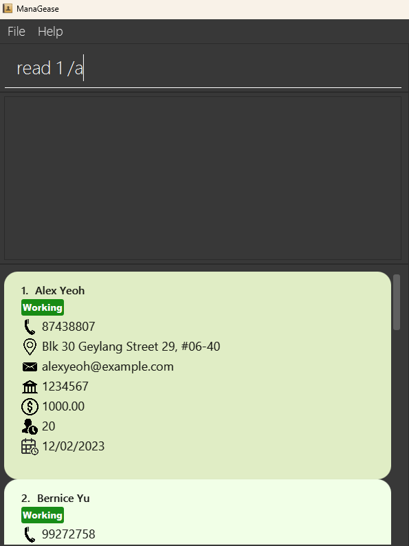

* Table of Contents
{:toc}

--------------------------------------------------------------------------------------------------------------------

## **Acknowledgements**

* {list here sources of all reused/adapted ideas, code, documentation, and third-party libraries -- include links to the original source as well}

--------------------------------------------------------------------------------------------------------------------

## **Setting up, getting started**

Refer to the guide [_Setting up and getting started_](SettingUp.md).

--------------------------------------------------------------------------------------------------------------------

## **Design**

:bulb: **Tip:** The `.puml` files used to create diagrams in this document `docs/diagrams` folder. Refer to the [_PlantUML Tutorial_ at se-edu/guides](https://se-education.org/guides/tutorials/plantUml.html) to learn how to create and edit diagrams.

### Architecture

The ***Architecture Diagram*** given above explains the high-level design of the App.

Given below is a quick overview of main components and how they interact with each other.

**Main components of the architecture**

**`Main`** (consisting of classes [`Main`](https://github.com/se-edu/addressbook-level3/tree/master/src/main/java/seedu/address/Main.java) and [`MainApp`](https://github.com/se-edu/addressbook-level3/tree/master/src/main/java/seedu/address/MainApp.java)) is in charge of the app launch and shut down.
* At app launch, it initializes the other components in the correct sequence, and connects them up with each other.
* At shut down, it shuts down the other components and invokes cleanup methods where necessary.

The bulk of the app's work is done by the following four components:

* [**`UI`**](#ui-component): The UI of the App.
* [**`Logic`**](#logic-component): The command executor.
* [**`Model`**](#model-component): Holds the data of the App in memory.
* [**`Storage`**](#storage-component): Reads data from, and writes data to, the hard disk.

[**`Commons`**](#common-classes) represents a collection of classes used by multiple other components.

**How the architecture components interact with each other**

The *Sequence Diagram* below shows how the components interact with each other for the scenario where the user issues the command `delete 1`.

Each of the four main components (also shown in the diagram above),

* defines its *API* in an `interface` with the same name as the Component.
* implements its functionality using a concrete `{Component Name}Manager` class (which follows the corresponding API `interface` mentioned in the previous point.

For example, the `Logic` component defines its API in the `Logic.java` interface and implements its functionality using the `LogicManager.java` class which follows the `Logic` interface. Other components interact with a given component through its interface rather than the concrete class (reason: to prevent outside component's being coupled to the implementation of a component), as illustrated in the (partial) class diagram below.

The sections below give more details of each component.

### UI component

The **API** of this component is specified in [`Ui.java`](https://github.com/se-edu/addressbook-level3/tree/master/src/main/java/seedu/address/ui/Ui.java)

The UI consists of a `MainWindow` that is made up of parts e.g.`CommandBox`, `ResultDisplay`, `PersonListPanel`, `StatusBarFooter` etc. All these, including the `MainWindow`, inherit from the abstract `UiPart` class which captures the commonalities between classes that represent parts of the visible GUI.

The `UI` component uses the JavaFx UI framework. The layout of these UI parts are defined in matching `.fxml` files that are in the `src/main/resources/view` folder. For example, the layout of the [`MainWindow`](https://github.com/se-edu/addressbook-level3/tree/master/src/main/java/seedu/address/ui/MainWindow.java) is specified in [`MainWindow.fxml`](https://github.com/se-edu/addressbook-level3/tree/master/src/main/resources/view/MainWindow.fxml)

The `UI` component,

* executes user commands using the `Logic` component.
* listens for changes to `Model` data so that the UI can be updated with the modified data.
* keeps a reference to the `Logic` component, because the `UI` relies on the `Logic` to execute commands.
* depends on some classes in the `Model` component, as it displays `Person` object residing in the `Model`.

### Logic component

**API** : [`Logic.java`](https://github.com/se-edu/addressbook-level3/tree/master/src/main/java/seedu/address/logic/Logic.java)

Here's a (partial) class diagram of the `Logic` component:

The sequence diagram below illustrates the interactions within the `Logic` component, taking `execute("delete 1")` API call as an example.

:information_source: **Note:** The lifeline for `DeleteCommandParser` should end at the destroy marker (X) but due to a limitation of PlantUML, the lifeline reaches the end of diagram.

How the `Logic` component works:

1. When `Logic` is called upon to execute a command, it is passed to an `AddressBookParser` object which in turn creates a parser that matches the command (e.g., `DeleteCommandParser`) and uses it to parse the command.
1. This results in a `Command` object (more precisely, an object of one of its subclasses e.g., `DeleteCommand`) which is executed by the `LogicManager`.
1. The command can communicate with the `Model` when it is executed (e.g. to delete a person).
1. The result of the command execution is encapsulated as a `CommandResult` object which is returned back from `Logic`.

Here are the other classes in `Logic` (omitted from the class diagram above) that are used for parsing a user command:

How the parsing works:
* When called upon to parse a user command, the `AddressBookParser` class creates an `XYZCommandParser` (`XYZ` is a placeholder for the specific command name e.g., `AddCommandParser`) which uses the other classes shown above to parse the user command and create a `XYZCommand` object (e.g., `AddCommand`) which the `AddressBookParser` returns back as a `Command` object.
* All `XYZCommandParser` classes (e.g., `AddCommandParser`, `DeleteCommandParser`, ...) inherit from the `Parser` interface so that they can be treated similarly where possible e.g, during testing.

### Model component
**API** : [`Model.java`](https://github.com/se-edu/addressbook-level3/tree/master/src/main/java/seedu/address/model/Model.java)

The `Model` component,

* stores the address book data i.e., all `Person` objects (which are contained in a `UniquePersonList` object).
* stores the currently 'selected' `Person` objects (e.g., results of a search query) as a separate _filtered_ list which is exposed to outsiders as an unmodifiable `ObservableList<Person>` that can be 'observed' e.g. the UI can be bound to this list so that the UI automatically updates when the data in the list change.
* stores a `UserPref` object that represents the user’s preferences. This is exposed to the outside as a `ReadOnlyUserPref` objects.
* does not depend on any of the other three components (as the `Model` represents data entities of the domain, they should make sense on their own without depending on other components)

:information_source: **Note:** An alternative (arguably, a more OOP) model is given below. It has a `Tag` list in the `AddressBook`, which `Person` references. This allows `AddressBook` to only require one `Tag` object per unique tag, instead of each `Person` needing their own `Tag` objects. 

### Storage component

**API** : [`Storage.java`](https://github.com/se-edu/addressbook-level3/tree/master/src/main/java/seedu/address/storage/Storage.java)

The `Storage` component,
* can save both address book data and user preference data in JSON format, and read them back into corresponding objects.
* inherits from both `AddressBookStorage` and `UserPrefStorage`, which means it can be treated as either one (if only the functionality of only one is needed).
* depends on some classes in the `Model` component (because the `Storage` component's job is to save/retrieve objects that belong to the `Model`)

### Common classes

Classes used by multiple components are in the `seedu.addressbook.commons` package.

--------------------------------------------------------------------------------------------------------------------

## **Implementation**

This section describes some noteworthy details on how certain features are implemented.

### \[Proposed\] Read feature

#### Proposed Implementation

The proposed implementation involves the ReadCommand and some associated classes:

* `ReadCommand` — This class is responsible for executing the "Read" command. It parses the user input, retrieves information from the model, and passes the results to the UI for display.
(class diagram to be added)

* `ReadCommandParser` — Responsible for parsing user input and creating a ReadCommand object. It extracts the index of the employee in the last shown list and the requested field.
(Class diagram to be added)

* `PersonCardWithSpecificField` - Since we have to display only one specific field, we created another person card with just one field. This class is responsible for displaying the name of the person and a specific field requested by the user in the UI. It receives the necessary information from the command result and formats it for display.
(Class diagram to be added)

Displaying a specific field with the new PersonCardWithSpecificField class.

1. Before we execute a command, the MainWindow will display a list of person with all their fields as shown below.

2. After we execute the command, and it is a ReadCommand, the ReadCommand will set CommandResult::isRead to true. The MainWindow of UI will then remove all the existing PersonCard with a PersonCardWithSpecificField as shown below.

How the read feature works in sequence diagram.

The user enters the command "read 1 /a" and executes it. The command is then parsed by AddressBookParser. The AddressBookParser parsed the input and created ReadCommandParser and ReadCommandParser parsed the remaining input(exclude the command word). If it parses successfully, it will eventually create a ReadCommand. The ReadCommand is then executed. If the index is not out of bounds, it will call Model#setSpecificPersonToDisplay() to filter the list to only the specific person. Then it will also call the respective getter to get the specific field from the Person. After getting the specific field, it will then create a CommandResult for the UI to display. 

This is the sequence diagram to show how the read operation works.

:information_source: **Note:** The lifeline for `ReadCommand` should end at the destroy marker (X) but due to a limitation of PlantUML, the lifeline reaches the end of diagram.

#### Design considerations:

**Aspect: Data Retrieval:**

* **Alternative 1 (current choice):** Retrieve only the specific field of the person being read.
  * Pros: Reduces memory usage and may improve performance.
  * Cons: Requires more complex implementation and handling of different data retrieval scenarios.

* **Alternative 2:** Retrieve the entire person's data when executing the "Read" command.
  * Pros: Simple and consistent with other command implementations.
  * Cons: May have performance issues if the person's data is extensive.
    
**Aspect: Using Index:**

* **Alternative 1 (current choice):** Use an index to identify the target person for the "Read" command.
  * Pros: Faster and more efficient execution when working with a large number of people.
  * Cons: This may require users to remember or find the index of the person.

* **Alternative 2:** Use the person's name to identify the target person for the "Read" command.
  * Pros: User-friendly, especially when users are more likely to identify persons by name.
  * Cons: This may result in slower execution when many persons exist in the address book.

_{more aspects and alternatives to be added}_

### \[Proposed\] Data archiving

_{Explain here how the data archiving feature will be implemented}_

### Deductions and Benefits

#### Proposed Implementation

The proposed deductions and benefits feature is facilitated by `Deduction` and `Benefit` classes. They represent payment deducted from and paid to an employee respectively.

A `Deduction` object contains the following information:
(Class diagram to be added)

A `Benefit` object contains the following information:
(Class diagram to be added)

Both `Deduction` and `Benefit` classes extend the `Payment` class, which contains the following information:
(Class diagram to be added)

Adding deductions and benefits to an employee is done by the `DeductCommand` and `DeductCommandParser` classes and `BenefitCommand` and `BenefitCommandParser` classes respectively.

The following sequence diagram shows how the `deduct`/`benefit` operation works:
(Sequence diagram to be added)

After `DeductCommandParser` and `BenefitCommandParser` classes parse the user input, the `DeductCommand` and `BenefitCommand` classes will be called to execute the command. The `DeductCommand` and `BenefitCommand` classes will then call the `Model` component to add the deduction/benefit to the employee.
`DeductCommand::execute(Model)` and `BenefitCommand::execute(Model)` will decide to call `DeductCommand::executeByIndex(Model)`/`BenefitCommand::executeByIndex(Model)` or `DeductCommand::executeByName(Model)`/`BenefitCommand::executeByName(Model)` based on whether an index has been specified in the user input.

The following activity diagram summarises the process of adding a deduction/benefit to an employee:
(Activity diagram to be added)

#### Design considerations:

{what are the design considerations?}

### Payslip generation

#### Proposed Implementation

The proposed payslip generation feature is facilitated by `PayslipGenerator`, `PayslipCommand` and `PayslipCommandParser` classes.

The `PayslipGenerator` class is responsible for generating the payslip for a specific employee. It contains the following methods:
(Class diagram to be added)

The `PayslipCommand` class is responsible for executing the `payslip` command. It contains the following methods:
(Class diagram to be added)

The `PayslipCommandParser` class is responsible for parsing the user input for the `payslip` command. It contains the following methods:
(Class diagram to be added)

The following sequence diagram shows how the `payslip` operation works:
(Sequence diagram to be added)

After `PayslipCommandParser` class parses the user input, the `PayslipCommand` class will be called to execute the command. The `PayslipCommand` class will then call the `Model` component to generate the payslip for the employee, and store the payslip as a PDF file at `payslips/`.

The following activity diagram summarises the process of generating a payslip for an employee:
(Activity diagram to be added)

### Payroll calculation feature

#### Implementation

The feature is facilitated by the four classes below:
1.	PayrollCommandParser
2.	PayrollCommand
3.	Payroll
4.	Salary

<u>PayrollCommandParser</u>

This class extends the Parser interface, it implements the following operations:
- PayrollCommandParser#parse() – Parses the user input and returns a PayrollCommand object.

<u>PayrollCommand</u>

This class extends the Command abstract class, it implements the following operations:
- PayrollCommand#execute() – Determines whether the user used employee name as reference or the index number. Once it confirms, it will calculate the payroll of the employee.

#### Design considerations:

{what are the design considerations?}

### Leave Tracking

#### Proposed Implementation

The proposed leave tracking feature is facilitated by `AnnualLeave`, `AddLeaveCommand` and `AddLeaveCommandParser` classes.

The `AnnualLeave` class is responsible for storing the leave data for a specific employee. It contains the following methods:
(Class diagram to be added)

The `AddLeaveCommand` class is responsible for executing the `addleave` command. It contains the following methods:
(Class diagram to be added)

The `AddLeaveCommandParser` class is responsible for parsing the user input for the `addleave` command. It contains the following methods:
(Class diagram to be added)

The following sequence diagram shows how the `addleave` operation works:
(Sequence diagram to be added)

After `AddLeaveCommandParser` class parses the user input, the `AddLeaveCommand` class will be called to execute the command. The `AddLeaveCommand` class will then call the `Model` component to add leave for the employee, and store the leave as an arraylist in `AnnualLeave`.

The following activity diagram summarises the process of adding leave for an employee:
(Activity diagram to be added)

#### Design considerations:
 
**Aspect: How addleave executes:**

* **Alternative 1 (current choice):** Saves the dates of the leave added.
  * Pros: Easy to trace and track when the leaves are applied, and whether employee is working on specific day.
  * Cons: May have performance issues in terms of memory usage.

* **Alternative 2:** Saves only the total number of days of leave added.
  * Pros: will use less memory (e.g. each employee will only need to store an integer for the total number of days of leave per annul)
  * Cons: Not much useful information that can be used (e.g. we do not know the working status of each employee for each day)

### Attendance Marking

#### Proposed Implementation

The mark mechanism is dependent on the Attendance class. The Attendance class contains information on the date and AttendanceType of a Person.  It implements the following operations:
* `Attendance#markAbsent(LocalDate date)` -- marks the attendance of the employee on the provided date as absent.
* `Attendance#markLate(LocalDate date)` -- marks the attendance of the employee on the provided date as late.
  The AttendanceStorage stores all the Attendance objects of one Person, only storing Attendances that are late or absent. Dates that are not in the storage are assumed to be marked as present for that given Person.

Given below is an example usage scenario and how the mechanism behaves at each step.

Step 1. The user executes `mark 5 P` command to mark the 5th person in the address book as present.

Step 2. The `mark` command calls `AttendanceStorage#markAbsent()` of the given employee, which calls the `Attendance#markAbsent()`.
(Sequence diagram to be added).

#### Design considerations:

**Aspect: How AttendanceStorage is assigned to each Person**
* **Alternative 1 (current choice):** As an attribute of a Person.
  * Pros: Easy to query for a Person's attendance status
  * Cons: May be sub-par performance as it would store identical Attendance objects for each Person (person A: absent on 24th oct, person B: also absent on 24th oct)
* **Alternative 2:** As a UniqueAttendanceList.
  * Pros: No copies of Attendance objects having the same attribute values
  * Cons: Difficult to reference a Person to each Attendance.

--------------------------------------------------------------------------------------------------------------------

## **Documentation, logging, testing, configuration, dev-ops**

* [Documentation guide](Documentation.md)
* [Testing guide](Testing.md)
* [Logging guide](Logging.md)
* [Configuration guide](Configuration.md)
* [DevOps guide](DevOps.md)

--------------------------------------------------------------------------------------------------------------------

## **Appendix: Requirements**

### Product scope

**Target user profile**:
* Human Resource Managers 
* has a need to manage a significant number of employees' information
* prefer desktop apps over other types
* can type fast
* prefers typing to mouse interactions
* is reasonably comfortable using CLI apps

**Value proposition**: Contact management app to simplify and centralize information for full-time employees. It offers easy access to essential details such as name, email, phone number, address, bank accounts, salary, joining date, and annual leave. With all the information, the app can help to track employees’ annual leave and also generate their payroll automatically. This helps to reduce errors and enhance overall operational efficiency. This results in time and cost savings, improved organization, and a smoother workflow for your business.

### User stories

Priorities: High (must have) - `* * *`, Medium (nice to have) - `* *`, Low (unlikely to have) - `*`

| Priority | As a …​                                     | I want to …​                                            | So that I can…​                                                         |
| -------- | ------------------------------------------ | ------------------------------                         | ---------------------------------------------------------------------- |
| `* * *`  | user                                       | add new full-time staff members                        | maintain an up-to-date database of employees.                          |
| `* * *`  | user                                       | delete an employee's information                       |keep the system clean and organized by removing unused data when employees resign |
| `* * *`  | user                                       | edit employee information (contacts, addresses, bank account, etc.) | keep the system clean and organized by removing unused data when employees resign.|
| `* * *`  | new user                                   | easily access the user guide within the app or platform| quickly learn how to use the application's features and functionalities effectively |
| `* *`    | user                                       | receive concise and informative error messages         | quickly identify my mistake and take corrective actions promptly      |
| `* *`    | user                                       | generate a report that shows the total payroll amount received by a specific employee| track the employee's overall compensation. |
| `* *`    | user                                       | effectively manage employees' annual leave balances    | make sure the employees do not exceed their allocated limits |
| `* * `   | user                                       | read specific information about a particular employee  | don’t need to manually scroll through multiple pages to find the required information|
| `* *`    | user                                       | close the application using a command       | i can expedite the process without relying on the mouse                                        |
| `* *`    | user                                       | calculate payroll for employees to be automatically based on their join dates and proposed salaries | ensure there are no discrepancies in compensation|
| `*`      | user                                       | have a user-friendly application          | I can quickly learn how to use it in a short time                                               |
| `*`      | user                                       | have the ability to sort employees by their join date/salary | make informed decisions and efficiently manage the workforce based on the sorted list.|
| `*`      | user                                       | have an application capable of detecting and preventing the input of duplicate employee information| locate a person easily | ensure the system does not mix up or duplicate payroll data and also helps to prevent errors.|

*{More to be added}*

### Use cases

(For all use cases below, the **System** is the `ManaGease` and the **User** is the `user`, unless specified otherwise)

**Use case: Add new full-time staff members**

**MSS**

1. User requests to add a new staff member.
2. ManaGease adds members to the list.
3. ManaGease displays a confirmation message that a member has been added.

   Use case ends.
   
**Extensions**

* 1a. Invalid tags are included in the command.
  
	 * 1a1. ManaGease shows an error message.
	
         Use case ends.

 

**Use case: Edit information of existing full-time staff members**

**MSS**

1. User requests to edit an existing staff member.
2. ManaGease edits the information of members.
3. ManaGease displays a confirmation message that information for members is updated.

   Use case ends.
   
**Extensions**

* 1a. Invalid command parameters are given.
  
 	* 1a1. ManaGease shows an error message.
	
   	     Use case ends.

 

**Use case: Read information on existing full-time staff members**

**MSS**

1. User requests to read information about existing staff members.
2. ManaGease displays the information for a member.

   Use case ends.
   
**Extensions**

* 1a. Invalid command parameters are given.
  
	* 1a1. ManaGease shows an error message.
	
        Use case ends.

 

**Use case: Delete existing full-time staff members**

**MSS**

1. User requests to delete an existing staff member.
2. ManaGease deletes existing members.

   Use case ends.

**Extensions**

* 1a. Invalid command parameters are given.

    * 1a1. ManaGease shows an error message.

      Use case ends.
 
* 1b. User requests to delete existing member via name.
  
	 * 1b1. ManaGease will display a list of members with the same name.
 
         Use case ends.

 

**Use case: Add deductions/benefits to the monthly salary of an employee**

**MSS**

1. User requests to add deductions/benefits to the monthly salary of an employee.
2. ManaGease adds deductions/benefits to the monthly salary of an employee.
3. ManaGease displays a confirmation message that deductions/benefits have been added.

   Use case ends.

**Extensions**

* 1a. Invalid command parameters are given.

    * 1a1. ManaGease shows an error message.

      Use case ends.

 

**Use case: Generate a PDF payslip for a specific employee**

**MSS**

1. User requests to generate a payslip for a specific employee.
2. ManaGease generates a PDF payslip for the employee.
3. ManaGease displays a confirmation message that a payslip has been generated.

   Use case ends.

**Extensions**

* 1a. Invalid command parameters are given.

    * 1a1. ManaGease shows an error message.

      Use case ends.

* 2a. Template file for the payslip is not found.

    * 2a1. ManaGease shows an error message.

      Use case ends.

**Use case: Add leave for a specific employee**

**MSS**

1. User requests to add leave for a specific employee.
2. ManaGease adds leave for the employee.
3. ManaGease displays a confirmation message that the leave has been added.

   Use case ends.

**Extensions**

* 1a. Invalid command parameters are given.

    * 1a1. ManaGease shows an error message.

      Use case ends.

* 1b. Invalid date(s) are given.

    * 1b1. ManaGease shows an error message.

      Use case ends.

*{More to be added}*

### Non-Functional Requirements

1.  Should work on any _mainstream OS_ as long as it has Java `11` or above installed.
2.  Should be able to hold up to 1000 persons without a noticeable sluggishness in performance for typical usage.
4.  The application should be designed with an intuitive and user-friendly interface to cater to HR managers who have not previously used such software.
5.  The application is designed and available exclusively in the English language.
6.  The application is not required to handle the printing of the reports.

*{More to be added}*

### Glossary

* **Mainstream OS**: Windows, Linux, Unix, OS-X
* **Employee**: A staff in the company

--------------------------------------------------------------------------------------------------------------------

## **Appendix: Instructions for manual testing**

Given below are instructions to test the app manually.

:information_source: **Note:** These instructions only provide a starting point for testers to work on;
testers are expected to do more *exploratory* testing.

### Launch and shutdown

1. Initial launch

   1. Download the jar file and copy into an empty folder

   1. Double-click the jar file Expected: Shows the GUI with a set of sample contacts. The window size may not be optimum.

1. Saving window preferences

   1. Resize the window to an optimum size. Move the window to a different location. Close the window.

   1. Re-launch the app by double-clicking the jar file. 
       Expected: The most recent window size and location is retained.

1. _{ more test cases …​ }_

### Deleting a person

1. Deleting a person while all persons are being shown

   1. Prerequisites: List all persons using the `list` command. Multiple persons in the list.

   1. Test case: `delete 1` 
      Expected: First contact is deleted from the list. Details of the deleted contact shown in the status message. Timestamp in the status bar is updated.

   1. Test case: `delete 0` 
      Expected: No person is deleted. Error details shown in the status message. Status bar remains the same.

   1. Other incorrect delete commands to try: `delete`, `delete x`, `...` (where x is larger than the list size) 
      Expected: Similar to previous.

1. _{ more test cases …​ }_

### Saving data

1. Dealing with missing/corrupted data files

   1. _{explain how to simulate a missing/corrupted file, and the expected behavior}_

1. _{ more test cases …​ }_
